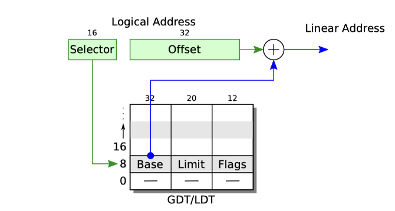
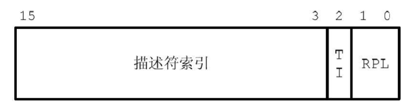
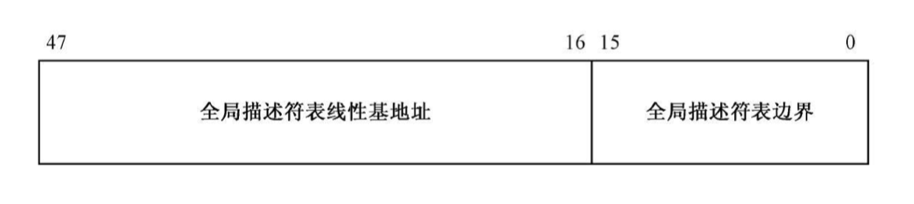
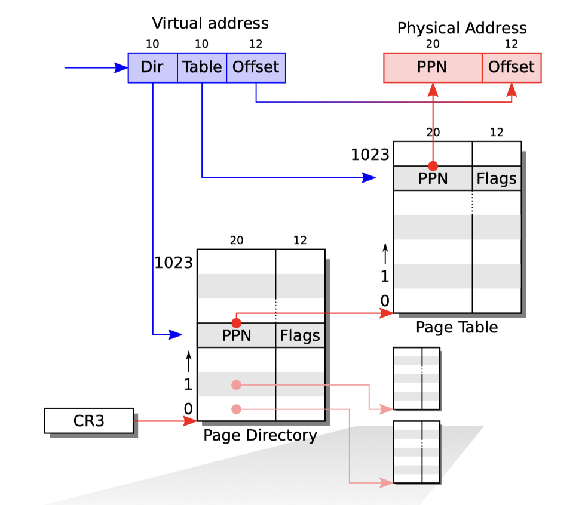
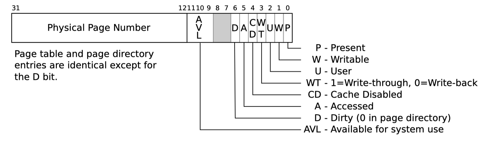
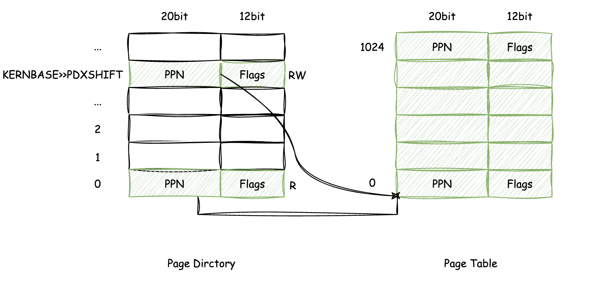

# 6.828 lab1 笔记

## 0x00 basics

### CPU real mode

计算机刚通电的时候，CPU运行在实模式下，使用16bit的寄存器，但是地址总线确有20bit，其寻址方式是通过2个寄存器CS:IP来组成，通过左移CS寄存器4个bit加上IP寄存器作为偏移地址实现，即：`CS * 16 + IP`。

在实模式下，CPU的可用内存空间非常有限，只有可怜的1MB，也就是0x00000 - 0x10000，其地址大概为：

```
+------------------+  <- 0x00100000 (1MB)
|     BIOS ROM     |
+------------------+  <- 0x000F0000 (960KB)
|  16-bit devices, |
|  expansion ROMs  |
+------------------+  <- 0x000C0000 (768KB)
|   VGA Display    |
+------------------+  <- 0x000A0000 (640KB)
|                  |
|    Low Memory    |
|                  |
+------------------+  <- 0x00000000
```

### BIOS

x86系统在启动通电的时候，CS:IP寄存器会被固定的设置为 0xF000:0xFFF0，通过计算可用得到是`0xFFFF0`，这个地址位于BIOS中的一块区域，BIOS会固定映射到如上图表示的位置处，其中的代码是做一些启动前的检查，如硬件自检等；
BIOS完成自检后，会从各种磁盘设备中读取前面第一个扇区(512bytes)到内存中，内存范围为 `0x7C00 - 0x7DFF`，假如这512bytes中的后两位“魔数”是符合要求的，即`0xAA55`，那么CS:IP被设定为0x0000:0x7C00，即`0x7C00`。

### MBR

TODO：MBR layout


### x86 register

TODO:

### CPU protected mode

保护模式下CPU拥有32bit的寻址空间，共计4GB，其寻址方式也由原来的CS:IP计算方式，转化为段选择子 + 查表；

就如同xv6-book中的这张图所示：




这里头涉及到这些点：

* 段选择子
* GDT/LDT 结构、保存方式
* 计算方式

#### 段选择子

段选择子其实就是实模式下的，原本的CS、SS等寄存器，其中16bit的内容layout结构大致为：



共计16bit，使用高13bit作为“描述符索引”，可表示大小为64K(有对齐因素)，TI则表示当前的段选择子指向的是GDT还是LDT，RPL则表示当前所运行的指令特级，通俗的讲就是内核态或者用户态，xv6和linux这种OS都只使用了0和3，分别代表内核态和用户态；

注：13bit本身是仅可以保存8192byte，但是由于GDT是8byte对齐的，所以作为索引使用的话，后面3位实际上都是0，索性都是0，就拿过来表示其他用途了，这里算是复用了。

#### GDT/LDT 结构、保存方式

GDT保存在内存中，使用lgdt寄存器来指向它，lgdt寄存器的layout大致为：



lgdt的32bit用来指向32bit模式下的任意一个地址，这里就是用来指向GDT/LDT表的物理地址了，后面的16bit则用来描述这个表的“大小”，共计64K；

而GDT/LDT的表结构可以从前面的xv6-book给出的图看出，每个entry占用8byte，组成方式是：

```
32bit + 20bit + 12bit
```

32bit表示保存基址，20bit保存limit，12bit保存flags；64K的表，共计可以保存8192个entry，不过由于分段和分页有很多相似之处，xv6和linux都很少用到分段的特性，更多的是使用分页机制。

#### 计算方式

现在有了段选择子，EIP、lgdt寄存器，就能计算出真实地址了，计算过程大致为：

* lgdt确定GDT表
* 段选择子上的高13bit计算出offset，拿到表上的一个entry
* 查询表得到base
* base + EIP 得到真实地址

## 0x01 bootloader

### assembly 部分

xv6启动代码位于boot文件夹下面，由boot.S和main.c组成，其入口处就在boot.S中的start符号，这点可以从boot/Makefrag中看到：

```makefile
28 ▎   $(V)$(LD) $(LDFLAGS) -N -e start -Ttext 0x7C00 -o $@.out $^
```

start符号被设定为地址0x7C00，即MBR加载后，CPU跳过去的位置。

关于boot.S做了啥，首先是一些基础设定：

```assembly
cli # 关中断
cld
# 一些重要的寄存器，ds、es、ss清零
xorw    %ax,%ax
movw    %ax,%ds
movw    %ax,%es
movw    %ax,%ss
```

然后去掉繁琐的一些兼容代码，这里准备开启保护模式了：

```assembly
8   .set PROT_MODE_CSEG, 0x8
9   .set PROT_MODE_DSEG, 0x10
10  .set CR0_PE_ON,      0x1
...
48 ▎ lgdt    gdtdesc # 加载 全局段表
49 ▎ movl    %cr0, %eax 
50 ▎ orl     $CR0_PE_ON, %eax
51 ▎ movl    %eax, %cr0
...
77  gdt:
78 ▎ SEG_NULL
79 ▎ SEG(STA_X|STA_R, 0x0, 0xffffffff)
80 ▎ SEG(STA_W, 0x0, 0xffffffff)
81
82 gdtdesc:
83 ▎ .word   0x17
84 ▎ .long   gdt
```
49-51做了CR0寄存器设置，开启了保护模式，CPU进入32bit寻址空间，在进入32bit之前，设定了lgdt，载入寄存器的值分别为16bit的0x17数值、32bit的gdt地址(大小端问题)。

关于SEG是一个宏定义，可以在inc/mmu.h中找到：

```c
139  #define SEG_NULL \
140 ▎   .word 0, 0;  \
141 ▎   .byte 0, 0, 0, 0
142 #define SEG(type,base,lim) \
143 ▎   .word (((lim) >> 12) & 0xffff), ((base) & 0xffff);  \
144 ▎   .byte (((base) >> 16) & 0xff), (0x90 | (type)),     \
145 ▎   ▎   (0xC0 | (((lim) >> 28) & 0xf)), (((base) >> 24) & 0xff)
```

可以注意到在global descriptor table中，仅有的2个内容都是base=0x00，并且他们的权限，分别是0x8处的 可执行、只读，以及0x10处的可写，不难猜到分别对应着代码段和数据段。

紧跟着后面的保护模式下第一条指令，使用段选择子0x8(对应代码段，同时ljmp会修改cs寄存器)跳转到设定选择子的函数中：

```assembly
55 ▎ ljmp    $PROT_MODE_CSEG, $protcseg
56 ▎
57 ▎ .code32
58 protcseg:
60 ▎ movw    $PROT_MODE_DSEG, %ax
61 ▎ movw    %ax, %ds
62 ▎ movw    %ax, %es
63 ▎ movw    %ax, %fs
64 ▎ movw    %ax, %gs
65 ▎ movw    %ax, %ss
...
68 ▎ movl    $start, %esp
69 ▎ call bootmain
```
在protcseg完成了对 数据段选择子的设定，设定完成后，流程跳转到bootmain这个符号地址处；

从bootmain这个地方开始，关于bootloader的部分进入了C语言的范畴，由于C语言生成汇编的特性，可以看到在call bootmain之前做了esp的调整，完成了临时栈的初始化。

由于栈的特性总是往下生长，并且此时内存中我们在地址`0x7C00 - 0x7DFF`的位置，故栈顶esp设定为start处的0x7C00是安全的，不会覆盖bootloader的代码。

### C 部分

代码来到boot/main.c中的bootmain，此时CPU已经在保护模式下，这段C语言代码做了一个比较简单的内容，从磁盘第二个sector开始，读取剩余的部分到内存中，这部分就是内核的ELF文件了，bootmain首先解析了ELF结构，将代码导入到对应pa地址上(物理地址)，这里可以简单的用readelf peek一下这个内核ELF：

```bash
ubuntu:~/github/lab$ readelf -l obj/kern/kernel

Elf file type is EXEC (Executable file)
Entry point 0x10000c
There are 3 program headers, starting at offset 52

Program Headers:
  Type           Offset   VirtAddr   PhysAddr   FileSiz MemSiz  Flg Align
  LOAD           0x001000 0xf0100000 0x00100000 0x0716c 0x0716c R E 0x1000
  LOAD           0x009000 0xf0108000 0x00108000 0x0a948 0x0a948 RW  0x1000
  GNU_STACK      0x000000 0x00000000 0x00000000 0x00000 0x00000 RWE 0x10

 Section to Segment mapping:
  Segment Sections...
   00     .text .rodata .stab .stabstr
   01     .data .bss
   02
```

在结合代码：

```c
 53         for (; ph < eph; ph++)
 54                 // p_pa is the load address of this segment (as well
 55                 // as the physical address)
 56                 readseg(ph->p_pa, ph->p_memsz, ph->p_offset);
 57
 58         // call the entry point from the ELF header
 59         // note: does not return!
 60         ((void (*)(void)) (ELFHDR->e_entry))();
```
实际的操作就是将LOAD的段，加载到对应的物理地址0x00100000和0x00108000位置上，然后跳到这个ELF的开始处执行，从这个地方开始，正式进入内核初始化阶段。

## 0x02 kernel initialization

### 内核基址

首先需要注意一点的是，内核镜像的本质是一个ELF文件，上述readelf显示，kernel的物理地址是0x00100000，虚拟地址则是0xf0100000，两者之间相差了0xf0000000，这个，其实就是内核的基地址，这点可以从代码 inc/memlayout.h中找到：

```c
87 #define KERNBASE    0xF0000000
```
还有一点需要注意的是，kern/kernel.ld中可以找到一些链接细节，确定：kernel所有的符号都是基于KERNBASE这个offset做的。

内核在启动之初，还未完全的建立出 虚拟地址 -> 物理地址的映射方式，因为此时访问虚拟地址就等同于访问物理地址，而那个地址上可是什么东西都没有，在这个时候访问虚拟地址会导致未知的问题，xv6中用了代码的逻辑来完成这个“动作”，可以在 kern/entry.S中找到：

```c
18 #define RELOC(x) ((x) - KERNBASE)
```

### 开启分页

kernel ELF文件的入口位置在 kern/entry.S中的entry，这个地方被确定在了物理地址0x10000处，就是刚好在BIOS上面的那块地址

```c
40 _start = RELOC(entry)
```

内核上来就直接尝试开启分页机制：

```assembly
57 ▎   movl    $(RELOC(entry_pgdir)), %eax
58 ▎   movl    %eax, %cr3
59 ▎   # Turn on paging.
60 ▎   movl    %cr0, %eax
60 ▎   movl    %cr0, %eax
61 ▎   orl $(CR0_PE|CR0_PG|CR0_WP), %eax
62 ▎   movl    %eax, %cr0
...
67 ▎   mov $relocated, %eax
68 ▎   jmp *%eax
```

首先是将页表的物理地址设定给cr3寄存器，然后设定了cr0寄存器，启用对应的bit来开启分页机制；然后在67、68行，直接跳到了relocated符号的地址上，这个符号显然没有经过RELOC来计算物理地址，这是一个虚拟地址，能否成功映射就要取决于entry_pgdir的内容了。

### xv6中的页表映射

xv6定义了2个层级的也表，分别为Page Directory和Page Table，每一个表都有1024个entry，关于虚拟地址的转化，高10bit表示在Page Directory中的index，中间的10bit则表示Page Table的index，低12bit为页内偏移，具体为：



从这些信息中我们可以得出以下几点：

* 页内偏移12bit表示，所以每一个页4KB
* 一个Page Table可以表示4MB，也就是Page Directory中的一个entry
* 一个Page Directory可以表示4GB，也就是总体32bit CPU可寻址的空间大小
* 每一个Page Directory/Table，都是4KB大小(4KB对齐)，所以寻址使用上，低位12bit总是0

### xv6中的页表项

页表项不仅仅只做虚拟地址到物理地址的映射，期间的一些权限检查也基于页表项中的Flags部分，由于页表是4K对齐的，低12bit自然都是0，所以可以直接拿过来存储一些其他信息，具体表示的内容为：



* P：PPN指向的内容是否已经呈现
    * 1:已经呈现
    * 0:未呈现
* W：写权限相关
    * 1:可写
    * 0:不可写
* U：TODO
* WT：该页的写回规则
    * 1: 写穿，需要立刻将page的内容写入到磁盘中
    * 0: 写回，由内核决定何时将page的内容写入到磁盘中
* CD：TODO
* A：TODO
* D：TODO
* AVL：TODO

### 内核初始化页表

内核也表的定义在 kern/entrypgdir.c中：

```c
4 pte_t entry_pgtable[NPTENTRIES];
...
20 __attribute__((__aligned__(PGSIZE)))
21 pde_t entry_pgdir[NPDENTRIES] = {
22 ▎   // Map VA's [0, 4MB) to PA's [0, 4MB)
23 ▎   [0]
24 ▎   ▎   = ((uintptr_t)entry_pgtable - KERNBASE) + PTE_P,
25 ▎   // Map VA's [KERNBASE, KERNBASE+4MB) to PA's [0, 4MB)
26 ▎   [KERNBASE>>PDXSHIFT]
27 ▎   ▎   = ((uintptr_t)entry_pgtable - KERNBASE) + PTE_P + PTE_W
28 };
...
32 __attribute__((__aligned__(PGSIZE)))
33 pte_t entry_pgtable[NPTENTRIES] = {
34 ▎   0x000000 | PTE_P | PTE_W,
...
1057 ▎   0x3ff000 | PTE_P | PTE_W,
1058 };
...
```

entry_pgtable这个数组在代码中手动定义了1024项，可以确定4MB的低地址，从0x000000 - 0x400000，每一个页表项的内容都是已呈现、可写的，这个对应的其实就是当前内核所加载的低端地址(物理)；

再看entry_pgdir，这个页目录只定义了`0`和`KERNBASE>>PDXSHIFT`这个两个index；0很好理解，虚拟0-4MB映射到物理0-4MB，等同于没映射，这也解释了为啥开启页表后，寻址并没有出现问题；另外一个可以看出22bit对齐即可，快速计算KERNBASE所在的那个地址的头4MB的PPN的index；现在，内核页表应该是这么一个情况：



他们2个PageDirectory的entry复用了相同的PageTable，只不过他们的权限上有些许不一样，高地址的才拥有write权限；

### 设置栈

完成页表的开启后，代码直接使用了虚拟地址的符号，并且跳转到了relocated处，完成了ebp、esp的设定，然后就跳转到了C代码部分的i386_init符号处。

```assembly
67 ▎   mov $relocated, %eax
68 ▎   jmp *%eax
69 relocated:
74 ▎   movl    $0x0,%ebp
77 ▎   movl    $(bootstacktop),%esp
80 ▎   call    i386_init
```

TODO: layout of init kernel stack

### C部分

内核进入到c部分，详细代码大概如下：

```c
22 void
23 i386_init(void)
24 {
25 ▎   extern char edata[], end[];
30 ▎   memset(edata, 0, end - edata);
34 ▎   cons_init();
36 ▎   cprintf("6828 decimal is %o octal!\n", 6828);
39 ▎   test_backtrace(5);
42 ▎   while (1)
43 ▎   ▎   monitor(NULL);
44 }
```

先是重新设定了一下ELF的BSS段的数据，确保是0，然后初始化console、递归调用了一下栈来确认ebp、esp设定是没问题的，然后就进入到死循环中，打印解析help和kerninfo。

至此，lab1里头的内核启动代码分析完毕。

## 0x03 questions

##### At what point does the processor start executing 32-bit code? What exactly causes the switch from 16- to 32-bit mode?

boot/boot.S:51的cr0设置完成后，下一条指令为第一条32bit指令；CR0寄存器的PE位被置位后，CPU寻址从16bit转到32bit。

##### What is the last instruction of the boot loader executed, and what is the first instruction of the kernel it just loaded?

boot/main.c:60是bootloader最后一行；内核代码中kern/entry.S:40是起始位置，指令在entry.S:44的位置。

##### Where is the first instruction of the kernel?

汇编在kern/entry.S:44处，C则在kern/init.c:23。

##### How does the boot loader decide how many sectors it must read in order to fetch the entire kernel from disk? Where does it find this information?

TODO：MBR layout

# refs

https://pdos.csail.mit.edu/6.828/2018/labs/lab1
