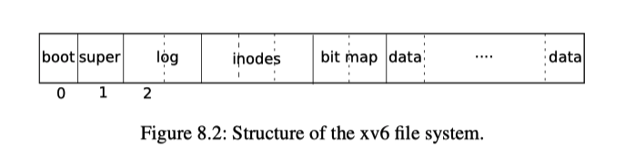

<font face="Monaco">

# xv6-riscv file system 笔记

## 0x00 磁盘的布局layout



其中boot块是进入系统的一些指令，super块是文件系统的起始位置，其代码：

```c
// kernel/fs.h
#define ROOTINO  1   // root i-number
#define BSIZE 1024  // block size

// mkfs computes the super block and builds an initial file system. The
// super block describes the disk layout:
struct superblock {
  uint magic;        // Must be FSMAGIC
  uint size;         // Size of file system image (blocks)
  uint nblocks;      // Number of data blocks
  uint ninodes;      // Number of inodes.
  uint nlog;         // Number of log blocks
  uint logstart;     // Block number of first log block
  uint inodestart;   // Block number of first inode block
  uint bmapstart;    // Block number of first free map block
};
```

xv6磁盘中，每个块大小为1024bytes，root块的inode值为1，super block中便记录了这些inode的起始位置，当前的inode数量，以及log、bitmap等。

之后便是inode的结构体：

```c
// kernel/fs.h
#define NDIRECT 12
#define NINDIRECT (BSIZE / sizeof(uint))
#define MAXFILE (NDIRECT + NINDIRECT)

// On-disk inode structure
struct dinode {
  short type;           // File type
  short major;          // Major device number (T_DEVICE only)
  short minor;          // Minor device number (T_DEVICE only)
  short nlink;          // Number of links to inode in file system
  uint size;            // Size of file (bytes)
  uint addrs[NDIRECT+1];   // Data block addresses
};
```

dinode可以视作真正文件的meta数据，type表明当前文件类型，nlink表示当前被链接了多少次，size则是文件大小，addrs中前NDIRECT是一个直接的地址，或者说是文件数据所在的block id，最后一个是一个间接的地址，它所指向一个block，block中并不是保存file的数据，而是新的"addrs",或者可以比喻为“新申请一个block，全部用来存放指针，这些指针才指向真正的数据块”。

所以就可以得出当前文件系统支持的最大文件大小：(12 + (1024 / 4)) * 1024 = 268 KB，并且，可以算出dinode结构体所占空间为：(2 * 4) + 4 + (4 * 13) = 64bytes。

磁盘中的dinode和内存中的inode结构体有所不同。

### 目录

在xv6-riscv的文件系统中，目录同样是文件，只不过其内容是一个个entry，每个entry的结构体为：

```c
struct dirent {
  ushort inum;       // 2
  char name[DIRSIZ]; // 14
};
```

每个entry在文件中也仅仅是以类似数组的方式排列罢了，所以在目录中搜索文件的效率可能不会很高，但这是xv6的实现，真实系统可能会更加的复杂，效率也会更高。

## 0x01 icache

接下去就可以看上层一点的icache了，icache作为将磁盘中数据读取到内存中缓存的结构，其定义为：

```c
// kernel/bio.c
struct {
  struct spinlock lock;
  struct buf buf[NBUF]; // 30

  // Linked list of all buffers, through prev/next.
  // Sorted by how recently the buffer was used.
  // head.next is most recent, head.prev is least.
  struct buf head;
} bcache;
```

其中保存的buf结构定义为：

```c
// kernel/buf.h
struct buf {
  int valid;   // has data been read from disk?
  int disk;    // does disk "own" buf?
  uint dev;
  uint blockno;
  struct sleeplock lock;
  uint refcnt;
  struct buf *prev; // LRU cache list
  struct buf *next;
  uchar data[BSIZE]; // 1024
};
```

其初始化的时候，将所有的buf都作为双向链表链接起来，用于LRU使用：

```c
// kernel/bio.c
void
binit(void)
{
  struct buf *b;

  initlock(&bcache.lock, "bcache");

  // Create linked list of buffers
  bcache.head.prev = &bcache.head;
  bcache.head.next = &bcache.head;
  for(b = bcache.buf; b < bcache.buf+NBUF; b++){
    b->next = bcache.head.next;
    b->prev = &bcache.head;
    initsleeplock(&b->lock, "buffer");
    bcache.head.next->prev = b;
    bcache.head.next = b;
  }
}
```

其使用的接口有几个，比如bget，它的源码为：

```c
// kernel/bio.c
// Look through buffer cache for block on device dev.
// If not found, allocate a buffer.
// In either case, return locked buffer.
static struct buf*
bget(uint dev, uint blockno)
{
  struct buf *b;

  acquire(&bcache.lock);

  // Is the block already cached?
  for(b = bcache.head.next; b != &bcache.head; b = b->next){
    if(b->dev == dev && b->blockno == blockno){
      b->refcnt++;
      release(&bcache.lock);
      acquiresleep(&b->lock);
      return b;
    }
  }

  // Not cached.
  // Recycle the least recently used (LRU) unused buffer.
  for(b = bcache.head.prev; b != &bcache.head; b = b->prev){
    if(b->refcnt == 0) {
      b->dev = dev;
      b->blockno = blockno;
      b->valid = 0;
      b->refcnt = 1;
      release(&bcache.lock);
      acquiresleep(&b->lock);
      return b;
    }
  }
  panic("bget: no buffers");
}
```

bget首先查看是否已经缓存在bcahce中了，如果有，只是简单的增加refcnt，然后返回，否则才会去寻找一个空闲的buffer块，然后找到这个空闲的buf块，上锁，返回。

__这里bget仅仅只是找到一个buf，至于这个buf是不是真的缓存了磁盘中的数据，需要由其中的valid字段来去确定，可以查看bread代码，如果这个buf没有缓存数据，那就需要virtio_disk_rw去获取这个缓存__。

```c
// kernel/bio.c
// Return a locked buf with the contents of the indicated block.
struct buf*
bread(uint dev, uint blockno)
{
  struct buf *b;

  b = bget(dev, blockno);
  if(!b->valid) {
    virtio_disk_rw(b, 0);
    b->valid = 1;
  }
  return b;
}
```

和bget相反的是brelse，它释放锁，然后查看是否还有refcnt，如果已经没有refcnt了，那么证明已经没有人再去使用这个东西了，不过由于采用了LRU，即使没有人使用了，还是需要将其放到链表的头部(bget找空闲的缓存块会从尾往头找)。

```c
// kernel/bio.c
// Release a locked buffer.
// Move to the head of the most-recently-used list.
void
brelse(struct buf *b)
{
  if(!holdingsleep(&b->lock))
    panic("brelse");

  releasesleep(&b->lock);

  acquire(&bcache.lock);
  b->refcnt--;
  if (b->refcnt == 0) {
    // no one is waiting for it.
    b->next->prev = b->prev;
    b->prev->next = b->next;
    b->next = bcache.head.next;
    b->prev = &bcache.head;
    bcache.head.next->prev = b;
    bcache.head.next = b;
  }
  
  release(&bcache.lock);
}
```


</font>