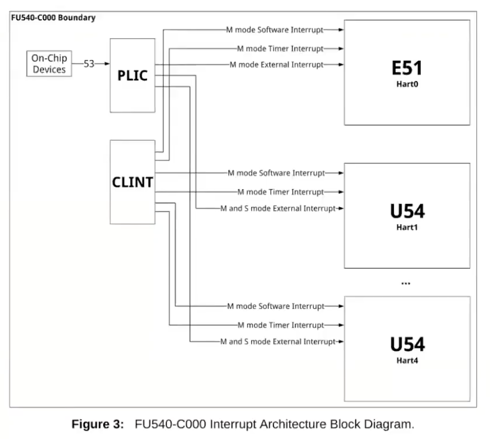

<font face="Monaco">

# xv6-riscv interrupt 笔记

## 0x00 RISC-V 硬件结构

首先是PLIC发送中断至CPU核心的结构：



PLIC接收来自硬件的中断信息，随后将其路由并发送至核心，当然这是可以控制的(发送至固定核心)，如果某些核心关闭了中断，甚至于全部核心都在处理中断过程中(关中断)，那PLIC就会一直持有当前中断信息，直到有核心可以处理。

有些中断是可以被指定为只有固定核心才能够处理的，而PLIC不会将这些中断发送至其他核心。内核通过对PLIC的编程进而可以控制中断的走向、中断的优先级等等操作，当CPU得到中断，并且判断其来自外部中断后，就会向PLIC获取中断信息，PLIC一直持有中断信息，直到CPU处理完中断信息。


## 0x01 UART的映射

在xv6-riscv中，URAT0映射地址可以从memlayout.h中看到：

```c
// kernel/memlayout.h
// qemu puts UART registers here in physical memory.
#define UART0 0x10000000L
#define UART0_IRQ 10
```

通过对这个地址的load/store操作，可以实现对UART硬件的控制，每个寄存器的大小为1byte，具体的layout为：

```c
// kernel/uart.c
// the UART control registers are memory-mapped
// at address UART0. this macro returns the
// address of one of the registers.
#define Reg(reg) ((volatile unsigned char *)(UART0 + reg))

// the UART control registers.
// some have different meanings for
// read vs write.
// see http://byterunner.com/16550.html
#define RHR 0                 // receive holding register (for input bytes)
#define THR 0                 // transmit holding register (for output bytes)
#define IER 1                 // interrupt enable register
#define IER_TX_ENABLE (1<<0)
#define IER_RX_ENABLE (1<<1)
#define FCR 2                 // FIFO control register
#define FCR_FIFO_ENABLE (1<<0)
#define FCR_FIFO_CLEAR (3<<1) // clear the content of the two FIFOs
#define ISR 2                 // interrupt status register
#define LCR 3                 // line control register
#define LCR_EIGHT_BITS (3<<0)
#define LCR_BAUD_LATCH (1<<7) // special mode to set baud rate
#define LSR 5                 // line status register
#define LSR_RX_READY (1<<0)   // input is waiting to be read from RHR
#define LSR_TX_IDLE (1<<5)    // THR can accept another character to send

#define ReadReg(reg) (*(Reg(reg)))
#define WriteReg(reg, v) (*(Reg(reg)) = (v))
```

其中RHR和THR分别为输入寄存器和输出寄存器，在xv6中，RHR对应键盘输入数据，THR为发送至控制台的数据。

## 0x02 xv6-rsicv 处理中断的设定

在PLIC还未初始化之前，就需要先设定各个中断的处理程序，在start中，将所有的中断都交给了supervisor模式，然后初始化timer中断：

```c
// kernel/start.c
// delegate all interrupts and exceptions to supervisor mode.
w_medeleg(0xffff);
w_mideleg(0xffff);
w_sie(r_sie() | SIE_SEIE | SIE_STIE | SIE_SSIE);

// ask for clock interrupts.
timerinit();
```

然后start跳到main函数中(所有CPU)：

```c
// kernel/main.c
// start() jumps here in supervisor mode on all CPUs.
void
main()
{
  if(cpuid() == 0){
    consoleinit();
    printfinit();
    printf("\n");
    printf("xv6 kernel is booting\n");
    printf("\n");
    // ...
    plicinit();      // set up interrupt controller
    plicinithart();  // ask PLIC for device interrupts
    // ...
    userinit();      // first user process
    started = 1;
  } else {
    while(started == 0)
      ;
    __sync_synchronize();
    printf("hart %d starting\n", cpuid());
    kvminithart();    // turn on paging
    trapinithart();   // install kernel trap vector
    plicinithart();   // ask PLIC for device interrupts
  }

  scheduler();        
}
```

其中启用了consoleinit：

```c
// kernel/console.c
void
consoleinit(void)
{
  initlock(&cons.lock, "cons");

  uartinit();

  // connect read and write system calls
  // to consoleread and consolewrite.
  devsw[CONSOLE].read = consoleread;
  devsw[CONSOLE].write = consolewrite;
}
```

然后开始初始化uartinit：

```c
// kernel/uart.c
void
uartinit(void)
{
  // disable interrupts.
  WriteReg(IER, 0x00);

  // special mode to set baud rate.
  WriteReg(LCR, LCR_BAUD_LATCH);

  // LSB for baud rate of 38.4K.
  WriteReg(0, 0x03);

  // MSB for baud rate of 38.4K.
  WriteReg(1, 0x00);

  // leave set-baud mode,
  // and set word length to 8 bits, no parity.
  WriteReg(LCR, LCR_EIGHT_BITS);

  // reset and enable FIFOs.
  WriteReg(FCR, FCR_FIFO_ENABLE | FCR_FIFO_CLEAR);

  // enable transmit and receive interrupts.
  WriteReg(IER, IER_TX_ENABLE | IER_RX_ENABLE);

  initlock(&uart_tx_lock, "uart");
}
```

之后将关于console的处理程序函数放到devsw中，到这里为止，关于uart的中断都已设定，而PLIC还未设定，UART设备已经可以产生中断了，但是CPU还需要通过PLIC来察觉，接下去就是进行PLIC设定，PLIC设备的地址如同UART一样被映射至了某个物理地址上。

```c
// kernel/plic.c
void
plicinit(void)
{
  // set desired IRQ priorities non-zero (otherwise disabled).
  *(uint32*)(PLIC + UART0_IRQ*4) = 1;
  *(uint32*)(PLIC + VIRTIO0_IRQ*4) = 1;
}

void
plicinithart(void)
{
  int hart = cpuid();
  
  // set uart's enable bit for this hart's S-mode. 
  *(uint32*)PLIC_SENABLE(hart)= (1 << UART0_IRQ) | (1 << VIRTIO0_IRQ);

  // set this hart's S-mode priority threshold to 0.
  *(uint32*)PLIC_SPRIORITY(hart) = 0;
}
```

至此，CPU已经“有能力”拿到中断了，而在之后的main函数中调用的scheduler函数中，每个CPU都将通过设定sstatus寄存器来打开中断。

## 0x03 输出至console

在xv6中，所有设备皆文件，在用户态进行write操作是完全一致的，只需要对文件描述符写入即可，内核则需要对输出的设备做判断，如果这个文件描述符号是文件，那就交由文件系统，如果是其他设备，就调用对应设备的驱动程序进行操作。

write函数最终会成为系统调用进入到filewrite：

```c
// kernel/file.c
// Write to file f.
// addr is a user virtual address.
int
filewrite(struct file *f, uint64 addr, int n)
{
  int r, ret = 0;

  if(f->writable == 0)
    return -1;

  if(f->type == FD_PIPE){
    ret = pipewrite(f->pipe, addr, n);
  } else if(f->type == FD_DEVICE){
    if(f->major < 0 || f->major >= NDEV || !devsw[f->major].write)
      return -1;
    ret = devsw[f->major].write(1, addr, n);
  } else if(f->type == FD_INODE){
    // ...
  } else {
    panic("filewrite");
  }

  return ret;
}
```

如果是设备，那就通过设备号去调用对应的函数，而之前中断设定时预埋的函数，分别是consoleread和consolewrite，这里我们关心的是consolewrite：

```c
// kernel/console.c
//
// user write()s to the console go here.
//
int
consolewrite(int user_src, uint64 src, int n)
{
  int i;

  acquire(&cons.lock);
  for(i = 0; i < n; i++){
    char c;
    if(either_copyin(&c, user_src, src+i, 1) == -1)
      break;
    uartputc(c);
  }
  release(&cons.lock);

  return i;
}
```

其逻辑也非常简单，从用户态拷贝数据至内核态，如果有有数据，那么直接调用uartputc到UART设备中去，这里的uartputs，已属于驱动范围：

```c
// kernel/uart.c
// the transmit output buffer.
struct spinlock uart_tx_lock;
#define UART_TX_BUF_SIZE 32
char uart_tx_buf[UART_TX_BUF_SIZE];
int uart_tx_w; // write next to uart_tx_buf[uart_tx_w++]
int uart_tx_r; // read next from uart_tx_buf[uar_tx_r++]

// add a character to the output buffer and tell the
// UART to start sending if it isn't already.
// blocks if the output buffer is full.
// because it may block, it can't be called
// from interrupts; it's only suitable for use
// by write().
void
uartputc(int c)
{
  acquire(&uart_tx_lock);

  if(panicked){
    for(;;)
      ;
  }

  while(1){
    if(((uart_tx_w + 1) % UART_TX_BUF_SIZE) == uart_tx_r){
      // buffer is full.
      // wait for uartstart() to open up space in the buffer.
      sleep(&uart_tx_r, &uart_tx_lock);
    } else {
      uart_tx_buf[uart_tx_w] = c;
      uart_tx_w = (uart_tx_w + 1) % UART_TX_BUF_SIZE;
      uartstart();
      release(&uart_tx_lock);
      return;
    }
  }
}
```

而在驱动的顶端，有一个art_tx_buf，其大小为32bytes的buf，用于保存输出至UART设备的数据，uartputc仅仅是简单的将数据放到缓冲区中，随后调用uartstart去叫醒UART设备工作，然后便返回了，在uartstart中：

```c
// kernel/uart.c
// if the UART is idle, and a character is waiting
// in the transmit buffer, send it.
// caller must hold uart_tx_lock.
// called from both the top- and bottom-half.
void
uartstart()
{
  while(1){
    if(uart_tx_w == uart_tx_r){
      // transmit buffer is empty.
      return;
    }
    
    if((ReadReg(LSR) & LSR_TX_IDLE) == 0){
      // the UART transmit holding register is full,
      // so we cannot give it another byte.
      // it will interrupt when it's ready for a new byte.
      return;
    }
    
    int c = uart_tx_buf[uart_tx_r];
    uart_tx_r = (uart_tx_r + 1) % UART_TX_BUF_SIZE;
    
    // maybe uartputc() is waiting for space in the buffer.
    wakeup(&uart_tx_r);
    
    WriteReg(THR, c);
  }
}
```

__如果THR可以继续接收字符，那就写入THR寄存器，否则直接放弃写入，而当UART设备可以继续接收数据时，UART会产生中断信息__。如果写入了THR，那么UART设备最终会将字符打印到console上(当前例子)。

UART在中断产生后，devintr最终将会调用uartintr来去处理中断：

```c
// kernel/uart.c
// handle a uart interrupt, raised because input has
// arrived, or the uart is ready for more output, or
// both. called from trap.c.
void
uartintr(void)
{
  // read and process incoming characters.
  while(1){
    int c = uartgetc();
    if(c == -1)
      break;
    consoleintr(c);
  }

  // send buffered characters.
  acquire(&uart_tx_lock);
  uartstart();
  release(&uart_tx_lock);
}
```

可以看到，某个核从PLIC中拿到中断信息后，得知来自UART的中断，就会调用驱动的中断处理程序，然后开始处理，在输出操作中，也就是其中断消息会调用uartstart函数重新写入THR寄存器，并且，中断处理程序可能会在任何一个核心中运行，这也就是为什么需要在进行uartstart时需要拿到锁了。

## 0x04 从键盘到控制台

键盘的中断在本例子中同样是由devintr来处理，并且最后调用了uartintr，也就是uartintr的上半段，其调用了uartgetc从RHR寄存器中读取信息：

```c
// kernel/uart.c
// read one input character from the UART.
// return -1 if none is waiting.
int
uartgetc(void)
{
  if(ReadReg(LSR) & 0x01){
    // input data is ready.
    return ReadReg(RHR);
  } else {
    return -1;
  }
}

// the console input interrupt handler.
// uartintr() calls this for input character.
// do erase/kill processing, append to cons.buf,
// wake up consoleread() if a whole line has arrived.
//
void
consoleintr(int c)
{
  acquire(&cons.lock);

  switch(c){
  case C('P'):  // Print process list.
    procdump();
    break;
  case C('U'):  // Kill line.
    while(cons.e != cons.w &&
          cons.buf[(cons.e-1) % INPUT_BUF] != '\n'){
      cons.e--;
      consputc(BACKSPACE);
    }
    break;
  case C('H'): // Backspace
  case '\x7f':
    if(cons.e != cons.w){
      cons.e--;
      consputc(BACKSPACE);
    }
    break;
  default:
    if(c != 0 && cons.e-cons.r < INPUT_BUF){
      c = (c == '\r') ? '\n' : c;

      // echo back to the user.
      consputc(c);

      // store for consumption by consoleread().
      cons.buf[cons.e++ % INPUT_BUF] = c;

      if(c == '\n' || c == C('D') || cons.e == cons.r+INPUT_BUF){
        // wake up consoleread() if a whole line (or end-of-file)
        // has arrived.
        cons.w = cons.e;
        wakeup(&cons.r);
      }
    }
    break;
  }
  
  release(&cons.lock);
}
```

然后将得到的数据送到buf中，在之后的read操作中，如果对象是一个“设备”，就会从这个buf中进行读取数据，比如shell，在xv6中，这个buf位于console.c中，名字为cons，作用为接收键盘的输入：

```c
// kernel/console.c
struct {
  struct spinlock lock;
  
  // input
#define INPUT_BUF 128
  char buf[INPUT_BUF];
  uint r;  // Read index
  uint w;  // Write index
  uint e;  // Edit index
} cons;
```

以上，为xv6-riscv的外部中断处理过程。

</font>