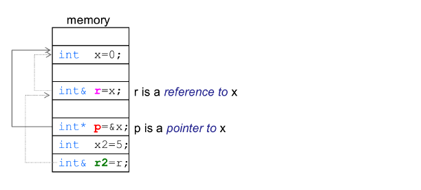

- [C++ exp](#c-exp)
    - [1. static 关键字](#1-static-关键字)
    - [2. 类的构造函数](#2-类的构造函数)
    - [3. 引用](#3-引用)
        - [1. 引用和指针](#1-引用和指针)
        - [2. 右值引用](#2-右值引用)
    - [4. const关键字](#4-const关键字)
      - [面向过程使用时:](#面向过程使用时)
      - [面向对象使用时:](#面向对象使用时)
    - [5. friend关键字](#5-friend关键字)
    - [6. class类中的一些需要记住的知识](#6-class类中的一些需要记住的知识)
    - [7. operator关键字](#7-operator关键字)
        - [1. operator的返回值](#1-operator的返回值)
        - [2. operator 重载*和->符号(伪指针)](#2-operator-重载和-符号伪指针)
        - [3. operator重载()符号 (伪函数)](#3-operator重载符号-伪函数)
    - [8.关于std::function和std::bind](#8关于stdfunction和stdbind)
    - [9. 智能指针！](#9-智能指针)
    - [10. 一些面试题目](#10-一些面试题目)
        - [* malloc free 和 new delete的区别](#-malloc-free-和-new-delete的区别)
        - [* 指针和引用的区别](#-指针和引用的区别)
        - [* 调用构造函数和构析函数的顺序](#-调用构造函数和构析函数的顺序)
        - [* 虚构造函数的作用](#-虚构造函数的作用)
        - [* 虚函数表](#-虚函数表)

# C++ exp

### 1. static 关键字

```C++
#include <iostream>

static void f4();
static int t;

class Test{
public:

    Test();
    void f1();
    void f2();
    static void f3();
    
public:
    int x;
    int y;
    static int z; /* static 关键字 */
};


void f5(){
    static int i = 10;
    i++;
}
```

(C++)
关于static修饰的变量，如变量z，它是个`类变量`， __所有由这个类实例出来的对象都可以访问，并且它只有一份copy，位于全局数据区域。__ 类变量必须在`类外定义`，如果没有赋予初始值，由于位于全局数据区， __所以一般为0 (动态区如栈或者堆一般为垃圾值)。__ sizeof计算一个对象的大小不包含static修饰的变量。

被static修饰的类函数也是如此，它将变成`类方法`，这个类实例出来的对象都可以访问到。只不过有一个地方相反， __即static方法里访问不到this指针！。__ 
(C)
对于全局静态变量如`t`， __保存在全局数据区，它在整个文件中都可以被访问到，但不被其他文件所访问，如果文件`File1`中包含此全局静态变量。则`File2`文件是无法访问到的，即使是使用extern提前声明都不行。__ 
局部静态变量`i`同样保存在 __全局数据区__ ，所以将导致整个函数调用结束后， __`f5()`函数中的其他数据会被销毁(其他数据放在栈中)，下次调用`f5()`时，`i`的数据和上次调用一样。__
静态函数`f4()`函数只能在定义的文件中使用，和全局静态变量相似。

注： __当一个头文件只有头文件存在时，那么所有文件只要包含此头文件即可访问其中的static修饰的变量或者函数，如果这个头文件存在对应的.c或者.cpp文件存在，那么其他文件无法访问static修饰的变量或者函数。__ (本质是编译器对.h等头文件等的不同处理方式)

暂时理解：单独的一个.h文件被include时会被单独的复制代码到include它的文件中，编译的时候也不会出现单独.o文件，它和include它的文件融合为一体了。也就没有了链接器找不到的问题。

### 2. 类的构造函数

```C++
class Gun{
public:
    int money;
    int distance;

public:
    
    /**
     * 列表构造函数
     **/
    Gun(int m, int dis):money(m), distance(dis){
        printf("构造函数1.0\n");
    }
    
    /**
     * 赋值构造函数
     **/
    Gun(int m, int dis){
        this->money = m;
        this->distance = dis;
    }
    
    Gun(){
        this->money = 1000; /* 默认值 */
        this->distance = 800;
        printf("构造函数2.0\n");
    }
    
    /**
     *  拷贝构造函数
     */
    Gun(Gun &g){
        this->money = g.money
        this->distance = g.distance;
        printf("构造函数3.0\n");
    }
    
};
```

类在被实例化的时候都会调用 __构造方法__ ，即使没有显式的写出，编译器也会为其添加所谓的构造函数，构造函数可以使用列表方式，这种方式的效率更高一些。
 __构造函数可以有多个，即重载__ ，如上例子，使用`Gun *g = new Gun(1, 2);`调用`1.0方式的构造函数`，而`Gun *g = new Gun();`则会调用`2.0的构造函数`。
 拷贝构造函数在一个对象进行拷贝时候会调用，如果没有显式的定义，它也会存在，只不过会出现一些`浅拷贝问题`， __即拷贝后的对象和拷贝前的对象中的指针指向相同区域的内存。__
 
### 3. 引用
##### 1. 引用和指针

引用和指针使用上是有些许不同的，但是其引用的底层实现也是指针，只不过编译器尽力做到`引用`的样子。

```C++
int x = 0;
int *p = &x;
int &r = x; /* r代表x，即r和x都是0 */
int x2 = 5; 
r = x2; /* 由于r和x是相同的，这个改动将导致r和x都为5 */
int &r2 = r;
```
上述程序内存结构:

引用其实就是一个`特殊指针`。
```C++
// x32操作系统
struct Node{ /* 一个链表节点 */
    int data;
    Node* pre;
    Node* next;
    Node():pre(nullptr),next(nullptr),data(0){}
};
int main(){
    struct Node node; 
    struct Node* p = new struct Node;
    struct Node& r = node;
    cout << sizeof(node) << endl; // 12
    cout << sizeof(p) << endl; // 4
    cout << sizeof(r) << endl; // 12
    
}
```
上述程序对于r打印出来的数值为`12`其实`编译器的欺骗`，`r`大小其实也是`4bytes`， __毕竟引用底层就是一个指针__ ，但至于为啥打印出来为`12`其实就是 __编译器为了实现所谓的特殊的指针__ 。
比如有一下三种函数声明方式:

```C++
// 声明
void func1(Object obj);
void func2(Object* obj);
void func3(Object& obj);
// 调用
Object obj;
func1(obj); // 直接传值，需要拷贝操作
func2(&obj); // 传地址，速度快，但是和传值操作的调用方式不一样，需要多一个取址
func3(obj); // 传引用，和直接传值书写一样，但传的却是 特殊指针，也就是引用
```

使用引用可以使得调用方式和传值方式调用一样，但传的是 __特殊指针__ ，不仅速度快，而且接口相同。


##### 2. 右值引用


区分左右值的方式最直观的就是判断是否可以取地址。
```C++
int a = 10;
int &a_ref = a; // 左值引用指向左值，正确
int &b_ref = 10; // 左值引用指向右值，错误
int &&right_ref = 10; // 右值引用指向右值 正确
const &c_ref = 10; // const左值引用可以指向右值，正确
```
经过如上的取引用后，`right_ref`便会成为左值，所有存在变量名字都是左值！右值永远临时存在，虽然你可以将一个`&&变量名X`的东西指向一个右值，但是语句结束后`变量名X`便会成为左值！C++标准库提供了`std::move`来将一个左值临时的变为一个右值。

```C++
int a = 10;
std::move(a); // 临时的将a变为左值
```

右值引用的存在是为了进行移动语义。在C++中，我们做一个移动操作，如将变量A移动到B上:
```C++
class Object;
Object A;
Object B;
Object A = B; // 复制操作
```
我们一般都会这样做: 先在A中开辟空间，然后将B中的数据复制到A中，这样做是一种`深拷贝`， __如果我们在之后的代码中不打算使用B变量了呢？我们就可以使用一种真正的移动操作，将B中的`数据`移动到A中__ 。例如:

```C++
class String{
public:
    String(char* s){
        this->data_ = new char[strlen(s)];
        strcpy(this->data_, s);
        this->len_ = strlen(s);
        std::cout << "String(char* s)" << std::endl;
    }
    String ():data_(nullptr), len_(0){}
    // 传统的拷贝操作
    String (const String& s):data_(nullptr), len_(0){
        delete data_;
        this->data_ = new char[s.len_];
        strcpy(this->data_, s.data_);
        this->len_ = s.len_;
        std::cout << "&" << std::endl;
    }
    String (String&& s){ // 接受一个右值
        this->data_ = s.data_;
        this->len_ = s.len_;
        s.data_ = nullptr;
        std::cout << "&&" << std::endl;
    }
    ~String(){
        if (data_)delete data_;
    }
public:
    char *data_;
    int len_;
};
```
当一个函数接受一个`右值的时候`，我们就可以将其指针传递过去，而不用进行复制，降低了复制的开销，是一种真正的`传递`，STL许多都用到了这种方式。


### 4. const关键字

#### 面向过程使用时:

```C++
/* 这两者本质没啥区别 */
int const x = 10;
const int y = 20;


const int *p1 = &x; /* p1指向的数值不可修改 */
/* 这里我们不能通过*p1修改x的值，但是我们可以直接修改x的值 */
x = 20; // 这里将导致*p1的值变为20
/* 不能修改*p1的值，但是我们可以将p1赋值为其他的地址 */
p1 = &y; // 这里将导致*p1的值变为20


int const *p2 = &x; /* p2的数值不可修改 */
/* 我们可以使用x直接修改*p2的值 */
x = 20; // 这里将导致*p2的值为20
/* 我们也可以使用*p2修改 */
*p2 = 20; // 这里将导致*p2的值为20

/* 指针和指向的值都不可以改 */
const int* const p1 = &x;
x = 1000; // 即时如此我们还是可以通过修改x来修改*p1的值
```

我们先来看一段代码和它的输出结果，将让我们看到const字段的本质。

```C++
     1  #include <iostream>
     2  #define BUF 1024
     3
     4
     5  int main(){
     6
     7          const int t = 10;
     8          int const x = 20;
     9
    10          int buf_size = BUF;
    11
    12
    13          int *p = (int*)&t;
    14          *p = 99;
    15
    16          printf("t  = %d\n", t);
    17          printf("*p = %d\n", *p );
    18
    19
    20          return 0;
    21
    22
    23  }
```

__输出结果将打印10和99__ ，也就是说我们虽然修改了`t处地址的值`，但是它打印的值还是为10，这怎么可能，之前看到有人说是`预编译器`搞的鬼， __它会将其const的值替换为对应的数字__ ，但是当我使用-E字段后，并没有发生如此，只有BUF的值被替换为1024。
我们使用gdb调试发现：
```shell
(gdb) p t
$6 = 10
(gdb) p &t
$7 = (const int *) 0x7fffffffe574
(gdb) p p
$8 = (int *) 0x7fffffffe574
(gdb) p *p
$9 = 10
(gdb) n
Breakpoint 3, main () at target.cpp:20
20              return 0;
(gdb) p t
$10 = 99
(gdb) p *p
$11 = 99
```
没问题，t处地址的值确实改为99了，但为啥会打印出10？
使用汇编查看一下当时发生了什么
```shell
   0x0000000000400757 <+48>:    mov    QWORD PTR [rbp-0x10],rax
   0x000000000040075b <+52>:    mov    rax,QWORD PTR [rbp-0x10]
   0x000000000040075f <+56>:    mov    DWORD PTR [rax],0x63
=> 0x0000000000400765 <+62>:    mov    esi,0xa
   0x000000000040076a <+67>:    mov    edi,0x400885
   0x000000000040076f <+72>:    mov    eax,0x0
   0x0000000000400774 <+77>:    call   0x4005e0 <printf@plt>
   0x0000000000400779 <+82>:    mov    rax,QWORD PTR [rbp-0x10]
```
可以看到，当代码跑到`printf`的时候 __将寄存器esi的值压入0xa__ 也就是10，之后 `call printf@plt`调用了printf打印出了10，其实是编译器在编译的时候将t改为了固定的值！


#### 面向对象使用时:

```C++
class Test{

public:

    const int test; // 不赋值，只能在对象初始化的时候初始化(列表初始化)
    
    int x;
    int y;
    
    mutable int z;
    
public:

    Test(int t): test(t){}
    // 常成员函数
    int test1() const{
        return test; 
    } 
    
    void test2();

};
```
其中 __test1()常成员函数可以访问x和y的值，但是无法修改普通对象中的x和y的值__ ，这是由于const修饰的就是`this`指针。也就是`void test1() const;`其实是`void test1(const Test* this);`，还记得之前的定义么，这种定义的意思表示的是 __无法修改`this`指向的地址处的值，所以自然无法修改其中x和y的值。__ 

如果在必须在常成员函数中修改某个特定的值，则可以对其定义`mutable`关键字，表示这个值总是可以被改变的， __如其中的`z`变量是可以被常成员函数所改变的。__

```C++
const Test* t = new Test(10);
t->test1();
```
常成员函数只能调用常成员函数。
常对象只能调用常成员函数。

```C++
/* 限制的是指针指向的值，所以不能调用其他方法，只能调用常成员函数 */
const Test* t = new Test(10);
/* 限制的是指针的值，对于指针指向的值不影响，所以所有函数都能调用 */
Test* const t = new Test(20);
```

上述的`const Test* t`只能调用常成员函数有些人可能会认为是一个固定的`"约定"`，但其实都是编译器的问题，如果从编译器的角度来看待这个语法的话: __一个const声明的对象，然后再调用这个对象的`某个函数`，由于const对象是肯定不允许改变其`对象中属性的值`，当我们调用一个`const声明的对象的成员函数`时，编译器不知道你调用的`成员函数`会不会改变其内部的值，因而报错__ ! 比如:

```C++
class Test{
public:
    int x;
    void change(){
        x = 100;
    }
};

const Test t;
t.change(); // 报错！，t是const类型，不可改变！
```
__这也就解释了为什么`const声明的对象`只能调用`const方法`，因为这让编译器`安心`__ 。

### 5. friend关键字

友元函数以及友元类
C++中类存在许多的属性如public，protected，private。
public: 类中所有方法，子类所有方法，类外方法都可以访问。
protected: 类中所有方法，子类所有方法都可以访问，类外不可访问。
private: 类中所有方法可以访问，子类和类外不可访问。

friend关键字的用处在于，当一个类中有许多封装好的private属性，但有不得已需要开放一些访问的途径，即可以将一个函数设置为`friend (友好的函数)`，那么函数中即可访问此类所有的属性。

```C++
class Student{

private:
    int money;
    
public:
    Student(int m): money(m){}

    ~Student(){}
    
    friend void cat_money(Student &stu); // 声明了一个友元函数
};

void cat_money(Student &stu){
    cout << stu->money << endl; // 访问了其私有属性
}
```

以上方法就可定义一个友元函数，除此之外，还能定义一个友元类，当一个类被定义为友元类，那么类中的所有方法都能访问到其私有属性等。

```C++
class Parent;

class Student{
private:
    int money;
    
public:
    Student(int m): money(m){}
    ~Student(){}
    
    friend class Parent; // 将parentl类设置为友元类
};

class Parent{
public:
    Parent(){}
    ~Parent(){}
    
    cat_money(Student &stu){
        cout << stu->money << endl; // 访问student中的私有属性。
    }
};
```

__友元类和友元函数不可继承和传递，__ 如有一个类`A`，它将类`B`设置为 __友元类__ ，类`B`又有一个子类`C`，那么`C`无法访问`A`中的私有属性。且派生类也不会收到其影响，还是以上的例子，现在类`A`有一个子类`D`， __那么类`B`是无法访问到`D`中的私有属性的。__ 
 一般不建议这样做，将一个类设置为友元类将暴露太多封装的细节。
 
### 6. class类中的一些需要记住的知识

```C++
class A;
class B: public A;
class C: public C;
```
那么以上的构造函数是从`A()`开始，到`C()`，析构函数是`~C()`开始直到`~A()`。
类的继承还涉及到public继承，protected继承，private继承等。

```C++
基类中成员   继承方式       派生类中的成员
public       public         public
protected    public         protected
private      public        无权访问


基类中成员    继承方式       派生类中的成员
public       protected      protected
protected    protected      protected
private      protected      无权访问

基类中成员    继承方式       派生类中的成员
public       private        private
protected    private        private
private      private        无权访问
```

### 7. operator关键字

operator关键字可以将某些操作符号进行重载，比如说`==`

```C++
class Student{
public:
    int age;
    bool operator==(const Student &stu){
        return this->age == stu->age;
    }
};

int main(){
    Student t1;
    t1.age = 20;
    Sutdent t2;
    t2.age = 22;
    if (t1 == t2)
        cout << "yes" << endl;
    else
        cout << "no" << endl;
}
//输出NO
```

```C++
class Object;
Object object1, object2;
Object::operator += (this, const Object& r); // this是编译器自行加上的，我们不必写也不可以写！
object1 += object2;
```
上述的语法编译器会将`+=`符号作用于`object1`这个对象(大部分都是作用于左边的对象)，当`object1`对象中真的重载了`+=`符号，那么编译即可通过。

##### 1. operator的返回值

```C++
class Inter{
public:
    Inter(int value)
    : value_(value){}
    /* 第一种方法 */
    operator += (const Inter& in){
        this->value_ = in.value_;
    }
    /* 第二种方法 */
    Inter& operator += (const Inter &in){
        this->value_ = in.value_;
        return *this;
    }

private:
    int value_;

};
```

对于没有返回值的`+=重载方法`是可以直接这样调用的
```C++
Inter t1(10);
Inter t2(20);
Inter t3(30);
t1 += t2; // 完全没问题---> t1.operator+=(t2);
t1 += t2 += t3; // 报错！
```
__但是当没有返回值的重载方法被上面的方式调用就会发生报错，由于是`void类型`，无返回，则`t2`和`t3`相加之后是没有值的，而`t1+=`这个符号却期待着一个`右值来进行+=操作`__ ！当使用上述第二种定义方法的时候就不会出现错误了。

##### 2. operator 重载*和->符号(伪指针)

由于operator操作符号非常的强大，以至于我们可以重载`*`和`->`操作符号， __让一个本身是类实例化出来的对象`很像一个指针`__ ，称为伪指针。

```C++
template<typename T>
class PointerLike{
public:
    PointerLike(T* pointer)
        :p_(pointer){}
    
    T& operator*() const { /* 重载操作符号*      */
        return *p;
    }
    T* operator->() const { /* 重载操作符号->    */
        return px;
    }
private:
    T *p_;
};
class Object; /* 假设存在的一个类 */

/* 使用 */
Object *x = new Object(); /* 创建一个对象Object */
PointerLike<int> p_x(x);
Object copy = *p_x; /* 赋值 */
p_x->func(); /* 假设Objcet中存在func()方法，那么也可以直接调用 */
```

其实标准库中的iterator也是一个`伪指针`，只不过它需要重载更多的方法，比如`++``--`等等。
__注：上述的`p_x->func()`操作符重载后`->`符号本该被消耗，并且根据重载函数的返回值可以得知返回的是一个`px`指针，按理说本不该调用`func()`，但其实还是被调用了，这是因为C++里有个规定，就是对于`->`操作符，需要递归的一直调用下去__ !

##### 3. operator重载()符号 (伪函数)

我们可以重载`()`符号，使一个类实例化的对象可以直接再调用`()`符号，让这个对象变得非常的 __像函数__ ，称为伪函数。

```C++
class FuncLike{
public:
    FuncLike(int x)
    :value_(x) {}
    /* 重载符号，第二个括号可以放参数 */
    int operator() () const{
        return value_;
    }
    
private:
    int value_;
};
FuncLike f(10);
int ret = f();/* 调用重载(),使用起来像函数 */
```


### 8.关于std::function和std::bind

`std::function`允许我们保存一个可以调用的对象，如

```C++

int add(int x, int y){return x + y;}
/* 生成一个可以保存int返回值和2个int形参的可调用对象new_function */
std::function<int(int, int)> new_function = add;

/* 之后我们可以使用 */
new_function(10, 20);
/* 又或者直接使用原函数都将返回相同的值 */
add(10, 20);
```

`std::bind`允许我们提前绑定对应的可以调用的对象和其参数。将调用对象和参数绑定为一个仿函数。

```C++
int add(int x, int y){return x+y;}

auto new_function = std::bind(add, 10, 20);
/* 之后调用new_function都将只会传入10和20 */
new_function(); // 返回30

/* 可变参数，绑定20到第二个参数位置，保留第一个参数位置 */
auto new_function2 = std::bind(add, std::placeholders::_1, 20);
```
__我们可以使用`std::placeholders::_1`来充当占位符号__ 。std::bind绑定一个成员函数时候：

```C++
class Test{
public:
    int add(int x, int y){
        return x + y;
    }
};

Test t;
auto new_function = std::bind(&Test::add, &t, 10, 20);
```
必须将其函数指针传入，并且在第二个参数中还需要指定所在的对象！。

std::bind更多的使用途径是用在回调函数的参数提前绑定。
```C++
class Work;

class Timer{
public:
    typedef std::function<void()> Functor;
    Functor cb_;
    Timer(Functor cb):cb_(std::move(cb)){}
    void run() const
    {
        cb_();
    }
};

class Work{
public:
    int fd_;
    Work(int fd):fd_(fd){}
    Timer* timer;
    void close(int fd){
        std::cout << "fd: " << fd << " closed" << std::endl;
    }
};

int main(){
    Work work(10);
    Timer timer(std::bind(&Work::close, work, 10));
    timer.run();
}
```

如上用法，`Timer`类中有一个回调函数`cb_`， __这个回调函数并不需要什么参数，因为使用者可以通过`std::bind`提前将参数绑定好__ ，然后将这个`std::bind`的返回对象，也就是一个仿函数传入，由于这个仿函数是这样的`std::bind(&Work::close, work, 10)`，它是一个右值，我们可以使用`std::move`来延长其寿命，并且最终将其赋予`cb_`。


### 9. 智能指针！

C++引入了智能指针，它帮助我们管理一个动态内存的释放动作。

__unique_ptr__ 智能指针，它表示独占一个"指针"，它控制着指针所指向的对象的生命周期，当unique_ptr这个类死亡时，调用构析函数将直接delete真正指针所指向的地址。
unique_ptr智能指针如其名一样，是一个unique的，如果你无法复制一个unique_ptr智能指针，因为其拷贝构造函数是私有的， __并且如果你强制声明了2个unique_ptr智能指针指向同一块地址，那么运行时将报错，因为析构函数将呗调用2次造成2次free操作__。
简单实现:

```C++
template <typename T>
class uniquePtr{
public:
    uniquePtr(T* ptr)
    :   ptr_(ptr)
    { 
        if (!ptr)
            exit(-1);
    }
    ~uniquePtr(){
        delete ptr_;
    }
    T& operator * (){
        return *ptr_;
    }
    T* operator -> () {
        return ptr_;
    }
private:
    uniquePtr(const uniquePtr&){}
    T* ptr_;
};
```


使用 __shared_ptr< T >__ 和unique_ptr有不同之处，它并不是直接在析构函数中delete指针，而是采用了一个引用计数的方式来记录这块地址的使用次数，将使用次数降低至0时才会释放内存，也如它名所示，它是一个可以复制(shared_ptr)的智能指针。

```C++
#include <iostream>
#include <memory>


int main(){

	int *x = new int;
	*x = 10;
	int *y = x; /* 偷偷保存一下值 */
	/* 初始化 */
	std::shared_ptr<int> p1(x);
	std::shared_ptr<int> p2 = p1;
	printf("ref: %d\n", p2.use_count());
	p1.reset(); /* 删除智能指针，p1将指向空 */
	printf("ref: %d\n", p2.use_count());
	p2.reset(); /* 删除，x的地址将被释放 */
	printf("&x: %p\n", y);
	printf("x: %d\n", *x); /* x处的内存已经释放了，打印出的东西是垃圾数据 */
   /* 不仅如此，还有概率崩掉，毕竟可能访问到一些不该访问的内存！ */
}
``` 

__weak_ptr< T >__ 智能指针一般配合 __shared_ptr< T >__ 智能指针，它所指向的内存空间是没有访问权限的，也就是 __weak_ptr< T >__是没有`*`和`->`重载符的。但是我们可以通过弱智能指针来判断所指向的地址是否已经过期。也可以提升权限，称为 __shared_ptr< T >指针。

```C++
#include <iostream>
#include <memory>
int main(){
	int *x = new int;
	*x = 10;
	int *y = x;

	std::shared_ptr<int> p1(x);
	/* 获取弱智能指针 */
	std::weak_ptr<int> wp = p1;
	std::shared_ptr<int> p2 = p1;
	printf("ref: %d\n", wp.use_count());
	p1.reset(); /* 删除智能指针，p1将指向空 */
	printf("ref: %d\n", wp.use_count());
	auto p3 = wp.lock(); // 提升权限，这个操作将使得引用+1
	p2.reset(); /* 删除，x的地址将被释放 */
	printf("&x: %p\n", y);
	printf("x: %d\n", *x);
	printf("*p3: %d\n", *p3);
}
```

关于循环引用的问题: 当对象A和对象B分别存有对方的shared_ptr时会发生的事情，如果发生了循环引用，会导致内存不被释放，进而产生内存泄漏。解决的方式就是一方使用weak_ptr，weak_ptr不会使引用数量增加，当需要使用的时候采用lock()或者expire来判断指针是否过期，之后再进行使用指针的操作。


### 10. 一些面试题目

##### * malloc free 和 new delete的区别

malloc和free是属于C/C++标准库函数，new和delete是C++中的运算符，受编译器控制。

malloc申请一块内存，申请的内存大小需要指定，free释放一块内存， __大小不需要指定，malloc和free所操作的对象称为chunk，其chunk头保存着对应大小，所以回收时不需要指定回收大小__ 。

<font color=#FF00000>`new`内部调用了`malloc`，但是它做的不止这些，它在内部计算了所需要的内存大小，并且如果这个空间需要存放的不是POD，那么new会为其调用构造函数来初始化空间。

`delete`内部调用了`free`，但是它做也不止这些，如果内存中存放的是非POD数据类型，那么它会提前调用对应的构析函数，之后调用free将内存还给heap管理器。

关于`new []` 和 `delete []`，如果它们作用的类型是POD数据类型，那么`delete`和 `delete []`没有任何区别。当作用在非POD数据类型上时，delete将导致数组第一个元素被调用构析函数，`delete []` 将使得整个数组上的所有元素都被调用构析函数。两者都会回收全部内存。</font> 

```C++
class Test;
Test test* = new Test; // 申请一个Test空间
Test test2* = new Test[2]; // 申请两个Test空间
delete test; // 语句1
delete [] test2; // 语句2
delete test2; // 语句3
```

__语句2会调用2次构析函数，语句3将导致test2[1]空间上的对象没有调用构析函数，如果Test对象中存储着一些指针，而这些指针上的内存由本对象所管理，那么没有调用构析函数回收这些内存将导致内存泄漏__ ！

new中还有一个 placement new，它允许我们在一个地址上直接调用所需要的对象的构造函数，当然这个地址需要事先申请完毕。

```C++
class Test;
Test *t1 = new Test; // 正常operator new
Test *t2 = (Test*)malloc(sizeof(Test)); // 申请一块地址
new (t2) Test; // placement new 操作，将在t2的位置上调用构造函数
```

##### * 指针和引用的区别

指针可以随时改变指向的对象，引用不行。

指针初始化时可以赋值为`nullptr`，引用不行，引用必须初始化。故引用必定指向某些对象，指针可指向空值。

<font color=#FF00000>引用的底层实现是指针，所以当以引用传参的时候会，改变函数内部的形参将改变真实对象的数据，以引用返回时其宗旨和指针返回一样，切勿返回临时变量。</font>

__指针是一个真正存在的变量，而引用更像是编译器实现的假的指针，对指针进行sizeof计算大小，得到的是一个指针的大小，而对引用计算大小，得到的是所指向的对象的大小，所以引用更像是一个别名，一个假指针__ 。

对指针进行`++`运算得到的将是地址往后移动一个指针大小，对引用++得到的将是对象的`++`运算操作。


##### * 调用构造函数和构析函数的顺序

`派生类`调用构造函数时会先调用`基类`构造函数，如果`派生类`中有组合其他类，那么之后会调用这些`组合类`的构造函数，之后才会调用本身构造函数。

`派生类`构析函数调用顺序和构造函数调用顺序相反，先构析自己，再构析`组合类`，最后构析`基类`。

```C++
#include <iostream>
class A{
public:
    A(){ std::cout << "A()" << std::endl; }
    ~A(){ std::cout << "~A()" << std::endl; }
};
class C{
public:
    C(){ std::cout << "C()" << std::endl; }
    ~C(){ std::cout << "~C()" << std::endl; }
};
class B: public A{
public:
    B(){ std::cout << "B()" << std::endl; }
    ~B(){ std::cout << "~B()" << std::endl; }
private:
    C c;
};
int main(){
    B b;
}
/*  A()
    C()
    B()
    ~B()
    ~C()
    ~A() 
*/
```
以上调用顺序引出了下一个问题

##### * 虚构造函数的作用

同样的代码，将主函数改成如下:

```C++
int main(){
    A* a = new B;
    delete a;
}
/*
    A()                                                                    
    C()                                                                     
    B()                                                                
    ~A()
*/
```

将父类A的构析函数改成虚函数后又恢复正常了。
这里就要用到什么是[虚函数表](#虚函数表)的知识了

在没有使用虚函数的情况下，`delete`调用了`a`的构析函数，注意这里调用a的构析函数是在编译时就已经写死了，如此便产生了一系列问题，比如B中的C对象没有及时删除等等内存泄漏的问题，通过构析函数改成虚函数的形式，将虚函数地址写到虚函数表并且存到变量中，由此调用析构函数就不再取决于变量`A* a`的类型了，而是取决于<font color=#FF0000>变量`A* a`中所存的对象的虚函数表指向的虚函数，这样就可以使得编译器在编译的时候，不通过`A* a`的类型，将所调用的虚函数直接写死为固定`A* a`类的虚函数，而到运行时才动态的通过内存中所存的虚函数表查询真正的函数地址。</font>

##### * 虚函数表

```C++
class A{
public:
    void echo(){
        std::cout << "this is A's echo" << std::endl;
    }
};
class B: public A{
public:
    void echo(){
        std::cout << "this is B's echo" << std::endl;
    }
};
int main(){
    A* b = new B;
    b->echo(); // this is A's echo
}
```

以上调函数运行时后其实调用的是A类中的echo函数，这并不是我们所想要的，探究其原因是编译器。当编译器编译代码的时候，发现我们b解引用并且调用echo函数，只不过编译器发现这个b所属的数据类型是`A*`类型，所以理所当然调用了A所属的echo函数。

我们想要做到的是使用`A*`类型指向任何其派生类，都能调用到对应的派生类中的函数，而不是基类中的函数，由此，C++引入了virtual关键字，将函数定义成一个虚拟函数，将函数的地址绑定变成了动态绑定。

```C++
class A{
public:
    virtual void echo(){
        std::cout << "this is A's echo" << std::endl;
    }
};
class B: public A{
public:
    void echo(){
        std::cout << "this is B's echo" << std::endl;
    }
};
int main(){
    A* b = new B;
    b->echo(); // this is B's echo
}
```

以上便调用成功了。

对象中函数不占用大小，static属于类属性，也不占用对象大小，了解了这些，就可以进入virtual虚函数了。

对于使用了虚函数的类，C++编译器在编译时对调用了虚函数的位置不采用 __绑死__ ，的操作，而且是通过一个叫虚函数表的东西进行调用，虚函数表是一个指针数组，数组中的各个元素指向各个不同的虚函数，类一旦使用了虚函数，那么内存中就有一份关于这个类的虚函数表。

实例化的对象通过储存一个虚函数指针，该指针指向其类的虚函数表。由此，对于`A* b`这种操作，<font color=#FF0000>编译器发现对于`b->echo()`调用的是一个虚函数，那么编译器就会通过`b`这个指针所指的内存中的虚函数指针来进行调用，通过虚函数指针找到关于其实例化的类，`b`的实例化模版是`B`，所以找到了`B`的虚函数表，进而调用了`B`的`echo`函数。</font>


##### * 重载与重写

重载(Function Overload)，在同一作用域中，同名函数的形式参数不同构成函数重载。

形式参数的个数不同，类型不同，顺序不同都构成重载。

在类中，成员函数是否为const也可以构成函数重载。

重载的本质是编译过程编译器将函数进行改名，改名的规则有函数所在的命名空间，函数的形式参数等。


##### * struct和class区别

在面向过程编程中，也就是C语言中没有class，并且struct作为一个`自定义的数据类型`，它不包含任何成员函数(不过可以定义函数指针)，没有所谓的属性访问权限(public|private等)。

在面向对象中，struct和class区别不大。

class 中存在this指针，struct中不存在。
class关键字可以用来做模版，struct关键字不行。


##### * 进程和线程的区别

地址空间: 进程间地址空间独立，同进程内线程间地址空间共享。

资源: 进程间内存、IO、CPU资源独立，线程是共享的。

健壮性: 同进程内的线程崩溃会引起整个进程崩溃，所以多进程程序更稳定。

并发: 两者都是CPU的调度单位，都可以并发执行，但是线程的上下文切换比较快。

##### * 进程间通讯

Linux下可以使用管道pipe进行通讯。

也可以通过发送信号的方式来进行通讯。

信号量可以来做进程间同步的操作。

共享内存方式。

或者直接使用套接字，但是对于有分布式要求的程序我觉得走网络协议会好点。本地协议不利于分布式。


 


