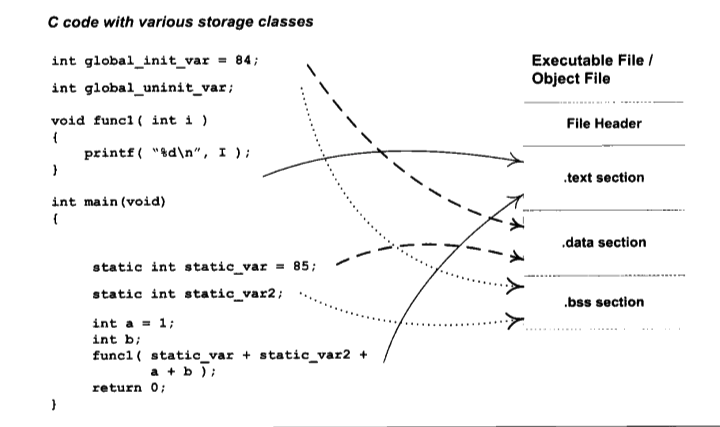
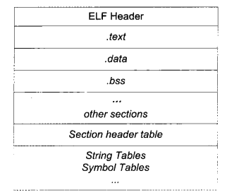
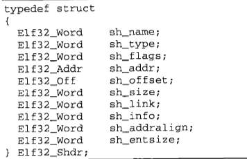
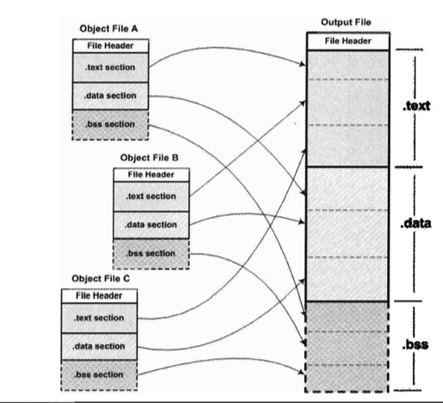

# ELF文件

主流的PC可执行文件格式一般有PE(Windows)和ELF(Linux)。

其中ELF文件包含可执行文件和可重定向文件等，比如Linux下的 __可执行文件以及.o文件和.so(动态链接库)和coredump文件等等。__

我们这里以可运行文件进行分析，一个可运行文件要可以运行，肯定需要保存有一系列代码以及数据等等，为了正确的保存这些代码以及数据，ELF文件中有着一个个的节(Section)又或者称之为段(Segment)的分区，程序编译完的汇编数据一般放在代码段(常见的代码段有.code或者.text，不同的编译器有不同的编译方式)，而数据则一般放到数据段(常见的有.data)。



ELF中只有这些段当然不够，操作系统需要知道当一个可运行文件加载到内存中的时候对应的段在哪些地址上，要做到这些，就需要用到段表(Section header table)。

段表中保存着所有段的信息，包括段名，段长度，段在文件中的偏移，段的读取权限。(段在加载后在内存中的位置-->不确定)。

使用以下命令可以看到整个ELF文件的段分布图。

```shell
# 使用objdump -h 命令可以取到整个文件的段信息
# 其中包括段的开始地址，长度，在文件中的偏移量等等
objdump -h target.elf 
# 或者可以使用readelf -S target.elf进行查看


# 使用objdump -s 命令可以得到整个ELF文件的hex值
objdump -s target.elf

# 使用objdump -d 命令可以打印ELF文件中的汇编代码(反汇编)
# 加上-M intel可以使用intel方式打印汇编代码
objdump -d target.elf
```

TODO: 关于其他段的具体用途

只有以上的段表还不足以让操作系统完全了解整个ELF文件，只有将所有所需信息都塞进一个叫做 __File Header__ 中才能做到，整个ELF文件结构:



文件头保存着最基本的ELF文件信息，比如 <font color=F0000> ELF魔数，文件机器字节长度，数据的存储方式，版本，运行平台，ABI版本，ELF重定位类型，硬件平台，还有最重要的入口地址，程序头入口和长度，以及我们上面提到的段表的位置和长度及段的数量等。 </font>

段表实际上存储的方式一个数组，数组中每个元素表示一个段，其中有段的信息，也就是一个结构体:



其中有些信息比较重要，比如sh_type表示这个段是属于什么类型的段，sh_addr对于一个可以被加载到内存的段则表示其被加载的虚拟地址，sh_offset表示它在文件中的偏移量，还有sh_link表示段链接信息等等。

TODO: ELF链接关键，符号

# ELF文件的静态链接

对于两个代码:

```C
// a.c
extern int shared;
int main(){
    int a = 100;
    swap( &a, &shared );
}
```

```C
// b.c
int shared = 1;
void swap( int* a, int* b){
    *a ^= *b ^= *a ^= *b;
}
```

其中分别编译出a.o和b.o，a中使用b中的shared变量和swap函数，但是对a.o使用nm命令查看信息可以明确的看到shared和swap地址并不知道，当使用 __ld a.o b.o -e main -o ab__ 命令将两个可重定向文件链接到一起时就可以查看到shared变量地址和swap函数地址。

这种静态链接，本质就像是将两个可重定向文件直接`合成`到一起，现代连接器一般采用两部，先分配空间和地址，之后对符号进行解析，并且重新写入对应符号在链接后的真正地址。




