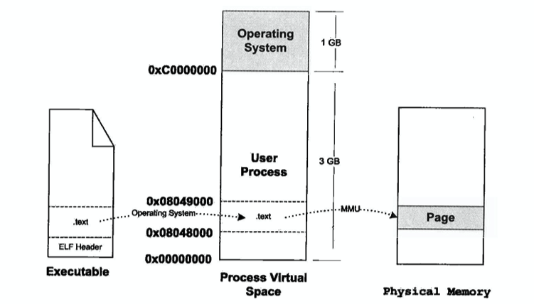
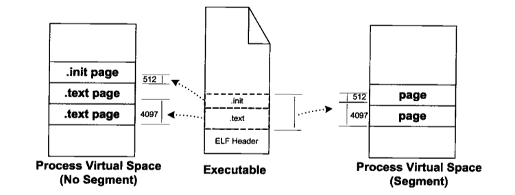
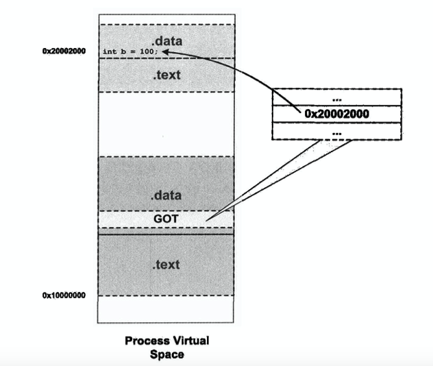

# C/C++的静态链接，装载与动态链接

理解C/C++的链接，需要先明白编译后的[ELF中有什么](./ELF.md)

## 静态链接

通俗的讲，静态链接，就是讲一系列的ELF文件都塞到一个ELF文件中去，这样做非常容易理解，优点是运行的时候不需要依赖其他的东西，直接就可以运行，缺点就是文件会变大，而且当有某个ELF文件发生改变，比如函数中的一些信息修改了，那么就需要重新链接。

一般为相同节和节进行融合，比如`.data`和`.data`合成到一起。


通过扫描每个ELF文件，计算出其大小，链接器为其分配大小空间用于存储，这是第一步，

后续还有很多需要调整的，如符号的地址和重定位。

##### 1.符号地址

我们可以用一个比较简单的例子来看符号地址是什么。

```C
void func();
int main() {
    int a;
    func();
}
```

使用gcc只编译不链接，objdump来查看

```
Disassembly of section .text:

0000000000000000 <main>:
   0:   55                      push   rbp
   1:   48 89 e5                mov    rbp,rsp
   4:   b8 00 00 00 00          mov    eax,0x0
   9:   e8 00 00 00 00          call   e <main+0xe>
   e:   b8 00 00 00 00          mov    eax,0x0
  13:   5d                      pop    rbp
  14:   c3                      ret    
```

可以清楚的看到，main函数并没有`地址`，这里的地址指的是加载到虚拟内存中的地址，并且关于func函数也被写成了`<main+0xe>`，我们具体看其汇编码`e8 00 00 00 00`，e8是call指令，而后面的零则表示编译器也不知道这个函数位置是哪里，需要由链接器来确定。

链接时，链接器就会开始分配每一个符号的具体地址了，当一个符号在ELF文件中时，都是关于某个节的偏移，比如`.text`节的0x20偏移是某个符号，而链接器会为`.text`这种的节分配一个地址，通过这个地址，链接器修改符号偏移为真正的地址。


如图所示，当链接到一起时，ab的.text被分配到了`0x8048166`，如果main函数在`a.o`中到偏移是0x20，那么链接到ab中时，main的地址就将是`0x8048166 + 0x20`。这就是符号地址确定。

##### 2. 重定位

跟符号地址确定不同，main函数是事实存在的一个函数，位于.text文件中的某个偏移上，而func是不存在的，它是一个函数，可能存在于某个其他ELF文件中，至少当前编译器不知道位置，所以留给了链接器来确定。链接器在发现后重新调整其地址，这就叫重定位。

链接器是如何找到一个个需要重定位的符号呢？答案是有一个节是保存关于重定位信息的，一般以`.rel`开头，比如`.rel.text`等等。它也是一个表，表成员由`Elf32_Rel`来定义。

```C
typedef struct
{
    Elf32_Addr  r_offset;       /* Address */
    Elf32_Word  r_info;         /* Relocation type and symbol index */
} Elf32_Rel;
```

`r_offset`是一个偏移，我们现在以静态链接的形式来看，它是关于文件开头的偏移，通过这个偏移，我们就能找到需要进行重定位的符号所在。

`r_info`重定向类型和符号，具体留空。

通过以上的重定向表信息，链接器就能找到一个个需要重定向的符号了，具体计算先留空。

## 装载

一个ELF如果只存储在硬盘上，那么将无法运行，CPU做的是将数据和指令从内存中读取并且执行，所以一个程序要运行前就要先将其装载到内存中。

我们直接跳过覆盖装入，现代操作系统的内存都是采用页映射的方式，且一般的对齐都为0x1000也就4k大小的对齐。

ELF文件中存在多个`节`，并且有`节头表`来说明各个`节`的具体信息，其实也可以翻译为段，但为了清晰，这里将`.section`表示为节，装载到内存中后，`.segment`表示为段。

一个最简单的例子，就是当一个程序中只有`.text`段的时候，静态链接时链接器为其分配内存到0x08048000，长度为0x900，那么在装载时，只需要将其加载到对应内存即可，注意，虚拟内存和物理内存的具体映射关系由操作系统维护，这里暂不讨论。由于其页对齐方式是4k，那么实际消耗的内存并不是0x900，而是0x1000。



除此之外，ELF中的各个节如果权限相同，那么可以合并映射，以做到减少内存碎片和浪费的效果，比如 __.text节占用0x1001，而.init段占用0x512，如果分开映射，那么将占用3页，即4k x 3，如果合并映射到一个Segment，则只需要消耗4k x 2__ 。



还记得在[ELF - Program Header Table](./ELF.md)中讲到的一个字段么，就是`Elf32_Phdr`这个结构体组成的数组，其中保存着加载信息。

```C++
typedef struct {
    Elf32_Word  p_type;
    Elf32_Off   p_offset;
    Elf32_Addr  p_vaddr;
    Elf32_Addr  p_paddr;
    Elf32_Word  p_filesz;
    Elf32_Word  p_memsz;
    Elf32_Word  p_flags;
    Elf32_Word  p_align;
} Elf32_Phdr;
```

使用readelf -l 即可看到程序的程序头表。

```shell
Program Headers:
  Type           Offset             VirtAddr           PhysAddr
                 FileSiz            MemSiz              Flags  Align
  LOAD           0x0000000000000000 0x0000000000400000 0x0000000000400000
                 0x00000000000c9a47 0x00000000000c9a47  R E    200000
  LOAD           0x00000000000c9ec0 0x00000000006c9ec0 0x00000000006c9ec0
                 0x0000000000001c90 0x0000000000003548  RW     200000
  NOTE           0x0000000000000190 0x0000000000400190 0x0000000000400190
                 0x0000000000000044 0x0000000000000044  R      4
  TLS            0x00000000000c9ec0 0x00000000006c9ec0 0x00000000006c9ec0
                 0x0000000000000020 0x0000000000000050  R      8
  GNU_STACK      0x0000000000000000 0x0000000000000000 0x0000000000000000
                 0x0000000000000000 0x0000000000000000  RW     10
  GNU_RELRO      0x00000000000c9ec0 0x00000000006c9ec0 0x00000000006c9ec0
                 0x0000000000000140 0x0000000000000140  R      1
```

我们只节选一些输出而已，其中的LOAD即表示需要被装载到内存中。

这里解释一下`.bss`段是如何节省磁盘空间的，对于每一个需要LOAD的段，有`p_filesz`和`p_memsz`，如果发现`p_memsz < p_filesz`的情况，我们完全无法理解，并且也确实不会出现这种情况，但是会出现另外一种情况， __也就是`p_memsz > p_filesz`，这就表示某些在`.bss`中未初始化的变量在装载的时候才会被填上`0`，而在磁盘中时并不会存储那么多无用的`0`，就可以节省ELF文件的大小了，一般`.bss`在被装载时会和数据节一起被映射到数据段中__ 。

当一个程序加载到内存中，并且运行的时候，我们可以在`/proc/PID/maps`看到其映射的内容，比如：

```shell
root@Swagger:~/c_test/load# cat /proc/2700/maps 
00400000-004ca000 r-xp 00000000 fd:01 1447162                            /root/c_test/load/a.out
006c9000-006cc000 rw-p 000c9000 fd:01 1447162                            /root/c_test/load/a.out
006cc000-006ce000 rw-p 00000000 00:00 0 
02218000-0223b000 rw-p 00000000 00:00 0                                  [heap]
7ffe78c13000-7ffe78c34000 rw-p 00000000 00:00 0                          [stack]
7ffe78d82000-7ffe78d84000 r--p 00000000 00:00 0                          [vvar]
7ffe78d84000-7ffe78d86000 r-xp 00000000 00:00 0                          [vdso]
ffffffffff600000-ffffffffff601000 r-xp 00000000 00:00 0                  [vsyscall]
```

排列的每列分别表示 __地址起始和结尾，权限(p表示私有，s表示共享)，偏移量，设备号，文件节点(inode)，和路径__ 。

其中可以看到除了2个LOAD加载了我们的程序外，还有一些其他的映射存在，比如`stack和heap`，以及`vdso`，`vdso`时程序访问内核所需要的。并且我们可以看到，只有LOAD有对应的inode，也就是说只有这两个段有对应的映像(文件)，堆栈则没有。

#### Linux装载程序入口

Linux中有5个关于execve()的API用于运行程序，当我们在shell中运行程序时，首先使用fork()，后调用execve()来加载映像并运行。

execve()内部又会调用do_execve()，do_execve()会检查输入文件的前128字节，通过识别文件魔数来辨别拿到的是什么文件格式。通过`load_elf_binary()`来加载程序，具体定义在`fs/Binfmt_elf.c`中，具体步骤为

* 1. 检查ELF文件格式，获取魔数，程序头表
* 2. 寻找动态链接的`.interp`段，设置动态链接库路径
* 3. 根据程序头表进行文件映射到内存
* 4. 初始化寄存器
* 5. 修改系统调用返回地址

修改系统调用返回地址的原因是，当一个ELF文件已经完成加载了，下一步就是进入ELF文件入口了， __ELF文件头中的`e_entry`就是程序的入口，当然这是对于静态链接的ELF文件而已，如果是动态链接的ELF文件，则入口是`动态链接器`__ 。

## 动态链接

动态链接和静态链接不同，你可以近似的看成是链接部分留到了装载时进行，C语言有一个运行库glibc，它的动态链接库是/lib下的libc.so，程序装载时，操作系统会将动态链接库加载到内存中。

这里动态链接就和静态链接有些许不同了，静态链接发生在链接时，链接过程可能会比较慢，但是并不会影响到程序的运行速度，但是动态链接不同，如果在装载的时候一次性链接全部的符号，那么就会使得程序运行变慢，所以动态链接一般采用`Lazy Binding`的方式，将链接步骤放到调用时。

#### 装载地址

如何将一个动态库装载到虚拟内存中并且供其他程序使用呢？程序在使用时如何确定动态链库的地址？我们可能会想，将一个固定的动态库A映射到0x1000-0x2000的一个固定地点，将动态库B映射到0x2000-0x3000的地址，这样，当程序运行时，需要哪个库，就到哪个地址去取即可。

这就是动态链接库的一个实现方式，称为`静态共享库`，这和静态链接不同，但是一样受到很多限制，比如库需要更新，其大小变大了，使得需要更多的内存来装载，那么使用到这个库的程序也不得不重新编译，因为这里面的地址是`绝对地址`。

#### 装载时重定位

就像模仿静态链接一样，当动态库装载时，通过动态链接器来动态的重定向地址。

比如一个动态链接库中的函数`func1`，其偏移量在关于此代码段的0x1000，那么我们在装载时随机装载到了0x10000000，那么`func1`经重定位就是0x1001000。当我们使用GCC编译时，使用`-shared`就可以生成装载时重定位的ELF文件了。

#### 地址无关代码

装载时重定位确实能解决很多问题，但是还有一个缺点，就是在多个进程之间，无法共享指令部分，要实现这个，就需要使得 __共享库中指令部分在装载时不需要因为装载地址的改变而改变，所以，我们就要将指令部分中需要改变的部分分离出来，和数据部分放到一起，使得需要改变的部分每个进程都拥有自己的副本__ 。

要了解 地址无关代码 中的函数寻址和数据寻址为何区分的这么奇怪，可以先看[这个](./addressing.md)。

关于动态链接库中共享库的函数与数据访问，我们只分2种，当然细分的话有4种。

##### 1. 同一个模块中(同动态库)

* 访问函数

这个简单，同一个模块中，并且是函数地址，直接使用call指令调用相对地址即可。

* 访问数据

这个在x86中会比较复杂，但是在x64中比较简单，不过原理和访问函数一样，通过相对地址，就可以访问到想要的数据了，复杂点在于 __x86这个架构不允许像call指令那样可以直接通过某个指令就获取到当前的地址，并且通过当前地址+偏移量去取数据__ 。所以就会比较绕，需要先通过`get_pc_thunk`拿到EIP中的地址，再通过偏移取数据，不过本质上是和访问函数一致的。

##### 2. 不同的模块(不同动态库间访问)

不同模块间的访问相比较会复杂很多，这是由于`地址无关代码`的原因，要在装载后才能确定其地址，所以不同模块间访问采用got表来实现(Global Offset Table)。

因为代码需要共用的原因，我们不能直接在代码中去直接`重定位`某个数据的地址，所以需要将这个地址移动到数据段中去， __通过在数据段中生成一个GOT表，代码段中所有需要用到外部数据或者外部函数的时候，都可以通过这个got表来进行跳转(动态链接库在每个使用的程序中都有独自的数据段copy)__ 。

装载器将某个模块装载到内存中后(此时数据地址已经确定)，就可以将数据地址填写到GOT表中去了。



以上就是不同模块间的数据和函数访问方式，均可以通过GOT来实现。

#### 延迟绑定(Lazy Binding)

如果直接使用GOT表来做链接时重定位，那当然非常简单，只不过问题时， __当一个程序装载时做重定位，如果符号非常多，就会使得程序运行的非常的慢，所以Linux使用了一个延迟绑定的方法来做，通过在GOT表中再添加一个中间表PLT来实现(Procedure Linkage Table)__ 。

比如调用一个简单的func函数，则汇编会这样写

```asm
    call func@plt
############### func@plt #############
func@plt:
    jmp *(func@got)
    push n
    push moduleID
    jump _dl_runtime_resolve
```

动态链接库在初始化时，会讲func@got处的表的`push n`的地址，也就是`jmp *(func@got)`的下条指令地址，这样以来，完整的调用过程就是这样的：

* 第一次调用func函数，call func@plt，跳转到`jmp *(func@got)`
* func@got处是push n的地址
* 执行`push n`和`push moduleID`
* 通过`dl_runtime_resolve`解析func地址，并将地址写到`func@got`上
* 重新调用func@plt，之后由于`func@got`已是真正的函数了，所以不必再解析符号了
* 接下来的后续调用都直接会跳转到`func@got`上


