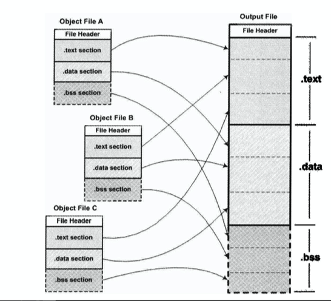

# C/C++的链接

理解ELF的链接，需要先明白[ELF中有什么](./ELF.md)

## 静态链接

通俗的讲，静态链接，就是讲一系列的ELF文件都塞到一个ELF文件中去，这样做非常容易理解，优点是运行的时候不需要依赖其他的东西，直接就可以运行，缺点就是文件会变大，而且当有某个ELF文件发生改变，比如函数中的一些信息修改了，那么就需要重新链接。

一般为相同节和节进行融合，比如`.data`和`.data`合成到一起。



通过扫描每个ELF文件，计算出其大小，链接器为其分配大小空间用于存储，这是第一步，

后续还有很多需要调整的，如符号的地址和重定位。

##### 1.符号地址

我们可以用一个比较简单的例子来看符号地址是什么。

```C
void func();
int main() {
    int a;
    func();
}
```

使用gcc只编译不链接，objdump来查看

```
Disassembly of section .text:

0000000000000000 <main>:
   0:   55                      push   rbp
   1:   48 89 e5                mov    rbp,rsp
   4:   b8 00 00 00 00          mov    eax,0x0
   9:   e8 00 00 00 00          call   e <main+0xe>
   e:   b8 00 00 00 00          mov    eax,0x0
  13:   5d                      pop    rbp
  14:   c3                      ret    
```

可以清楚的看到，main函数并没有`地址`，这里的地址指的是加载到虚拟内存中的地址，并且关于func函数也被写成了`<main+0xe>`，我们具体看其汇编码`e8 00 00 00 00`，e8是call指令，而后面的零则表示编译器也不知道这个函数位置是哪里，需要由链接器来确定。

链接时，链接器就会开始分配每一个符号的具体地址了，当一个符号在ELF文件中时，都是关于某个节的偏移，比如`.text`节的0x20偏移是某个符号，而链接器会为`.text`这种的节分配一个地址，通过这个地址，链接器修改符号偏移为真正的地址。


如图所示，当链接到一起时，ab的.text被分配到了`0x8048166`，如果main函数在`a.o`中到偏移是0x20，那么链接到ab中时，main的地址就将是`0x8048166 + 0x20`。这就是符号地址确定。

##### 2. 重定位

跟符号地址确定不同，main函数是事实存在的一个函数，位于.text文件中的某个偏移上，而func是不存在的，它是一个函数，可能存在于某个其他ELF文件中，至少当前编译器不知道位置，所以留给了链接器来确定。链接器在发现后重新调整其地址，这就叫重定位。

链接器是如何找到一个个需要重定位的符号呢？答案是有一个节是保存关于重定位信息的，一般以`.rel`开头，比如`.rel.text`等等。它也是一个表，表成员由`Elf32_Rel`来定义。

```C
typedef struct
{
    Elf32_Addr  r_offset;       /* Address */
    Elf32_Word  r_info;         /* Relocation type and symbol index */
} Elf32_Rel;
```

`r_offset`是一个偏移，我们现在以静态链接的形式来看，它是关于文件开头的偏移，通过这个偏移，我们就能找到需要进行重定位的符号所在。

`r_info`重定向类型和符号，具体留空。

通过以上的重定向表信息，链接器就能找到一个个需要重定向的符号了，具体计算先留空。


