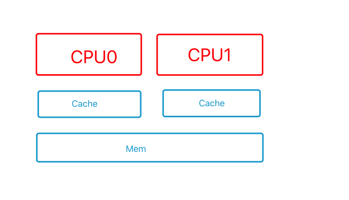

# MESI 缓冲一致性协议

现代主流CPU为了提高访问数据的销量，通常在CPU内部集成了很多高级缓存，并且随着发展，人们往CPU中塞入了越来越多的核心，以及各种压榨CPU性能的骚操作比如乱序流水线等等。

在多核处理器中，各个核心并行访问数据，为了保证数据的一致性，就有了MESI，缓存一致性协议。

现代CPU的一般架构

MESI中的4种状态

* invalid
    Cache Line没有被使用

* shared
    当前的Cache Line对应的主存数据可能也被缓存到了其他CPU核心的高缓中。在通知其他CPU核心之前，此Cache Line不能修改，只能读取。
    
* modified
    当前Cache Line对应的主存数据只在当前的CPU核心的高缓中，并且已经被修改了，还没写回到主存中。当前的Cache Line如果要换成其他数据，则必须写入主存，或者转交其他CPU。
    
* exclusive
    当前Cache Line对应的主存数据只在当前的CPU核心的高缓中，并且还没修改，即缓存和主存数据一致。Cache Line中的数据可以随时更换，无需写入主存，也无需通知其他CPU。
    

MESI中的6种消息

* Read
    读取请求，包括要读取的主存地址

* Read Respond
    读取请求的响应，可能来自主存或者是其他CPU，其中包含了请求的数据，并且收到此请求的CPU会将数据放到Cache Line中。
    
* Invalidate
    其中包含一个失效的主存地址，收到此消息的CPU将在对应的Cache Line中移除这个主存地址的数据，并且回复Invalidate Acknowledge。
    
* Invalidate Acknowledge
    收到Invalidate后移除对应Cache Line后响应。
    
* Read Invalidate
    Read和Invalidate两者结合
    
* WriteBack
    