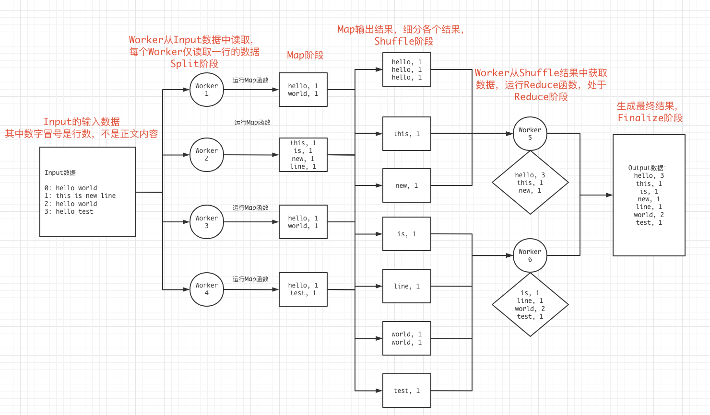
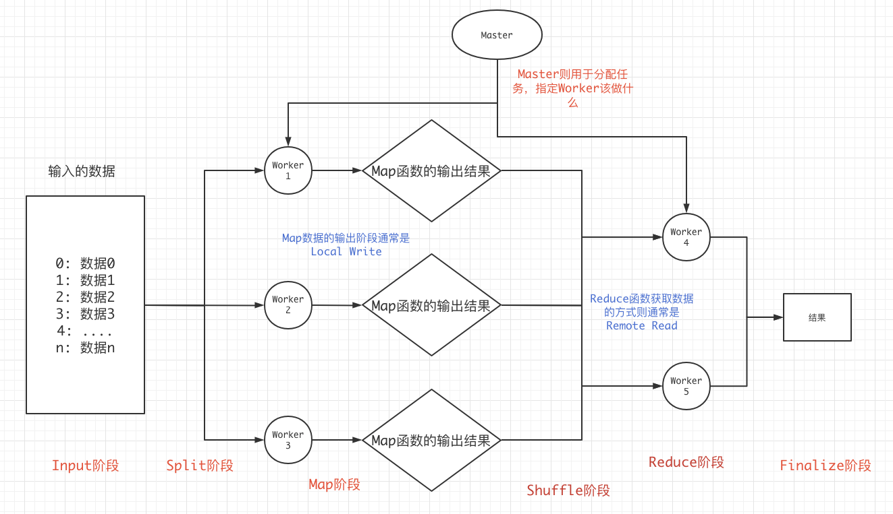

# 6.824 Lab1 MapReduce 学习笔记

## 0x00 理论

MapReduce分为Map阶段和Reduce阶段。

Map阶段: Map函数将拆分数据，例如将一辆汽车拆分成一个个零件。

Reduce阶段: Reduce函数将合并之前Map拆分的数据称为一组新的数据，例如将汽车拆分的零件合成变形金刚。


MapReduce细分来讲，存在6个阶段，在最开始是`input阶段`，当Map函数获取input中的数据时，称为`split阶段`，以及Map函数执行的`Map阶段`，Reduce获取Map的输出结果称为`shuffle阶段`，Reduce执行的`Reduce阶段`，Reduce执行完毕输出的`Finalize`阶段。

我们以一个最经常使用到的WorldCount示例作图来说明



可以看到，每个阶段上的操作，都能找到一个键值对，在`Split`阶段，健值对可以是`行数->行内容`，在`Map阶段`，健值对是`单词->单词个数1`，在`Shuffle阶段`同样如此，在`Reduce阶段`健值对则被更新为了整体`单词->真正的单词个数`。

由此可以大致推断其中的`Map`和`Reduce`函数，伪代码:

```python
# key为行号
# value为行内容
Map(string key, string value):
  for each word in value:
  	output(word, 1)

# key 为 word
# valueList 是 word个数，也就是一个个 “1”
Reduce(string key, list valueList):
  total = 0
  for value in valueList:
    total += value
  outputFinal(key, total)
```

通过查看Reduce函数，也可以加深理解`Shuffle`过程的重要性。

通过以上例子，整理一下，得到整体的架构图:



## 0x01 6.824 Lab1实现

