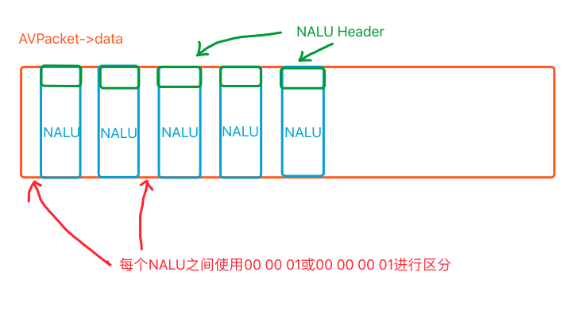

# NALU

在FFMPEG中AVFrame经过H264编码后得到AVPacket，AVPacket中的data存储的是一个个NALU单元。

NALU之间通过`0x00 0x00 0x01`或者`0x00 0x00 0x00 0x01`进行分割，每个NALU拥有其NALU header，其中记录了一些关于NALU的信息， __NALU header占用1Bytes__ 。

#### * forbidden_zero_bit

占用一个bit，为0表示该NALU正常，为1表示在传输过程或者某种情况下此NALU发生了错误，解码器发现NALU为1将抛弃该NALU。

#### * nal_ref_idc

占用2个bit，表示该NALU的重要性，值越大，重要性越大，当解码器忙不过来时会丢弃值为0的NALU。

#### * nal_unit_type

占用5个bit，表示该NALU类型，其中比较重要的

- 1 表示正常帧，如P帧，I帧，B帧
- 7 表示SPS(Sequence Parameter Sets)
- 8 表示PPS(Picture Parameter Sets)

## NALU本体称为RBSP(Raw Bytes Sequence Payload)原始数据字节流

RBSP还可以进一步细分，RBSP由SODB(String of Data Bits)加上对齐组成，其中SODB是最为原始的H264编码后的数据。

## 使用FFMPEG解析裸H264流

