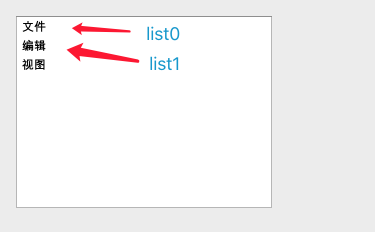

# Qt exp


###  1. UI文件


xxx.ui文件中设计的界面最终都将被转换成一个头文件，程序想使用这个设计好的`ui`都需要通过这个来访问，头文件的命名规则一般为`ui_xxx.h`的，内部的类名则为`Ui_Xxxx`(首字母大写)，这个所谓的文件将在qmake编译时才会动态生成的。

如果我们选择一个简单的`Widget`的项目，则会生成如下的代码

```c++
#include "widget.h"
#include "ui_widget.h"

Widget::Widget(QWidget *parent)
    : QWidget(parent)
    , ui(new Ui::Widget)
{
    ui->setupUi(this);
}

Widget::~Widget()
{
    delete ui;
}
```

其中`ui_widget.h`就是连接我们设计的ui的关键，而构造列表中可以明显看到使用了`QWidget`来初始化一个父类，以及初始化一个`ui`，这里看似很奇怪，因为`ui(new Ui::Widget)`不是递归吗？其实在`ui_widget.h`中是有一行代码如下的:

```c++
namespace Ui {
    class Widget: public Ui_Widget {};
} // namespace Ui
```

也就是说，我们将`Ui_Widget`看似的定义成了另外的类名`Widget`，并且是处于`Ui`这个命名空间下的，而我们再看`widget.h`头文件即可明白

```c++
#include <QWidget>

QT_BEGIN_NAMESPACE
namespace Ui { class Widget; } // 声明
QT_END_NAMESPACE

class Widget : public QWidget
{
    Q_OBJECT

public:
    Widget(QWidget *parent = nullptr);
    ~Widget();

private:
    Ui::Widget *ui; // 自己
};
```

在代码中的namespace其实只是一个声明而已。

这样代码逻辑就成了，我们设计一个ui，ui被qmake操作后生成了一个文件，名为`ui_widget.h`，其中定义了一个类`Ui_Widget`，这个类就是ui设计的代码实现，并且在最后， __我们通过定义另外一个处于`Ui`这个命名空间中的一个类`Widget`继承于`Ui_Widget`__ 。

然后在最外层的`Widget`中使用在`Ui`这个命名空间中的`Widget`的`setupUi`将本身注册进去，在`setupUi`这个函数中，就是设计的ui的代码实现(ui中的某些窗口的位置，大小，名字，信号和槽等等)。

之后我们需要写的代码都可以直接写到外层的这个`Widget`类中，并且通过`ui`指针来去获取在设计中的一些组件等等。


###  2. 信号和槽

这种关系有点类似Linux中的signal和signal handler的关系，槽即位函数嘛，具体定义方式为

```c++
class Widget{
  Q_OBJECT// 宏
public slots: // 权限可自由定义
	void slot_func();
};
```

其中`Q_OBJECT`宏是信号和槽的基础，如果一个类中需要使用到信号和槽，则需要`Q_OJBECT`宏，这将由MOC进行预处理。


##### 1. 信号的发送者

当一个槽函数被调用时，如果我们想知道信号的发送者，则可以通过`sender()`来获得，并且通过`qobject_cast`来对其进行转换，比如

```c++
QSpinBox* spinBox = qobject_cast<QSpinBox*>(sender()); // 获取信号发射者
```

##### 2. 自定义信号

使用`sigals`关键字可以自定义信号，并且可以通过`emit`来手动控制信号的发送，其中，信号函数不可以有返回值，但是可以有参数。比如

```c++
class Test{
	Q_OBJECT
public:
signals:
  void mySignal(int value);
private:
  void sendMySignal(){
    emit mySignal(10); // 手动发射信号出去
  }
};
```


###  3. 一些组件

* ##### 1. QLineEdit

一个编辑文本的组件，具体的使用函数如下

```c++
lineEdit->setPalette(QPalette); // 通过Palette设定颜色
lineEdit->text();								// 获取一个QString的对象，就是文本中的内容
```

其中， __只有一个信号，那就是文本改变信号`QLineEdit::textChange` __，当文本发生改变时会被触发。

* ##### 2. QLabel

一段文本，改变颜色只可以发生在初始化的时候，一旦显示了，就不能再改变了。

* ##### 3. RadioButton

这种是一个互斥的选项，例如选中了A，则B被自动取消。具体使用的一些函数

```c++
radioButton->isChecked(); // 标明是否被选中，被选中则为true
```

信号

```c++
clicked(); // 被点击后的信号
```

* ##### 4. QSpinBox

这是一个数值的组件，有可以手动输入，也可以通过上下箭头来增减数量，一些函数

```c++
spinBox->setRange(int, int); // 设置范围
spinBox->setSingleStep(int); // 设置一步的长度
spinBox->setValue(int);			 // 默认值
```

信号有2种，都是关于改变时触发，分别是:

```c++
QSpinBox::valueChanged(int i);
QSpinBox::valueChanged(const QString &text);
```

* ##### 5. QSpinBox的信号和槽关联方式

由于`valueChanged`是一个同名的函数，并且有不同参数，在Qt中，这种情况就不能使用函数指针来进行connect了，但可以使用如下的方式进行关联。

```c++
// 其中，int将会是这个组件改变后的新值，将被传递到onValueChanged中的int。
connect(ui->spinBox, SIGNAL(valueChange(int)), this, SLOT(onValueChanged(int)));
```

* ##### 6. QComboBox

QComboBox是一个下拉列表的组件，可以提供一些列表供用户选择，我们可以通过一系列函数进行增加内容

```c++
comboBox->addItem(QString); 											// 添加内容
comboBox->insertItem(int index, QString target);	// 添加到指定的index上
comboBox->addItems(QStringList);									// 将列表中的元素都加进入
```

当组件上的选择发生变化时，会发射如下的信号

```c++
void currentIndexChanged(int index);
void currentIndexChanged(const QString& text);
```

* ##### 7. QPlainTextEdit

这是一个多行文本编辑器的组件，

* ##### 8. TableWidget

TableWidget其实就是一个表格，有着行与列，其中的每个元素都可以添加对应的组件，比如我们可以将ComboBox加入到其中，成为一个`cell`，其中，这些表格内容都是可以修改的，如果不想被用户修改，那么可以将权限设定为只读。

```
tableWidget->setEditTriggers(QAbstractItemView::NoEditTriggers);
```

比较常用的使用函数为

```c++
/* 添加一个TableWidgetItem的cell到对应的坐标上 */
tableWidget->setItem(cols, rows, new QTableWidgetItem(str));
/* 添加一个其他的Widget控件上去，比如ComboBox */
QComboBox* myBox = new QComboBox();
tableWidget->addCellWidget(cols, rows, myBox);
```

* ##### 9. ListWidget

这是一个一列的列表，如图类似这种列表



我们可以选中它，并且会触发一些信号，比如

```c++
clicked(QModelIndex); // 当被点击时触发
```

对于这个列表的使用方式有一些函数，比如

```c++
listWidget->addItem(QString); // 添加列表中的元素
listWidget->currentRow();			// 当前被选中的索引
listWidget->currentItem();		// 当前被选中的目标，返回的是一个 QModelIndex的类
```


### 4. 一些基础类


##### * QString

QT中自己定义了一个管理字符串的类，为`QString`，对于这个类，其中并不是保存普通的`char`字符，而是使用了Unicode来进行编码，每一个字符为`QChar`占用16bit，所以用于显示中文是完全没问题的。

有一些比较常用的使用方法，比如

```c++
int toInt(bool* ok = Q_NULLPTR, int base = 10);
int toLong(bool* ok = Q_NULLPTR, int base = 10);
int toShort(bool* ok = Q_NULLPTR, int base = 10);
int toUInt(bool* ok = Q_NULLPTR, int base = 10);
int toULong(bool* ok = Q_NULLPTR, int base = 10);
int toFloat(bool* ok = Q_NULLPTR);
int toDouble(bool* ok = Q_NULLPTR);
append(QString target);
prepend(QString target);
isEmpty();
count();
size();
length();
contains();
```


##### * QTimer

这是QT中定义的一个定时器，具体使用方法如

```c++
QTimer* timer = new QTimer(this);
timer->setInterval(1000); // ms 设定一个超时时间
timer->start();						// 开始定时
timer->stop();						// 定时结束 
```

