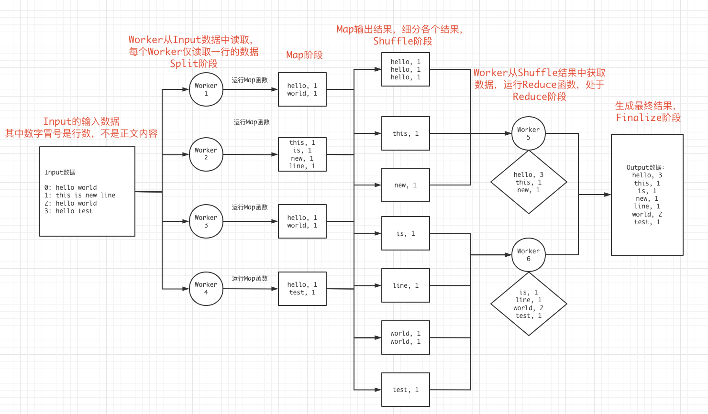
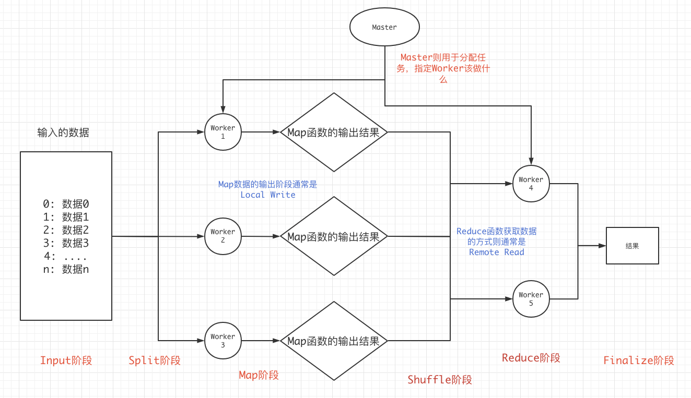

# 6.824 Lab1 MapReduce 学习笔记

## 0x00 理论

MapReduce分为Map阶段和Reduce阶段。

Map阶段: Map函数将拆分数据，例如将一辆汽车拆分成一个个零件。

Reduce阶段: Reduce函数将合并之前Map拆分的数据称为一组新的数据，例如将汽车拆分的零件合成变形金刚。


MapReduce细分来讲，存在6个阶段，在最开始是`input阶段`，当Map函数获取input中的数据时，称为`split阶段`，以及Map函数执行的`Map阶段`，Reduce获取Map的输出结果称为`shuffle阶段`，Reduce执行的`Reduce阶段`，Reduce执行完毕输出的`Finalize`阶段。

我们以一个最经常使用到的WorldCount示例作图来说明



可以看到，每个阶段上的操作，都能找到一个键值对，在`Split`阶段，健值对可以是`行数->行内容`，在`Map阶段`，健值对是`单词->单词个数1`，在`Shuffle阶段`同样如此，在`Reduce阶段`健值对则被更新为了整体`单词->真正的单词个数`。

由此可以大致推断其中的`Map`和`Reduce`函数，伪代码:

```python
# key为行号
# value为行内容
Map(string key, string value):
  for each word in value:
  	output(word, 1)

# key 为 word
# valueList 是 word个数，也就是一个个 “1”
Reduce(string key, list valueList):
  total = 0
  for value in valueList:
    total += value
  outputFinal(key, total)
```

通过查看Reduce函数，也可以加深理解`Shuffle`过程的重要性。

通过以上例子，整理一下，得到整体的架构图:



## 0x01 6.824 Lab1实现

实验源码:

```shell
git clone git://g.csail.mit.edu/6.824-golabs-2021 6.824
```

Lab1中为我们定义了3个文件，我们按照其规则补完其剩下的代码即可，分别为`mr/coordinator.go`、`mr/rpc.go`、`mr/worker.go`，代表的即是Master，调用过程中需要用到的RPC参数以及返回内容，需要由我们自定义，以及Worker。

##### 大致逻辑

在Worker中我们这样设计，Worker是一个人死循环，一直通过RPC向Master获取任务，然后执行这个任务，这个任务可能是Map，也有可能是Reduce。

```
1. 通过RPC向Master获取任务
2. 执行任务
3. 提交任务，继续获取新任务

任务分为Map和Reduce，在这里WorldCount例子中，我们这样做:
Map任务中，通过给定文件读取响应数据，调用Map函数，然后将处理完的数据写入到Hash桶中
Reduce任务中，读取关于这个Reduce需要用到的中间结果，然后执行Reduce操作，输出结果到最终文件
```

在Master中我们这样设计，Master是一个分配任务的角色，所以通过输入的文件量，我们分配固定的Task，也就是任务，然后通过RPC开放某些接口以供Worker来调用，主要用于获取任务，提交任务等等操作。

```
1. 生成Master对象，初始化Task，开始对外提供RPC服务
2. 通过Worker调用的RPC分别处理不同的请求

这里Master对外开放2个RPC，分别为请求任务和提交任务
请求任务:
  通过RPC响应将需要的文件名发送到Worker中，标记为当前Worker正在处理，这里需要处理一下Worker超时情况，需要
  重新分配任务给其他Worker。
提交任务:
	通过RPC开放，检测当前记录中的Worker和提交Worker的ID是否相等，如果不等，说明发生了重新分配等情况，需要做其他处理
```

## 实现代码

#### Master节点

```go
type Master struct {
  lock sync.Mutex 
  
  status string // MAP or REDUCE or DONE
  nMap int
  nReduce int
  AssignTask map[string]Task
  remainderTask int // task that not commit yet
}
```

其中`nMap`和`nReduce`分别代表需要进行的Map和Reduce数量，`status`则分别拥有3种状态，`DONE`表示所有操作结束，`AssignTask`中保存有已经分配出去的Task，当Worker线程提交一个任务时，Master比对`AssignTask`，中数据正确时，将移除在`AssignTask`中的字段，然后将`remainderTask`减少一。

#### RPC参数和响应

获取Task RPC的参数和响应，以及提交Task RPC的参数和响应

```go
type ApplyTaskArgs struct {
  WorkerID string
}

type ApplyTaskReply struct {
  Type string
  Index int
  InputFile string
  MapNum int
  ReduceNum int
}

type CommitTaskArgs struct {
  WorkerID string
  Type string  // MAP or REDUCE 
  Index string // index of task
}
```

`ApplyTaskArgs`中只提交了Worker本身的ID用于Master保存而已，Master将返回一个`ApplyTaskReply`，其中，`Type`分别有MAP，REDUCE，DONE，如果节点获取到一个DONE的type类型，那么节点将直接退出。`Index`则表示其获取的任务的标识符，`InputFile`只在`Type==MAP`时生效。

`CommitTaskArgs`用与提交完成的任务，我这里没有设置返回值，其中`WorkerID`主要用于确定此任务是否已经被Master又分配给了其他节点。三个字段可以合并给Master用于查询当前分配出去的Task状态。

#### Task本体

```go
type Task struct {
	Type string
  Index int
  MapInputFile string
  
  // for record
  WorkerID string
  Timeout time.Time // 超时将被Master分配给其他Worker节点重新开始任务
  Done bool 
}
```

#### Worker

主要代码在Worker函数中：

```go
func Worker2(mapf func(string, string)[]KeyValue, reducef func(string, []string) string) {
	WorkerID := strconv.Itoa(os.Getpid())
	for {
		applyArgs := ApplyTaskArgs{
			WorkerID: WorkerID,
		}
		applyReply := ApplyTaskReply{}
		// apply task
		call("Coordinator.ApplyTask", &applyArgs, &applyReply)
		if applyReply.Type == DONE {
			// all job done
			break
		}
		// do map func
		if applyReply.Type == MAP {
			file, err := os.Open(applyReply.InputFile)
			if err != nil {
				log.Fatalf("Open file %s Error", applyReply.InputFile)
			}
			content, err := ioutil.ReadAll(file)
			if err != nil {
				log.Fatalf("Read file %s Error", applyReply.InputFile)
			}
			kva := mapf(applyReply.InputFile, string(content))
			// 一个个 word -> 1 的健值对
			bucket := make(map[int][]KeyValue)
			// 将一个个kv健值对分散到各个bucket中，共计ReduceNum个bucket
			for _, kv := range kva {
				bucketIndex := ihash(kv.Key) % applyReply.ReduceNum
				bucket[bucketIndex] = append(bucket[bucketIndex], kv)
			}
			// 将桶中数据存储到临时文件中
			for reduceIndex, value := range bucket {
				outFile, _ := os.Create(tmpMapOutFile(WorkerID, applyReply.Index, reduceIndex))
				for _, kv := range value {
					fmt.Fprintf(outFile, "%v\t%v\n", kv.Key, kv.Value)
				}
				outFile.Close()
			}
			// commit to master
			commitArgs := CommitTaskArgs{
				WorkerID: WorkerID,
				Type : applyReply.Type,
				Index : applyReply.Index,
			}
			commitReply := CommitTaskReply{}
			call("Coordinator.CommitTask", &commitArgs, &commitReply)
		}else if applyReply.Type == REDUCE { // do Reduce
			var lines []string
			for mapIndex := 0; mapIndex < applyReply.MapNum; mapIndex++ {
				inputFile := finalMapOutFile(mapIndex, applyReply.Index)
				file, err := os.Open(inputFile)
				if err != nil {
					// TODO: handle Error
				}
				content, err := ioutil.ReadAll(file)
				if err != nil {
					// TODO: handle Error
				}
				lines = append(lines, strings.Split(string(content), "\n")...)
			}
			var kva []KeyValue
			for _, line := range lines {
				if strings.TrimSpace(line) == "" {
					continue
				}
				parts := strings.Split(line, "\t")
				kva = append(kva, KeyValue{
					Key : parts[0],
					Value : parts[1],
				})
			}

			// 按照key进行排序
			sort.Sort(ByKey(kva))
			// 保存Reduce函数结果
			ofile, _ := os.Create(tmpReduceOutFile(WorkerID, applyReply.Index))
			i := 0
			for i < len(kva) {
				j := i + 1
				for j < len(kva) && kva[j].Key == kva[i].Key{
					j ++
				}
				var values []string
				for k := i; k<j; k ++{
					values = append(values, kva[k].Value)
				}
				output := reducef(kva[i].Key, values)
				fmt.Fprintf(ofile, "%v %v\n", kva[i].Key, output)
				i = j
			}
			ofile.Close()
			// commit task
			commitArgs := CommitTaskArgs{
				WorkerID: WorkerID,
				Type: applyReply.Type,
				Index : applyReply.Index,
			}
			commitReply := CommitTaskReply{}
			call("Coordinator.CommitTask", &commitArgs, &commitReply)
			// TODO: has no jobs exit
		}else {
			fmt.Println("worker done all job!")
			break
		}
	}
}
```

### Master

Master开放2个RPC接口，分别为ApplyTask用于Worker申请Task，以及CommitTask用于Worker提交已经完成的Task。

ApplyTask部分：

```go
func (m *Coordinator) ApplyTask(args* ApplyTaskArgs, reply* ApplyTaskReply) error {

	fmt.Println("Assigning task")

	m.lock.Lock()
	defer m.lock.Unlock()
	if m.status == DONE {
		reply.Type = DONE
		return nil
	}

	task, ok:= <- m.Tasks
	if !ok {
		// TODO: there are no job in tasks but has some in process
	}
	task.Done = false
	task.WorkerID = args.WorkerID
	task.Timeout = time.Now().Add(10 * time.Second)
	// add to AssignTask map
	m.AssignTask[GenTaskID(m.status, task.Index)] = task

	// reply to worker
	reply.Index = task.Index
	reply.Type = m.status
	reply.InputFile = task.MapInputFile
	reply.MapNum = m.nMap
	reply.ReduceNum = m.nReduce
	return nil
}
```

CommitTask部分：

```go
func (m *Coordinator) CommitTask(args* CommitTaskArgs, reply *CommitTaskReply) error {

	// TODO: make critical zone smaller
	taskID := GenTaskID(args.Type, args.Index)
	m.lock.Lock()
	defer m.lock.Unlock()
	task, ok := m.AssignTask[taskID]
	if !ok {
		reply.Done = false
		return nil
	}
	if task.WorkerID != args.WorkerID {
		reply.Done = false
		// job has been assign to other worker
		// commit invalid
		return nil
	}
	// for debug
	if task.Done != false {
		log.Fatal("Task is Done before commit task!")
	}
	// if check ok delete from AssignTask
	m.remainderTask --
	delete(m.AssignTask, taskID)

	if args.Type == MAP {
		// move map output tmp file to done
		// worker-tmp-(WorkerID)-(TaskIndex)-(ReduceIndex) to mr-(TaskIndex)-(ReduceIndex)
		for reduceIndex := 0; reduceIndex < m.nReduce; reduceIndex++ {
			os.Rename(tmpMapOutFile(args.WorkerID, args.Index, reduceIndex),
				finalMapOutFile(args.Index, reduceIndex))
		}
	}else { // REDUCE
		err := os.Rename(tmpReduceOutFile(args.WorkerID, args.Index), finalReduceOutFile(args.Index))
		if err != nil {
			log.Fatalf("Reduce commit error at file %s", tmpReduceOutFile(args.WorkerID, args.Index))
		}
	}

	// check if there has no task, then we need to change status
	// MAP to REDUCE
	// REDUCE to DONE
	if m.remainderTask == 0 {
		if m.status == MAP {
			m.change()
			// TODO: change to REDUCE
		}else if m.status == REDUCE {
			// DONE
			m.change()
		}else {
			// DONE
			m.change()
		}
	}
	return nil
}
```

除此之外，还需要转换Map和Reduce任务，这里交由change：

```go
func (c *Coordinator) change() {
	if c.status == MAP { // 转Reduce
		fmt.Println("Map Done")
		c.status = REDUCE
		for i :=0; i < c.nReduce; i++ {
			task := Task{
				Type: REDUCE,
				Index: i,
			}
			c.Tasks <- task
			c.remainderTask ++
		}
	}else if c.status == REDUCE { // Reduce 完成，则结束
		fmt.Println("Reduce Done")
		close(c.Tasks)
		c.status = DONE
	}else {
		// All Done
	}
}
```

