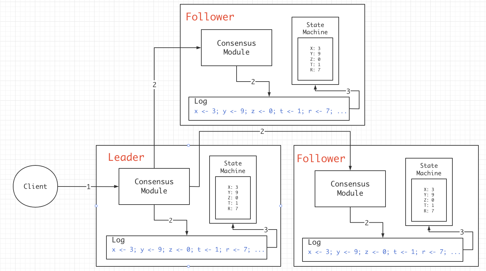
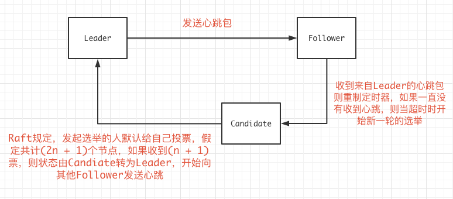

# 6.824 Lab2A Raft学习笔记

## 0x00 理论

### 复制状态机

Raft的本质，就是一个状态复制机：



每一个节点服务器中，都保存有执行指令日志，指令日志中执行到的位置等等，并且通过一致性模块将其同步到各个节点上，当客户端发起请求后，只有多数服务器中都保存有对应的指令日志并响应Leader后，客户端才会收到回复。取决于实现，如果client只对Leader发起读写请求，那么Raft是强一致性模型。

### Election

Raft中有3种角色，分别是`Leader`，`Follower`，`Candidate`。

在Raft中，Leader只能存在一个，Leader每过一段时间，就要向Follower发送心跳包以确认其Follower状态，Follower也能通过心跳包了解到Leader在线，每个Follower本身维护一个定时器，当收到Leader的心跳后重制定时器，如果一直没有收到来自Leader的心跳，则定时器超时，Follower开始新一轮的Leader选举。

流程大致为：



论文（）中提到，如果总节点为2n个，碰巧的是发生了2个节点同时发起选举的请求，且他们平摊了选票，则本轮作废，重新进入下一轮选举。

### Status

每个节点都需要保存的数据包括3种，分别是需要进行持久化的：

```
currentTerm           服务器最后一次知道的任期
votedFor              获得本服务器选票的候选人
log[]                 日志
```

所有服务器中经常改变的：

```
commitIndex           已经被提交的日志索引
lastApplied           被应用到状态机中的日志索引
```

Leader节点中经常改变的，在选举后重新初始化：

```
nextIndex[]           对于每一个节点，需要发送给他的下一个日志条目索引
matchIndex[]          对于每一个节点，已经复制给他的日志的最高索引值
```

### Election

投票。。。。

### LogEntries

在原论文figure5中说明了关于LogEntries的原理，通过LogEnties来复制日志指令，同时也用作心跳，LogEnties中需要发送的参数：

```
term               Leader任期
leaderID           LeaderID
prevLogIndex       新日志之前的日志索引
prevlogTerm        prevLogIndex那条记录执行的任期
entries[]          准备同步的日志
leaderCommit       Leader已经Commit的日志索引值

// 返回

term               当前任期号
success            用于确定成功提交日志
```

Follower要做的：

1 : 比对Leader发送过来的term，发现小于当前任期，则直接返回false。

2：检查prevLogIndex下的prevLogTerm是否相同，不同返回false。

3：附加参数中的entries到本地日志中

4：如果发现 leaderCommit > commitIndex；则令commitIndex等于LeaderCommit或最新的日志索引中的比较小的那个。


## 0x01 例子

### Append Log 

假定有日志为：

```
// 数字代表日志添加的term
index：   10 11 12 13
Server1:  3
Server2:  3  3  4
Server3:  3  3  5
```

如何生成这种日志：起初，client发送指令，所有节点均在index10下完成同步，Term为3，之后client又发送了一个指令，这条指令由Server2和Server3完成响应并返回，写入到日志index 11中，在Raft中，只要多数票通过，则Leader就会响应客户端，所以index 11的指令会被Commit掉，到此没有任何分歧。

index 12之前，Leader为Server3，而后，Leader节点宕机了，Server2当选为Leader，他执行了来自客户端的一次操作，并且写入日志，term为4，但此时还未来得及发送LogEntries，立马宕机了，随后，节点们又选出Server3作为Leader，并且执行了来自客户端的操作，写入日志，此时Term为5。


### Raft的强制日志同步


## 0x02 实现思路

### 投票

在6.824的2A实验的选举操作中，不要求对Log的判断，我们只需要判断其Term是否是最新的即可，那么每个节点都将开放一个投票的RPC接口供其他节点调用，这里我们定为`RequestVote`。

同时，每个节点都需要维护一个定时器，当超时的时候，状态由Follower转为Candidate并企图开始新的一轮选举。

关于投票的RPC请求参数以及响应参数结构体：

```go
type RequestVoteArgs struct {
  Term      int // 选举任期    
  Candidate int // 被选举人
}

type RequestVoteReply struct {
  Term 		int   // 选民所在的任期
  Success   bool  // 是否愿意将票投给被选举者
}
```

选举细节还需要在2B中细化，需要融入LogEntries相关的操作，但2A中可以先忽略。

### 心跳

在投票部分讲过，每个节点都需要设定一个随机定时器，当定时器超时的时候出发选举操作，如果一个节点是Leader，那么这个超时操作将不再是开启新一轮选举，而是向所有Follower发送一个心跳以证明他们的Leader还在，不需要进行新一轮的选举。

```go
type HeartBeatArgs struct {
  Term          int // 当前任期
  LeaderID      int // 当前Leader的节点ID
}

type HeartBeatReply struct {
  Term          int  // 当前任期
  Success       bool // 心跳是否被接受
}
```

如果心跳不被Follower所接受，则证明任期不对，整个集群中存在一个任期更高的节点，收到心跳包的Leader就需要“让位”，转为最高任期的Follower，并且标记本身LeaderID为-1，等待来着更高任期的Leader向他发送心跳。

## 0x03 具体代码实现

首先的是Raft节点的设计：

```go
type Raft struct {
  mu                sync.Mutex
  peers             []*labrpc.ClientEnd
  persister         *Persister // 2A中没有用到
  me                int
  dead              int32

  currentTerm       int // 当前任期
  voteFor           int // 当前任期获取本节点选票的节点
  log               []*LogEntry // 日志，2A中没有用到

  role              string
  leaderID          int

  lastBroadcastTime         time.Time // Leader发送心跳的时间
  broadcastInterval         time.Duration // 100ms
  lastActiveTime            time.Time 
  lastActiveTimeInterval    time.Duration // 200ms - 400ms

}
```

生成Raft节点和测试使用的代码：

```go
func (rf *Raft) GetState() (int, bool) {
  rf.mu.Lock()
  defer rf.mu.Unlock()

  var term int
  var isleader bool

  term = rf.currentTerm
  if rf.role == Leader {
    isleader = true
  }else {
    isleader = false
  }
  return term, isleader
}

func Make(peers []*labrpc.ClientEnd, me int, persister *Persister, applyCh chan ApplyMsg) *Raft {
  rf := &Raft{}
  rf.peers = peers
  rf.persister = persister
  rf.me = me

  // Your initialization code here (2A, 2B, 2C).
  rf.role = Follower
  rf.currentTerm = 0
  rf.leaderID = -1
  rf.lastActiveTime = time.Now()
  rf.lastActiveTimeInterval = time.Duration(200 + rand.Int31n(200)) * time.Millisecond

  // initialize from state persisted before a crash
  rf.readPersist(persister.ReadRaftState())

  // start ticker goroutine to start elections
  go rf.ticker()
  go rf.ElectionLoop()
  go rf.HeartBeatLoop()
  return rf
}


```

__Raft中，Follower的超时时间一般是随机的，范围：[min~max]，心跳间隔则一般取自min / 2，这里我们设定心跳间隔为100ms，则Follower的超时最短时间为200ms，最高我们设为400ms__ 。

投票方面，需要每个节点开放RPC接口`RequestVoteRPC`，Candidate通过调用`RequestVoteRPC`来获得选票，每一个节点内部都有一个`ElectionLoop`，当超时的时候，且节点不是Leader状态，则启动`Election`开始新一轮选举。

```go
func (rf *Raft)ElectionLoop() {
  for !rf.killed() {
    time.Sleep(1 * time.Millisecond)
    rf.Election()
  }
}

func (rf* Raft) Election() {
  rf.mu.Lock()
  defer rf.mu.Unlock()
  
  if rf.role == Leader {
    return
  }
	// 未超时
  now := time.Now()
  if now.Sub(rf.lastActiveTime) < rf.lastActiveTimeInterval {
    return
  }
  
  // 超时，状态转为Candidate，开始新一轮选举
  rf.role = Candidate
  rf.currentTerm += 1
  rf.voteFor = rf.me
  
  // 在投票给自己的同时，向其他节点发起RPC获取选票
  args := RequestVoteArgs{
    Term : rf.currentTerm
    Candidate : rf.me
  }
  
  type Result struct {
    peerID int
    respond* RequestVoteReply
  }
  voteCount := 1 // 自己一票
  totalCount := 1 // 所有票数，包括没有给自己投票的节点
  resultChan := make(chan *Result, len(rf.peers)) // 管道
  // 启协程获取选票，解锁
  // 当结束后，由于解锁的请求，解锁期间，可能有任期变动，所以需要重新判断！
  rf.mu.Unlock()
  for index := 0; index < len(rf.peers); index ++ {
    if index == rf.me {
      continue
    }
    go func (id int){
      reply := RequestVoteReply{}
      if ok := rf.sendRequestVote(id, &args, &reply); ok {
        resultChan <- &Result{peerID : id, respond: &reply }
        return
      }
      resultChan <- &Result {peerID : id, respond : nil}
    }(index)
  }
  maxTerm := 0 // 获取最高任期，以确定当前的任期是正确的
  // 当发现有更高任期的节点存在，本次投票无意义
  for {
    select {
      case result := <- resultChan:
      	totalCount += 1
      	if result.respond != nil {
        	if result.respond.Success {
          	voteCount += 1
        	}
        	if result.respond.Term > maxTerm{
          	maxTerm = result.respond.Term
        	}
      	}
        // 投票结束
      	if totalCount == len(rf.peers) || voteCount > len(rf.peers) / 2 {
        	goto END
      	}
    }
  }
  END:
  // 重新上锁，并且检测状态
  rf.mu.Lock()
  
  if rf.role != Candidate { // 不是Candidate状态，则抛弃一切投票结果
    return
  }
  // 有更高任期存在，转而成为Follower，等待Leader的心跳
  if maxTerm > rf.currentTerm {
    rf.role = Follower
    rf.leaderID = -1
    rf.voteFor = -1
    rf.currentTerm = maxTerm
    return
  }
  // 计算选票
  if voteCount > len(rf.peers) / 2 {
    rf.role = Leader
    rf.leaderID = rf.me
    // 设定心跳发送间隔100ms
    rf.lastBroadcastTime = time.Now()
    rf.broadcastInterval = time.Duration(100) * time.Millisecond
  }
  rf.lastActiveTime = time.Now()
  rf.lastActiveTimeInterval = time.Duration(200 + rand.Int31n(200)) * time.Millisecond
}
```

开放给其他节点的RPC接口`RequestVoteRPC`，Candidate通过调用`RequestVoteRPC`来获取一个节点的选票。

```go
func (rf *Raft) RequestVoteRPC(args *RequestVoteArgs, reply *RequestVoteReply) {
  rf.mu.Lock()
  defer rf.mu.Unlock()
  // 被选举者任期比当前任期小，拒绝
  if args.Term < rf.currentTerm {
    reply.Term = rf.currentTerm
    reply.Success = false
    return
  }
  // 成为当前任期中的Follower
  // 这里的leaderID还未确定！
  if args.Term > rf.currentTerm {
    rf.currentTerm = args.Term
    rf.role = Follower
    rf.leaderID = -1
    rf.voteFor = args.CandidateID
    rf.lastActiveTime = time.Now()
    reply.Success = true
  }
}

func (rf *Raft) sendRequestVote(server int, args *RequestVoteArgs, reply *RequestVoteReply) bool {
	ok := rf.peers[server].Call("Raft.RequestVoteRPC", args, reply)
	return ok
}
```

节点开放的RPC接口`HeartBeatRPC`，Leader通过调用`HeartBeatRPC`来时刻提醒Follower节点他的“Leader”在线。

```go
func (rf *Raft) HeartBeatRPC(args* HeartBeatArgs, reply* HeartBeatReply){
  rf.mu.Lock()
  defer rf.mu.Unlock()
  
  // 发现对方Term小于本节点Term，返回错误
  if args.Term < rf.currentTerm{
    reply.Term = rf.currentTerm
    reply.Success = false
    return
  }
  // 发现对方的任期更大，并向我发送了心跳，则它是新Leader
  if args.Term > rf.currentTerm{
    rf.currentTerm = args.Term
    rf.leaderID = args.LeaderID
    rf.role = Follower
    rf.voteFor = -1 // 当前任期并没有投票过
  }
  // 任期一致，更新超时时间
  rf.lastActiveTime = time.Now()
}

func (rf *Raft) sendHeartBeat(server int, args *HeartBeatArgs, reply *HeartBeatReply) {
  ok := rf.peers[server].Call("Raft.HeartBeat", args, reply)
  return ok
}
```

Leader节点在固定时间间隔需要发送的心跳包，这里使用`HeartBeat`来发送心跳包，`HeartBeatLoop`来实现100ms发送一次心跳：

```go
func (rf* Raft) HeartBeatLoop(){
  for !rf.killed(){
    time.Sleep( 1 * time.Millisecond ) 
    rf.HeartBeat()
  }
}

func (rf *Raft) HeartBeat() {
  rf.mu.Lock()
  defer rf.mu.Unlock()
  
  // 只有Leader才需要进行发送心跳包
  if rf.role != Leader {
    return
  }
  
  now := time.Now() // 如果还没到时间，则返回
  if now.Sub(rf.lastActiveTime) < rf.broadcastInterval {
    return
  }
  // 重置下一次发送心跳包时间
  rf.lastBroadcastTime = time.Now()
  for peerID := 0; peerID < len(rf.peers); peerID ++ {
    if peerID == rf.me {
      continue
    }
    tmpArgs := HeartBeatArgs{
      Term : rf.currentTerm,
      LeaderID : rf.me,
    }
    // 这里不用解锁，创建协程后本函数很快退出并释放锁
    go func(id int, args* HeartBeatArgs){
      reply := HeartBeatReply{}
      if ok := rf.sendHeartBeat(id, args, &reply); ok {
        rf.mu.Lock()
        rf.mu.Unlock()
        if reply.Term > rf.currentTerm {
          // 发现有更高的Term存在，转为Follower，不再发送心跳
          rf.role = Follower
          rf.leaderID = -1 // 当前Term并不知道谁是leader
          rf.voteFor = -1  // 当前Term还未投票
          rf.currentTerm = reply.Term
        }
      }
    }(peerID, &tmpArgs)
  }
}
```

## 0x04 测试用例

6.824中给定的测试用例通过：

```shell
➜  raft git:(master) ✗ go test -run 2A
Test (2A): initial election ...
  ... Passed --   3.1  3 4712  518338    0
Test (2A): election after network failure ...
  ... Passed --   8.6  3 14126  915384    0
Test (2A): multiple elections ...
  ... Passed --   5.7  7 1255  104664    0
PASS
ok  	6.824/raft	17.824s
```