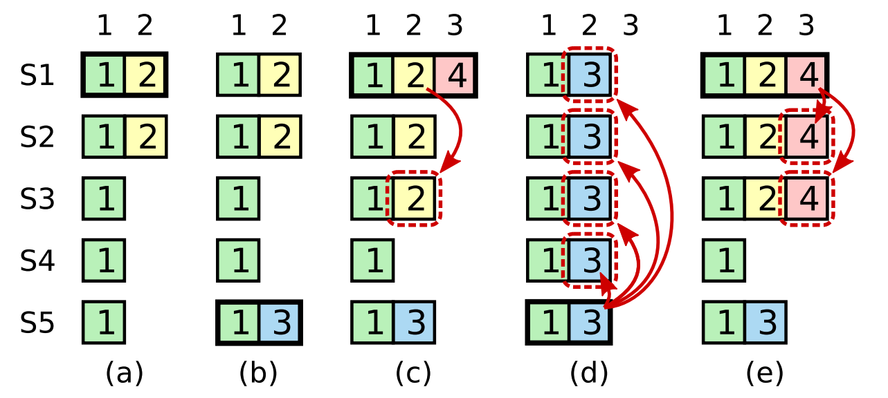

<font face="Monaco">

# 6.824 Lab2B Raft学习笔记

## 0x00 基础理论

一些基础理论知识，如果了解可以直接跳转到[代码实现](#0x01-设计思路) 。

### Raft节点

2B相比2A多了许多必要的信息，每个节点都需要保存的数据包括3种，分别是需要进行持久化(2C)的：

```
currentTerm           服务器最后一次知道的任期
votedFor              获得本服务器选票的候选人
log[]                 日志
```

所有服务器中经常改变的：

```
commitIndex           已经被提交的日志索引
lastApplied           被应用到状态机中的日志索引
```

Leader节点中经常改变的，在选举后重新初始化：

```
nextIndex[]           对于每一个节点，需要发送给他的下一个日志条目索引
matchIndex[]          对于每一个节点，已经复制给他的日志的最高索引值
```


### Follower 需要做的：

* 超时进行选举，这个我们在 Lab2A中讨论过

* 收到Leader的AppendEntry后重置定时，同时，同步日志。

重置定时器也在Lab2A中实现过了，比较重要的是日志同步，这几乎就是Raft的重点， __Follower通过PrevLogIndex以及PrevLogTerm来判断是否同意合并Leader此次发送的Entry，只有之前已经存在的日志就和Leader一致了，Follower才会同意合并，否则将reject本次同步__ 。

* 检查AppendEntry中的LeaderCommit到哪里了。

只有Follower同意了合并日志，Follower才会同步日志到LeaderCommit的位置。

### Leader 需要做的：

* Leader启动后，初始化Leader信息，然后发送日志。

__nextIndex和matchIndex都是在新Leader上任时需要重新计算的，不仅如此，commitIndex也是需要重新计算，通过选举限制，我们可以选出一个拥有所有commited日志的Leader，但新上任Leader无法确定当前所有Follower节点的Commit位置在哪里，通过第一次AppendEntry，Leader可以使用中位数计算出当前集群的CommitIndex所在的位置__ 。

注：在论文5.4.1的[选举限制](#0x05-选举限制)中这样说道： __Raft使用投票的方式来阻止一个候选人赢得选票，除非这个候选人包含了全部的已经提交的日志条目__ 。


* Leader接受来自上层应用的LogEntry，比如6.824中是kvServer。

Start作为入口，通过Start，Leader开始将日志条目发送到其他Follower上， __当日志条目被Commit后，Raft会通过ApplyCh管道将信息传递给上层，代表当前日志已经可以提交到状态机了__ 。

### 都需要做的：

__通过lastApplied来判断提交给上层的日志条目执行到了哪里，并且通过applyCh通知上层__ 。


### 例子：

假定有日志为：

```
// 数字代表日志添加的term
index：   10 11 12 13
Server1:  3
Server2:  3  3  4
Server3:  3  3  5
```

如何生成这种日志：起初，client发送指令，所有节点均在index10下完成同步，Term为3，之后client又发送了一个指令，这条指令由Server2和Server3完成响应并返回，写入到日志index 11中，在Raft中，只要多数票通过，则Leader就会响应客户端，所以index 11的指令会被Commit掉，到此没有任何分歧。

index 12之前，Leader为Server3，而后，Leader节点宕机了，Server2当选为Leader，他执行了来自客户端的一次操作，并且写入日志，term为4，但此时还未来得及发送LogEntries，立马宕机了，随后，节点们又选出Server3作为Leader，并且执行了来自客户端的操作，写入日志，此时Term为5。

#### 强制同步日志

我们假定有以下日志，其中Server3为Leader：

```
index：  10 11 12 13
Server1: 3
Server2: 3  3  4
Server3: 3  3  5  6
```

Server3通过LogEntries(心跳)来同步其他节点的日志，通过之前的理论，可以知道Leader将发出

```
prevLogIndex = 12
prevLogTerm = 5
entries[] 中是 index=13，term = 6的日志

// Leader节点中的数据：
nextIndex[s1] = 13
nextIndex[s2] = 13
```

Server1和Server2中的日志和Leader发送的LogEntries显然不一样，所以会返回False， __Leader会将prevLogIndex向前移动一位__ ，修改nextIndex，继续发送LogEnties，这回将发送：

```
prevLogIndex = 11
prevLogTerm = 3
entries[] 中有(index=12, term=5),(index=13, term=6)

// Leader节点中的数据
nextIndex[s1] = 12
nextIndex[s2] = 12
```

此时Server2中发现prevLogIndex和pervLogTerm匹配，接受了来自Leader的日志，同步日志和Leader一样(此处先不讨论commitIndex)。而Server1在pervLogIndex= 11处没有数据，同样返回false，Leader收到后继续向前移动prevLogIndex为10，发送：

```
prevLogIndex = 10
prevLogTerm = 3
entries[] 中有(index=11, term=3),(index=12, term=5),(index=13, term=6)

// Leader节点中的数据
nextIndex[s1] = 11
nextIndex[s2] = 14
```

这回Server1比对通过，接受日志，完成所有的日志同步操作。

__这种同步一次将nextIndex向后移动一位的速度在follower落后过多条日志时，将使得同步时间过长，所以可以考虑自己引入其他方法来提高日志同步的速度__ 。

注：最初在Server2中，log index = 12的term4操作会被直接抛弃，因为当时的Raft没有得到多数票通过此条操作，所以Raft压根就没回应客户端，所以不必担心。


## 0x01 代码实现

### Raft 


```go
type Raft struct {
	mu        sync.Mutex          // Lock to protect shared access to this peer's state
	peers     []*labrpc.ClientEnd // RPC end points of all peers
	persister *Persister          // Object to hold this peer's persisted state
	me        int                 // this peer's index into peers[]
	dead      int32               // set by Kill()

	applyCh          chan ApplyMsg
	notifyCh         chan int
	appendEntryCh    chan int // AppendEntry控制管道
	electionCh       chan int // Election控制管道

	currentTerm      int
	votedFor         int
	log              []LogEntry

	nextIndex        []int
	matchIndex       []int

	commitIndex      int
	lastApplied      int
	lastIncludeIndex int
	lastIncludeTerm  int

	role                  string
	leaderID              int
	appendEntriesInterval time.Duration // 100ms

	// for debug
	loop int

}

func Make(peers []*labrpc.ClientEnd, me int,
	persister *Persister, applyCh chan ApplyMsg) *Raft {
	rf := &Raft{}
	rf.peers = peers
	rf.persister = persister
	rf.me = me


	rf.applyCh = applyCh
	rf.role = Follower
	rf.currentTerm = 0
	rf.leaderID = -1
	rf.votedFor = -1
	rf.lastIncludeIndex = 0
	rf.lastIncludeTerm = 0
	rf.readPersist(persister.ReadRaftState())
	rf.notifyCh = make(chan int, 300) // 大小随意，只要不要被阻塞即可
	rf.appendEntryCh = make(chan int, 300)
	rf.electionCh = make(chan int, 300)

	rf.appendEntriesInterval = time.Duration(100 * time.Millisecond)
	go rf.electionLoop()
	go rf.applyLogLoop()
	go rf.appendEntriesLoop()

	rf.loop = 0

	return rf
}

func (rf *Raft) Start(command interface{}) (int, int, bool) {
	rf.mu.Lock()
	defer rf.mu.Unlock()
	if rf.role != Leader {
		return -1, rf.currentTerm, false
	}
	logEntry := LogEntry{
		Command: command,
		Term: rf.currentTerm,
	}

	rf.log = append(rf.log, logEntry)
	rf.persist() // 状态改变，需要持久化
	rf.appendEntryCh <- AppendEntryEmergencySignal
	//			Index           Term           isLeader
	return rf.lastIndex(), rf.currentTerm, true
}
```

### 日志和心跳

在2B的实现中，Leader不再向Follower发送心跳，转而发送AppendEntries来进行强制同步日志的操作，同时，AppendEntries也“当作”心跳包的作用。


```go
type AppendEntryArgs struct {
	Term           int
	LeaderID       int
	PrevLogIndex   int
	PrevLogTerm    int

	Entries        []LogEntry
	LeaderCommit   int
}

type AppendEntryReply struct {
	Term             int
	Success          bool
	XTerm            int // 冲突的任期
	XIndex           int // 冲突任期Log开始位置
	XLen             int // 冲突任期的Log长度
}


func (rf *Raft) appendEntriesLoop() {
	timer := time.NewTimer(1 * time.Millisecond)
	for {
		select {
		// TODO	: case shut down
		case signal := <- rf.appendEntryCh: {
			// 如果是紧急日志或者开始日志同步，那么开始立即开始日志同步
			if signal == AppendEntryStartSignal || signal == AppendEntryEmergencySignal{
				if _, isLeader := rf.GetState(); !isLeader {
					timer.Stop()
				}else {
					//fmt.Printf("Node[%d].Term: %d 收到信号，重置为1\n", rf.me, rf.currentTerm)
					timer.Reset(1 * time.Millisecond)
				}
			}
		}
		case <- timer.C: {
			if _, isLeader := rf.GetState(); !isLeader {
				timer.Stop()
			}else {
				//fmt.Printf("Node[%d].Term: %d 开始发送日志\n", rf.me, rf.currentTerm)
				timer.Reset(rf.appendEntriesInterval) // 100ms
				rf.sendAppendEntry()

			}
		}
		}
	}
}

func (rf* Raft) sendAppendEntry() {
	rf.loop += 1
	rf.mu.Lock()
	//fmt.Printf("*Leader[%d].Term: %d send AppendEntry at: %d\n", rf.me, rf.currentTerm, rf.loop)
	rf.mu.Unlock()
	for peerID := 0; peerID < len(rf.peers); peerID ++ {
		if peerID == rf.me {
			continue
		}
		// 发送日志
		rf.appendEntriesWithCoroutine(peerID)
	}
}

// 内部启动协程发送日志
func (rf *Raft) appendEntriesWithCoroutine(peerID int){
	rf.mu.Lock()
	defer rf.mu.Unlock()
	args := AppendEntryArgs{
		Term: rf.currentTerm,
		LeaderID: rf.me,
		LeaderCommit: rf.commitIndex,
		Entries: make([]LogEntry, 0),
		PrevLogIndex: rf.nextIndex[peerID] - 1, // TODO ?
	}

	// TODO: 判断是否安装snapshot
	if args.PrevLogIndex == rf.lastIncludeIndex {
		args.PrevLogIndex = rf.lastIncludeIndex	 // 处于开始时是0
	}else {
		args.PrevLogTerm = rf.log[rf.index2LogPos(args.PrevLogIndex)].Term
	}
	// 从PrevLogIndex 之后开始填装需要同步的日志
	args.Entries = append(args.Entries, rf.log[rf.index2LogPos(args.PrevLogIndex + 1):]...)

	go func() {
		reply := AppendEntryReply{}
		//fmt.Printf("Leader[%d].Term: %d send AppendEntry to Node[%d]\n", rf.me, rf.currentTerm, peerID)
		ok := rf.sendAppendEntriesRPC(peerID, &args, &reply)
		if !ok { return }

		rf.mu.Lock()
		defer rf.mu.Unlock()
		// RPC期间需要解锁，重新上锁后必须检查当前任期以及节点状态
		// 任期发生变化，丢弃当前的AppendEntry响应
		if rf.currentTerm != args.Term {
			return
		}

		// 响应AppendEntry发现更高任期，转而成为当前任期的Follower，但不知道其余的信息
		// 其余信息需要等到当前任期的Leader发送AppendEntry后得到
		if rf.currentTerm < args.Term {
			rf.currentTerm = args.Term
			rf.leaderID = -1
			rf.role = Follower
			rf.votedFor = -1
			// TODO: presist 状态发生改变，肯定需要进行持久化
			rf.persist()
			return
		}

		if reply.Success {
			newMatchIndex := args.PrevLogIndex + len(args.Entries)
			// 这里不能直接赋值，要考虑幂等问题
			// 当上一个RPC响应如果过慢可能会覆盖掉新的RPC响应
			if newMatchIndex + 1 > rf.nextIndex[peerID] { // nextIndex总是比matchIndex + 1
				rf.nextIndex[peerID] = newMatchIndex + 1
				rf.matchIndex[peerID] = newMatchIndex
				rf.updateCommitIndex()
			}
			if rf.lastApplied < rf.commitIndex  {
				rf.notifyCh <- CommitSignal 	// 提交信号
			}
			return
		}

		// -------- 失败情况	----------

		// Follower需要snapshot来跟上日志
		if reply.XIndex == -1 {
			rf.nextIndex[peerID] = 1 // 直接设置为1，下次进行AppendEntry时。Leader会发现的
			return
		}

		// Follower上缺失的日志过多，但不至于需要用到snapshot
		if reply.XTerm == -1 {
			rf.nextIndex[peerID] = args.PrevLogIndex - reply.XLen + 1 // TODO: 更好的表示方法？
			return
		}

		// 执行RPC之前Leader的snapshot还没提交，但突然收到了client大量日志，导致Leader压缩了日志
		// 从而导致一些日志缺失，无法进行同步，只能让Follower安装snapshot
		if reply.XIndex <= rf.lastIncludeIndex {
			rf.nextIndex[peerID] = 1
			return
		}

		// 通过3个字段快速找到冲突的Index
		for conflictIndex := reply.XIndex; conflictIndex < reply.XIndex + reply.XLen; conflictIndex ++ {
			if conflictIndex == 0 {
				// TODO: handle Error
				return
			}

			if rf.index2LogPos(conflictIndex) < 0 {
				// TODO: handle Error
				return
			}

			// 发现不同的XTerm即是冲突的日志位置
			if rf.log[rf.index2LogPos(conflictIndex)].Term != reply.Term {
				rf.nextIndex[peerID] = conflictIndex
				break
			}
		}

	}()
}

func (rf *Raft) updateCommitIndex() {
	sortedMatchIndex := make([]int, 0)
	sortedMatchIndex = append(sortedMatchIndex, rf.lastIndex())
	for i := 0; i < len(rf.peers); i++ {
		if i == rf.me {
			continue
		}
		sortedMatchIndex = append(sortedMatchIndex, rf.matchIndex[i])
	}
	sort.Ints(sortedMatchIndex)
	newCommitIndex := sortedMatchIndex[len(rf.peers)/2]
	// 如果index属于snapshot范围，那么不要检查term了，因为snapshot的一定是集群提交的
	// 否则还是检查log的term是否满足条件
	// TODO
	if newCommitIndex > rf.commitIndex && (newCommitIndex <= rf.lastIncludeIndex || rf.log[rf.index2LogPos(newCommitIndex)].Term == rf.currentTerm) {
		rf.commitIndex = newCommitIndex
	}
}

// 发送RPC到其他主机上
func (rf *Raft) sendAppendEntriesRPC(peerID int, args *AppendEntryArgs, reply *AppendEntryReply) bool {
	ok := rf.peers[peerID].Call("Raft.AppendEntriesRPCServer", args, reply)
	return ok
}

```

每个Follower暴露的RPC接口，论文5.1中提出了5点要求，分别为：
1. args.Term < rf.currentTerm 同步日志失败。
2. args.PrevLogIndex处点日志条目任期和args.PrevLogTerm不同，同步日志失败。
3. 在2通过的情况下，可以强制覆盖“Follower中的已存在日志”。
4. 附加Follower中不存在的日志
5. 令commitIndex = min(args.LeaderCommit，rf.commitIndex，新日志条目索引值)。

```go
func (rf *Raft) AppendEntriesRPCServer(args *AppendEntryArgs, reply *AppendEntryReply) {
	rf.mu.Lock()
	defer rf.mu.Unlock()

	// 对方任期过低
	if rf.currentTerm > args.Term {
		reply.Term = rf.currentTerm
		reply.Success = false
		return
	}

	// TODO: 重置选举时间

	// 对方是更高任期的Leader
	if rf.currentTerm < args.Term {
		rf.currentTerm = args.Term
		rf.leaderID = args.LeaderID
		rf.role = Follower
		rf.votedFor = -1
		// TODO: 状态修改，需要持久化
		rf.persist()
	}

	// ------- 同步日志 ---------
	
	defer func() {
		rf.electionCh <- ElectionReset
	}()

	// Follower上的Log已经被丢弃，需要同步只能通过先装snapshot了
	if args.PrevLogIndex < rf.lastIncludeIndex {
		reply.XIndex = -1
		reply.Success = false
		return
	}

	if args.PrevLogIndex == rf.lastIncludeIndex {
		// lastInclude的任期不同，只能重新安装snapshot
		if rf.lastIncludeTerm != args.PrevLogTerm {
			reply.Success = false
			reply.XIndex = -1
			return
		}
	}else { // args.PrevLogIndex > rf.lastIncludeIndex

		// 日志缺失，直接向Leader请求缺失的长度，由XLen表示
		if rf.lastIndex() < args.PrevLogIndex {
			reply.Success = false
			reply.XTerm = -1
			reply.XLen = args.PrevLogIndex - rf.lastIndex() // TODO: 或者吧XLen改为当前日志的开始位置？
			return
		}

		// 日志条目一致，但发生Term冲突，找出所有冲突Term的条目
		if rf.log[rf.index2LogPos(args.PrevLogIndex)].Term != args.PrevLogTerm {
			reply.XLen = 0
			reply.XTerm = rf.log[rf.index2LogPos(args.PrevLogIndex)].Term
			// 从PrevLogIndex向前找，直到出所有的冲突的Term条目为止
			// TODO: 用2分查找寻找？
			for index := args.PrevLogIndex; index > rf.lastIncludeIndex; index -- {
				if reply.XTerm == rf.log[rf.index2LogPos(index)].Term {
					reply.XLen ++
				}else {
					reply.XIndex = index
					break
				}
			}
			reply.XIndex += 1
			reply.Success = false
			return
		}
	}

	// 没有冲突，可以接受日志

	for i, logEntry := range args.Entries {
		index := args.PrevLogIndex + 1 + i
		logPos := rf.index2LogPos(index)
		if index > rf.lastIndex() {
			rf.log = append(rf.log, logEntry)
		}else {
			if rf.log[logPos].Term != logEntry.Term {
				rf.log = rf.log[:logPos]
				rf.log = append(rf.log, logEntry)
			}
		}
	}
	// 状态改变，进行持久化
	rf.persist()

	// 考虑幂等问题，RPC延迟导致先发RPC后到，进而导致commitIndex倒退
	if rf.commitIndex < args.LeaderCommit {
		rf.commitIndex = args.LeaderCommit
		if rf.commitIndex > rf.lastIndex() {
			rf.commitIndex = rf.lastIndex()
		}
	}
	reply.Success = true
	if rf.lastApplied < rf.commitIndex {
		rf.notifyCh <- CommitSignal // 提交
	}
}
```

### 选举方式

与2A中相比，增加了选举限制，需要节点拥有所有commited entry才允许成为Leader，Node发起选举地方和2A一致，不同的是RPCServer方面：

```go
func (rf *Raft) RequestVoteRPCServer(args *RequestVoteArgs, reply *RequestVoteReply) {
	rf.mu.Lock()
	defer rf.mu.Unlock()
	defer func() {
		if reply.Success == false {
			//fmt.Printf("Node[%d] reject Candidate[%d]\n", rf.me, args.CandidateID)
		}
	}()
	reply.Success = false
	if rf.currentTerm > args.Term {
		reply.Term = rf.currentTerm
		reply.Success = false
		return
	}

	defer rf.persist()
	// TODO: persist?
	if rf.currentTerm < args.Term {
		//fmt.Printf("Node[%d].Term: %d, Candidate[%d].Term: %d\n", rf.me, rf.currentTerm, args.CandidateID, args.Term)
		rf.currentTerm = args.Term
		rf.role = Follower
		rf.leaderID = -1
		rf.votedFor = -1
	}

	if rf.votedFor == -1 {
		lastLogTerm := rf.lastTerm()
		// 选举限制！TODO:
		if args.LastLogTerm > lastLogTerm || (args.LastLogTerm == lastLogTerm && args.LastLogIndex >= rf.lastIndex()) {
			rf.votedFor = args.CandidateID
			reply.Success = true
			// 成功投票给别人，重置一下
			rf.electionCh <- ElectionReset
			return
		}
	}
}
```

### ApplyCh

相比之下，Apply操作就简单很多了

```go
func (rf *Raft) applyLogLoop() {
	for {
		select {
		case signal := <- rf.notifyCh: {
			if signal == CommitSignal {
				rf.applyLog()
			}else if signal == ShutdownSignal {
				// TODO: shutdown
			}
		}
		}
	}
}


func (rf *Raft) applyLog() {
	rf.mu.Lock()
	defer rf.mu.Unlock()
	for rf.lastApplied < rf.commitIndex {
		rf.lastApplied += 1
		applyMsg := ApplyMsg{
			Command: rf.log[rf.index2LogPos(rf.lastApplied)].Command,
			CommandValid: true,
			CommandIndex: rf.lastApplied,
			CommandTerm: rf.log[rf.index2LogPos(rf.lastApplied)].Term,
		}
		rf.applyCh <- applyMsg
	}
}
```

## 0x02 测试用例

6.824 Lab2B中给出的测试用例执行100次均通过，不代表无bug。

```shell
➜  raft git:(master) ✗ go test -run 2B          
Test (2B): basic agreement ...
  ... Passed --   0.6  3   14    3578    3
Test (2B): RPC byte count ...
  ... Passed --   1.4  3   46  112486   11
Test (2B): agreement despite follower disconnection ...
  ... Passed --   3.8  3  142   36509    7
Test (2B): no agreement if too many followers disconnect ...
  ... Passed --   3.9  5  232   52982    4
Test (2B): concurrent Start()s ...
  ... Passed --   0.7  3   16    4126    6
Test (2B): rejoin of partitioned leader ...
  ... Passed --   3.9  3  248   57332    4
Test (2B): leader backs up quickly over incorrect follower logs ...
  ... Passed --  31.3  5 2892 2669420  103
Test (2B): RPC counts aren't too high ...
  ... Passed --   2.2  3   74   19806   12
PASS
ok  	6.824/raft	47.625s
```


# 论文笔记

## 0x03 日志同步

5.3具体说明了日志。

一旦一个Leader被选举出来，就可以处理来自客户端的服务， __客户端的每一个请求都包含一条可以被`复制状态机`执行的指令，Leader会将这条指令当作日志条目添加到本地的日志中，然后通过RPC并发发送给其他的Follower，当多数Follower同步了这条日志后，Leader才会响应客户端__ 。

__Leader来决定什么时候将日志条目中的指令提交到状态机中，这种日志被称为`已提交`(commited)，Raft保证所有`已提交`的指令最终都会被状态机执行__ 。

__在Leader将创建的日志条目同步到多数服务器上时，日志就会变为`已提交`，同时，Leader之前的所有日志条目也都将一并被提交__ 。

要使得Follower日志和自己保持一致，就要找到`最后两者达成一致`的地方，然后将那个点之后的日志全部删除(Follower节点上)，发送自己的日志给Follower。

#### 同步过程：

Leader在刚刚当选的时候，会维护一个nextIndex的变量，nextIndex将为Leader本地日志index+1。而发送的AppendEntries中的PrevLogIndex就为nextIndex-1。

Leader发送的AppendEntries在被Follower收到后，Follower将比较本地日志索引为`args.PrevLogIndex`下的日志条目的Term和`args.PrevLogTerm`的任期是否相同，如果不同(或者不存在)，Follower将回绝此次操作，而Leader会将`PrevLogIndex - 1`，然后重复一遍，直到同步为止。


## 0x04 选举限制

5.4.1中明确指出了如果一个候选人想要赢得选举，就必须拥有所有已经提交的日志条目。

5.4.2中也说明了， __领导人知道一条当前任期内的日志条目时可以被提交的，只要它被存储到了大多数节点上(即使commitIndex没有被更新)，如果一个领导人在提交日志时宕机了，则未来的领导人必须继续尝试复制这条日志记录__ 。

这就需要在投票的时候决定谁拥有`最新的`日志条目，规则为：

 __Raft通过比较两份日志中最后一条日志条目的索引值和任期号来确定谁的日志比较新：如果两份日志最后的条目的任期号不同，那么任期号大的日志更新。如果两份日志最后的条目任期号相同，那么日志长度比较长的那个更新__ 。
 
论文中也给出了一个例子：


#### a:
S1是Leader，在接收了客户端的一个请求后，S1将日志写入了Slot2处，Term为2，并同步给了S2后就宕机了，由于少数派持有的日志条目，这条日志必然不会被提交，这也引申出了Raft选举中的重点。

#### b:
S5当选为Leader，并且处理了一条来自客户端的日志，写入Slot2处的位置，Term为3。

让我们`将时间轴拉回S5当选前`， __为何S5可以当选？__ 根据上述日志最新的规则，S1和S2必然不会投票给S5，这是因为S1和S2的 __最后一条日志条目的任期高于S5__ ，但是S3和S4不会受此约束，它们投了同意票，加上S5本身多票当选(3票)， __如果S5没有宕机，不出所料，S1和S2中Slot2处的日志将被覆盖掉(这个操作是没问题的)__ 。

#### c:
在b结束后，S5宕机了，随后，S1当选为Leader，事实也确实如此， __S1可以拿到S2，S3，S4的选票(加上本身已经4票可以当选，S5会拒绝)__ 。S1当选为Leader后处理了一条来自客户端的请求，将日志条目写入到Solt3处，Term为4。

接下来c中发生的一些东西将影响后续的走向，假设S1处理完请求后立马宕机了，那么后续将跳转到d图中的场景，而如果S1没有立刻宕机，而是成功的将日志(AppendEntries)同步到了S2和S3中，那么将跳转到e图中。

#### d:
在c中，Leader机S1处理完请求后，只写入了本地日志，没来得及同步日志，就宕机了，随后，S5再次当选(S5可以拿到S2, S3, S4和本身4票)，之后，S5开始发送日志同步(AppendEntries)，S1和S2中原先的日志将被覆盖掉。

#### e:
在c中，Leader机处理完请求后，没有立刻宕机，它成功的将Slot2处，Term为2的日志条目同步到了S3中，随后才宕机。

接下来将发生的： __S4和S5不可能当选(根据选举规则)__ ，之后S1，S2，S3可能当选，由图可看到，例子中再次当选的是S1，随后的日志同步大家都已明了，这里就不再赘述。

## 0x05 快速备份

在论文5.3的Log Replication简略了说明了一种日志快速备份的机制，6.824教授有说到了他所用到的实现方式，通过增加Follower在AppendEntries回复的信息来实现：

1. Xterm: Follower中与Leader冲突的任期号
2. Xindex: Xterm开始的index
3. Xlen: Xterm的长度

解释一下Xterm，在`AppendEntries`中，Leader将发送2个关键的字段，分别为`PrevLogIndex`以及`PrevLogTerm`，如果Follower发现，本地的日志`log[PrevLogIndex].Term != PrevLogTerm`，那么就证明发现了冲突，则`Xterm`将被设定为`log[PrevLogIndex].Term`。

接下来的Xindex和Xlen就很好解释了，Xindex就是Follower本地日志条目中关于`Xterm`开始的那个索引位置，Xlen则是关于`Xterm`的所有日志条目总长度，6.824中也给出了3个例子。

__注：特殊情况将在例3中说明__ 。


#### 例 1：
这里假设S2为Leader，S1为Follower，我们单独拎出这两个节点，不讨论其他节点。

```
index : 1   2   3   4
S1      4   5   5
S2      4   6   6   6
```

S2作为Leader发送AppendEntries到S1，内容为
```
PrevLogIndex = 3
PrevLogTerm = 6
Entries[] = "6"(位于index=4下的日志条目)
```
Follower S1发现，本地log[PrevLogIndex].Term = 5，不等于6，随即返回：
```
Xterm = 5
Xindex = 2
Xlen = 2
```
Leader通过Follower返回的信息知道了，在Follower日志中，冲突在Xterm=5，但具体是哪个index，Leader也不得而知，随即开始了遍历(你可以用更快的方法)，遍历范围就是任期为5的所有日志，直到找到冲突点。

本例子中，Leader很快知道了冲突位置在Xindex=2的位置，也就是一开始就冲突了，接下来，Leader将nextIndex[S1]设为Xindex，在下一次AppendEntries中，Leader将在这个位置开始同步。

#### 例 2：
```
index : 1   2   3   4
S1      4   4   4
S2      4   6   6   6
```
Leader向Follower发送：

```
PrevLogIndex = 3
PrevLogTerm = 6
Entries[] = "6"
```

Follower比对发现，本地`log[PrevLogIndex].Term != PrevLogTerm`，返回：

```
Xterm = 4
Xindex = 1
Xlen = 3
```

Leader开始从Xindex=1的位置开始遍历，遍历的长度就是Xlen，发现和本地日志一致(本地index=1的位置term也为4)，接下里，Leader将走到index=2的位置，这回Leader发现了不同的地方了(index=2时本地日志条目Term=6)，这即是冲突点，那么Leader将设置nextIndex[S1] = 2

#### 例 3：

在例3中，和之前情况有所不同，Follower的log[PrevLogIndex]处没有日志存在，此时：

1. Xterm 直接设定为-1，表示当前位置没有日志
2. Xindex 没有用处
3. Xlen 需要的日志长度

```
index : 1   2   3   4
S1      4   
S2      4   6   6   6
```

S2发送AppendEntries到S1，内容为：

```
PrevLogIndex = 3
PrevLogTerm = 6
Entries[] = "6"
```

Follower收到后，发现冲突，返回：

```
Xterm = -1
Xlen = 2
```

Leader收到后发现Follower的log[PrevLogIndex]没有日志，且Follower表示，从这个点开始往后Xlen的长度都没有日志存在，那么Leader会将nextIndex[s1]设置为`PrevLogIndex - Xlen + 1`。

</font>


