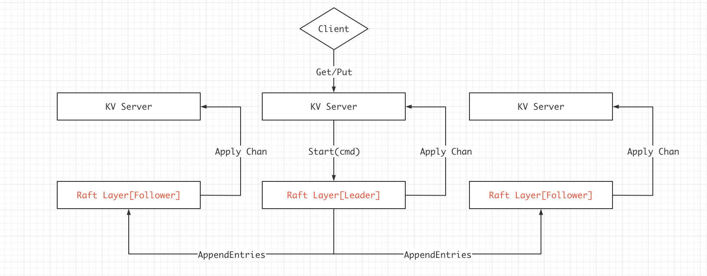

# 6.824 Lab3A Raft学习笔记

## 0x00 理论基础

Lab3A中需要实现一个跑在Raft上的简单KV数据库，具体流程大致为：



过程为：

1. Client发起请求`Get/Put`，请求发送给Leader。
2. KV Server首先接收到请求，然后通过`Start`将cmd传递给底层Raft。
3. 在Raft层，Leader通过`AppendEntries`等操作和Follower进行同步。
4. 当多数节点提交后，Leader的KV Server会收到`ApplyChan`中的信息，然后将cmd执行到KV数据库中，将数据返回给客户端。
5. Follower中的KV数据库将在一段时间后也收到`ApplyChan`中的信息，然后执行cmd同步(速度取决于Raft的日志同步速度)。


## 0x01 设计思路


首先是KVServer，代码为：

```go
type KVServer struct {
	mu      sync.Mutex
	me      int
	rf      *raft.Raft
	applyCh chan raft.ApplyMsg
	dead    int32 // set by Kill()

	maxraftstate int // snapshot if log grows this big

	// Your definitions here.
	kvData map[string]string
	
	lastApplied map[int64]int64 // clientID -> SeqID
	chanMap map[int64]DoneMsg // 通过chanID -> DoneMsg
	
}
```

KVServer指令执行完成后的返回信息：

```go
type DoneMsg struct {
    Err Err
    Value string
}
```

在lab2中，我们总是讨论关于Log的存储与复制，但完全没有讨论到，Log中到底应该又些什么，为什么需要存储？回顾lab2中关于Log的结构体：

```go
type LogEntry struct {
	Command interface{}
	Term int
}
```

其中Command无疑是一个指令，而在`kv数据库`中，可以简单的分为Put，Get等指令的形式。

并且，Raft在存储时采用`LogEntry`的方式存储，提交给上层应用时，则是用管道的方式，提交的结构体也为：

```go
type ApplyMsg struct {
	CommandValid bool
	Command      interface{}
	CommandIndex int

	// For 2D   先不讨论
	SnapshotValid bool
	Snapshot      []byte
	SnapshotTerm  int
	SnapshotIndex int
}
```

至于这个Command同样是属于interface{}的，我们这样设计Command：

```go
type LogData struct {
    Method      string // Put Get Append
    Key         string 
    Value       string
    SeqID       int64 // 幂等性需要的
    ClientID    int64 // 客户端ID
    ChanID      int64 // 通过ChanID获取到chan，进而发送指令执行成功的消息
}
```

## 0x02 代码实现

### Server

在KVServer中需要启一个协程监听Raft管道`ApplyChan`，当Raft向上层提供了对应的日志条目(指令)，则表明可以执行指令到KVServer的数据库中了，执行完毕后，通过`LogData.ChanID`来获取一个管道，向管道中发送执行指令后得到的信息。管道的另外一头则是`runCmd`，此函数将持续监听，直到获取到信息(或者超时)，然后将信息返回给客户端。

```go
func (kv *KVServer) applyLog() {
	for {
		select {
		case msg := <- kv.applyCh:
			//index := msg.CommandIndex
			logData := msg.Command.(LogData)
			kv.mu.Lock()
			seqID, ok := kv.lastApplied[logData.ClientID]
			// client发送过来的seqID已经被执行过了，不再执行
			if ok && seqID == logData.SeqID {

			}else {
				if logData.Method == PUT {
					kv.kvData[logData.Key] = logData.Value
					// 记录已经执行的指令
					kv.lastApplied[logData.ClientID] = logData.SeqID
				}else if logData.Method == APPEND {
					oldValue, ok := kv.kvData[logData.Key]
					if ok {
						kv.kvData[logData.Key] = oldValue + logData.Value
					}else {
						kv.kvData[logData.Key] = logData.Value
					}
					// 记录已经执行的指令
					kv.lastApplied[logData.ClientID] = logData.SeqID
				}else if logData.Method == GET {
					// Get什么都不需要执行
				}else {
					// Error Method
				}
				// 执行完指令后返回对应的信息
				if ch, ok := kv.chanMap[logData.ChanID]; ok {
					var retMsg DoneMsg
					val, exist := kv.kvData[logData.Key]
					if exist {
						retMsg.Err = OK
						retMsg.Value = val
					}else {
						retMsg.Err = ErrNoKey
					}
					ch <- retMsg
				}
			}
			kv.mu.Unlock()
		}
	}
}

```

KVServer开放2个RPC接口，分别是`Put/Append`和`Get`，比较重要的逻辑在`runCmd`中：

1. 启动Raft.Start同步日志条目到多数节点上。
2. 监听ch管道，直到收到信息或者超时。

注意这里的ch管道并不是Raft层的，

Raft层和KVServer层交互的重点管道，过程：

1. Raft.Start收到指令，保存成日志条目，通过AppendEntries同步到多数节点上。
2. Raft通过kv.applyCh将指令发送至KVServer层。
3. KVServer层的applyLog监听发现有可执行的指令了，执行它，然后将执行后的信息发送入ch管道。

```go
func (kv *KVServer) runCmd(logData LogData) DoneMsg {
	var retMsg DoneMsg
	_, _, isLeader := kv.rf.Start(logData)
	if !isLeader { // 不是Leader直接结束
		retMsg.Err = ErrWrongLeader
		return retMsg
	}

	ch := make(chan DoneMsg, 1)
	kv.chanMap[logData.ChanID] = ch
	t := time.NewTimer(500 * time.Millisecond)
	defer t.Stop()
	defer func() { // 退出前删除管道(任务已经执行完毕，管道没有用处了)
		kv.mu.Lock()
		defer kv.mu.Unlock()
		delete(kv.chanMap, logData.ChanID)
	}()
	select {
	case retMsg = <- ch :
		return retMsg

	case <- t.C:
		// timeout
		retMsg.Err = ErrTimeout
		return retMsg
	}
}
```

接下来就是最简单的外放接口`Put/Append`和`Get`了

```go
func (kv *KVServer) PutAppend(args *PutAppendArgs, reply *PutAppendReply) {
	logData := LogData {
		SeqID : args.SeqID,
		ChanID : nrand(), // 有概率是一样的？？
		ClientID : args.ClientID,
		Key : args.Key,
		Value : args.Value,
		Method : args.Method,
	}
	// put append只需要返回执行是否成功即可
	reply.Err = kv.runCmd(logData).Err
}

func (kv *KVServer) Get (args *GetArgs, reply *GetReply) {
	_, isLeader := kv.rf.GetState() // term, isLeader
	if !isLeader {
		reply.Err = ErrWrongLeader
		return
	}
	// 生成指令所需记录的日志
	logData := LogData {
		ClientID : args.ClientID,
		SeqID : args.SeqID,
		ChanID : nrand(),
		Key : args.Key,
		Method : GET,
	}
	res := kv.runCmd(logData)
	reply.Err = res.Err
	reply.Value = res.Value
}
```

### Client


## 0x03 测试用例

```shell
Test: one client (3A) ...
  ... Passed --  15.2  5  2237  440
Test: ops complete fast enough (3A) ...
  ... Passed --  10.6  3  3405    0
Test: many clients (3A) ...
  ... Passed --  15.6  5  3693 1645
Test: unreliable net, many clients (3A) ...
  ... Passed --  17.6  5  2784  509
Test: concurrent append to same key, unreliable (3A) ...
  ... Passed --   1.0  3   204   52
Test: progress in majority (3A) ...
  ... Passed --   0.7  5    47    2
Test: no progress in minority (3A) ...
  ... Passed --   1.1  5   100    3
Test: completion after heal (3A) ...
  ... Passed --   1.3  5    71    3
Test: partitions, one client (3A) ...
  ... Passed --  23.0  5  1997  254
Test: partitions, many clients (3A) ...
  ... Passed --  23.4  5  2466  623
Test: restarts, one client (3A) ...
labgob warning: Decoding into a non-default variable/field int may not work
  ... Passed --  19.9  5  2557  472
Test: restarts, many clients (3A) ...
  ... Passed --  20.7  5  5090 1961
Test: unreliable net, restarts, many clients (3A) ...
  ... Passed --  23.5  5  3384  550
Test: restarts, partitions, many clients (3A) ...
  ... Passed --  27.8  5  3907 1289
Test: unreliable net, restarts, partitions, many clients (3A) ...
  ... Passed --  29.3  5  2182  222
Test: unreliable net, restarts, partitions, random keys, many clients (3A) ...
  ... Passed --  38.4  7  5976  636
PASS
ok  	6.824/kvraft	270.135s
```
