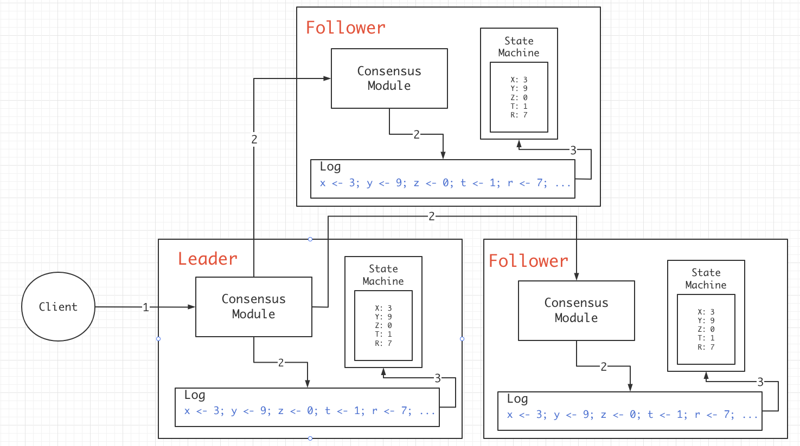
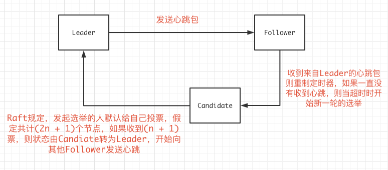

# 6.824 Lab2 Raft学习笔记

## 0x00 理论

### 复制状态机

Raft的本质，就是一个状态复制机：



每一个节点服务器中，都保存有执行指令日志，指令日志中执行到的位置等等，并且通过一致性模块将其同步到各个节点上，当客户端发起请求后，只有多数服务器中都保存有对应的指令日志并响应Leader后，客户端才会收到回复。取决于实现，如果client只对Leader发起读写请求，那么Raft是强一致性模型。

### Election

Raft中有3种角色，分别是`Leader`，`Follower`，`Candidate`。

在Raft中，Leader只能存在一个，Leader每过一段时间，就要向Follower发送心跳包以确认其Follower状态，Follower也能通过心跳包了解到Leader在线，每个Follower本身维护一个定时器，当收到Leader的心跳后重制定时器，如果一直没有收到来自Leader的心跳，则定时器超时，Follower开始新一轮的Leader选举。

流程大致为：



论文（）中提到，如果总节点为2n个，碰巧的是发生了2个节点同时发起选举的请求，且他们平摊了选票，则本轮作废，重新进入下一轮选举。

### Status

每个节点都需要保存的数据包括3种，分别是需要进行持久化的：

```
currentTerm           服务器最后一次知道的任期
votedFor              获得本服务器选票的候选人
log[]                 日志
```

所有服务器中经常改变的：

```
commitIndex           已经被提交的日志索引
lastApplied           被应用到状态机中的日志索引
```

Leader节点中经常改变的，在选举后重新初始化：

```
nextIndex[]           对于每一个节点，需要发送给他的下一个日志条目索引
matchIndex[]          对于每一个节点，已经复制给他的日志的最高索引值
```


### LogEntries

在原论文figure5中说明了关于LogEntries的原理，通过LogEnties来复制日志指令，同时也用作心跳，LogEnties中需要发送的参数：

```
term               Leader任期
leaderID           LeaderID
prevLogIndex       新日志之前的日志索引
prevlogTerm        prevLogIndex那条记录执行的任期
entries[]          准备同步的日志
leaderCommit       Leader已经Commit的日志索引值

// 返回

term               当前任期号
success            用于确定成功提交日志
```

Follower要做的：

1 : 比对Leader发送过来的term，发现小于当前任期，则直接返回false。

2：检查prevLogIndex下的prevLogTerm是否相同，不同返回false。

3：附加参数中的entries到本地日志中

4：如果发现 leaderCommit > commitIndex；则令commitIndex等于LeaderCommit或最新的日志索引中的比较小的那个。


## 0x01 例子

### Append Log 

假定有日志为：

```
// 数字代表日志添加的term
index：   10 11 12 13
Server1:  3
Server2:  3  3  4
Server3:  3  3  5
```

如何生成这种日志：起初，client发送指令，所有节点均在index10下完成同步，Term为3，之后client又发送了一个指令，这条指令由Server2和Server3完成响应并返回，写入到日志index 11中，在Raft中，只要多数票通过，则Leader就会响应客户端，所以index 11的指令会被Commit掉，到此没有任何分歧。

index 12之前，Leader为Server3，而后，Leader节点宕机了，Server2当选为Leader，他执行了来自客户端的一次操作，并且写入日志，term为4，但此时还未来得及发送LogEntries，立马宕机了，随后，节点们又选出Server3作为Leader，并且执行了来自客户端的操作，写入日志，此时Term为5。


### Raft的强制日志同步

我们假定有以下日志，其中Server3为Leader：

```
index：  10 11 12 13
Server1: 3
Server2: 3  3  4
Server3: 3  3  5  6
```

Server3通过LogEntries(心跳)来同步其他节点的日志，通过之前的理论，可以知道Leader将发出

```
prevLogIndex = 12
prevLogTerm = 5
entries[] 中是 index=13，term = 6的日志
```

Server1和Server2中的日志和Leader发送的LogEntries显然不一样，所以会返回False， __Leader会将prevLogIndex向前移动一位__ ，继续发送LogEnties，这回将发送：

```
prevLogIndex = 11
prevLogTerm = 3
entries[] 中有(index=12, term=5),(index=13, term=6)
```

此时Server2中发现prevLogIndex和pervLogTerm匹配，接受了来自Leader的日志，同步日志和Leader一样(此处先不讨论commitIndex)。而Server1在pervLogIndex= 11处没有数据，同样返回false，Leader收到后继续向前移动prevLogIndex为10，发送：

```
prevLogIndex = 10
prevLogTerm = 3
entries[] 中有(index=11, term=3),(index=12, term=5),(index=13, term=6)
```

这回Server1比对通过，接受日志，完成所有的日志同步操作。

注：最初在Server2中，log index = 12的term4操作会被直接抛弃，因为当时的Raft没有得到多数票通过此条操作，所以Raft压根就没回应客户端，所以不必担心。

## 0x02 实现思路


## 0x03 具体代码实现

