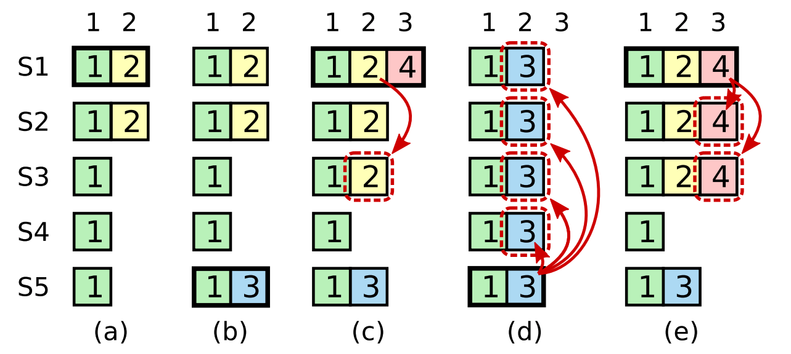

# 6.824 Lab2B Raft学习笔记

## 0x00 基础理论

一些基础理论知识，如果了解可以直接跳转到[代码实现](#0x01设计思路) 。

### Raft节点

2B相比2A多了许多必要的信息，每个节点都需要保存的数据包括3种，分别是需要进行持久化(2C)的：

```
currentTerm           服务器最后一次知道的任期
votedFor              获得本服务器选票的候选人
log[]                 日志
```

所有服务器中经常改变的：

```
commitIndex           已经被提交的日志索引
lastApplied           被应用到状态机中的日志索引
```

Leader节点中经常改变的，在选举后重新初始化：

```
nextIndex[]           对于每一个节点，需要发送给他的下一个日志条目索引
matchIndex[]          对于每一个节点，已经复制给他的日志的最高索引值
```


### AppendEntries
2B相比2A增加了日志同步的操作，并且根据论文figure5中所说，AppendEntries操作同时也用作HeartBeat操作，所以2B中的结构体将由2A中的HeartBeat修改而来。

Follower要做的：

1 : 比对Leader发送过来的term，发现小于当前任期，则直接返回false。

2：检查prevLogIndex下的prevLogTerm是否相同，不同返回false。

3：附加参数中的entries到本地日志中

4：如果发现 leaderCommit > commitIndex；则令commitIndex等于LeaderCommit或最新的日志索引中的比较小的那个。

例子：

假定有日志为：

```
// 数字代表日志添加的term
index：   10 11 12 13
Server1:  3
Server2:  3  3  4
Server3:  3  3  5
```

如何生成这种日志：起初，client发送指令，所有节点均在index10下完成同步，Term为3，之后client又发送了一个指令，这条指令由Server2和Server3完成响应并返回，写入到日志index 11中，在Raft中，只要多数票通过，则Leader就会响应客户端，所以index 11的指令会被Commit掉，到此没有任何分歧。

index 12之前，Leader为Server3，而后，Leader节点宕机了，Server2当选为Leader，他执行了来自客户端的一次操作，并且写入日志，term为4，但此时还未来得及发送LogEntries，立马宕机了，随后，节点们又选出Server3作为Leader，并且执行了来自客户端的操作，写入日志，此时Term为5。

#### 强制同步日志

我们假定有以下日志，其中Server3为Leader：

```
index：  10 11 12 13
Server1: 3
Server2: 3  3  4
Server3: 3  3  5  6
```

Server3通过LogEntries(心跳)来同步其他节点的日志，通过之前的理论，可以知道Leader将发出

```
prevLogIndex = 12
prevLogTerm = 5
entries[] 中是 index=13，term = 6的日志

// Leader节点中的数据：
nextIndex[s1] = 13
nextIndex[s2] = 13
```

Server1和Server2中的日志和Leader发送的LogEntries显然不一样，所以会返回False， __Leader会将prevLogIndex向前移动一位__ ，修改nextIndex，继续发送LogEnties，这回将发送：

```
prevLogIndex = 11
prevLogTerm = 3
entries[] 中有(index=12, term=5),(index=13, term=6)

// Leader节点中的数据
nextIndex[s1] = 12
nextIndex[s2] = 12
```

此时Server2中发现prevLogIndex和pervLogTerm匹配，接受了来自Leader的日志，同步日志和Leader一样(此处先不讨论commitIndex)。而Server1在pervLogIndex= 11处没有数据，同样返回false，Leader收到后继续向前移动prevLogIndex为10，发送：

```
prevLogIndex = 10
prevLogTerm = 3
entries[] 中有(index=11, term=3),(index=12, term=5),(index=13, term=6)

// Leader节点中的数据
nextIndex[s1] = 11
nextIndex[s2] = 14
```

这回Server1比对通过，接受日志，完成所有的日志同步操作。

__这种同步一次将nextIndex向后移动一位的速度在follower落后过多条日志时，将使得同步时间过长，所以可以考虑自己引入其他方法来提高日志同步的速度__ 。

注：最初在Server2中，log index = 12的term4操作会被直接抛弃，因为当时的Raft没有得到多数票通过此条操作，所以Raft压根就没回应客户端，所以不必担心。


## 0x01 设计思路

### Raft 

节点结构体：

```go
type Raft struct {
  mu                sync.Mutex
  peers             []*labrpc.ClientEnd
  persister         *Persister // 2A中没有用到
  me                int
  dead              int32

  currentTerm       int // 当前任期
  voteFor           int // 当前任期获取本节点选票的节点
  log               []LogEntry // 日志，2A中没有用到
  
  nextIndex         []int // 每个Follower同步起点
  matchIndex        []int // 每个Follower已经同步的日志索引
  
  // 所有节点中，属于容失状态
  commitIndex       int // 已知的最大提交索引
  lastApplied       int // 提交到状态机到索引 

  role              string
  leaderID          int

  lastBroadcastTime         time.Time // Leader发送心跳的时间
  broadcastInterval         time.Duration // 100ms
  lastActiveTime            time.Time 
  lastActiveTimeInterval    time.Duration // 200ms - 400ms
  
  applyChan                 chan ApplyMsg // 提交给应用层状态机的管道

}
```

### AppendEntries

```go
type AppendEntriesArgs struct {
  Term          int // 当前任期
  LeaderID      int 
  PrevLogIndex  int // 当前提交日志index的前一个index
  PrevLogTerm   int // prevLogIndex下的任期
  
  Entries       []LogEntry // 需要同步的日志
  LeaderCommit  int
}

type AppendEntriesReply struct {
  Term      int
  Success   bool
  
  // quick backup
  XTerm     int
  XIndex    int
  XLen      int
}
```

### RequestVoteArgs

投票代码也需要修改，2B中，不仅仅只判断任期更高就能投票，还需要通过log长度等等条件来判断

```go
type RequestVoteArgs struct {
  Term          int
  Candidate     int
  LastLogIndex  int
  LastLogTerm   int
}

type RequestVoteReply struct {
  Term      int
  Success   int
}
```

## 0x02 代码实现

### 日志和心跳

在2B的实现中，Leader不再向Follower发送心跳，转而发送AppendEntries来进行强制同步日志的操作，同时，AppendEntries也“当作”心跳包的作用。

每个节点通过`AppendEntriesRPC`来暴露调用接口给Leader，Leader则通过`AppendEntiesLoop`来定时发送`AppendEntries`，这里则设定为100ms。

当一个节点成为Leader时需要关注的函数`AppendEntriesLoop`和`AppendEntries`:

```go
func (rf *Raft) AppendEntriesLoop() {
	for !rf.killed() {
		time.Sleep(10 * time.Millisecond)
		rf.AppendEntries()
	}
}

func (rf *Raft) AppendEntries() {
	rf.mu.Lock()
	defer rf.mu.Unlock()
	// Leader 才需要广播
	if rf.role != Leader {
		return
	}

	now := time.Now()
	// 还未超时
	if now.Sub(rf.lastBroadcastTime) < rf.broadcastInterval {
		return
	}

	// 向所有Follower广播
	for index := 0; index < len(rf.peers); index ++ {
		if index == rf.me {
			continue
		}

		args := AppendEntriesArgs{
			Term : rf.currentTerm,
			LeaderID : rf.me,
			LeaderCommit: rf.commitIndex,
			Entries: make([]LogEntry, 0),
			PrevLogIndex: rf.nextIndex[index] - 1,
		}
		if args.PrevLogIndex > 0 {
			args.PrevLogTerm = rf.log[args.PrevLogIndex - 1].Term
		}
		// 填充log
		args.Entries = append(args.Entries, rf.log[rf.nextIndex[index] - 1:]...)
		// 启动协程发送
		go rf.coroutineAppendEntries(index, &args)
	}
	// 更新超时时间
	rf.lastBroadcastTime = time.Now()
}

func (rf *Raft)coroutineAppendEntries(index int, args* AppendEntriesArgs) {
	reply := AppendEntriesReply{}
	if ok := rf.sendAppendEntriesRPC(index, args, &reply); !ok {
		// Error!
		return
	}
	rf.mu.Lock()
	defer rf.mu.Unlock()

	// 任期发生改变，不再是Leader了！
	if rf.currentTerm != args.Term {
		return
	}

	// 有更高任期节点存在，成为当前任期Follower，等待Leader
	if rf.currentTerm < reply.Term {
		rf.currentTerm = reply.Term
		rf.role = Follower
		rf.voteFor = -1
		rf.leaderID = -1
		return
	}
	// Follower同意同步日志
	if reply.Success {
	   // 这里是一个坑点！
	   // 考虑使用以下代码再并发发送RPC时，由于网络请求延迟的情况，Leader多发送了一条
	   // 并且都被Follower接受了会如何？
		//rf.nextIndex[index] += len(args.Entries)
		rf.nextIndex[index] = args.PrevLogIndex + len(args.Entries) + 1
		rf.matchIndex[index] = rf.nextIndex[index] - 1

		sortedMatchIndex := make([]int, 0)
		sortedMatchIndex = append(sortedMatchIndex, len(rf.log))
		for i := 0; i < len(rf.peers); i ++ {
			if i == rf.me {
				continue
			}
			sortedMatchIndex = append(sortedMatchIndex, rf.matchIndex[i])
		}
		sort.Ints(sortedMatchIndex)
		newCommitIndex := sortedMatchIndex[len(rf.peers) / 2]
		if newCommitIndex > rf.commitIndex && rf.log[newCommitIndex - 1].Term == rf.currentTerm {
			rf.commitIndex = newCommitIndex
		}
	}else {
		// quick backup
		// Log不存在
		if reply.XTerm == -1 {
			rf.nextIndex[index] = args.PrevLogIndex - reply.XLen + 1
		}else {
			// 遍历寻找，或者有更好的想法也可以
			for conflictIndex := reply.XIndex; conflictIndex < reply.XIndex + reply.XLen; conflictIndex ++ {
				if rf.log[conflictIndex - 1].Term != reply.XTerm {
					// 冲突Index
					rf.nextIndex[index] = conflictIndex
					break
				}
			}
		}
		// 普通同步方式，直接将nextIndex - 1，在一个Follower已经落后了非常多Log后
		// 同步将非常的缓慢
		//rf.nextIndex[index] -= 1
		//if rf.nextIndex[index] < 1 {
		//	rf.nextIndex[index] = 1
		//}
	}
}

```

每个Follower暴露的RPC接口`AppendEntriesRPC`，论文5.1中提出了5点要求，分别为：
1. args.Term < rf.currentTerm 同步日志失败。
2. args.PrevLogIndex处点日志条目任期和args.PrevLogTerm不同，同步日志失败。
3. 在2通过的情况下，可以强制覆盖“Follower中的已存在日志”。
4. 附加Follower中不存在的日志
5. 令commitIndex = min(args.LeaderCommit，rf.commitIndex，新日志条目索引值)。

```go
func (rf *Raft) sendAppendEntriesRPC(server int, args *AppendEntriesArgs, reply *AppendEntriesReply) bool {
	ok := rf.peers[server].Call("Raft.AppendEntriesRPC", args, reply)
	return ok
}

func (rf *Raft) AppendEntriesRPC(args* AppendEntriesArgs, reply* AppendEntriesReply) {
	rf.mu.Lock()
	defer rf.mu.Unlock()

	// 对方任期更小，直接返回错误
	if rf.currentTerm > args.Term {
		reply.Success = false
		reply.Term = rf.currentTerm
		return
	}

	// 更大任期的Leader发来AppendLog
	if rf.currentTerm < args.Term {
		rf.currentTerm = args.Term
		rf.role = Follower
		rf.voteFor = -1
		rf.leaderID = args.LeaderID
	}

	// 更新
	rf.lastActiveTime = time.Now()

	// prevLogIndex 空
	if len(rf.log) < args.PrevLogIndex {
		reply.Success = false
		reply.Term = rf.currentTerm
		// quick backup
		reply.XTerm = -1
		reply.XLen = args.PrevLogIndex - len(rf.log)
		return
	}

	if args.PrevLogIndex > 0 && rf.log[args.PrevLogIndex - 1].Term != args.PrevLogTerm {
		reply.Success = false
		reply.Term = rf.currentTerm
		// quick backup
		reply.XLen = 0
		reply.XTerm = rf.log[args.PrevLogIndex - 1].Term
		// 找出XTerm的首个日志条目的索引
		for index := args.PrevLogIndex; index > 0 ; index -- {
			if reply.XTerm == rf.log[index - 1].Term {
				reply.XLen += 1
				continue
			}
			reply.XIndex = index
			break
		}
		reply.XIndex += 1
		return
	}

	// 检查通过，没有问题
	for i, log := range args.Entries {
		index := args.PrevLogIndex + 1 + i
		if index > len(rf.log) {
			rf.log = append(rf.log, log)
		}else {
			if rf.log[index - 1].Term != log.Term {
				rf.log = rf.log[:index - 1] 
				rf.log = append(rf.log, log)
			}
		}
	}

	// 更新commitIndex
	if args.LeaderCommit > rf.commitIndex {
		rf.commitIndex = args.LeaderCommit
		if len(rf.log) < rf.commitIndex {
			rf.commitIndex = len(rf.log)
		}
	}
	reply.Term = rf.currentTerm
	reply.Success = true
}

```

### 选举方式

选举和2A中也有所不同，每个节点都不能随意投票，有条件限制，同样每个Follower暴露`RequestVoteRPC`接口，每个节点通过`ElectionLoop`来定期发送选举请求，当收到Leader发送来的`AppendEntries`时，重置定时。

```go
func (rf *Raft) ElectionLoop () {
	for !rf.killed() {
		time.Sleep(1 * time.Millisecond)
		rf.Election()
	}
}

func (rf* Raft) Election() {
	rf.mu.Lock()
	defer rf.mu.Unlock()

	if rf.role == Leader {
		return
	}
	// 未超时
	now := time.Now()
	if now.Sub(rf.lastActiveTime) < rf.lastActiveTimeInterval {
		return
	}
	// 超时，状态转为Candidate，开始新一轮选举
	rf.role = Candidate
	rf.currentTerm += 1
	rf.voteFor = rf.me

	// 在投票给自己的同时，向其他节点发起RPC获取选票
	args := RequestVoteArgs{
		Term : rf.currentTerm,
		CandidateID : rf.me,
		LastLogTerm: rf.lastTerm(),
		LastLogIndex: rf.lastIndex(),
	}

	type Result struct {
		peerID int
		respond* RequestVoteReply
	}
	voteCount := 1 // 自己一票
	totalCount := 1 // 所有票数，包括没有给自己投票的节点
	resultChan := make(chan *Result, len(rf.peers)) // 管道
	// 启协程获取选票，解锁
	// 当结束后，由于解锁的请求，解锁期间，可能有任期变动，所以需要重新判断！
	rf.mu.Unlock()
	for index := 0; index < len(rf.peers); index ++ {
		if index == rf.me {
			continue
		}
		go func (id int){
			reply := RequestVoteReply{}
			if ok := rf.sendRequestVote(id, &args, &reply); ok {
				resultChan <- &Result{peerID : id, respond: &reply }
				return
			}
			resultChan <- &Result {peerID : id, respond : nil}
		}(index)
	}
	maxTerm := 0 // 获取最高任期，以确定当前的任期是正确的
	// 当发现有更高任期的节点存在，本次投票无意义
	for {
		select {
		case result := <- resultChan:
			totalCount += 1
			if result.respond != nil {
				if result.respond.Success {
					voteCount += 1
				}
				if result.respond.Term > maxTerm{
					maxTerm = result.respond.Term
				}
			}
			// 投票结束
			if totalCount == len(rf.peers) || voteCount > len(rf.peers) / 2 {
				goto END
			}
		}
	}
END:
	// 重新上锁，并且检测状态
	rf.mu.Lock()
	if rf.role != Candidate { // 不是Candidate状态，则抛弃一切投票结果
		return
	}
	// 有更高任期存在，转而成为Follower，等待Leader的心跳
	if maxTerm > rf.currentTerm {
		rf.role = Follower
		rf.leaderID = -1
		rf.voteFor = -1
		rf.currentTerm = maxTerm
		return
	}
	// 计算选票
	if voteCount > len(rf.peers) / 2 {
		rf.role = Leader
		rf.leaderID = rf.me
		rf.lastBroadcastTime = time.Now()
		rf.broadcastInterval = time.Duration(100) * time.Millisecond
		// 设定心跳发送间隔100ms
		// 初始化nextIndex和matchIndex
		rf.nextIndex = make([]int, len(rf.peers))
		rf.matchIndex = make([]int, len(rf.peers))
		for i := 0; i<len(rf.peers); i++ {
			rf.nextIndex[i]	= rf.lastIndex() + 1
			rf.matchIndex[i] = 0
		}
	}
	// 重新设定时器
	rf.lastActiveTime = time.Now()
	rf.lastActiveTimeInterval = time.Duration(200 + rand.Int31n(200)) * time.Millisecond
}
```
每个节点暴露的RPC调用接口`RequestVoteRPC`

`RequestVoteRPC`中关于Log长度以及Log执行任期的判断，论文5.2中说明了：
1. args.Term < rf.currentTerm, 拒绝投票。(肯定的)
2. 当前节点还未投票，且候选人日志至少和自己一样的新，则投票给他。

这里出现了一个比较难的点，在论文5.4.1的选举限制中这样说道： __Raft使用投票的方式来阻止一个候选人赢得选票，除非这个候选人包含了全部的已经提交的日志条目__ 。[具体解释](#0x05选举限制)

```go
func (rf *Raft) RequestVoteRPC(args *RequestVoteArgs, reply *RequestVoteReply) {
	rf.mu.Lock()
	defer rf.mu.Unlock()
	reply.Success = false
	// 被选举者任期比当前任期小，拒绝
	if rf.currentTerm > args.Term {
		reply.Term = rf.currentTerm
		reply.Success = false
		return
	}
	// 成为当前任期中的Follower
	// 这里的leaderID还未确定！
	// 2B 中不能直接投票，需要判断日志长度等等一系列操作
	if rf.currentTerm < args.Term {
		rf.currentTerm = args.Term
		rf.role = Follower
		rf.leaderID = -1
		rf.voteFor = -1 // 当前任期没有投票过
	}
	if rf.voteFor == -1 { // 还没投票
		lastLogTerm := rf.lastTerm()
		// 被选举者日志最后一条中的任期要么是最高的
		// 又或者是相同任期，但其日志是最长的
		if args.LastLogTerm > lastLogTerm || (args.LastLogTerm == lastLogTerm && args.LastLogIndex >= rf.lastIndex()) {
			rf.voteFor = args.CandidateID
			rf.lastActiveTime = time.Now()
			reply.Success = true
		}
	}
}

func (rf *Raft) lastIndex() int {
	return len(rf.log)
}

func (rf *Raft) lastTerm() int {
	if len(rf.log) != 0 {
		return rf.log[len(rf.log) - 1].Term
	}
	return 0
}

func (rf *Raft) sendRequestVote(server int, args *RequestVoteArgs, reply *RequestVoteReply) bool {
	ok := rf.peers[server].Call("Raft.RequestVoteRPC", args, reply)
	return ok
}
```

### 其他

生成Raft的Make函数，这里nextIndex和matchIndex都是Leader中容失的内容，所以我们干脆在一个选举成功后再生成，不必在Make阶段就生成。

```go
func Make(peers []*labrpc.ClientEnd, me int,
	persister *Persister, applyCh chan ApplyMsg) *Raft {
	rf := &Raft{}
	rf.peers = peers
	rf.persister = persister
	rf.me = me

	// Your initialization code here (2A, 2B, 2C).
	rf.applyChan = applyCh
	rf.role = Follower
	rf.currentTerm = 0
	rf.leaderID = -1
	rf.voteFor = -1
	rf.lastActiveTime = time.Now()
	rf.lastActiveTimeInterval = time.Duration(200 + rand.Int31n(200)) * time.Millisecond

	// initialize from state persisted before a crash
	rf.readPersist(persister.ReadRaftState())

	// start ticker goroutine to start elections
	go rf.ticker()

	go rf.ElectionLoop()
	go rf.applyLogLoop(applyCh)
	go rf.AppendEntriesLoop()
	return rf
}

```

在Make中，我们可以看到一个函数`applyLogLoop`，这个函数是用于向状态机发送已经提交的日志条目，2B中是通过`applyCh`这个管道来判断日志条目是否有完成同步的。内容：

```go
func (rf *Raft) applyLogLoop (applyChan chan ApplyMsg) {
	for !rf.killed() {
		time.Sleep(10 * time.Millisecond)

		var appliesMsgs = make([]ApplyMsg, 0)
		func() {
			rf.mu.Lock()
			defer rf.mu.Unlock()

			for rf.commitIndex > rf.lastApplied {
				rf.lastApplied += 1
				appliesMsgs = append(appliesMsgs, ApplyMsg{
					Command: rf.log[rf.lastApplied - 1].Command,
					CommandValid: true,
					CommandIndex: rf.lastApplied,
				})
			}
		}()

		rf.mu.Lock()
		for _, msg := range appliesMsgs {
			applyChan <- msg
		}
		rf.mu.Unlock()
	}
}
```

剩下一些杂七杂八的函数，一些是测试需要使用的：

```go
func (rf *Raft) GetState() (int, bool) {
	rf.mu.Lock()
	defer rf.mu.Unlock()

	var term int
	var isleader bool

	term = rf.currentTerm
	if rf.role == Leader {
		isleader = true
	}else {
		isleader = false
	}
	return term, isleader
}

func (rf *Raft) Start(command interface{}) (int, int, bool) {
	index := -1
	term := -1
	isLeader := true

	// Your code here (2B).
	rf.mu.Lock()
	defer rf.mu.Unlock()

	if rf.role != Leader {
		return -1, -1, false
	}

	log := LogEntry{
		Command: command,
		Term: rf.currentTerm,
	}
	rf.log = append(rf.log, log)
	index = len(rf.log)
	term = rf.currentTerm
	return index, term, isLeader
}
```

## 0x03 测试用例

6.824 Lab2B中给出的测试均通过。

```shell
➜  raft git:(master) ✗ go test -run 2B          
Test (2B): basic agreement ...
  ... Passed --   0.6  3   14    3578    3
Test (2B): RPC byte count ...
  ... Passed --   1.4  3   46  112486   11
Test (2B): agreement despite follower disconnection ...
  ... Passed --   3.8  3  142   36509    7
Test (2B): no agreement if too many followers disconnect ...
  ... Passed --   3.9  5  232   52982    4
Test (2B): concurrent Start()s ...
  ... Passed --   0.7  3   16    4126    6
Test (2B): rejoin of partitioned leader ...
  ... Passed --   3.9  3  248   57332    4
Test (2B): leader backs up quickly over incorrect follower logs ...
  ... Passed --  31.3  5 2892 2669420  103
Test (2B): RPC counts aren't too high ...
  ... Passed --   2.2  3   74   19806   12
PASS
ok  	6.824/raft	47.625s
```


# 论文笔记

## 0x04 日志同步

figure5.3具体说明了日志。

一旦一个Leader被选举出来，就可以处理来自客户端的服务， __客户端的每一个请求都包含一条可以被`复制状态机`执行的指令，Leader会将这条指令当作日志条目添加到本地的日志中，然后通过RPC并发发送给其他的Follower，当多数Follower同步了这条日志后，Leader才会响应客户端__ 。

__Leader来决定什么时候将日志条目中的指令提交到状态机中，这种日志被称为`已提交`(commited)，Raft保证所有`已提交`的指令最终都会被状态机执行__ 。

__在Leader将创建的日志条目同步到多数服务器上时，日志就会变为`已提交`，同时，Leader之前的所有日志条目也都将一并被提交__ 。

要使得Follower日志和自己保持一致，就要找到`最后两者达成一致`的地方，然后将那个点之后的日志全部删除(Follower节点上)，发送自己的日志给Follower。

#### 同步过程：

Leader在刚刚当选的时候，会维护一个nextIndex的变量，nextIndex将为Leader本地日志index+1。而发送的AppendEntries中的PrevLogIndex就为nextIndex-1。

Leader发送的AppendEntries在被Follower收到后，Follower将比较本地日志索引为`args.PrevLogIndex`下的日志条目的Term和`args.PrevLogTerm`的任期是否相同，如果不同(或者不存在)，Follower将回绝此次操作，而Leader会将`PrevLogIndex - 1`，然后重复一遍，直到同步为止。


## 0x05 选举限制

figure5.4.1中明确指出了如果一个候选人想要赢得选举，就必须拥有所有已经提交的日志条目。

figure5.4.2中也说明了， __领导人知道一条当前任期内的日志条目时可以被提交的，只要它被存储到了大多数节点上(即使commitIndex没有被更新)，如果一个领导人在提交日志时宕机了，则未来的领导人必须继续尝试复制这条日志记录__ 。

这就需要在投票的时候决定谁拥有`最新的`日志条目，规则为：

 __Raft通过比较两份日志中最后一条日志条目的索引值和任期号来确定谁的日志比较新：如果两份日志最后的条目的任期号不同，那么任期号大的日志更新。如果两份日志最后的条目任期号相同，那么日志长度比较长的那个更新__ 。
 
论文中也给出了一个例子：


#### a:
S1是Leader，在接收了客户端的一个请求后，S1将日志写入了Slot2处，Term为2，并同步给了S2后就宕机了，由于少数派持有的日志条目，这条日志必然不会被提交，这也引申出了Raft选举中的重点。

#### b:
S5当选为Leader，并且处理了一条来自客户端的日志，写入Slot2处的位置，Term为3。

让我们`将时间轴拉回S5当选前`， __为何S5可以当选？__ 根据上述日志最新的规则，S1和S2必然不会投票给S5，这是因为S1和S2的 __最后一条日志条目的任期高于S5__ ，但是S3和S4不会受此约束，它们投了同意票，加上S5本身多票当选(3票)， __如果S5没有宕机，不出所料，S1和S2中Slot2处的日志将被覆盖掉(这个操作是没问题的)__ 。

#### c:
在b结束后，S5宕机了，随后，S1当选为Leader，事实也确实如此， __S1可以拿到S2，S3，S4的选票(加上本身已经4票可以当选，S5会拒绝)__ 。S1当选为Leader后处理了一条来自客户端的请求，将日志条目写入到Solt3处，Term为4。

接下来c中发生的一些东西将影响后续的走向，假设S1处理完请求后立马宕机了，那么后续将跳转到d图中的场景，而如果S1没有立刻宕机，而是成功的将日志(AppendEntries)同步到了S2和S3中，那么将跳转到e图中。

#### d:
在c中，Leader机S1处理完请求后，只写入了本地日志，没来得及同步日志，就宕机了，随后，S5再次当选(S5可以拿到S2, S3, S4和本身4票)，之后，S5开始发送日志同步(AppendEntries)，S1和S2中原先的日志将被覆盖掉。

#### e:
在c中，Leader机处理完请求后，没有立刻宕机，它成功的将Slot2处，Term为2的日志条目同步到了S3中，随后才宕机。

接下来将发生的： __S4和S5不可能当选(根据选举规则)__ ，之后S1，S2，S3可能当选，由图可看到，例子中再次当选的是S1，随后的日志同步大家都已明了，这里就不再赘述。

## 0x06 快速备份

在论文5.3的Log Replication简略了说明了一种日志快速备份的机制，6.824课程教授有说到了他所用到的实现方式，通过增加Follower在AppendEntries回复的信息来实现：

1. Xterm: Follower中与Leader冲突的任期号
2. Xindex: Xterm开始的index
3. Xlen: Xterm的长度

解释一下Xterm，在`AppendEntries`中，Leader将发送2个关键的字段，分别为`PrevLogIndex`以及`PrevLogTerm`，如果Follower发现，本地的日志`log[PrevLogIndex].Term != PrevLogTerm`，那么就证明发现了冲突，则`Xterm`将被设定为`log[PrevLogIndex].Term`。

接下来的Xindex和Xlen就很好解释了，Xindex就是Follower本地日志条目中关于`Xterm`开始的那个索引位置，Xlen则是关于`Xterm`的所有日志条目总长度，6.824中也给出了3个例子。

__注：特殊情况将在例3中说明__ 。


#### 例 1：
这里假设S2为Leader，S1为Follower，我们单独拎出这两个节点，不讨论其他节点。

```
index : 1   2   3   4
S1      4   5   5
S2      4   6   6   6
```

S2作为Leader发送AppendEntries到S1，内容为
```
PrevLogIndex = 3
PrevLogTerm = 6
Entries[] = "6"(位于index=4下的日志条目)
```
Follower S1发现，本地log[PrevLogIndex].Term = 5，不等于6，随即返回：
```
Xterm = 5
Xindex = 2
Xlen = 2
```
Leader通过Follower返回的信息知道了，在Follower日志中，冲突在Xterm=5，但具体是哪个index，Leader也不得而知，随即开始了遍历(你可以用更快的方法)，遍历范围就是任期为5的所有日志，直到找到冲突点。

本例子中，Leader很快知道了冲突位置在Xindex=2的位置，也就是一开始就冲突了，接下来，Leader将nextIndex[S1]设为Xindex，在下一次AppendEntries中，Leader将在这个位置开始同步。

#### 例 2：
```
index : 1   2   3   4
S1      4   4   4
S2      4   6   6   6
```
Leader向Follower发送：

```
PrevLogIndex = 3
PrevLogTerm = 6
Entries[] = "6"
```

Follower比对发现，本地`log[PrevLogIndex].Term != PrevLogTerm`，返回：

```
Xterm = 4
Xindex = 1
Xlen = 3
```

Leader开始从Xindex=1的位置开始遍历，遍历的长度就是Xlen，发现和本地日志一致(本地index=1的位置term也为4)，接下里，Leader将走到index=2的位置，这回Leader发现了不同的地方了(index=2时本地日志条目Term=6)，这即是冲突点，那么Leader将设置nextIndex[S1] = 2

#### 例 3：

在例3中，和之前情况有所不同，Follower的log[PrevLogIndex]处没有日志存在，此时：

1. Xterm 直接设定为-1，表示当前位置没有日志
2. Xindex 没有用处
3. Xlen 需要的日志长度

```
index : 1   2   3   4
S1      4   
S2      4   6   6   6
```

S2发送AppendEntries到S1，内容为：

```
PrevLogIndex = 3
PrevLogTerm = 6
Entries[] = "6"
```

Follower收到后，发现冲突，返回：

```
Xterm = -1
Xlen = 2
```

Leader收到后发现Follower的log[PrevLogIndex]没有日志，且Follower表示，从这个点开始往后Xlen的长度都没有日志存在，那么Leader会将nextIndex[s1]设置为`PrevLogIndex - Xlen + 1`。


