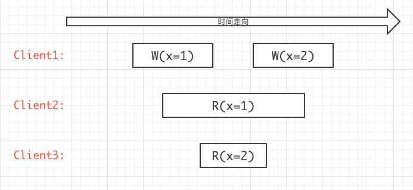
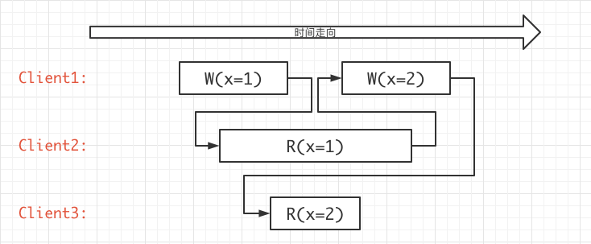
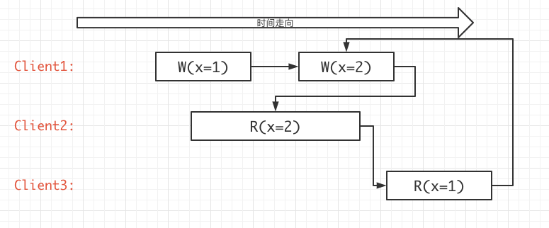

# 6.824 Lab2C Raft学习笔记

## 0x00 基础理论

在Lab2B中，我们实现了选举，日志同步(心跳)，状态提交等操作，但还未涉及到节点宕机重启这个相关的操作，在Raft论文第五章中的状态中说明了需要持久化的参数：

```
currentTerm
voteFor
log[]
```
至于为何[why?](#0x04-持久化内容)

## 0x01 设计思路

## 0x02 代码实现

## 0x03 测试用例

## 0x04 持久化内容

#### currentTerm

currentTerm如果没有持久化，当所有节点都宕机后，任期就将不得而知了。

#### voteFor

首先是voteFor这个字段，肯定是需要持久化的，考虑这样的一种情况，共计3个节点，S1和S2同时超时发起投票，他们都投票给了自己，而S3投票给S1后快速重启，然后又收到了S2的投票请求，结果S3也投票给了S2，这样整个集群中出现了2个Leader的情况，即脑裂(brain split)。

#### log

日志不解释。

## 0x05 一致性问题

关于一致性问题，直接先看一个6.824中提出：

```
Total order of operations match real time.
```

例子：


其中每个框框的长度代表一条指令执行的时间，分别代表开始和结尾，在client2和client3来看，client2比client3早执行了read操作，并且也晚于client3收到操作，但实际的结果却是client3收到的才是最新的结果(x=2)，看似有点违背顺序，但以上例子确实是线性一致性的，也就是说，我们可以找到一个确切的执行顺序：

`W(x=1)`->`R(x=1)`->`W(x=2)`->`R(x=2)`



接下来再看一个例子，他就不再是线性一致性的，因为我们在其中找到了一个`环`：



这个例子中，无法找到一个`线性的`一条过程来表示整个指令的执行过程，只能表示：

`W(x=1)`是先于`W(x=2)`的，`R(x=1)`是先于`W(w=2)`的。

`W(x=2)`是先于`R(x=2)`的。

`R(x=2)`是先于`R(x=1)`的。注：从时间线上得出。

但这里却引申出另外一种一致性，即`顺序一致性`，我们可以看到client2读到的是`R(x=2)`，即已经是最新的数据了，而client3不同，它读到的是`R(x=1)`， __如果client3从得到`R(x=1)`开始，再发送一次读请求，那么得到的将是`最新的`数据，也就是`R(x=2)`，即顺序一致性(假设期间没有其他的写操作，即便有写操作，client3也将得到至少比x=1更 新的数据)__ 。