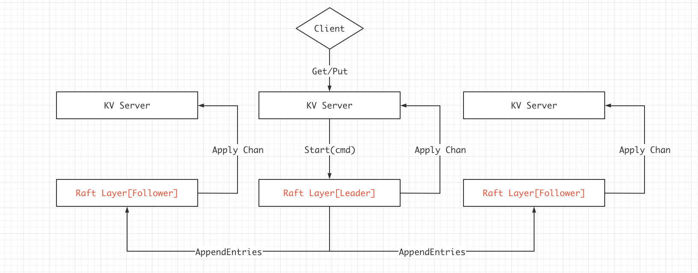

# 6.824 Lab3A Raft学习笔记

## 0x00 理论基础

Lab3A中需要实现一个跑在Raft上的简单KV数据库，具体流程大致为：



过程为：

1. Client发起请求`Get/Put`，请求发送给Leader。
2. KV Server首先接收到请求，然后通过`Start`将cmd传递给底层Raft。
3. 在Raft层，Leader通过`AppendEntries`等操作和Follower进行同步。
4. 当多数节点提交后，Leader的KV Server会收到`ApplyChan`中的信息，然后将cmd执行到KV数据库中，将数据返回给客户端。
5. Follower中的KV数据库将在一段时间后也收到`ApplyChan`中的信息，然后执行cmd同步(速度取决于Raft的日志同步速度)。


## 0x01 设计思路

首先是KVServer，代码为：

```go
type KVServer struct {
	mu      sync.Mutex
	me      int
	rf      *raft.Raft
	applyCh chan raft.ApplyMsg
	dead    int32 // set by Kill()

	maxraftstate int // snapshot if log grows this big

	// Your definitions here.
	kvStore 	map[string]string  // key -> value
	reqMap 		map[int]*OpContext // log index -> OpContext
	seqMap 		map[int64]int64 // ClientID -> seqID
}
```

在lab2中，我们总是讨论关于Log的存储与复制，但完全没有讨论到，Log中到底应该又些什么，为什么需要存储？回顾lab2中关于Log的结构体：

```go
type LogEntry struct {
	Command interface{}
	Term int
}
```

其中Command无疑是一个指令，而在`kv数据库`中，可以简单的分为Put，Get等指令的形式。

并且，Raft在存储时采用`LogEntry`的方式存储，提交给上层应用时，则是用管道的方式，提交的结构体也为：

```go
type ApplyMsg struct {
	CommandValid bool
	Command      interface{}
	CommandIndex int

	// For 2D   先不讨论
	SnapshotValid bool
	Snapshot      []byte
	SnapshotTerm  int
	SnapshotIndex int
}
```

至于这个Command同样是属于interface{}的，我们这样设计Command：

```go
type Op struct {
    Index       int
    Term        int
    Type        string // Put Gettt
    Key         string 
    Value       string
    SeqID       int64 // 幂等性需要的
    ClientID    int64 // 客户端ID
}
```

```go
type OpContext struct {
	op *Op
	committed chan byte

	wrongLeader bool // leader改变过？
	ignored	bool // seqid过期

	keyExist bool
	value string
}
```

## 0x02 代码实现

## 0x03 测试用例
