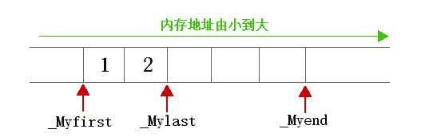
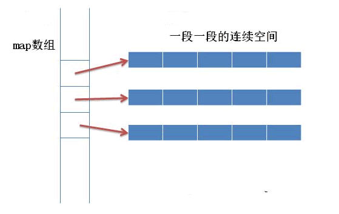
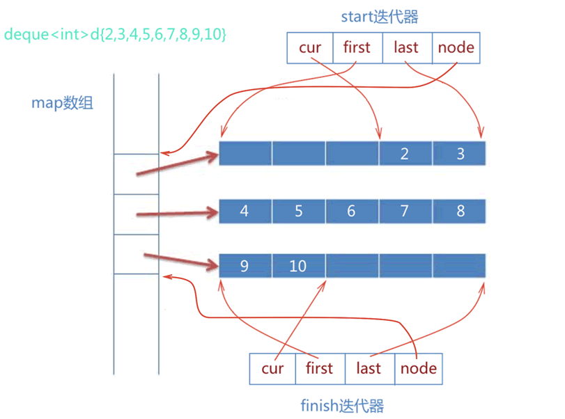
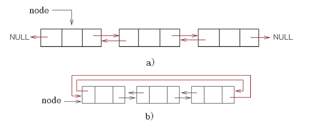
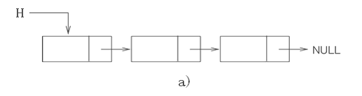

# C++ STL

## vector

内部实现

```C++
template<class _Ty,
    class _Ax>
    class vector
        : public _Vector_val<_Ty, _Ax>
    {   // varying size array of values
public:
    ...
protected:
    pointer _Myfirst;   // pointer to beginning of array
    pointer _Mylast;    // pointer to current end of sequence
    pointer _Myend;     // pointer to end of array
    };
```

内存排布: 



vector的内存排布就是简单的顺序内存排布方式，first迭代器指向头部，last迭代器指向第一个空元素(最后一个元素的下一个)，end指向最后一个元素的末尾(空间最末端)。

所以往尾部操作的效率是最高的，删除和插入都是O(1)，如果往中间或者前面插入删除，使用时长都是O(n)，vector会自动改变其内部的构造。

如果一个vector装满了，那么再往其中加入元素将触发扩容，分配器将分配一个更大的空间(一般是2倍于原先的空间)，然后将所有数据拷贝过去，再将原先的空间释放掉。

注: 当空间使用达到满时，先前的有些迭代器可能无法使用，这时由于扩容导致的。

## deque

deque的实现比较复杂，类似vector，其内存分布图: 



其中map是一个指针数组，指向一个个空间，有点类似二维数组的方式，并且map的扩容方式和vector底层类似。

deque这样做是为了实现更为快速的头部操作和尾部操作。

其内部迭代器代码: 

```C++
template<class T,...>
struct __deque_iterator{
    ...
    T* cur;
    T* first;
    T* last;
    map_pointer node; //map_pointer 等价于 T**
}
```

cur指向的是当前元素，first则指向一段段的地址开头，last则指向一段段的地址结尾，node则指向map数组中的对应索引位置，其指向图: 



所以往头部进行增删为O(1)，往尾部增删为O(1)，往中间增删为O(n)。

## List

C++ STL中的list有双向，也有单向list

#### 双向链表

底层内存空间分布: 



对于双向或者双向循环链表，其头尾的操作时间复杂度都是O(1)，对中间节点进行操作的复杂度尾O(n)，如果能拿到某个节点的地址，那么删除的操作是O(1)级别的。

#### 单向链表

底层内存空间分布: 



其头部操作为O(1)，其余的操作都为O(n)。

## set和multiset

set和multiset底层实现都是红黑树

#### set

set底层实现为红黑树，其键值不可重复，并且是顺序排序的，其内部的key和value是相同的。

至于为何set不使用hash来实现的主要原因是由于set经常会进行并集交集等等的操作，其红黑树的效率(红黑树可以顺序排序，中序遍历即可)比hash效率更快。

#### multiset

multiset底层实现也为红黑树，但是它可以有重复项目，具体留空。。。。

## map和multimap

map和multimap底层实现也都是红黑树，和set不同的是，map的key-value不同。

#### map

底层实现为红黑树，通过key进行排序，是一个个键值对构成的。

#### multimap

留空。。。。

## unorder_set和unorder_map

其底层实现都是hashtable，有着O(1)的增删改查效率，不过需要注意的是，当使用范围查找时，hashtable的效率就变得非常的差了。

哈希表主要是取决于哈希算法，Redis中使用的哈希算法是murmur2，它将一个"数据"对应到一个数字上，在经过经典的取余算法即可得出该元素该放到哪个数组索引上。


