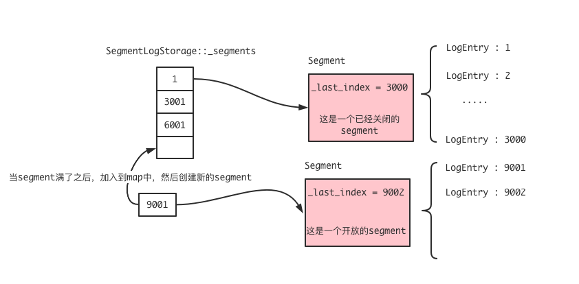
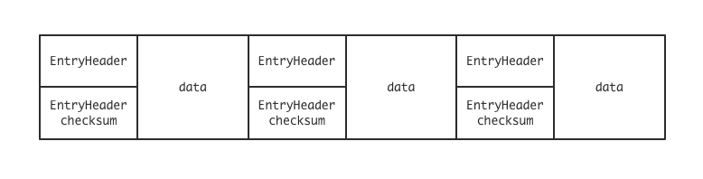
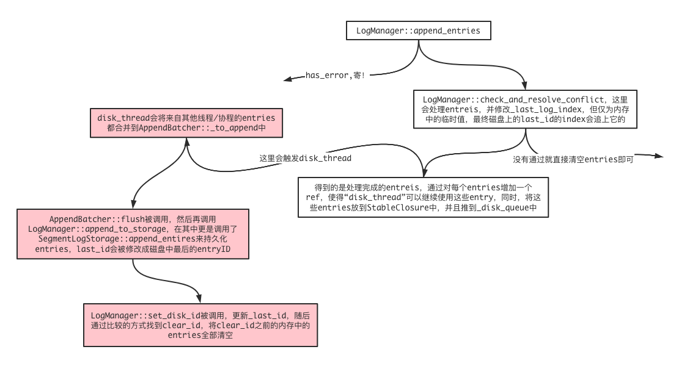

<font face="Monaco">

# braft log 引擎

## 0x00 LogStorage

在braft中，位于src/braft/storage.h中定义了这个LogStorage的抽象类，也就是日志存储引擎的抽象基础了，具体的接口大致有这些：

```cpp
class LogStorage {
public:
    virtual ~LogStorage() {}

    // init logstorage, check consistency and integrity
    virtual int init(ConfigurationManager* configuration_manager) = 0;

    // 第一个日志所处的index
    virtual int64_t first_log_index() = 0;

    // 最后一个日志所处的index
    virtual int64_t last_log_index() = 0;

    // 通过index来获取一个日志条目
    virtual LogEntry* get_entry(const int64_t index) = 0;

    // 通过index来获取一个日志条目被提交时的term
    virtual int64_t get_term(const int64_t index) = 0;

    // 提交一个日志到当前的日志磁盘引擎中
    virtual int append_entry(const LogEntry* entry) = 0;

    // append entries to log and update IOMetric, return append success number 
    virtual int append_entries(const std::vector<LogEntry*>& entries, IOMetric* metric) = 0;

    // delete logs from storage's head, [first_log_index, first_index_kept) will be discarded
    virtual int truncate_prefix(const int64_t first_index_kept) = 0;

    // delete uncommitted logs from storage's tail, (last_index_kept, last_log_index] will be discarded
    virtual int truncate_suffix(const int64_t last_index_kept) = 0;

    // Drop all the existing logs and reset next log index to |next_log_index|.
    // This function is called after installing snapshot from leader
    virtual int reset(const int64_t next_log_index) = 0;

    // Create an instance of this kind of LogStorage with the parameters encoded 
    // in |uri|
    // Return the address referenced to the instance on success, NULL otherwise.
    virtual LogStorage* new_instance(const std::string& uri) const = 0;

    static LogStorage* create(const std::string& uri);

    // GC an instance of this kind of LogStorage with the parameters encoded 
    // in |uri|
    virtual butil::Status gc_instance(const std::string& uri) const {
        CHECK(false) << butil::class_name_str(*this)
                     << " didn't implement gc_instance interface while deleting"
                        " raft log in " << uri;
        butil::Status status;
        status.set_error(ENOSYS, "gc_instance interface is not implemented");
        return status;
    }
    
    static butil::Status destroy(const std::string& uri);
};
```

同样在src/braft下，log.h/log.cpp中的SegmentLogStorage实现了这些接口，不过还需要先看它的一些属性字段：

```cpp
class SegmentLogStorage : public LogStorage {
public:
    typedef std::map<int64_t, scoped_refptr<Segment> > SegmentMap;
private:
    std::string _path;
    butil::atomic<int64_t> _first_log_index;
    butil::atomic<int64_t> _last_log_index;
    raft_mutex_t _mutex;
    SegmentMap _segments;
    scoped_refptr<Segment> _open_segment;
    int _checksum_type;
    bool _enable_sync;
};
```

这个_segments是一个map，指向一个Segment类，由此可见，这个Segment其实就是一段段的日志条目，不过这里我们先看init函数：

```cpp
int SegmentLogStorage::init(ConfigurationManager* configuration_manager) {
    // 路径信息
    butil::FilePath dir_path(_path);
    // ...
    int ret = 0;
    bool is_empty = false;
    do {
        // 加载log_meta的信息
        ret = load_meta();
        if (ret != 0 && errno == ENOENT) {
            LOG(WARNING) << _path << " is empty";
            is_empty = true;
        } else if (ret != 0) {
            break;
        }
        // 建立索引信息
        ret = list_segments(is_empty);
        if (ret != 0) {
            break;
        }
        // 加载信息
        ret = load_segments(configuration_manager);
        if (ret != 0) {
            break;
        }
    } while (0);
    // 如果是空的，那么就从头开始建立索引信息
    if (is_empty) {
        _first_log_index.store(1);
        _last_log_index.store(0);
        ret = save_meta(1);
    }
    return ret;
}
```

这里主要将重点放到list_segments和load_segments中，list_segment的代码：

```cpp
int SegmentLogStorage::list_segments(bool is_empty) {
    butil::DirReaderPosix dir_reader(_path.c_str());
    // 循环遍历所有当前文件夹中的文件
    // restore segment meta
    while (dir_reader.Next()) {
        // 如果检测到是不需要或者说被丢弃的segment文件，那么就直接unlink
        // 也就是不需要将其加载进来
        // unlink unneed segments and unfinished unlinked segments
        if ((is_empty && 0 == strncmp(dir_reader.name(), "log_", strlen("log_"))) ||
            (0 == strncmp(dir_reader.name() + (strlen(dir_reader.name()) - strlen(".tmp")),
                          ".tmp", strlen(".tmp")))) {
            std::string segment_path(_path);
            segment_path.append("/");
            segment_path.append(dir_reader.name());
            ::unlink(segment_path.c_str());
            continue;
        }

        // 否者的话，那么就将其加载到map中，也就是之前说到的_segments字段
        // 并且它的key，也就是当前segment中“第一条”LogEntry的index
        int match = 0;
        int64_t first_index = 0;
        int64_t last_index = 0;
        match = sscanf(dir_reader.name(), BRAFT_SEGMENT_CLOSED_PATTERN, 
                       &first_index, &last_index);
        // 2表示这是一个关闭的segment
        if (match == 2) {
            Segment* segment = new Segment(_path, first_index, last_index, _checksum_type);
            _segments[first_index] = segment;
            continue;
        }

        match = sscanf(dir_reader.name(), BRAFT_SEGMENT_OPEN_PATTERN, 
                       &first_index);
        // 1则表示这是一个开放的segment
        if (match == 1) {
            if (!_open_segment) {
                _open_segment = new Segment(_path, first_index, _checksum_type);
                continue;
            } else {
                return -1;
            }
        }
    }

    // check segment
    // 后面就是关于segment的check部分了，这里略...
    return 0;
}
```

当从磁盘路径中列出了各个segment的文件，并且将其缓存到_segments中后，就需要进行加载操作了：

```cpp
int SegmentLogStorage::load_segments(ConfigurationManager* configuration_manager) {
    int ret = 0;
    // 首当其冲的当然是关闭着的segment，通过对关闭着的segment的遍历
    // 我们可以非常轻松的得到当前log的last_log_index
    // closed segments
    SegmentMap::iterator it;
    for (it = _segments.begin(); it != _segments.end(); ++it) {
        Segment* segment = it->second.get();
        ret = segment->load(configuration_manager);
        if (ret != 0) {
            return ret;
        } 
        _last_log_index.store(segment->last_index(), butil::memory_order_release);
    }
    // 之后就是开放的segment载入了
    // open segment
    if (_open_segment) {
        ret = _open_segment->load(configuration_manager);
        if (ret != 0) {
            return ret;
        }
        // 如果这个开放的segment出现了first_log_index比last_index大的情况
        // 必然发生了错误，就需要丢弃掉，否者的话，当前的last_index就是开放的
        // segment中的last_index了
        if (_first_log_index.load() > _open_segment->last_index()) {
            _open_segment->unlink();
            _open_segment = NULL;
        } else {
            _last_log_index.store(_open_segment->last_index(), 
                                 butil::memory_order_release);
        }
    }
    // 而如果这个last_index是为0，即当前开放的segment中并没有数据，那么
    // last_log_index就是上一个关闭的segment的最后一个，其实也就是
    // 当前first_log_index - 1
    if (_last_log_index == 0) {
        _last_log_index = _first_log_index - 1;
    }
    return 0;
}
```

### 1. mem layout & segment

通过上文的一些源码分析，可以得到segment大致在磁盘中的分布图



甚至可以直接理解为Segment，就是对磁盘读写的抽象，Segment管理着磁盘的数据，可以通过源码看到更为具体的：

```cpp
class BAIDU_CACHELINE_ALIGNMENT Segment 
        : public butil::RefCountedThreadSafe<Segment> {
    std::string _path;          // 当前segment所在的路径
    int64_t _bytes;             // 总共的大小
    int64_t _unsynced_bytes;    // 还没同步到磁盘中的bytes
    mutable raft_mutex_t _mutex;
    int _fd;                    // 打开文件的描述符
    bool _is_open;
    const int64_t _first_index; // 当前segment中第一条日志条目的index
    butil::atomic<int64_t> _last_index; // 最后一个日志条目的index
    int _checksum_type;
    std::vector<std::pair<int64_t/*offset*/, int64_t/*term*/> > _offset_and_term;
};
```

### 2. create

我们可以从create看起：

```cpp
#define BRAFT_SEGMENT_OPEN_PATTERN "log_inprogress_%020" PRId64
int Segment::create() {
    if (!_is_open) {
        return -1;
    }
    std::string path(_path);
    butil::string_appendf(&path, "/" BRAFT_SEGMENT_OPEN_PATTERN, _first_index);
    _fd = ::open(path.c_str(), O_RDWR | O_CREAT | O_TRUNC, 0644);
    if (_fd >= 0) {
        butil::make_close_on_exec(_fd);
    }
    return _fd >= 0 ? 0 : -1;
}
```

总是开启一个“开启的segment”，其命名方式也是以log_inprogress开头并跟随一个first_log_index的数字，总体而言，create只是简单的创建一个文件罢了。

比较经常用到的，便是Segment::append这个函数了，它将一个LogEntry持久化到磁盘中，其代码为：

```cpp
int Segment::append(const LogEntry* entry) {
    // 一些关于文件和entry、和log是否存在空洞的判断
    if (BAIDU_UNLIKELY(!entry || !_is_open)) {
        return EINVAL;
    } else if (entry->id.index != 
                    _last_index.load(butil::memory_order_consume) + 1) {
        return ERANGE;
    }

    // 将需要添加的数据append到data中
    butil::IOBuf data;
    switch (entry->type) {
    case ENTRY_TYPE_DATA:
        data.append(entry->data);
        break;
    case ENTRY_TYPE_NO_OP:
        break;
    case ENTRY_TYPE_CONFIGURATION: 
        {
            butil::Status status = serialize_configuration_meta(entry, data);
            if (!status.ok()) {
                return -1; 
            }
        }
        break;
    default:
        return -1;
    }
    
    // 这里就是进行打包操作了，调整好一个LogEntry的头，然后将其
    // 放到header中，并且将header和data一同写入到_fd中
    char header_buf[ENTRY_HEADER_SIZE];
    const uint32_t meta_field = (entry->type << 24 ) | (_checksum_type << 16);
    RawPacker packer(header_buf);
    packer.pack64(entry->id.term)
          .pack32(meta_field)
          .pack32((uint32_t)data.length())
          .pack32(get_checksum(_checksum_type, data));
    packer.pack32(get_checksum(
                  _checksum_type, header_buf, ENTRY_HEADER_SIZE - 4));
    butil::IOBuf header;
    header.append(header_buf, ENTRY_HEADER_SIZE);
    const size_t to_write = header.length() + data.length();
    butil::IOBuf* pieces[2] = { &header, &data };
    size_t start = 0;
    ssize_t written = 0;
    while (written < (ssize_t)to_write) {
        const ssize_t n = butil::IOBuf::cut_multiple_into_file_descriptor(
                _fd, pieces + start, ARRAY_SIZE(pieces) - start);
        if (n < 0) {
            return -1;
        }
        written += n;
        for (;start < ARRAY_SIZE(pieces) && pieces[start]->empty(); ++start) {}
    }
    BAIDU_SCOPED_LOCK(_mutex);
    _offset_and_term.push_back(std::make_pair(_bytes, entry->id.term));
    _last_index.fetch_add(1, butil::memory_order_relaxed);
    _bytes += to_write;
    _unsynced_bytes += to_write;
    return 0;
}
```

### 3. Segment EntryHeader

每个Entry的Header结构体为：

```cpp
const static size_t ENTRY_HEADER_SIZE = 24;

struct Segment::EntryHeader {
    int64_t term;               // 当前LogEntry的term
    int type;
    int checksum_type;
    uint32_t data_len;          // data的长度
    uint32_t data_checksum;
};
// 在EntryHeader的屁股后面还跟着一个32bit的EntryHeader checksum
```

所以它的内存结构大概就是这种：



### 4. Segment load

load是从磁盘的segment中获得对应的数据，代码比较常规，分别一个个的从磁盘中获取entry，如果entry还未写完，直接丢弃，否者仅仅缓存_offset_and_term的信息，并不会直接将data直接缓存至内存中。

随后更新了_last_index，并且，只有当前的Segment是open的，才会将文件seek到末尾，为了之后的写入做准备。

### 5. Segment get & get_term

get通过一个index来获取对应的LogEntry，这个操作会使得磁盘中的数据重新加载到内存中：

```cpp
LogEntry* Segment::get(const int64_t index) const {
    LogMeta meta;
    if (_get_meta(index, &meta) != 0) {
        return NULL;
    }
    bool ok = true;
    LogEntry* entry = NULL;
    do {
        ConfigurationPBMeta configuration_meta;
        EntryHeader header;
        butil::IOBuf data;
        if (_load_entry(meta.offset, &header, &data, 
                        meta.length) != 0) {
            ok = false;
            break;
        }
        CHECK_EQ(meta.term, header.term);
        entry = new LogEntry();
        entry->AddRef();
        switch (header.type) {
        case ENTRY_TYPE_DATA:
            entry->data.swap(data);
            break;
        case ENTRY_TYPE_NO_OP:
            break;
        case ENTRY_TYPE_CONFIGURATION:
            {
                butil::Status status = parse_configuration_meta(data, entry); 
                if (!status.ok()) {
                    ok = false;
                    break;
                }
            }
            break;
        default:
            break;
        }

        if (!ok) { 
            break;
        }
        entry->id.index = index;
        entry->id.term = header.term;
        entry->type = (EntryType)header.type;
    } while (0);

    if (!ok && entry != NULL) {
        entry->Release();
        entry = NULL;
    }
    return entry;
}
```

get_term则相对简单，直接通过_offset_and_term来获取对应index的任期即可，速度比较快：

```cpp
int64_t Segment::get_term(const int64_t index) const {
    LogMeta meta;
    if (_get_meta(index, &meta) != 0) {
        return 0;
    }
    return meta.term;
}
```

### 6. Segment close

close表示将一个Segment从open移为close：

```cpp
int Segment::close(bool will_sync) {
    std::string old_path(_path);
    butil::string_appendf(&old_path, "/" BRAFT_SEGMENT_OPEN_PATTERN,
                         _first_index);
    std::string new_path(_path);
    butil::string_appendf(&new_path, "/" BRAFT_SEGMENT_CLOSED_PATTERN, 
                         _first_index, _last_index.load());
    int ret = 0;
    if (_last_index > _first_index) {
        if (FLAGS_raft_sync_segments && will_sync) {
            ret = raft_fsync(_fd);
        }
    }
    if (ret == 0) {
        _is_open = false;
        const int rc = ::rename(old_path.c_str(), new_path.c_str());
        return rc;
    }
    return ret;
}
```

同时它也需要将文件重新命名，将一个open的inprogress的名字改成一个close的名字。

### 7. SegmentLogStorage open_segment

现在回到SegmentLogStorage中，这种分段式的Segment存储方式和日志文件的存储非常相像，都需要进行文件的滚动，日志文件大部分都是通过文件大小或者时间来进行判断是否需要进行滚动。

在braft的Log引擎管理中，使用的是文件大小，为8 * 1024 * 1024即8M，具体操作就在open_segment这个操作中：

```cpp
scoped_refptr<Segment> SegmentLogStorage::open_segment() {
    scoped_refptr<Segment> prev_open_segment;
    // 首先通过判断当前的_open_segment是否是nullptr，如果是，那么就代表
    // 没有存在一个“open”的Segment，那么我们只需要创建一个新的即可，同时
    // 如果上一个Segment是满的，那么也是需要进行创建新的，只不过不同的是需
    // 要将“上一个Segment”同prev_open_segment进行swap
    {
        BAIDU_SCOPED_LOCK(_mutex);
        if (!_open_segment) {
            _open_segment = new Segment(_path, last_log_index() + 1, _checksum_type);
            if (_open_segment->create() != 0) {
                _open_segment = NULL;
                return NULL;
            }
        }
        if (_open_segment->bytes() > FLAGS_raft_max_segment_size) {
            _segments[_open_segment->first_index()] = _open_segment;
            prev_open_segment.swap(_open_segment);
        }
    }
    do {
        if (prev_open_segment) {
            if (prev_open_segment->close(_enable_sync) == 0) {
                BAIDU_SCOPED_LOCK(_mutex);
                _open_segment = new Segment(_path, last_log_index() + 1, _checksum_type);
                if (_open_segment->create() == 0) {
                    // success
                    break;
                }
            }
            // Failed, revert former changes
            BAIDU_SCOPED_LOCK(_mutex);
            _segments.erase(prev_open_segment->first_index());
            _open_segment.swap(prev_open_segment);
            return NULL;
        }
    } while (0); // ?
    return _open_segment;
}
```

### 8. SegmentLogStorage append_entries

至此就到了整个磁盘抽象的SegmentLogStorage::append_entries中了，它可以批量的将entries添加到对应的磁盘中，并且返回成功添加到磁盘中的entry数量：

```cpp
// 去掉记录的代码
int SegmentLogStorage::append_entries(const std::vector<LogEntry*>& entries, IOMetric* metric) {
    if (entries.empty()) {
        return 0;
    }
    // 判断是否存在一些日志空隙问题
    if (_last_log_index.load(butil::memory_order_relaxed) + 1
            != entries.front()->id.index) {
        return -1;
    }
    scoped_refptr<Segment> last_segment = NULL;
    // 遍历entries中的每个条目
    for (size_t i = 0; i < entries.size(); i++) {
        now = butil::cpuwide_time_us();
        LogEntry* entry = entries[i];
        
        scoped_refptr<Segment> segment = open_segment();
        if (NULL == segment) {
            return i;
        }
        int ret = segment->append(entry);
        if (0 != ret) {
            return i;
        }
        _last_log_index.fetch_add(1, butil::memory_order_release);
        last_segment = segment;
    }
    last_segment->sync(_enable_sync);
    return entries.size();
}
```

并且在最后总是会调用一下同步，确保哪些数据已经落地到磁盘中，随后才会返回。


### 9. SegmentLogStorage truncate_prefix

SegmentLogStroage的截断是由LogManager中的截断来调用的，LogManager先通过去截断它可以控制的_logs_in_memory的数据，然后才阶段已持久化的数据。

```cpp
int SegmentLogStorage::truncate_prefix(const int64_t first_index_kept) {
    // 如果当前所保存的LogEntry已经大于想要截断的最大index了，那么就没必要截了
    // 造成这种原因的可能之一就是快照导致的日志压缩
    if (_first_log_index.load(butil::memory_order_acquire) >= first_index_kept) {
        return 0;
    }
    // NOTE: truncate_prefix is not important, as it has nothing to do with 
    // consensus. We try to save meta on the disk first to make sure even if
    // the deleting fails or the process crashes (which is unlikely to happen).
    // The new process would see the latest `first_log_index'
    if (save_meta(first_index_kept) != 0) { // NOTE
        return -1;
    }
    // popped的保存的是需要进行截断的日志，在pop_segments中会进行判断，如果
    // first_index_kept大于segment中的last_index，那么整个segment都会被
    // 删除，反之不一定，也就是说可能存在first_index_kept处于segment中间，
    // 但这个segment却不会被删除，其原因在上面的官方注释也有体现。
    std::vector<scoped_refptr<Segment> > popped;
    pop_segments(first_index_kept, &popped);
    for (size_t i = 0; i < popped.size(); ++i) {
        popped[i]->unlink();
        popped[i] = NULL;
    }
    return 0;
}
```


## 0x01 LogManager 

LogManager是一个管理全部Log的类。

### 1. LogManager append_entries

这里先通过append_entries来观察整个添加entries的过程：

```cpp
void LogManager::append_entries(
            std::vector<LogEntry*> *entries, StableClosure* done) {
    CHECK(done);
    // 错误处理
    if (_has_error.load(butil::memory_order_relaxed)) {
        for (size_t i = 0; i < entries->size(); ++i) {
            (*entries)[i]->Release();
        }
        entries->clear();
        done->status().set_error(EIO, "Corrupted LogStorage");
        return run_closure_in_bthread(done);
    }
    // 锁，保护临界区，特别是对logs会进行修改的，比如truncate_xxx的函数
    std::unique_lock<raft_mutex_t> lck(_mutex);
    // 处理冲突
    if (!entries->empty() && check_and_resolve_conflict(entries, done) != 0) {
        lck.unlock();
        // release entries
        for (size_t i = 0; i < entries->size(); ++i) {
            (*entries)[i]->Release();
        }
        entries->clear();
        return;
    }
    for (size_t i = 0; i < entries->size(); ++i) {
        // Add ref for disk_thread
        (*entries)[i]->AddRef();
        if ((*entries)[i]->type == ENTRY_TYPE_CONFIGURATION) {
            ConfigurationEntry conf_entry(*((*entries)[i]));
            _config_manager->add(conf_entry);
        }
    }
    // 没有冲突的话，就会将其先添加到内存的log中
    if (!entries->empty()) {
        done->_first_log_index = entries->front()->id.index;
        _logs_in_memory.insert(_logs_in_memory.end(), entries->begin(), entries->end());
    }
    // 然后等待disk_thread将这些数据整合到一起，也就是这些enties
    done->_entries.swap(*entries);
    int ret = bthread::execution_queue_execute(_disk_queue, done);
    CHECK_EQ(0, ret) << "execq execute failed, ret: " << ret << " err: " << berror();
    wakeup_all_waiter(lck);
}
```

### 2. LogManager append_to_storage

在disk_thread中，基本做的就是整合操作，通过AppendBatcher将所有的Closure中的_enteis整合到一个vector中，然后再通过调用私有函数LogManager::append_to_storage将数据从内存添加到磁盘中去：

```cpp
void LogManager::append_to_storage(std::vector<LogEntry*>* to_append, 
                                   LogId* last_id, IOMetric* metric) {
    if (!_has_error.load(butil::memory_order_relaxed)) {
        // 这里就是写磁盘了
        int nappent = _log_storage->append_entries(*to_append, metric);
       // 入股写到磁盘中的数量和预计写的数量不同，那么必然发生了一些错误
        if (nappent != (int)to_append->size()) {
            // FIXME
            report_error(EIO, "Fail to append entries");
        }
        // 更新当前的last_id
        if (nappent > 0) { 
            *last_id = (*to_append)[nappent - 1]->id;
        }
    }
    for (size_t j = 0; j < to_append->size(); ++j) {
        (*to_append)[j]->Release();
    }
    to_append->clear();
}
```

在disk_thread的最后有一个：

```cpp
log_manager->set_disk_id(last_id);
```

来设置磁盘中“最后/最新”的LogEntry所在，而这个set_disk_id:

```cpp
void LogManager::set_disk_id(const LogId& disk_id) {
    std::unique_lock<raft_mutex_t> lck(_mutex);  // Race with set_applied_id
    if (disk_id < _disk_id) {
        return;
    }
    _disk_id = disk_id;
    LogId clear_id = std::min(_disk_id, _applied_id);
    lck.unlock();
    return clear_memory_logs(clear_id);
}
// set_applied_id和set_disk_id原理基本一致
void LogManager::set_applied_id(const LogId& applied_id) {
    std::unique_lock<raft_mutex_t> lck(_mutex);  // Race with set_disk_id
    if (applied_id < _applied_id) {
        return;
    }
    _applied_id = applied_id;
    LogId clear_id = std::min(_disk_id, _applied_id);
    lck.unlock();
    return clear_memory_logs(clear_id);
}
```

会通过计算_disk_id和_applied_id来判断该从哪里截断这些内存中的LogEntry以释放内存(索引低
于clear_id的LogEntry都已保存到磁盘中/或者在snapshot中了，可以去掉)：

```cpp
void LogManager::clear_memory_logs(const LogId& id) {
    LogEntry* entries_to_clear[256];
    size_t nentries = 0;
    do {
        nentries = 0;
        {
            BAIDU_SCOPED_LOCK(_mutex);
            while (!_logs_in_memory.empty() 
                    && nentries < ARRAY_SIZE(entries_to_clear)) {
                LogEntry* entry = _logs_in_memory.front();
                if (entry->id > id) {
                    break;
                }
                // 这里就是保存需要去掉的LogEntry，然后在后面通过
                // Release的方式来释放内存
                entries_to_clear[nentries++] = entry;
                _logs_in_memory.pop_front();
            }
        }  // out of _mutex
        for (size_t i = 0; i < nentries; ++i) {
            entries_to_clear[i]->Release();
        }
    } while (nentries == ARRAY_SIZE(entries_to_clear));
}
```

### 3. LogManager check_and_resolve_conflict

冲突问题上，check_and_resolve_conflict会去掉冲突的日志条目部分：

```cpp
int LogManager::check_and_resolve_conflict(
            std::vector<LogEntry*> *entries, StableClosure* done) {
    AsyncClosureGuard done_guard(done); 
    // 这里会出现2种情况，第一种是属于Leader身份所进行的append_entries，这样
    // 的话在id.index中并不会标明具体是多少，而是会直接设置为0，那么其index会
    // 在当前的函数中算出，然后直接返回  
    if (entries->front()->id.index == 0) {
        // Node is currently the leader and |entries| are from the user who 
        // don't know the correct indexes the logs should assign to. So we have
        // to assign indexes to the appending entries
        for (size_t i = 0; i < entries->size(); ++i) {
            (*entries)[i]->id.index = ++_last_log_index;
        }
        done_guard.release();
        return 0;
    } else {
        // 如果当前节点是Follower，那么append_entries是来自Leader发送的
        // 日志同步，那就需要和本地已有的日志条目进行比对，以确保没有冲突
        // Node is currently a follower and |entries| are from the leader. We 
        // should check and resolve the confliction between the local logs and
        // |entries|
        // 正常情况，新的log_index应该等于_last_log_index，如果大于，则会
        // 发生日志空洞
        if (entries->front()->id.index > _last_log_index + 1) {
            return -1;
        }
        // 这种情况有可能是此appendEntries信息在网络中停留过久导致的
        const int64_t applied_index = _applied_id.index;
        if (entries->back()->id.index <= applied_index) {
            return 1;
        }

        if (entries->front()->id.index == _last_log_index + 1) {
            // Fast path
            _last_log_index = entries->back()->id.index;
        } else {
            // 这里发生的冲突是重叠，那么从“entries”起始位置开始计算，找出重叠部分
            // 中和原先的LogEntry是否一样，如果一样，则可以添加到其中，同时将重叠的
            // 部分去掉，只保留未重叠的“需要”添加的Entry
            // Appending entries overlap the local ones. We should find if there
            // is a conflicting index from which we should truncate the local
            // ones.
            size_t conflicting_index = 0;
            for (; conflicting_index < entries->size(); ++conflicting_index) {
                if (unsafe_get_term((*entries)[conflicting_index]->id.index)
                        != (*entries)[conflicting_index]->id.term) {
                    break;
                }
            }
            if (conflicting_index != entries->size()) {
                if ((*entries)[conflicting_index]->id.index <= _last_log_index) {
                    // Truncate all the conflicting entries to make local logs
                    // consensus with the leader.
                    unsafe_truncate_suffix(
                            (*entries)[conflicting_index]->id.index - 1);
                }
                _last_log_index = entries->back()->id.index;
            }  // else this is a duplicated AppendEntriesRequest, we have 
               // nothing to do besides releasing all the entries
            
            // Release all the entries before the conflicting_index and the rest
            // would be append to _logs_in_memory and _log_storage after this
            // function returns
            for (size_t i = 0; i < conflicting_index; ++i) {
                (*entries)[i]->Release();
            }
            entries->erase(entries->begin(), 
                           entries->begin() + conflicting_index);
        }
        done_guard.release();
        return 0;
    }
    CHECK(false) << "Can't reach here";
    done->status().set_error(EIO, "Impossible");
    return -1;
}
```

所以check_and_reslove_conflict是会进行entries的修改，同时会改变_last_log_index为entries中的最后一个index，但此_last_log_index仅仅是LogManager内存中的字段，在SegmentLogStorage中也有一个_last_log_index，它是经过持久化的字段。

最后，append_entries的大致流程就是：



### 4. LogManager truncate_prefix

truncate_prefix是删除操作，它将`[1, first_index_kept)`的logs删除掉，一般使用在日志压缩上，truncate_prefix是运行在锁中的(第二参数lck)，为了避免直接释放内存而导致的性能下降，所以才将所有logs先添加至saved_logs_in_memory中，并在解锁后才进行ref减少以释放内存。

这些对`_logs_in_memory`的修改都是在`_mutex`的保护下进行的。

```cpp
int LogManager::truncate_prefix(const int64_t first_index_kept,
                                std::unique_lock<raft_mutex_t>& lck) {
    std::deque<LogEntry*> saved_logs_in_memory;
    // As the duration between two snapshot (which leads to truncate_prefix at
    // last) is likely to be a long period, _logs_in_memory is likely to
    // contain a large amount of logs to release, which holds the mutex so that
    // all the replicator/application are blocked.
    // FIXME(chenzhangyi01): to resolve this issue, we have to build a data
    // structure which is able to pop_front/pop_back N elements into another
    // container in O(1) time, one solution is a segmented double-linked list
    // along with a bounded queue as the indexer, of which the payoff is that
    // _logs_in_memory has to be bounded.
    while (!_logs_in_memory.empty()) {
        LogEntry* entry = _logs_in_memory.front();
        if (entry->id.index < first_index_kept) {
            saved_logs_in_memory.push_back(entry);
            _logs_in_memory.pop_front();
        } else {
            break;
        }
    }
    CHECK_GE(first_index_kept, _first_log_index);
    _first_log_index = first_index_kept;
    if (first_index_kept > _last_log_index) {
        // The entrie log is dropped
        _last_log_index = first_index_kept - 1;
    }
    _config_manager->truncate_prefix(first_index_kept);
    TruncatePrefixClosure* c = new TruncatePrefixClosure(first_index_kept);
    // 将截断操作推到_disk_queue中，将由disk_thread来进行操作
    const int rc = bthread::execution_queue_execute(_disk_queue, c);
    lck.unlock();
    for (size_t i = 0; i < saved_logs_in_memory.size(); ++i) {
        saved_logs_in_memory[i]->Release();
    }
    return rc;
}
```

在disk_thread里：

```cpp
TruncatePrefixClosure* tpc = 
                        dynamic_cast<TruncatePrefixClosure*>(done);
if (tpc) {
    ret = log_manager->_log_storage->truncate_prefix(
                    tpc->first_index_kept());
    break;
}
```

一旦检测到拿到了“截断”的指令，那么就调用SegmentLogStroage的截断操作。

### 5. LogManager last_log_index & last_log_id

这两个函数都直接传入了参数false，标明根本就不需要等待持久化，直接看到的是内存中的值：

```cpp
int64_t last_log_index(bool is_flush = false);
LogId last_log_id(bool is_flush = false);
```


</font>