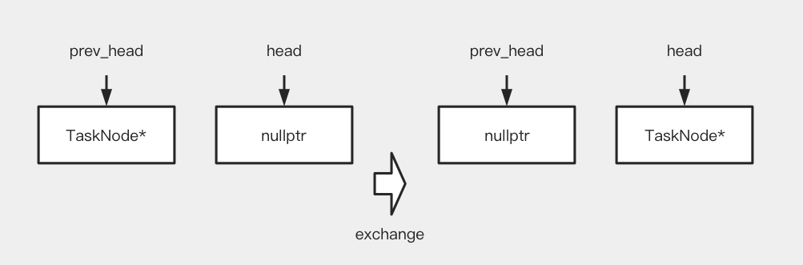
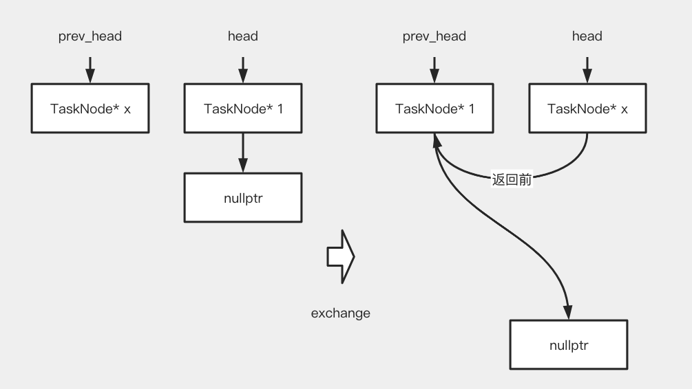
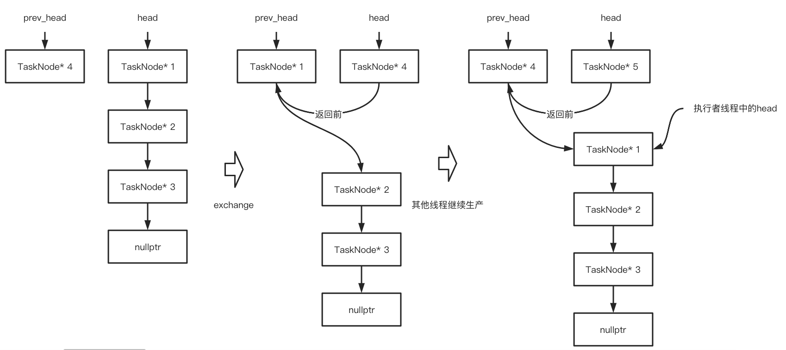

<font face="Monaco">

# brpc execution_queue

## 0x00 启动

启动代码位于src/bthread/execution_queue.h中，定义在execution_queue_in.h中(template分开写法)。

其中id是用于返回的，而`execute`就是类似一个线程的启动函数，每当这个执行队列中收到可执行的任务，都会在`execute`函数的逻辑中执行。

```cpp
template <typename T>
inline int execution_queue_start(
        ExecutionQueueId<T>* id, 
        const ExecutionQueueOptions* options,
        int (*execute)(void* meta, TaskIterator<T>&),
        void* meta) {
   return ExecutionQueue<T>::create(id, options, execute, meta);
}
```

最终会执行到`ExecutionQueueBase::create`的代码，通过对象池获取一个`ExecutionQueueBase`的对象，做一些简单的赋值操作后，就将会返回，主要是这个id。

```cpp
int ExecutionQueueBase::create(uint64_t* id, const ExecutionQueueOptions* options,
                               execute_func_t execute_func,
                               clear_task_mem clear_func,
                               void* meta, void* type_specific_function) {
    if (execute_func == NULL || clear_func == NULL) {
        return EINVAL;
    }

    slot_id_t slot;
    ExecutionQueueBase* const m = butil::get_resource(&slot, Forbidden());
    if (BAIDU_LIKELY(m != NULL)) {
        m->_execute_func = execute_func;
        m->_clear_func = clear_func;
        m->_meta = meta;
        m->_type_specific_function = type_specific_function;
        CHECK(m->_head.load(butil::memory_order_relaxed) == NULL);
        CHECK_EQ(0, m->_high_priority_tasks.load(butil::memory_order_relaxed));
        ExecutionQueueOptions opt;
        if (options != NULL) {
            opt = *options;   
        }
        m->_options = opt;
        m->_stopped.store(false, butil::memory_order_relaxed);
        m->_this_id = make_id(
                _version_of_vref(m->_versioned_ref.fetch_add(
                                    1, butil::memory_order_release)), slot);
        *id = m->_this_id;
        get_execq_vars()->execq_count << 1;
        return 0;
    }
    return ENOMEM;
}
```

例如braft中`NodeImpl::init`的初始化方式，主要需要获取的就是这个`_apply_queue_id`，传入的函数是`execute_applying_tasks`，它接受一个参数this，因为这个函数是NodeImpl中的成员函数。

```cpp
if (bthread::execution_queue_start(&_apply_queue_id, NULL,
                                   execute_applying_tasks, this) != 0) {
    LOG(ERROR) << "node " << _group_id << ":" << _server_id 
        << " fail to start execution_queue";
    return -1;
}
_apply_queue = execution_queue_address(_apply_queue_id)
```

## 0x01 加入TaskNode

这个执行队列的实现是在`ExecutionQueueBase`这个类里，里面有一些比较有意思的成员属性，这个`_head`是一个`TaskNode*`类型的头，是一个单向队列，看到这里已经不难想象，这是想做出一个单消费者多生产者的wait-free的单向链表了。

```cpp
butil::atomic<TaskNode*> BAIDU_CACHELINE_ALIGNMENT _head;
execute_func_t _execute_func;
void* _meta;
```

从`start_execute`中看起就可以明白这种wait-free单向链表是如何运作的了，首先是进行一个交换的操作，如果__head原先是nullptr，那么交换的结果将是这样的__：



交换后的结果中，prev_head将会是nullptr，所以可以得知当前的线程会 __是第一个添加节点的线程，所以它需要承担起运行这些Task的任务__。

而如果head中本来就有内容了，那么结果就是本线程可以很快返回，因为已经有一个线程在做__执行者__这个角色了，本线程在返回前，只需要链上这个链表即可。



当然，如果执行者线程来不及消费这些TaskNode，而生产者过多，就会导致TaskNode原来越多，随后形成一条链表，就想这样子： 



这就导致了一些问题，比如执行者在将TaskNode执行至nullptr之前，它的顺序都是正确的，而一旦执行结束，回头就可以看到是先`TaskNode5`，然后才是`TaskNode4`，这种顺序并不是程序员所期望的。

尽管如此，这种设计方式使得生产者可以快速返回，不会进行多次尝试即可，是wait-free的，压力一般在执行者线程上，如果得到执行权限，执行者线程就会起一个bthread来运行`_execute_tasks`。

```cpp
void ExecutionQueueBase::start_execute(TaskNode* node) {
    node->next = TaskNode::UNCONNECTED;
    node->status = UNEXECUTED;
    node->iterated = false;
    TaskNode* const prev_head = _head.exchange(node, butil::memory_order_release);
    if (prev_head != NULL) {
        node->next = prev_head;
        return;
    }
    // Get the right to execute the task, start a bthread to avoid deadlock
    // or stack overflow
    node->next = NULL;
    node->q = this;

    bthread_t tid;
    // We start the execution thread in background instead of foreground as
    // we can't determine whether the code after execute() is urgent (like
    // unlock a pthread_mutex_t) in which case implicit context switch may
    // cause undefined behavior (e.g. deadlock)
    if (bthread_start_background(&tid, &_options.bthread_attr,
                                 _execute_tasks, node) != 0) {
        _execute_tasks(node);
    }
}
```

在`_execute_tasks`中，先是对head判断是否有经历过迭代，如果有，那么这个节点就可以直接回收了(已经运行过了)，否则就运行`_execute`，在`_execute`内部，会将head作为迭代器的一个头，然后调用一开始传入的用户回调，一般而言，在用户回调函数中都会进行迭代器的迭代，所以等到这个`_execute`返回后，我们就会发现从 __head开始到nullptr的这段距离上的Task都应该被运行过了__。

当`_execute`返回后的while循环，为的就是回收这些已经被运行过的TaskNode，直到最后一个TaskNode或者最后一个未运行的TaskNode，然后在`_more_tasks`函数中进行链表反转操作，从而将__最后一个TaskNode作为头，而由其他线程新添加进来的TaskNode被发转后顺序也将是正确的，从而进行下一轮迭代运行__。

```cpp
void* ExecutionQueueBase::_execute_tasks(void* arg) {
    TaskNode* head = (TaskNode*)arg;
    ExecutionQueueBase* m = (ExecutionQueueBase*)head->q;
    TaskNode* cur_tail = NULL;
    bool destroy_queue = false;
    for (;;) {
        if (head->iterated) {
            CHECK(head->next != NULL);
            TaskNode* saved_head = head;
            head = head->next;
            m->return_task_node(saved_head);
        }
        int rc = 0;
        if (m->_high_priority_tasks.load(butil::memory_order_relaxed) > 0) {
        	// 先不讨论具有优先级别的Node
        } else {
            rc = m->_execute(head, false, NULL);
        }
        if (rc == ESTOP) {
            destroy_queue = true;
        }
        // Release TaskNode until uniterated task or last task
        while (head->next != NULL && head->iterated) {
            TaskNode* saved_head = head;
            head = head->next;
            m->return_task_node(saved_head);
        }
        if (cur_tail == NULL) {
            for (cur_tail = head; cur_tail->next != NULL; 
                    cur_tail = cur_tail->next) {}
        }
        // break when no more tasks and head has been executed
        if (!m->_more_tasks(cur_tail, &cur_tail, !head->iterated)) {
            CHECK_EQ(cur_tail, head);
            CHECK(head->iterated);
            m->return_task_node(head);
            break;
        }
        // 略...
    }
    return NULL;
}
```

当然，如果没有任何TaskNode的，当前的bthread就会结束退出，当下一次有任务来的时候，第一进行添加的线程就会承担起__启动执行者线程__这个任务的使命。

TODO:

</font>