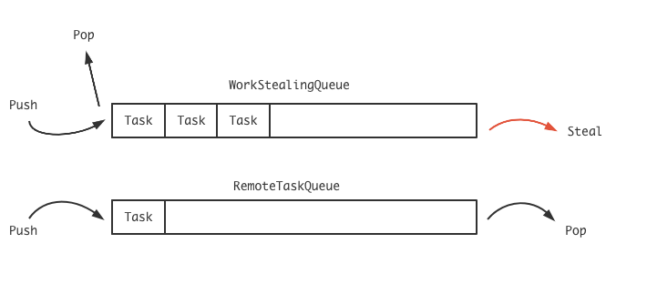

<font face="Monaco">

# brpc bthread

## 0x00 总体架构

bthread在管理上，有3个类非常重要，分别是全局的TaskControl，线程局部的TaskGroup，每个运行上下文(协程)TaskMeta。

 ### TaskControl
 
 TaskControl由get_or_new_task_control来创建：
 
 ```cpp
 inline TaskControl* get_or_new_task_control() {
    butil::atomic<TaskControl*>* p = (butil::atomic<TaskControl*>*)&g_task_control;
    TaskControl* c = p->load(butil::memory_order_consume);
    if ( c != NULL ) {
        return c;
    }
    c = new (std::nothrow)TaskControl;
    if ( NULL == c ) {
        return NULL;
    }
    int concurrency = ... // 设定pthread的线程数量
    if ( c->init(concurrency) != 0 ) {
        // handle error...
    }
    p->store(c, butil::memory_order_release);
    return c;
 }
 ```
 
 在看init初始化代码之前，可以先看一下TaskControl中目前可以关注的几个重点属性：
 
 ```cpp
 class TaskControl {
 private:
    
    butil::atomic<size_t> _ngroup; // group数量
    TaskGroup** _groups;
    butil::Mutex _modify_group_mutex;
 
    butil::atomic<int> _concurrency; // pthread的数量
    std::vector<pthread_t> _workers; // pthread id
    
 };
 ```
 
 然后就是TaskControl的初始化了：
 
 ```cpp
 int TaskControl::init(int concurrency) {
    // ...

    // Make sure TimerThread is ready.
    if (get_or_create_global_timer_thread() == NULL) {
        LOG(ERROR) << "Fail to get global_timer_thread";
        return -1;
    }
    
    // 设定worker，然后创建pthread，每个worker都事先运行在worker_thread上
    // worker_thread会做线程后的一些操作，它传入this指针(TaskControl*)
    _workers.resize(_concurrency);   
    for (int i = 0; i < _concurrency; ++i) {
        const int rc = pthread_create(&_workers[i], NULL, worker_thread, this);
        if (rc) {
            LOG(ERROR) << "Fail to create _workers[" << i << "], " << berror(rc);
            return -1;
        }
    }
    // ...

    // Wait for at least one group is added so that choose_one_group()
    // never returns NULL.
    // TODO: Handle the case that worker quits before add_group
    while (_ngroup == 0) {
        usleep(100);  // TODO: Elaborate
    }
    return 0;
}
 ```
 
 ```cpp
 void* TaskControl::worker_thread(void* arg) {
    run_worker_startfn();    // 启动前的“回调”
    // ...
    
    TaskControl* c = static_cast<TaskControl*>(arg);
    TaskGroup* g = c->create_group(); // 创建当前线程的TaskGroup
    TaskStatistics stat;
    if (NULL == g) {
        LOG(ERROR) << "Fail to create TaskGroup in pthread=" << pthread_self();
        return NULL;
    }
    // tls_task_group是一个线程局部变量
    tls_task_group = g;
    // 这里才是进入线程内部的调度
    g->run_main_task();
    // 如果run_main_task结束，那也就意味着当前worker已经要准备退出了
    stat = g->main_stat();
    BT_VLOG << "Destroying worker=" << pthread_self() << " bthread="
            << g->main_tid() << " idle=" << stat.cputime_ns / 1000000.0
            << "ms uptime=" << g->current_uptime_ns() / 1000000.0 << "ms";
    tls_task_group = NULL;
    g->destroy_self();
    c->_nworkers << -1;
    return NULL;
}
 ```
 
 ### TaskGroup
 
 从g->run_main_task开始进入TaskGroup的地盘了，其函数和TaskGroup中需要关注的比较中要的属性：
 
 ```cpp
 void TaskGroup::run_main_task() {
    // ...
    TaskGroup* dummy = this;
    bthread_t tid;
    // wait_task等待一个协程，如果获取到，那么就调用sched_to跳转过去
    // 一旦sched_to返回，那么_cur_meta->stack必然就是_main_stack，
    // 也就是“主协程”的stack。
    while (wait_task(&tid)) {
        TaskGroup::sched_to(&dummy, tid);
        DCHECK_EQ(this, dummy);
        DCHECK_EQ(_cur_meta->stack, _main_stack);
        if (_cur_meta->tid != _main_tid) {
            TaskGroup::task_runner(1/*skip remained*/);
        }
        // ...
    }
    // 去掉一些记录的函数...
}
 ```
 
 ```cpp
 class TaskGroup {
 private:
    TaskMeta* _cur_meta; // 当前正在运行的协程
    TaskControl* _control;
    
    ContextualStack* _main_stack; // 主协程的栈
    bthread_t _main_tid; // 主协程tid
    WorkStealingQueue<bthread_t> _rq;
    RemoteTaskQueue _remote_rq;
 };
 ```
 
在每个TaskGroup中，有2个队列，它用来存放和协程的任务，在brpc中存放的是bthread_id，其实也就是根据bthread_id的低32bit可以到resource_pool中拿到相应的address，两个队列分别是WorkStealingQueue和RemoteTaskQueue，rq(WorkStealingQueue)所存放的，是当前pthread生成的bthread，remote_rq则是其他pthread生成的：
 

 
它的放入顺序是这样的，__在bthread_start_background中，任务(协程)一开始是被推入到rq(WorkStealingQueue)中，如果当前的pthread中没有生成TaskGroup，那么就会随机选择一个其他pthread的TaskGroup，然后推到它的remote_rq中__。

run_main_task作为一个pthread被初始化时会被运行的函数，它本身就通过wait_task(&tid)来去取任务来运行，在wait_task中：
 
 ```cpp
 bool TaskGroup::wait_task(bthread_id* tid) {
    do {
        if (_last_pl_state.stopped()) { // 先不管
            return false;
        }
        _pl->wait(_last_pl_state);
        if (steal_task(tid)){
            return true;
        }
    }while (true);
 }
 ```
 
 它总是去“窃取”任务，从哪里窃取呢？
 
 ```cpp
 bool steal_task(bthread_id* tid) {
    if (_remote_rq.pop(tid)) {
        return true;
    }
    // ...
    return _control->steal_task(tid, &_steal_seed, _steal_offset);
 }
 ```
 
 先从本地(这里的本地指当前TaskGroup)的remote_rq中获取，如果没有，再去全局中窃取：
 
 ```cpp
 bool TaskControl::steal_task(bthread_t* tid, size_t* seed, size_t offset) {
    // 1: Acquiring fence is paired with releasing fence in _add_group to
    // avoid accessing uninitialized slot of _groups.
    const size_t ngroup = _ngroup.load(butil::memory_order_acquire/*1*/);
    if (0 == ngroup) {
        return false;
    }

    // NOTE: Don't return inside `for' iteration since we need to update |seed|
    bool stolen = false;
    size_t s = *seed;
    for (size_t i = 0; i < ngroup; ++i, s += offset) {
        TaskGroup* g = _groups[s % ngroup];
        // g is possibly NULL because of concurrent _destroy_group
        if (g) {
            if (g->_rq.steal(tid)) {
                stolen = true;
                break;
            }
            if (g->_remote_rq.pop(tid)) {
                stolen = true;
                break;
            }
        }
    }
    *seed = s;
    return stolen;
}
```

在全局的窃取顺序中，是先从对方的“rq”线程中获取，然后才是对方的“remote_rq”，而这个“对方”是随机的，所以就可以得出wait_task的窃取流程了：

> 1. 从本地的remote_rq中获取

> 2. 从一个随机远程的rq中窃取

> 3. 从一个随机远程的remote_rq中获取

一旦wait_task获得一个bthread，那么就调用TaskGroup::sched_to：

```cpp
inline void TaskGroup::sched_to(TaskGroup** pg, bthread_t next_tid) {
    TaskMeta* next_meta = address_meta(next_tid);
    // 如果一个TaskMeta是第一次运行，那么它可能没有栈，所以需要获取栈
    // 或者说是创建一个运行的上下文，它的入口总是task_runner
    if (next_meta->stack == NULL) {
        ContextualStack* stk = get_stack(next_meta->stack_type(), task_runner);
        if (stk) {
            next_meta->set_stack(stk);
        } else {
            // stack_type is BTHREAD_STACKTYPE_PTHREAD or out of memory,
            // In latter case, attr is forced to be BTHREAD_STACKTYPE_PTHREAD.
            // This basically means that if we can't allocate stack, run
            // the task in pthread directly.
            next_meta->attr.stack_type = BTHREAD_STACKTYPE_PTHREAD;
            next_meta->set_stack((*pg)->_main_stack);
        }
    }
    // Update now_ns only when wait_task did yield.
    sched_to(pg, next_meta);
}
```

随后通过sched_to：

```cpp
void TaskGroup::sched_to(TaskGroup** pg, TaskMeta* next_meta) {
    TaskGroup* g = *pg;

    // Save errno so that errno is bthread-specific.
    const int saved_errno = errno;
    void* saved_unique_user_ptr = tls_unique_user_ptr;

    TaskMeta* const cur_meta = g->_cur_meta;
    
  
    // Switch to the task
    if (__builtin_expect(next_meta != cur_meta, 1)) {
        g->_cur_meta = next_meta;
        // Switch tls_bls
        cur_meta->local_storage = tls_bls;
        tls_bls = next_meta->local_storage;

        if (cur_meta->stack != NULL) {
            if (next_meta->stack != cur_meta->stack) {
                // 跳转到next_meta的上下文当中
                jump_stack(cur_meta->stack, next_meta->stack);
                // probably went to another group, need to assign g again.
                g = tls_task_group;
            }
        }
        // else because of ending_sched(including pthread_task->pthread_task)
    } else {
        LOG(FATAL) << "bthread=" << g->current_tid() << " sched_to itself!";
    }

    // 当再一次跳转回来后，就需要判断是否存在“需要清除”的context了
    // 如果有，那么就调用清除函数
    while (g->_last_context_remained) {
        RemainedFn fn = g->_last_context_remained;
        g->_last_context_remained = NULL;
        fn(g->_last_context_remained_arg);
        g = tls_task_group;
    }

    // Restore errno
    errno = saved_errno;
    tls_unique_user_ptr = saved_unique_user_ptr;
    *pg = g;
}
```

在jump_stack中，如果是第一次调用的bthread，那么它总会跳到task_runner，task_runner会去运行用户从一开始传入的函数：

```cpp
void TaskGroup::task_runner(intptr_t skip_remained) {
    // NOTE: tls_task_group is volatile since tasks are moved around
    //       different groups.
    TaskGroup* g = tls_task_group;

    if (!skip_remained) {
        while (g->_last_context_remained) {
            RemainedFn fn = g->_last_context_remained;
            g->_last_context_remained = NULL;
            fn(g->_last_context_remained_arg);
            g = tls_task_group;
        }
    }

    do {
        // A task can be stopped before it gets running, in which case
        // we may skip user function, but that may confuse user:
        // Most tasks have variables to remember running result of the task,
        // which is often initialized to values indicating success. If an
        // user function is never called, the variables will be unchanged
        // however they'd better reflect failures because the task is stopped
        // abnormally.

        // Meta and identifier of the task is persistent in this run.
        TaskMeta* const m = g->_cur_meta;

        // Not catch exceptions except ExitException which is for implementing
        // bthread_exit(). User code is intended to crash when an exception is
        // not caught explicitly. This is consistent with other threading
        // libraries.
        void* thread_return;
        try {
            // 这里调用了真正的用户回调函数
            thread_return = m->fn(m->arg);
        } catch (ExitException& e) {
            thread_return = e.value();
        }

        // Group is probably changed
        g = tls_task_group;

        // TODO: Save thread_return
        (void)thread_return;

        // Clean tls variables, must be done before changing version_butex
        // otherwise another thread just joined this thread may not see side
        // effects of destructing tls variables.
        KeyTable* kt = tls_bls.keytable;
        if (kt != NULL) {
            return_keytable(m->attr.keytable_pool, kt);
            // After deletion: tls may be set during deletion.
            tls_bls.keytable = NULL;
            m->local_storage.keytable = NULL; // optional
        }

        // Increase the version and wake up all joiners, if resulting version
        // is 0, change it to 1 to make bthread_t never be 0. Any access
        // or join to the bthread after changing version will be rejected.
        // The spinlock is for visibility of TaskGroup::get_attr.
        {
            BAIDU_SCOPED_LOCK(m->version_lock);
            if (0 == ++*m->version_butex) {
                ++*m->version_butex;
            }
        }
        butex_wake_except(m->version_butex, 0);

        g->_control->_nbthreads << -1;
        g->set_remained(TaskGroup::_release_last_context, m);
        ending_sched(&g);

    } while (g->_cur_meta->tid != g->_main_tid);

    // Was called from a pthread and we don't have BTHREAD_STACKTYPE_PTHREAD
    // tasks to run, quit for more tasks.
}
```

__当用户函数返回后，task_runner开始进行“收尸”操作，这里我们先跳过叫醒其他join的bthread的实现，直接看到清理的过程，先是通过set_remained设定函数，这个函数是用来清理“当前”TaskMeta数据，但还没有调用，在jump_stack函数中，你可以看到skip_remained总是传入0__。

现在我们先看ending_sched：

```cpp
void TaskGroup::ending_sched(TaskGroup** pg) {
    TaskGroup* g = *pg;
    bthread_t next_tid = 0;
    // Find next task to run, if none, switch to idle thread of the group.
#ifndef BTHREAD_FAIR_WSQ
    // When BTHREAD_FAIR_WSQ is defined, profiling shows that cpu cost of
    // WSQ::steal() in example/multi_threaded_echo_c++ changes from 1.9%
    // to 2.9%
    const bool popped = g->_rq.pop(&next_tid);
#else
    const bool popped = g->_rq.steal(&next_tid);
#endif
    if (!popped && !g->steal_task(&next_tid)) {
        // Jump to main task if there's no task to run.
        next_tid = g->_main_tid;
    }

    TaskMeta* const cur_meta = g->_cur_meta;
    TaskMeta* next_meta = address_meta(next_tid);
    if (next_meta->stack == NULL) {
        if (next_meta->stack_type() == cur_meta->stack_type()) {
            // also works with pthread_task scheduling to pthread_task, the
            // transfered stack is just _main_stack.
            next_meta->set_stack(cur_meta->release_stack());
        } else {
            ContextualStack* stk = get_stack(next_meta->stack_type(), task_runner);
            if (stk) {
                next_meta->set_stack(stk);
            } else {
                // stack_type is BTHREAD_STACKTYPE_PTHREAD or out of memory,
                // In latter case, attr is forced to be BTHREAD_STACKTYPE_PTHREAD.
                // This basically means that if we can't allocate stack, run
                // the task in pthread directly.
                next_meta->attr.stack_type = BTHREAD_STACKTYPE_PTHREAD;
                next_meta->set_stack(g->_main_stack);
            }
        }
    }
    sched_to(pg, next_meta);
}
```

默认情况下，BTHREAD_FAIR_WSQ会被定义，也就是会从rq中获得任务，同时跳转到对应的栈上运行，而如果这个任务是第一次运行，毫无疑问，它会跳转到task_runner上，而jump_stack总是将skip_remained传入0，以至于在task_runner开始的时候，会运行最早通过set_remained函数，它会清理“上一次”协程所运行结束后需要清理的东西，然后再去运行用户的函数。

再看task_runner中的循环：

```cpp
while(g->_cur_meta->tid != g->_main_tid);
```

以及在ending_sched函数的从rq处pop的代码：

```cpp
const bool popped = g->_rq.pop(&next_tid);
if (!popped && !g->steal_task(&next_tid)) {
    next_tid = g->_main_tid;
}
```

就可以得出一个协程运行的方式：

> 1. task_runner开始运行某个协程(任务)，协程结束，启动ending_sched

> 2. ending_sched从当前TaskGroup的rq中尝试获取任务

> 3. 没有的话就本地remote_rq，然后全局中随机找一个TaskGroup，先rq后remote_rq

> 4. 实在没有，那ending_sched就会将下一次跳转设定为主协程栈

> 5. 主协程会在run_main_task中恢复回来，然后继续在wait_task上等待新的协程到来

## 0x01 tls_task_group

tls_task_group由__thread修饰，属于线程独享变量，在task_control.cpp中也是引用至这个变量：

```cpp
extern BAIDU_THREAD_LOCAL TaskGroup* tls_task_group;
```

现在来追踪一下这个变量，首先最早是会在TaskControl::worker_thread中，这是一个static的函数：

```cpp
// worker_thread在pthread被创建时第一个调用，它传入
// TaskControl*作为arg，并在内部通过TaskControl调用
// create_group来创建一个TaskGroup，然后通过这个TaskGroup
// 运行run_main_task函数
// 此时已经跑在子线程内部了
void* TaskControl::worker_thread(void* arg) {
    TaskControl* c = static_cast<TaskControl*>(arg);
    TaskGroup* g = c->create_group();
    tls_task_group = g;
}
```

这里最早用到tls_task_group，它做了初始化操作。

## 0x02 routine的状态

和真正的线程切换一样，routine的状态转变也很有趣，而在bthread，我相信它使用了set_remained函数，它设定了一个回调：

```cpp
typedef void (*RemainedFn)(void*);
void set_remained(RemainFn cb, void* arg) {
    _last_context_remained = cb;
    _last_context_remained_arg = arg;
}
```

这个set_remained会在一个协程yield的时候被调用，亦或者一个协程结束的时候，总结一下就是jump_stack之前，可以发现，在task_runner中，企图去ending_sched(内部会调用sched_to)到另外的协程之前会被调用：

```cpp
// 清理协程，这里是当前协程已经运行完要退出了
g->set_remained(TaskGroup::_release_last_context, m);

// 在yield中被调用，将其放回到队列中
// 之所以不直接push到队列里，是因为目前的协程实际上还没切出
// 而一旦TaskMeta到一个就绪队列中，就有可能导致其被另外的pthread取出
// 从而实际上有2个pthread在运行同一个bthread
// 所以采用这种方式，在下一个协程已经“resume”后，先不做自己的事情，先
// 将其“推入”到就绪队列中
g->set_remained(ready_to_run_in_worker, &args);
```

而在“resume”之后，基本都是需要判断是否需要运行之前的remained函数的：

```cpp
// 在sched_to的jump_stack之后
while (g->_last_context_remained) {
    RemainedFn fn = g->_last_context_remained;
    g->_last_context_remained = NULL;
    fn(g->_last_context_remained_arg);
    g = tls_task_group;
}

// 在task_runner开始之前，也会进行检查一下是否有remain
```

<font>