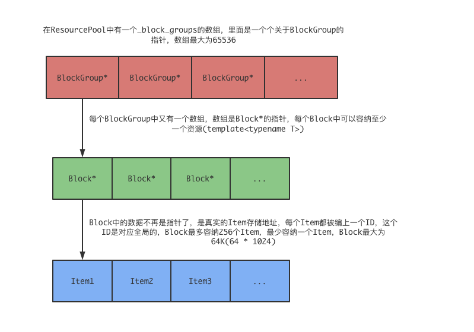

<font face="Monaco">

# brpc resource pool 分析

## 0x00 内存池的布局

ResourcePool是一个全局的资源池(某种对象T来说)，ResourcePool最多可以拥有65536个BlockGroup，而每个BlockGroup也最多可以拥有65536个Block，每个Block最少可以放入一个Item，这个Item就是我们想要让资源池替我们保管的类。



### id

资源池的设计使用了id唯一的标识符来获取这个“对象”的地址，其转换是O(1)，id的构成是一个uint64_t的value，说白了，这个id其实就是全局ResourcePool中的“Item顺序”，在get方法中有一个生成id的代码：

```cpp
template<typename T>
struct ResourceId {
    uint64_t value;
};

id->value = _cur_block_index * BLOCK_NITEM + _cur_block->nitem;
```

_cur_block_index是当前Block的index，注意，这里的block_index并不是“单独BlockGroup”中的index，如果是这样的话，那么其大小是小于65536的。

而事实是，这里的_cur_block_index是通过ResourcePool中ngroup * RP_GROUP_NBLOCK来计算的，其源代码在add_block中：

```cpp
// index将被传入_cur_block_index
static Block* add_block(size_t* index) {
    // ...
    *index = (ngroup - 1) * RP_GROUP_NBLOCK + block_index;
    // ...
}
```

以上代码中，`block_index`是“当前BlockGroup”的index，或者叫做“块内偏移”，`RP_GROUP_NBLOCK`是BlockGroup支持的最大Block数量，也就是65536，所以这个`_cur_block_index`所代表的Block_index，是全局的。

所以再回到之前的代码中，就可以很明显的知道id->value所被赋予的是一个“全局的序号”。

### id转地址

id怎么转地址？在unsafe_address_resource中：

```cpp
static inline T* unsafe_address_resource(ResourceId<T> id) {
    const size_t block_index = id.value / BLOCK_NITEM; 
    return (T*)(_block_groups[(block_index >> RP_GROUP_NBLOCK_NBIT)] 
                .load(butil::memory_order_consume)
                ->blocks[(block_index & (RP_GROUP_NBLOCK - 1))] 
                .load(butil::memory_order_consume)->items) +
           id.value - block_index * BLOCK_NITEM;
}
```

先说明一下`BLOCK_NITEM`block中存储的item数量，`RP_GROUP_NBLOCK_NBIT`为16，`RP_GROUP_NBLOCK`是65536。

首先直接通过id.value计算出所属的`block_index`是多少，然后再计算这个block是位于哪个BlockGroup的，计算方法为：

```cpp
block_index >> RP_GROUP_NBLOCK_NBIT // 其实也就是 除 65536罢了
```

所以取这个BlockGroup的代码就是：

```cpp
_block_groups[(block_index >> RP_GROUP_NBLOCK_NBIT)].load(...);
```

拿到BlockGroup后，就需要拿到其内的Block位置了，其位置在全局中的位置其实就是`block_index`，对65536取余就好了，也就是：

```cpp
blocks[(block_index & (RP_GROUP_NBLOCK - 1))];
```

至此已经拿到了Block中的items的地址，也就是真实的存储地址了。

`id.value`中存储的是全局item index。

`block_index`是全局Block index。

`block_index * BLOCK_NITEM`可以当前Block的第一个item。

`id.value - block_index * BLOCK_NITM`就是当前Block第一个item到id.value这个item的“index之差”。

所以再看源代码中，在找到Block中items的地址位置后，以(T*)的指针去加上这个index之差，其实也就是拿到了确切的地址了。

```cpp
return (T*)(计算得出的block->items地址) +
     id.value - block_index * BLOCK_NITEM;
```

## 0x01 Singleton方式

ResourcePool中：

```cpp
class ResourcePool {
    static butil::static_atomic<ResourcePool*> _singleton;
    static pthread_mutex_t _singleton_mutex;
};

butil::static_atomic<ResourcePool<T>*> ResourcePool<T>::_singleton; // 全局
```

然后在获取的时候通过接口：

```cpp
static inline ResourcePool* singleton() {
    ResourcePool* p = _singleton.load(butil::memory_order_consume);
    if (p) {
        return p;
    }
    pthread_mutex_lock(&_singleton_mutex);
    p = _singleton.load(butil::memory_order_consume);
    if (!p) {
        p = new ResourcePool();
        _singleton.store(p, butil::memory_order_release);
    } 
    pthread_mutex_unlock(&_singleton_mutex);
    return p;
}
```

## 0x02 return resource

归还方式：

```cpp
inline int return_resource(ResourceId<T> id) {
    LocalPool* p = get_or_new_local_pool();
    if (__builtin_expect( lp != nullptr, 1 )){
        return lp->return_resource(id);
    }
    return -1;
}
```

在LocalPool的return_resource：

```cpp
inline int return_resource(ResourceId<T> id) {
    if (_cur_free.nfree < ResourcePool::free_chunk_nitem()) {
        _cur_free.ids[_cur_free.nfree ++] = id;
        return 0;
    }
    if (_pool->push_free_chunk(_cur_free)) {
        _cur_free.nfree = 1;
        _cur_free.ids[0] = id;
        return 0;
    }
    return -1;
}
```

先归还到本地的freelist中，并且所谓的归还，只是归还“ID”而已，其对象还在，如果本地的freelist已经满，那么归还到全局的freelist中，等到不够了再从其中取出。


</font>