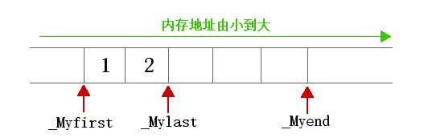
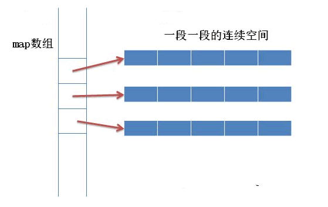
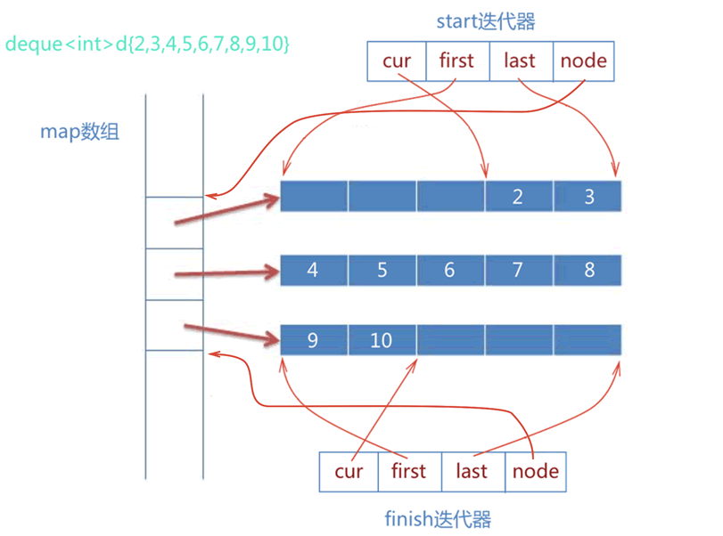
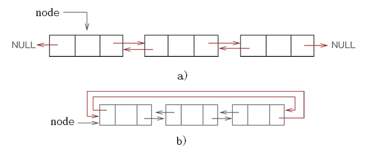
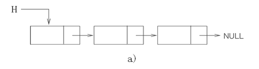

# C++ STL

## vector

内部实现

```C++
template<class _Ty,
    class _Ax>
    class vector
        : public _Vector_val<_Ty, _Ax>
    {   // varying size array of values
public:
    ...
protected:
    pointer _Myfirst;   // pointer to beginning of array
    pointer _Mylast;    // pointer to current end of sequence
    pointer _Myend;     // pointer to end of array
    };
```

内存排布: 



vector的内存排布就是简单的顺序内存排布方式，first迭代器指向头部，last迭代器指向第一个空元素(最后一个元素的下一个)，end指向最后一个元素的末尾(空间最末端)。

所以往尾部操作的效率是最高的，删除和插入都是O(1)，如果往中间或者前面插入删除，使用时长都是O(n)，vector会自动改变其内部的构造。

如果一个vector装满了，那么再往其中加入元素将触发扩容，分配器将分配一个更大的空间(一般是2倍于原先的空间)，然后将所有数据拷贝过去，再将原先的空间释放掉。

注: 当空间使用达到满时，先前的有些迭代器可能无法使用，这时由于扩容导致的。

* 添加

    vector中添加使用的比较多的是push_back和emplace_back，其中emplace_back是C++11后加入的，其可以直接在目标地址上生成对象，这两个在对POD数据时没有任何区别，但是在非POD时还是建议使用emplace_back来提高速度。

    ```C++
    class Object{
    public:
        Object(int num):num_(num){}
        ~Object(){}
        Object(const Object& object): num_(object.num_){}
        Object(Object&& object): num_(object.num_){}
    private:
        int num_;
    };
    vector<Object> target;
    target.push_back(2);
    // 后先调用构造函数，然后调用移动构造，如果没有移动构造，则调用拷贝构造
    target.emplace_back(3); // 直接在vector对应的索引内存上调用构造函数
    ```
    
    insert将会在某个迭代器处插入对应的元素，并且返回这个新插入的元素的迭代器。
    
    ```C++
    vector<int> target = {0, 1, 2, 4, 5, 6, 7, 8, 9};
    auto iter = target.begin();
    iter ++; iter ++; iter++; // 3 but not exist now
    auto retIter = target.insert(iter, 3); // return *retIter = 3
    ```


* 删除

    ```C++
    vector<int> target = {1, 2, 3, 4, 5, 6};
    // 一个其中的迭代器
    auto iter = target.begin();
    target.erase(iter); // 直接删除会使得iter后边的数字前移
    ```
    
    删除一般都是使用erase这个操作，erase不止只接受一个迭代器，它还支持begin和end迭代器的支持方式。
    
    ```C++
    auto iter = target.begin(); // 某个迭代器
    target.erase(iter);
    //由于以上的方式，我们将iter删除了，那么iter就将不能再使用，但如果我们还想
    // 继续遍历整个vector，这时就需要用到其返回值了
    // erase返回一个迭代器，等同于被删除的迭代器的下一个位置
    // 使用方式:
    auto next = target.erase(iter);
    ```
    
    vector的范围删除
    
    ```C++
    vector<int> target = {0, 1, 2, 3, 4, 5, 6};
    // 删除 0 - 2
    auto iter = target.begin();
    iter ++; iter ++; iter ++; // iter指向3的位置
    auto retIter = target.erase(target.begin(), iter); // 0 - 2 被删除
    // retIter 指向3的位置。
    ```
    
    vector的全部删除，使用clear用来删除所有元素，如果vector中存储的为非POD类型，那么clear会为它们调用析构函数，并且，clear不会清空内存! 如果需要清空内存可以使用swap。
    
    ```C++
    vector<int> target = {1, 2, 3, 4, 5, 6};
    target.clear(); // 删除所有元素
    ```
    
    remove和erase的区别
    
    remove是算法库中的一个函数，传入迭代器起始和尾部，以及一个value，它将所有value移动到容器尾巴，并且返回一个迭代器，其指向第一个value(此时value都在尾部)。
    
    ```C++
    Iter remove(Iter begin, Iter end, type value);
    ```
    
    例如我们要删除一个数组中所有为1的元素:
    
    ```C++
    vector<int> target = {1, 1, 2, 2, 1, 4, 1};
    target.erase(remove(target.begin(), target.end()), target.end());
    // remove返回1的开头，此时1都已经被移动到尾巴了，
    // erase将其全部删除
    ```
    
* 内存

    vector中存在2个方法，分别是size()和capacity()，区别就在于size是元素的真正个数，而capacity则表示vector总共拥有的内存空间。
    
    使用resize和reserve可以分别控制这些东西，resize会将整个vector的数量调整至对应的个数，如果不够，则增加capacity。而reserve只会申请空间而已。

    ```C++
    vector<int> target = {0, 1, 2, 3, 4, 5, 6, 7, 8, 9};
    target.size(); // size和capacity都为10
    target.resize(20); // size和capacity都为20
    target.reserve(20); // 如果上条语句没有调用，则size为10，capacity为20
    ```
    
    <font color=F0000> 基本上，所有vector的内置删除操作都不会导致capacity的改变，只会减少size而已，增加操作则会导致capacity变大。 可以使用shrink_to_fit将capacity缩小到和size一样大。</font>


## deque

deque的实现比较复杂，类似vector，其内存分布图: 



其中map是一个指针数组，指向一个个空间，有点类似二维数组的方式，并且map的扩容方式和vector底层类似。

deque这样做是为了实现更为快速的头部操作和尾部操作。

其内部迭代器代码: 

```C++
template<class T,...>
struct __deque_iterator{
    ...
    T* cur;
    T* first;
    T* last;
    map_pointer node; //map_pointer 等价于 T**
}
```

cur指向的是当前元素，first则指向一段段的地址开头，last则指向一段段的地址结尾，node则指向map数组中的对应索引位置，其指向图: 



所以往头部进行增删为O(1)，往尾部增删为O(1)，往中间增删为O(n)。

## List

C++ STL中的list有双向，也有单向list

#### 双向链表

底层内存空间分布: 



对于双向或者双向循环链表，其头尾的操作时间复杂度都是O(1)，对中间节点进行操作的复杂度尾O(n)，如果能拿到某个节点的地址，那么删除的操作是O(1)级别的。

#### 单向链表

底层内存空间分布: 



其头部操作为O(1)，其余的操作都为O(n)。

## set和multiset

set和multiset底层实现都是红黑树

#### set

set底层实现为红黑树，其键值不可重复，并且是顺序排序的，其内部的key和value是相同的。

至于为何set不使用hash来实现的主要原因是由于set经常会进行并集交集等等的操作，其红黑树的效率(红黑树可以顺序排序，中序遍历即可)比hash效率更快。

#### multiset

multiset底层实现也为红黑树，但是它可以有重复项目，具体留空。。。。

## map和multimap

map和multimap底层实现也都是红黑树，和set不同的是，map的key-value不同。

#### map

底层实现为红黑树，通过key进行排序，是一个个键值对构成的。

#### multimap

留空。。。。

## unorder_set和unorder_map

其底层实现都是hashtable，有着O(1)的增删改查效率，不过需要注意的是，当使用范围查找时，hashtable的效率就变得非常的差了。

哈希表主要是取决于哈希算法，Redis中使用的哈希算法是murmur2，它将一个"数据"对应到一个数字上，在经过经典的取余算法即可得出该元素该放到哪个数组索引上。


