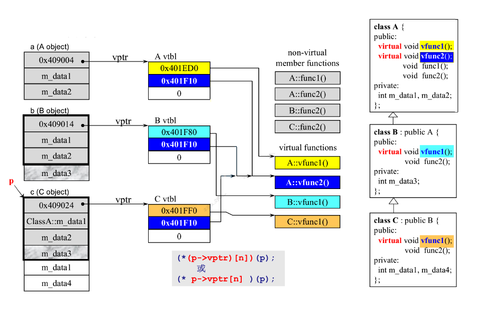
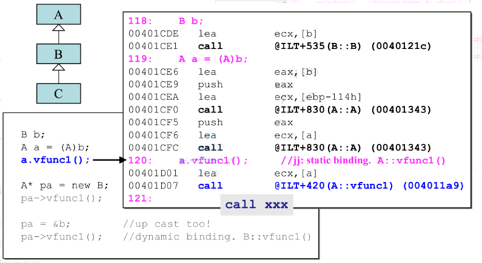
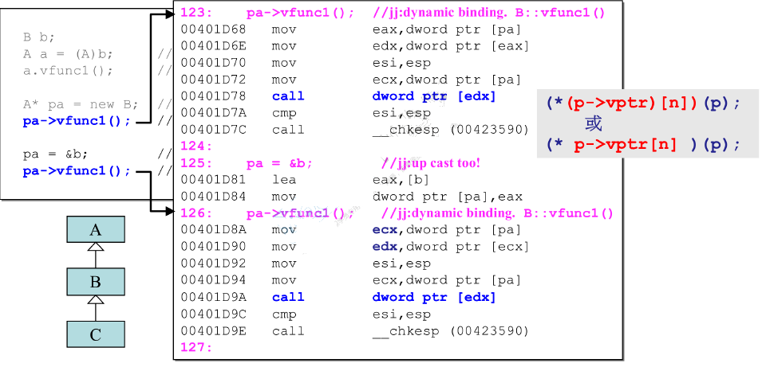

# C++对象模型

__C++的各种`对象特性`其实都是来源其`存储方式`，也就是`对象模型`__ ！对于以下程序:
```C++
class A { // 一个基础类
public:
    virtual void vfunc1();
    virtual void vfunc2();
    void func1();
    void func2();
private:
    int m_data1;
    int m_data2;
};

class B : public A {
public:
    virtual void vfunc1();
    void vfunc2();
private:
    int m_data3;
};

class C : public B {
public:
    virtual void vfunc1();
    void vfunc2();
private:
    int m_data1;
	int m_data4;
};
```

它在内存中的模型图:



其中的`虚函数部分`尤为重要， __是实现多态的重要实现方式__ ， __当被一个`成员函数`被定以为一个`虚函数`的时候，编译器在编译的时候就不会`写死一个函数调用的地址`了，而是会使用`虚指针`来调用`虚函数`，`虚指针`指向一个`虚表(一个指针数组)`，里面存着这个类所有的`虚拟函数的地址`，进而达到多态的目的__ 。

例如:

__`a`根本连一个指针都不是，虽然它是有b强行转来的，但编译器还是将其调用的`函数地址写死`了__ ！这样以来调用的必定是A的vfunc1函数。如果使用以下方法调用:



__由于`pa`是一个指针，它指向了`B`，虽然它是一个`父类指针(A类型的指针)`，但是由于所调用的函数是`虚函数`，编译器在编译的时候并`不会写死函数调用地址`，而是会利用this指针去取真正的虚函数__ ！
它会使用  __`(*(this->vptr)[n])(this)`__ 来找到真正的函数地址。