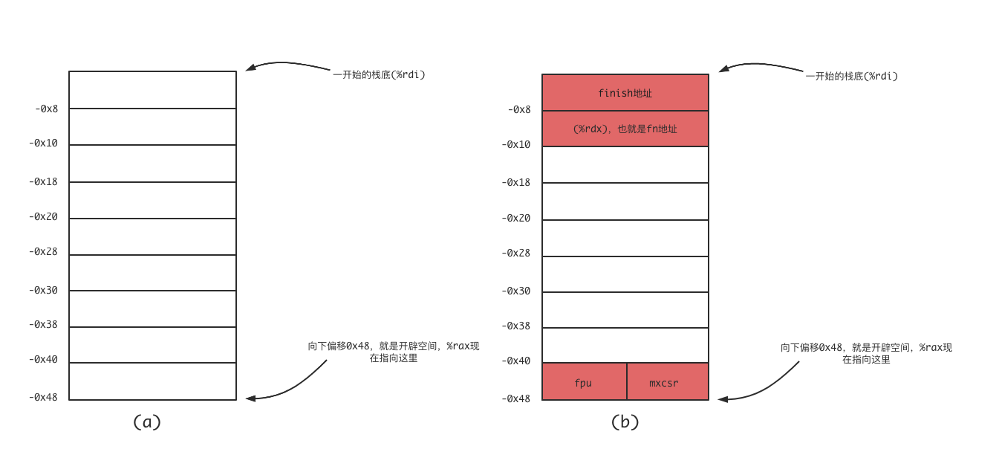
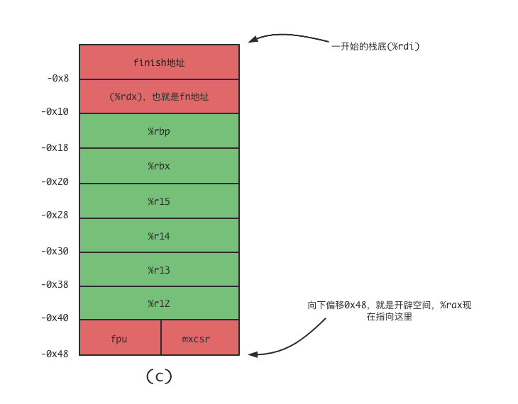

<font face="Monaco">

# C/C++ routine

OS:linux x86_64

## 0x00 make_context

make_context是生成一个可以使用的栈，它以传入的函数指针作为RIP开始运行的地址。

```cpp
typedef void* context;
context make_context(void *sp, size_t size, void (*fn)(intptr_t));
```

void* sp是一个栈低的指针，size则是栈的大小，fn就是生成的“协程”入口了。

首先是总的代码：

```cpp
__asm (".text\n"
       ".globl make_context\n"
       ".type make_context,@function\n"
       ".align 16\n"
       "make_context:\n"
       "  movq %rdi, %rax\n" 
       "  andq $-16, %rax\n" 
       "  leaq -0x48(%rax), %rax\n"
       "  movq %rdx, 0x38(%rax)\n" 
       "  stmxcsr (%rax)\n"
       "  fnstcw 0x4(%rax)\n"
       "  leaq finish(%rip), %rcx\n"
       "  movq %rcx, 0x40(%rax)\n"
       "  ret\n"
       "finish: \n"
       "  xorq %rdi, %rdi\n"
       "  call _exit@PLT\n"
       "  hlt\n"
       ".size make_context,.-make_context\n"
       ".section .note.GNU-stack,\"\",%progbits\n"
       ".previous\n"
);
```

我们一个个来看：

```assembly
make_context:
    movq %rdi, %rax
    andq $-16, %rax
    leaq -0x48(%rax), %rax
```

首先是x64下的传参方式：

> 1. rdi 

> 2. rsi

> 3. rdx

> 4. rcx

> 5. r8

> 6. r9

所以这几行的汇编就是将第一个参数栈底指针对齐，然后向下偏移0x48，类似于开辟空间，其大致的内存图(a)：



然后开始填入一些数据了：

```assembly
    movq %rdx, 0x38(%rax)       ; rdx为第三个参数，也就是函数地址
    stmxcsr (%rax)              ; 一个4bytes的数据，这里先不管它
    fnstcw 0x4(%rax)            ; 同上
    leaq finish(%rip), %rcx 
    movq %rcx, 0x40(%rax)       ; 将finish地址放到%rax + 0x40的位置
```

操作完的内存结构图大概就是(b)的样子了，之所以中间有很多空位，这是因为还要与之后的jump_context配合，这里仅仅是预留空间。

## 0x01 jump_context

jump_context会保存当前运行的上下文，随后跳转到目标上下文：

```cpp
intptr_t jump_context(context* from, context to, 
                intptr_t vp, bool preserve_fpu = false);
```

其汇编为：

```cpp
__asm (
    ".text\n"
    ".globl jump_context\n"
    ".type jump_context,@function\n"
    ".align 16\n"
    "jump_context:\n"
    "    pushq  %rbp  \n"
    "    pushq  %rbx  \n"
    "    pushq  %r15  \n"
    "    pushq  %r14  \n"
    "    pushq  %r13  \n"
    "    pushq  %r12  \n"
    "    leaq  -0x8(%rsp), %rsp\n"
    "    cmp  $0, %rcx\n"
    "    je  1f\n"
    "    stmxcsr  (%rsp)\n"
    "    fnstcw   0x4(%rsp)\n"
    "1:\n"
    "    movq  %rsp, (%rdi)\n"
    "    movq  %rsi, %rsp\n"
    "    cmp  $0, %rcx\n"
    "    je  2f\n"
    "    ldmxcsr  (%rsp)\n"
    "    fldcw  0x4(%rsp)\n"
    "2:\n"
    "    leaq  0x8(%rsp), %rsp\n"
    "    popq  %r12  \n"
    "    popq  %r13  \n"
    "    popq  %r14  \n"
    "    popq  %r15  \n"
    "    popq  %rbx  \n"
    "    popq  %rbp  \n"
    "    popq  %r8\n"
    "    movq  %rdx, %rax\n"
    "    movq  %rdx, %rdi\n"
    "    jmp  *%r8\n"
    ".size jump_context,.-jump_context\n"
    ".section .note.GNU-stack,\"\",%progbits\n"
    ".previous\n"
);
```

在此之前，需要先明白，在x64下，有些寄存器并不总是“callee”来保存的，它本身就是“caller”保存的，还有一些寄存器，它们在函数调用过程中总是一直在改变，它们分别是：

> 1. %rax 函数返回值

> 2. %rsp 栈指针

> 3. %r10 caller保存

> 4. %r11 caller保存

再加上之前的6个用于传递参数的寄存器有10个了，x64通用寄存器总共16个，剩下6个寄存器我们需要保存(我们指callee)，所以jump_context一开始就是6个callee需要保存的寄存器推栈：

```assembly
jump_context:
    pushq %rbp
    pushq %rbx
    pushq %r15
    pushq %r14
    pushq %r13
    pushq %r12
    leaq -0x8(%rsp), %rsp   ; 这里多开辟了0x8的空间，保存fpu和mxcsr，先不管
```

之后就是栈的切换了：

```assembly
    cmp $0, %rcx        ; %rcx作为第3个参数，我们总是传入0
    je 1f
    stmxcsr (%rsp)      ; 被跳过
    fnstcw              ; 同上
1:
    movq %rsp, (%rdi)   ; 保存当前的栈，写入%rdi处的地址，也就是第一个参数
    movq %rsi, %rsp     ; 切换栈，第二参数作为新栈顶指针
    cmp $0, %rcx    
    je 2f
    ldmxcsr (%rsp)
    fldcw 0x4(%rsp)
```

到这里就已经完成了栈的切换，但要跳转到之前的栈，我们还需要恢复一些寄存器，也就是之前推栈的反向出栈即可：

```assembly
    leaq 0x8(%rsp), %rsp    ; 和之前形成一对，不管
    popq %r12
    popq %r13
    popq %r14
    popq %r15
    popq %rbx
    popq %rbp
```

这里需要补充一个关于x86_64函数的调用栈，caller会先保存需要保存的寄存器，然后开始推入函数的参数(第7个开始反向推入，1-6由寄存器来传参)，之后调用call指令，call指令会将ret地址推入，现在就可以解释剩下的汇编了：

```assembly
    popq %r8    ; 这里取到的，就是make_context中的fn
                ; 或者是jump_context函数开始时，由call指令压入的ret地址
    movq %rdx, %rax ; 0
    movq %rdx, %rdi ; 0
    jmp *%r8    ; 跳转
```

这里也可以填上之前那个图里的所有内容了：




 在使用之前需要知道的是，make_context传入的是栈底指针，返回的所谓context，其实也就是一个栈低指针0x48偏移的地址，需要保存的寄存器都保存到了栈中了，对于主栈(线程内主栈)，使用的还是原来的主栈，jump_context会做这个保存，保存到第一个参数的地址中。


## ref

[https://blog.csdn.net/wxj1992/article/details/109271030](https://blog.csdn.net/wxj1992/article/details/109271030)

[https://blog.csdn.net/KIDGIN7439/article/details/106426635](https://blog.csdn.net/KIDGIN7439/article/details/106426635)

[https://blog.csdn.net/z974656361/article/details/107125458/](https://blog.csdn.net/z974656361/article/details/107125458/)


</font>