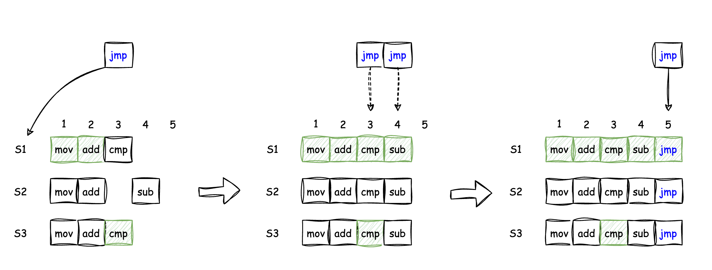
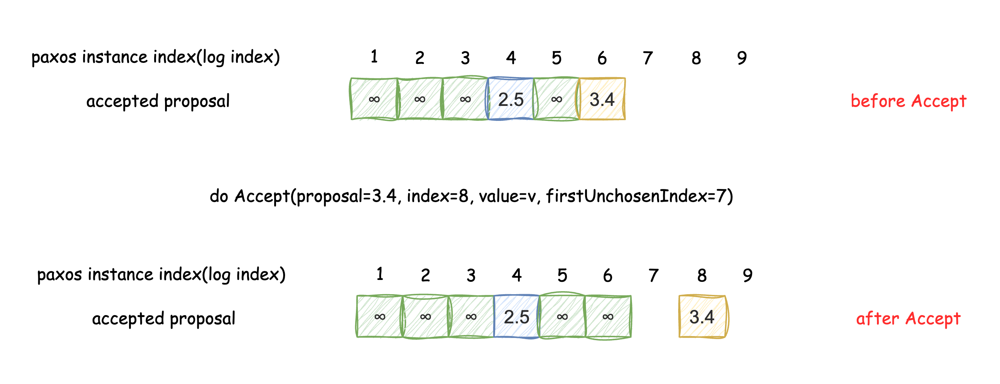
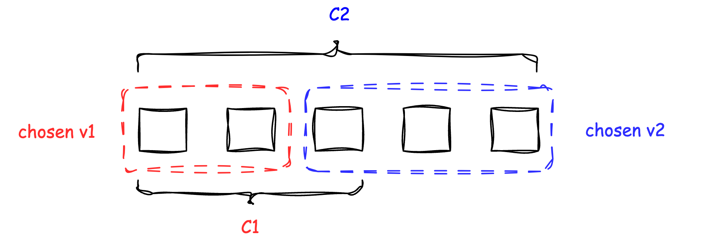
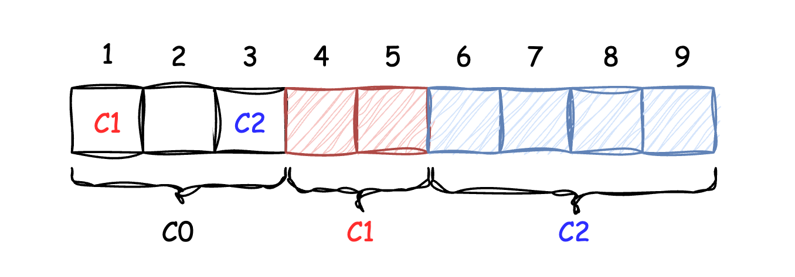
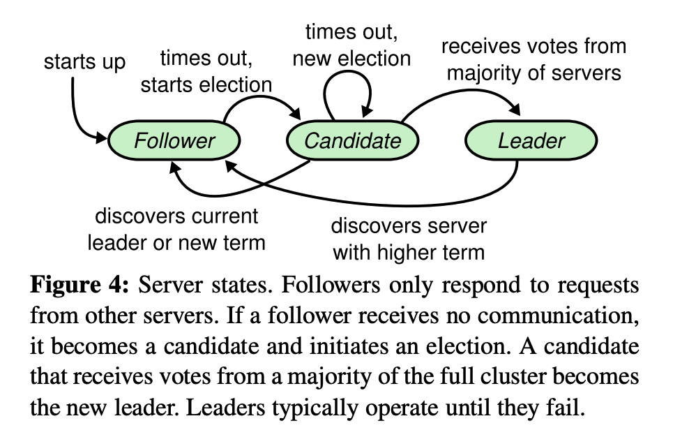
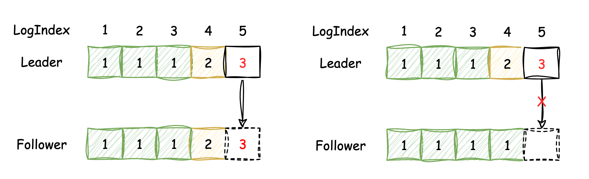
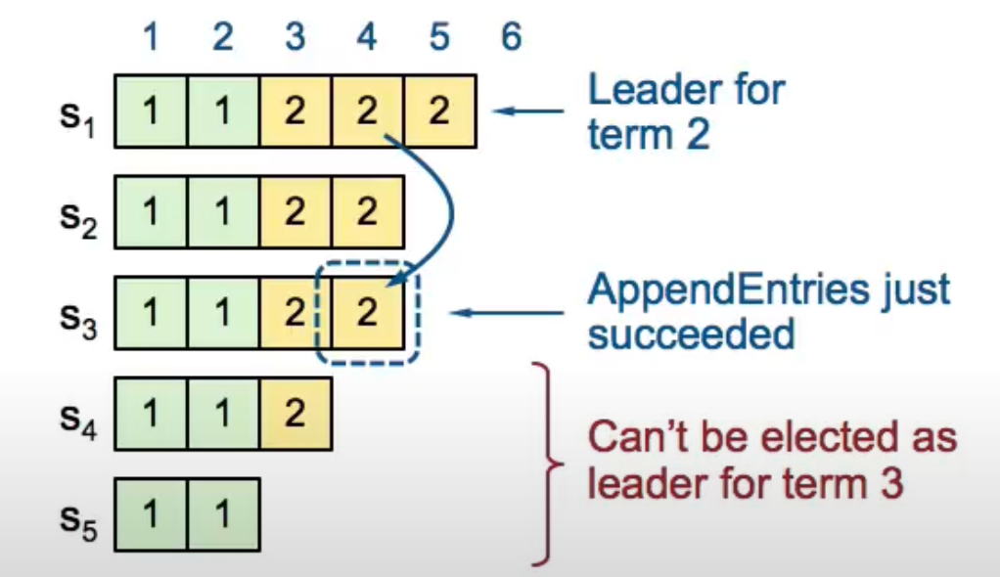

# Consensus

## 0x00 Paxos algorithm

共识问题一直是服务侧无法绕开的话题，一提到共识协议，我更多想到的是raft，但为了理解raft，个人觉得还是应该从paxos开始看起，正如raft论文《In Search of an Understandable Consensus Algorithm》，从paxos看起，就能理解raft作者如何将“multi-paxos”描述的“可理解”。

### 1. Basic-paxos

basic-paxos只能对“一件事(提案)”完成一个共识，一旦这件“事(提案)”确定，则无法改变，paxos中有3种角色，分别为：
* Proposer: 提出提案
* Acceptor: 投票提案，选择是否接受该提案
* Learner: 学习提案结果

算法规定，由Proposer提出提案，Acceptor来投票决定是否通过，当多数派(quorum)一致投同意票后，则提案通过，Learner可以通过学习知道提案结果，实际工程中，这几个角色可以混部，即一个节点可以是Proposer，同时也是Acceptor和Learner，算法基本投票流程为：

<table>
    <tr>
        <th>Phase/Role</th><th>Proposer</th><th>Acceptor</th>
    </tr>
    <tr>
        <td rowspan="2">Phase1(Prepare)</td>
        <td>
            生成唯一且递增的N，这里记为Proposer(N)，将请求发送给Acceptor
        </td>
        <td style="white-space: nowrap;" rowspan="2">
            Acceptor收到来自Proposer的请求，根据本地已有内容作出判断： 
            case1 Proposer(N) <= Acceptor(N): 
            &nbsp;&nbsp;&nbsp;&nbsp; 拒绝投票，返回。 
            case2 Proposer(N) > Acceptor(N): 
            &nbsp;&nbsp;&nbsp;&nbsp;投赞成票，Acceptor记住这个新的N，然后返回前把自己 
            &nbsp;&nbsp;&nbsp;&nbsp;已经接受的提案(这里记做N1和V1)也一并返回，如果没有， &nbsp;&nbsp;&nbsp;&nbsp;
            则返回NULL。
        </td>
    </tr>
    <tr>
        <td style="white-space: nowrap;">
        Proposer根据Acceptor的返回情况再作出判断： 
        case1 收到的票数没有超过总数的一半： 
        &nbsp;&nbsp;&nbsp;&nbsp;结束，本次提案没有通过。 
        case2 收到的票数超过半数： 
        &nbsp;&nbsp;&nbsp;&nbsp;进入第二阶段
        </td>
    </tr>
    <tr>
        <td rowspan="2">Phase2(Accept)</td>
        <td>
        Proposer从一阶段所有Acceptor中，选择他们返回的结果中N1最大的提案，将这个N1的提案内容V1，作为本次的提案，如果都是NULL，则Proposer可以自己决定V，然后向Acceptor发起Accept(N, V)请求。
        </td>
        <td rowspan="2">
        Acceptor对比本地情况，决定是否赞成投票： 
        case1 Proposer(N) < Acceptor(N)： &nbsp;&nbsp;&nbsp;&nbsp;
        投反对票，返回当前N。 
        case2 Proposer(N) >= Acceptor(N)： &nbsp;&nbsp;&nbsp;&nbsp;
        投赞成票，接受这个提案，记住N和V
        </td>
    </tr>
    <tr>
        <td>
        Proposer根据Accept二阶段返回情况判断： 
        case1 票数没有超过半数，提案N没有通过。 
        case2 票数超半，则提案(N, V)提案达成，结束。
        </td>
    </tr>
</table>

注：其中N为一个唯一且递增的序列，例如工程中，可以使用seqid + node_id的实现方式。

从一二阶段的Acceptor判断中，可以理解到，basic-paxos的本质其实是一种分布式占坑：
1. Prepare流程保证Proposer一定能占到超过半数的坑，然后才会发起Acceptor请求。
2. Accept流程保证一定能否发现之前有人“成功”占过坑，并且能替他们完成“完整的占坑”的请求。

这就是basic-paxos的完整流程了，而细心的人可能会发现，basic-paox是一个`活锁`，也就是只要有人捣乱，不停的提高N，则可能一直无法达成共识；另一方面，外部的观察者(client)，如果想要知道basic-paxos“是否就某一件事情”已经达成共识了，那么他必须访问大多数节点，去确认是否真的在多数节点上，它们确实Accept了这个结果。

### 2. Multi-paxos

multi-paxos的想法是，既然basic-paxos只能就一件事情完成共识，那就多弄几个basic-paxos，这样就可以就多件事情完成共识了，算法的基本思路是：每一个basic-paxos称之为paxos instance，维护一个数组空间来保存这些instance，每个instance占用一个slot，每个slot都能就一件事达成共识，当一个slot上已经达成共识后，就再选一个新的slot来达成新的共识。

## 0x01 Paxos impl

### 1. Multi paxos problem?

在实际工程实现上，我们主要说的是multi-paxos，如果你真的按照上面说的，一轮轮basic-paxos来实现，那么就会发现性能非常的差，因为我们有这几个问题：

1. 如何选择index(slot)？
2. basic-paxos活锁问题
3. 2pc太重
4. Acceptor无法知道，某些协议是否已经达成共识了 
5. 配置、成员变更？

### 2. Possible solutions

#### 2.1 Index(slot) chosen

当一个Proposer收到一个来自Client请求后，如何选择一个合适的index？简单的想法是，Proposer总是尝试从最低的index开始，逐渐递增，这个想法确实是一个可行的方案，例如：

client尝试执行jmp指令，请求被提交到S1上，绿色框表示，对应服务器“知道”该提案已经被chosen了，其流程：

* jmp提交到S1，从S1知道的情况来看，index=3貌似还没完成提案，它尝试以index=3提交jmp提案
* S1通过Prepare返回得到了cmp已经被某些Acceptor接受了，随后只能放弃jmp，完成cmp的提案
* S1在index=4上重复basic-paxos的2pc，完成sub的提案
* S1在index=5上重复basic-paxos的2pc，完成jmp的提案

#### 2.2 Basic-paxos live lock

basic-paxos活锁问题会出现在集群内部有多个节点都尝试去做Proposer时出现，它们竞争，然后大家都无法拿到多数派节点的同意，从而不断的提高Proposer(N)，一个想法是，规定集群中有一个Leader，只有这个Leader会扮演Proposer角色，其余节点只扮演Acceptor。

Lamport提到了一个选举方式，直接规定节点id比较高的节点为Leader就好了，然后维护一个心跳到其他节点，在超时的时间范围内，如果有收到比自己大的节点id的心跳，则只扮演Acceptor，否则就可作为Proposer；这点有问题么？从multi-paxos正确性角度来看，理论上是没有问题的，因为多主(多Proposer)在paxos中只会造成活锁，最多也就是性能变差，但有一个机制来限制Proposer的数量，是实打实的降低活锁的概率。

#### 2.3 2pc

为什么basic-paxos需要Prepare？记得我们之前提到的么：占坑，以及发现前人占过的坑，为什么需要占坑？因为集群中有多个Proposer，而前面的活锁问题中的一个优化方案，如果集群中只有一个Proposer，那么Prepare其实是可以很大程度上优化掉的，怎么做呢？主要流程为：

1. Proposer发起Prepare请求时，不仅仅占一个坑，它直接占从当前paxos instance index开始到无限大位置的坑。
2. Acceptor，除了返回当前index是否存在Prepare(N)以外，Acceptor还额外返回了之后的index是否有其他Prepare(N)，如果没有，则直接返回noMoreAcceptored
3. Proposer发现多数派Acceptor返回了noMoreAcceptored后，不再发出Prepare请求，直接发起Accept请求

经过这样优化，2pc很大程度上被优化成了1pc。

#### 2.4 All servers known about chosen entries?

目前为止，还是存在一个问题，就是只有Proposer才能知道哪些paxos instance是已完成提案的，Acceptor很难知道提案是否已经被chosen，这点很重要，关乎到如何确定该提案是否可以提给状态机；

既然Proposer知道已完成的提案，那就由Proposer直接在Accept请求中告知Acceptor，Proposer和Acceptor都维护一个“firstUnchosenIndex”，表示该index之前的paxos instance都是已经chosen的，how it works？

处理流程为：

* index=8的位置，被Accept为N=3.4的提案占领，但是否被提交，Acceptor并不知道
* index=6的位置，Acceptor现在可以通过请求中的firstUnchosenIndex=7确定，在相同的N下(Accptor可以确认，Proposer在这个index上一定是和自己一样的提案)，Proposer将其设定为了chosen，Acceptor也可以将其设定为chosen，用∞(最大的N，无法被任何人更改了)表示chosen
* index=4的位置，虽然在firstUnchoseIndex之内，但Accptor仅能确认“Proposer知道这个提案是什么”，但Proposer没有明说是啥，所以Accptor无法设定index=4的位置为chosen
* Acceptor的firstUnchoseIndex仍然是4

在流程中，确认chosen一定要N一致，这是因为在N不一样的情况下，Accptor无法知道这个提案的值是否和Proposer所认为的那个提案是一样的，毕竟这个提案来自另外一个Proposer。

经过上面的流程分析，这个优化点还有一个问题，就是Accptor仍然无法确认index=4的位置的提案到底是被chosen为了什么，所以multi-paxos中还需要一个rpc：success，Acceptor在完成Accept请求时，在response中添加firstUnchoseIndex值，Proposer对比Accptor的firstUnchoseIndex来确认是否要发起success请求，如例子中Proposer收到firstUnchoseIndex=4的时候，对比自己的7，那么应该响应：

success(index, v)，这个动作，类似于Learner，学习paxos instance index=success.index的提案为v。

#### 2.5 configuration changes

配置变更或者成员变更，在故障发生时会频繁用到，由于成员变更会直接影响quorum，所以非常容易影响到共识协议的正确性，假设你要从C1配置替换为C2，它将一个3个成员的paxos集群转变为5个成员的paxos集群：

如果直接无脑变更，则他们可能选出自己认为的提案，从而破坏共识协议的一致性，所以必须要有一个方式来规定，要么C1生效，要么C2生效，他们不能同时生效，怎么做呢？multi-paxos用提案本身来决定，将一个配置变更当作一个提案，当就该提案达成协议后，配置发生变更，并在此基础之上引入一个间隙值‌α，表示从该提案提交后，经过多少次“提案”，该配置再生效，假设α=3，开始配置为C0，则：

当然这种设定在α大小变化时会有一些问题，α太小时，那multi-paxos提交就是完全线性的，必须确定前一个paxos instance后，才能做下一个，α太大时，配置变更可能需要一段时间才能生效(虽然你可以提交空提案，强行推进)。

### 3. Industrial implementation

工业界实现的multi-paxos有很多种，比如google的zookeeper、spanner，以及后面的raft，基本都是multi-paxos的变种。
TODO：留坑

## 0x02 raft algorithm

终于到raft了，raft论文非常详细的描述了一个共识协议要怎么做才能达成共识，作者刨析了paxos，并将paxos中杂糅到一起的问题拆分成了几个子项，然后逐个解决：

* 选主问题
* 日志同步
* 安全性
* 配置变更

### 1. Leader election

raft从将节点分成3种角色：

* Leader
* Follower
* Candidate

一个raft集群中，同一时刻只能存在一个leader，在raft中，时间纬度的信息用“Term”来表示，所有节点都记录当前所知道的Term，即currentTerm，Term发生变化时，总是递增的；

关于角色变更，可以参考论文中给出的图，这里重点关注Follower到Leader的转变，也就是选举，角色总是以Follower启动，然后经过一定时间后超时[T, 2T]，触发Follower转为Candidate，提高Term，然后开始选举，多数派同意后，则选举通过，Candidate转为Leader。

超时是一个随机值，之所以这么做是怕split vote，导致Term不断的提高，但总选不出主来，有点类似Paxos中的第一次Prepare + Accept总是无法完成占坑。

关于是否投给Candiate，这个在安全性那边在讨论，这里只需要知道，Candidate在不违反安全性的情况下，投给先到的候选人。

### 2. Append entries

日志同步在raft中只能由Leader来执行，Leader将日志发给Follower，由Follower选择是否接受这些日志，正常情况下，Follower都会接受来自Leader的日志，但Follower不会无脑接受，这里的原则是，Leader在发送一个AppendEntries的RPC时，携带以下信息：

* currentTerm
* prevLogIndex, prevLogTerm
* Logs(需要同步的日志)
* committedIndex

currentTerm自不必多说，如果Follower的Term在逻辑时间上比Leader发送的Term要更大，那必然会拒绝这个合并请求；

Follower是否接受这些日志，取决于prevLogIndex和prevLogTerm是否和自己是一致的，如果不是，则拒绝合并，这是一个冲突，而Leader则需要回退，直到找到一个和当前“Follower”日志一样的prevLogIndex+prevLogTerm的点，然后从那个地方开始同步。

然后是committedIndex，raft严格规定committedIndex和之前的日志一定都是committed，不允许丢失和存在空洞，从这个角度来考虑，这个和paxos的firstUnchoseIndex很像，但又没那么像，raft要严格很多，paxos允许存在空洞，然后再慢慢补上，raft则反之，这一点raft是怎么做到的？

考虑这个合并规则：prevLogIndex+prevLogTerm一定要匹配上才能接受当前的Logs，这就是保证raft log不存在空洞的机制，raft严格要求AppendEntris时一定要找到Follower和Leader冲突的点，然后从那个地方开始 “顺序” 的接受这些日志，绝不允许出现乱序接受Logs的情况！

从这个地方可以看出，raft是严格的串行提交日志。

### 3. Safety

raft如何保证正确性？一个重要的点就是，Leader总是拥有所有committed的日志，为了达到这个目的，有这几个要求：

* Leader不会修改之前的logs，它只会append
* Leader中有的日志才有可能被committed
* 只有committed之后的日志，才会被apply到状态机中

如何达到这几个要求？第一条中，需要在选举中加入一个特别的条件，即：只投给“日志”最多、最新的那个Candidate，投票者基于下面几个流程来判断是否投票：

1. Candidate.Term < Self.Term，那必然拒绝
2. Candidate.LastLogTerm == Self.LastLogTerm 同时 Candidate.LastLogIndex < Self.LastLogIndex，一样拒绝

基于这种保证，Candidate如果获得选票，则他一定是有“最新”的日志。

比如例子中的这个场景，S1作为Leader，刚完成S1到S3的日志同步，随后宕机，并开始选举，我们能够确定：

S4、S5绝对无法当选，因为他们的日志太少，S1、S2、S3一定会拒绝；
只有S1、S2、S3有可能当选，因为S2可以拿到自己S3、S4、S5的选票，S3也是一样，S1则可以拿到所有人的选票；

## refs

papers:
https://lamport.azurewebsites.net/pubs/paxos-simple.pdf
https://raft.github.io/raft.pdf

文中的图来自raft作者在youtube的ppt：
https://www.youtube.com/watch?v=JEpsBg0AO6o
