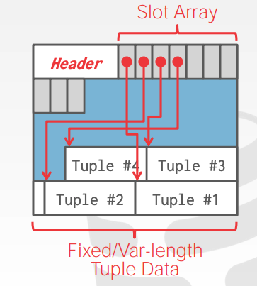
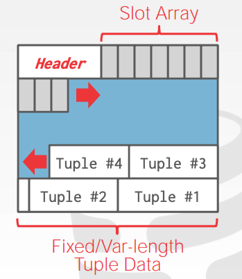

# DBMS

## 0x00 管理文件

### Page大小

首先数据库会将一个文件再细分成一个个的Page，每个Page作为基本单位进行管理，Page的大小取决于数据库的实现，就比如SQLite中的Page大小是1K，而MySQL则是16K。每个Page都有一个唯一的标识符，差不多可以理解成ID。

### Page的管理

> 链表法

链表中存在一个Header，Header中则又拥有2个链表头，分别指向空闲链表Page，以及已经使用的链表Page，这种方式效率非常的低下，一般我们不使用这样的方法。

> 字典法

### Page结构

每个Page中都包含有一个Header，这个Header中包含了一系列必要的信息，比如Page大小、CheckSum(校验值)、DBMS版本、压缩信息...等。

Header之后也就是其数据内容了，数据的存储方式也很有讲究，目前来说2种方式比较流行。

> slotted pages

格式如图所示

Tuple表示的是数据表中的一段数据。

Header之后紧接着跟随SlotArray，每个Slot存储着Tuple在当前Page开始的位置(offset)，注意他们的写入方式，SlotArray由前往后写，而Tuple数据则是由后往前写，当所剩空间不再足够容纳一个Tuple后，这个Page也就写满了。

一般的数据库并不会在一个Page里存储来自不同Table的Tuple，这样将导致一些Tuple大小无法确定，并且，在数据库中存储一些大文件比如视频文件是允许的，但不建议这样做。

至于Slotted layout方式的删除操作，假设同样如上图所示布局，删除Tuple 2后，再添加新的Tuple，数据库的行为如何？

这要取决于数据库的实现方式，在SQLite中，新插入的Tuple会被放到原先在Tuple2的位置，而如果在Oracle中，新Tuple会被插入到Tuple5的位置。

> log layout

也就是日志布局，具体参见[LSMTree](./lsm.md)。

