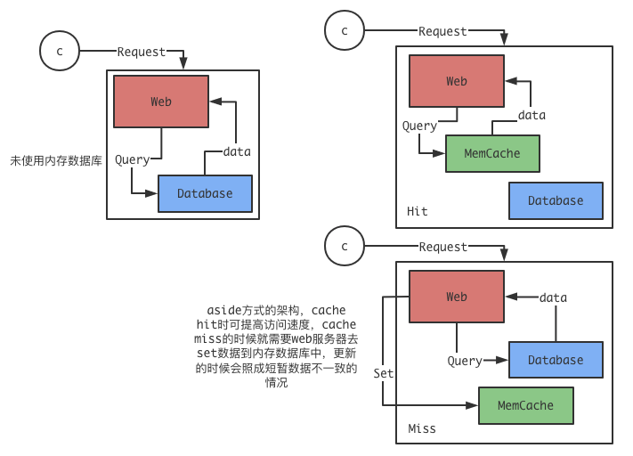
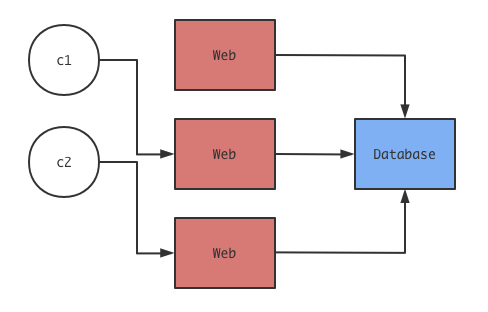
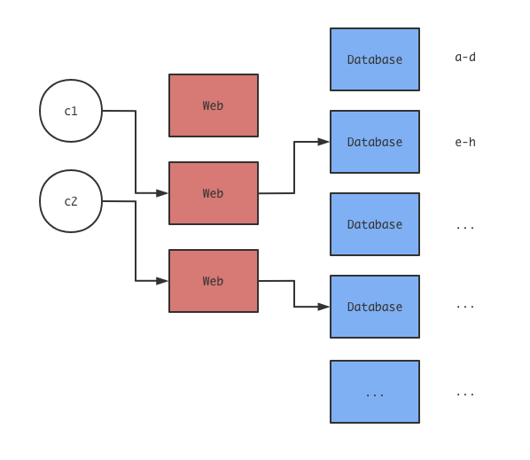
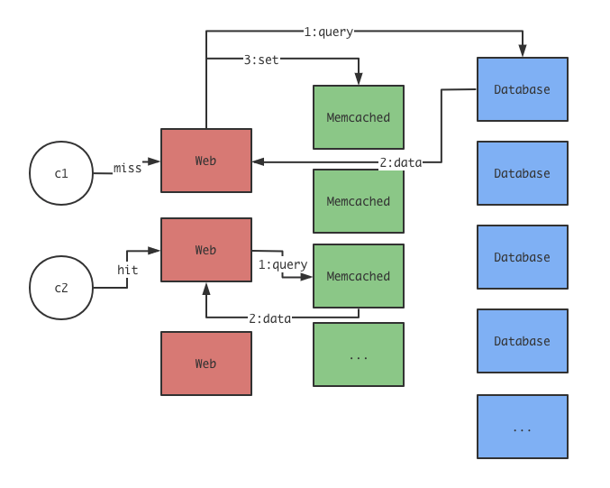
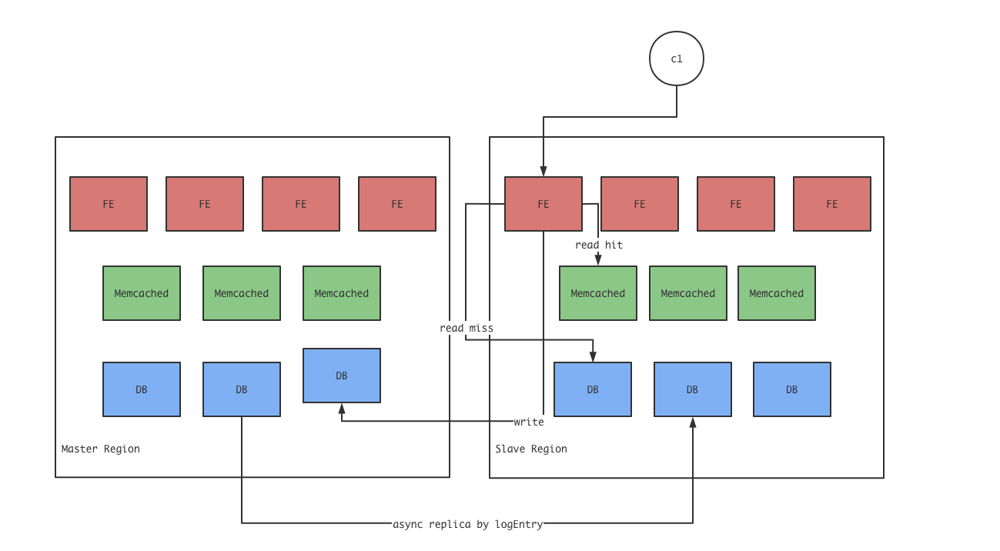
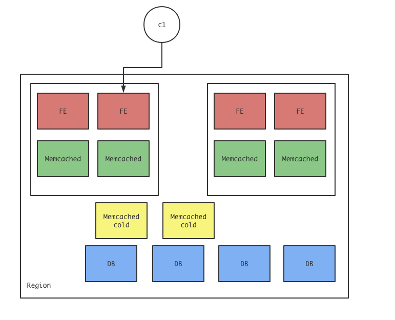

<font face="Monaco">

# 读 Scaling Memcached at Facebook 笔记

[🔗论文链接](https://www.usenix.org/system/files/conference/nsdi13/nsdi13-final170_update.pdf)

## 0x00 单机网站架构

在服务访问人数比较低的时候，比较常见的是直接将Web服务和数据库直接跑在同一个物理机上，有时候，我们觉得数据库可能太慢了，也许可以增加一些内存缓存，比如Memcached or Redis等，那么架构也基本不变：



添加了内存数据库确实可以明显提高数据的访问效率，但由于这种架构方式，会使得更新数据时会产生一段时间的数据不一致问题，并且由于内存数据库能够承受的QPS比传统数据库(假设MySQL)要来的高，出现缓存击穿情况时会有些危险，除去这些情况，web服务器多数情况下会使用一些脚本语言来编写，这些web服务器在高并发情况下会占据大量的CPU时间，整体的性能会下滑，比较简单的方式就是将服务分别运行在不同的物理机上，比如这样：



这种架构方式可以很容易的通过增加web服务器来获得更多的CPU时间，从而提高性能，但很明显的是这种架构也有很长的路要走，比如一些客户端请求到不同服务器的问题，负载均衡的问题，以及同样的数据库性能问题，随着web服务器的增加，最后的瓶颈将来到数据库这边。

## 0x01 数据库集群

当瓶颈来到数据库这边时，比较容易想到的就是水平增加数据库机器的数量，做成集群，但这会衍射出更多更复杂的问题，比如Shard or Replica？

### Shard

假设我们简单的将数据库按key分片，然后均匀的分布到各个数据库服务器上：



现在这个架构显然看起来可以承受住更多的QPS了，但同样存在许多问题，首先是事务，分片导致事务的执行变得复杂，我们有可能就需要用到2PC或者各种分布式事务了，其次就是热数据问题，我们无论如何拆分，总会有一些数据比较“hot”，重复的访问这些数据的服务器同样存在问题，还有一点就是成本问题，相同的一台物理主机，运行内存数据库比传统的MySQL数据库能够承受的访问量要多的多。

### 缓存

通过加入中间缓存层，引入内存数据库集群来提高整体并发量，比如这样：



通过加入内存缓存服务器来提高速度是值得的，但这种架构同样存在脆弱性，我们肯定希望加入内存缓存来提高集群整体能够承受的访问量，这就意味着这些访问量是远远高于磁盘型数据库(比如MySQL)能够承受的范围，一旦出现缓存击穿，磁盘数据库将无法应对这种级别的访问量。

缓存击穿的情况其实很普遍，比如引入新的MemCached机器，空数据将导致来自web的所有数据请求都落到后端的磁盘数据库上，又或者Memchaced机器宕机等等。

### 复制

之前讨论的是分片情况，而加上replica的架构就和论文中描述的框架比较类似了，比如：




其中分别有主数据中心(Region)和副数据中心，每个Region中的数据都是完整的，不会进行分片，仅有在数据中心内部的DB才会进行数据分片，所有的write都需要发送到主数据中心上，read可以根据数据中心的距离，选择比较近的数据中心进行请求。

由于Facebook提供的服务一致性的敏感程度不会太高(web服务比较多)，只需要保证用户可以“立刻看到其修改的内容”即可，实际上，写请求会由Master Region来处理，而读请求是由比较近的Region来处理的，写入完成后，不同Region之间的同步是采用异步的，也就是存在部分时间是数据不一致的(比较短的时间内)，在上述描述的框架中，是顺序一致性的。

## 0x02 look-aside cache

在FE中，look-aside设计可以轻易的写出read的代码，可能是这样的：

```go
func read(key xxx) xxx {
    if v, ok := get_from_memcached(key); ok {
        return v
    }
    value := get_from_mysql(key)
    // TODO....
    set_to_memcached(key)
    return value
}
```

write就可能会有一些问题的，但我们还是可能写出这样的：

```go
func write(key xxx, value xxx) {
    set_to_mysql(key, value) // 更新MySQL中的数据
    delete_to_memcached(key)
}
```

或者像论文中提及的，MySQL服务器应该通过某种机制，当MySQL更新完数据后，发送删除命令到Memcached服务器，使得FE不会再从Memcached读到旧数据。

但这种写入方式会出现一些问题，比较容易看出来的是更新后的缓存一致性问题，MySQL和Memcached处理的过程需要时间，存在部分时间，用户还是可以用Memcached中读到旧的数据。

或者我们会想到，先实现delete掉Memcached，然后再写库？然而这种情况存在相同的问题。

又或者，是否可以用update scheme?，比如这样：

```go
func write(key xxx, value xxx) {
    set_to_mysql(key, value)
    set_to_memcached(key, value)
}
```

这种更新方式的最大问题就是，MySQL同Memcached的更新不是原子的，不处理正常的话，在并发情况下会出现比较严重的问题，比如：

```
c1: set_to_mysql(x, 1)
c2: set_to_mysql(x, 2)
c2: set_to_memcached(x, 2)
c1: set_to_memcached(x, 1)
```

最后，只要x不被修改或者删除，x=1的老数据将永久的留在Memcached中。

### 多集群

在单个Region中，并不少以单个集群存在的，假设以单个集群存在，那么会有一些问题，比如，每个Memcached都进行分片存储，每个FE都可能在各个Memcached中找到想要的数据，那么会存在N^2个连接，随着集群数量的增加，会增加在维护连接上的开销，又或者，同样是热数据情况，Memcached可能也无法承受大量的热点数据的请求。

以上假设都是以软件的角度来讨论的，有些时候，网络也是一个问题，要构建出一个巨大的集群，并且保证每台机器可以相互稳定、高速的连接是一件难以做到的事情，而如果区分开成多个小的集群，维护每个小的集群内部的网络通畅就比较容易的多了。

通过这种数据中心内的小型集群，也能够应对一些热数据以及冷数据，即增加热数据的副本，减少冷数据的占用。



如上图所示，比较热门的数据会在每个小集群中都有对应的Memcached缓存，比较“冷”的数据则会保存在整个数据中心中的“冷Memcached里”。

### 集群加入

在多集群的设计下，有时候，我们希望添加新的集群以提高性能，但新的集群在加入的时候，其内部的Memcached是空的，这就意味着是100%的Cache miss，所有的请求都将落到DB上，而DB显然具备这种等级的写入。

facebook采用的是“冷启动”，即对新的集群中的Memcached进行标记，当访问到标记Memcached并且Cache miss后，FE并不会立刻访问DB，而是会到其他的集群Memcached中进行访问，如果也出现Cache miss才会访问DB，而如果Cache hit(其他集群中的Memcached)，那么FE会将访问到的结果记录到被标记的Memcached中(本地集群中的Memcached)，当以这种“冷启动”运行一段时间后，被标记的Memcached会缓存一定量的数据，然后再将标记去除。

### 惊群

同样是对于热点数据，如果热点数据一直保存在Memcached中，那将没有问题，但有些时候，热点数据需要修改或者删除，在Memcached删除的瞬间，可能会有成百上千个FE同时发起请求，这些请求同样会落到DB上，并且这些请求都是一些重复性的操作，同时会给DB带来很大的压力，显然我们不想这样，facebook使用了一种LEASE的操作。

即：

>FE对某个数据进行数据获取，并且cache miss时，Memcached会对这个key进行一个标记，这里直接记`L`，Memcached会记住这个标记，只有获取数据的FE和Memcached会有这个标记。

>FE从DB中获取数据之后，FE带着这个`L`标记去访问Memcached，Memcached比对通过后缓存对应的数据，然后删除这个`L`标记。

>其他FE如果尝试获取相同的数据，Memcached会察觉已经有其他FE在对DB访问相同的key，那么Memcached会告诉FE等待一段时间后再继续获取。

>`L`标记持续一段时间后会超时自动删除。

>delete操作会使得对应的key上的`L`标记被清除。

### 竞态

LEASE机制其实也解决了竞态的一些问题，假设没有LEASE机制，那么可能存在以下顺序：

```
c1: get_from_memcached(key) -> miss
c1: v = get_from_mysql(key)
c2: set_to_mysql(key, newValue)
c2: delete_to_memcached(key)
c1: set_to_memcached(key, v)
```

之后，Memcached将一直缓存旧数据直到对应的key被改变或者删除，这是不容忍的，但LEASE解决了这个问题：

```
c1: get_from_memcached(key) -> miss, got L
c1: v = get_from_mysql(key)
c2: set_to_mysql(key, newValue)
c2: delete_to_memcached(key) -> 使L失效
c1: set_to_memcached(key, v) -> 无法通过检查
```

即使set先到达memcached，之后的delete总会到达，同样会删除过时的数据，这种极其短的时间数据不一致在facebook看来是可以接受的。

</font>