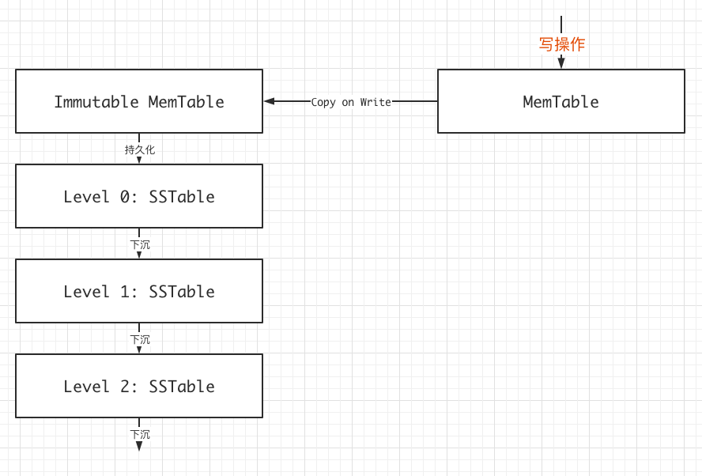

# LSM

lsm不同于B树和B+树，它舍弃了部分读性能，从而提高了写的吞吐量，Leveldb即采用这种算法，今用C++实现一个小型LSMTree，记录一番。

## 0x00 理论

LSM的基本思想：在数据达到一定量后，将数据从内存移动到硬盘，然后和之前写入硬盘的作合并操作，并且由于最新数据均在内存中，所以拥有不俗的写入性能。

LSM中的内存数据采用跳表的方式存储，它拥有和红黑树不相上下的性能，但代码实现远远没有红黑树那样复杂。

### 整体流程

写操作只能在MemTable中，而读操作则是层层递进，MemTable如果找到结果，则即可返回，否则就在Immutable MemTable、Level0...以此类推，直到最底层。

LSM的这种读方式注定了其读性能会被受到影响，但其写性能被极大的提升了。

### MemTable

MemTable顾名思义，即存在内存中的部分，当MemTable达到一定的大小后，将其转为Immutable MemTable，然后将其转存到磁盘中，当然，我们需要重新开辟新的MemTab。

### Immutable MemTable

> 为什么要有Immutable MemTable？

假设我们不设Immutable MemTable，考虑这样的情况：MemTable达到一定的数据量，程序开始将MemTable持久化到磁盘中，此时，读操作固然不受影响，但写操作就麻烦了，无论怎么做，都难以达到令人满意的程度，如果锁住MemTable，则写操作性能受到影响，如果不锁住，则数据不一致情况将导致更复杂的问题。

> Immutable MemTable怎么做？

Immutable MemTable是一个只读表，开始时，我们镜像MemTable到一个Immutable MemTable，然后将其丢到后台供磁盘持久化，在此期间，所有的写操作均由MemTable来做，读则可以分摊到只读的Immutable MemTable。

### SSTable

> SSTable(a set of sorted key-value pairs)

SSTable是存储在磁盘上的数据块，我们肯定无法像在内存上处理数据一样直接存储一个跳表等数据结构，所以SSTable的存储方式是将跳表上的数据排列，然后一一排在SSTable上，

## 0x01 实现

## 0x02 最后

