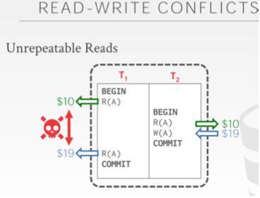
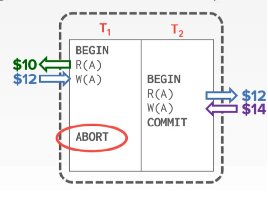
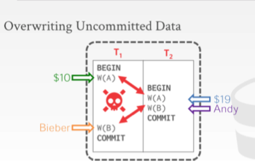
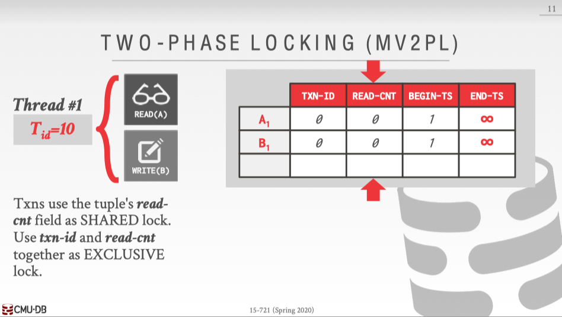
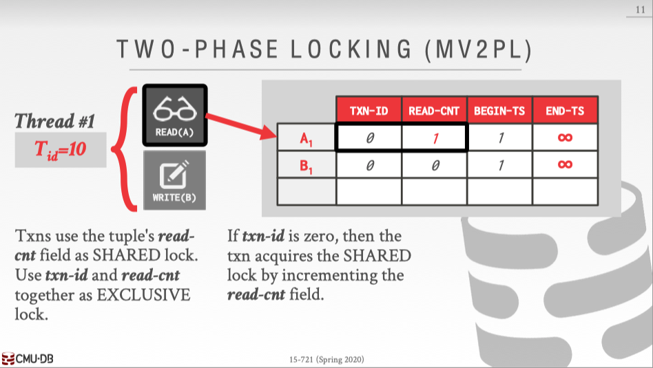
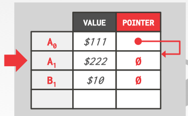

<font face="Monaco">

# C++实现的kv小型MVCC数据库

不考虑持久化和容错，仅为加深印象。

## 0x00 preview

数据库的事务当然可以直接通过加锁来实现，也就是串行执行，每个时刻，都只有一个事务可以进行操作，比如这样：

```C++
// 内存kv，持久化不在此范围内
class KV {
public:
    string get(string key) {
        std::lock_guard lockGuard(mutex_);
        // TODO:...
    }
    
    void set(string key, string value) {
        std::lock_guard lockGuard(mutex_);
        // TODO:...
        // TODO: 一些rollback的方法....
    }

private:
    std::map<string, string> data_;
    std::mutex mutex_;
};
```

只要不放开锁，就没有人可以访问到partial transcation，完全符合要求，但其效率可以说是非常非常的低下，为了尽可能的提高性能，运行更多的线程同时访问数据是一种办法，但这也意味着更难的问题出现。


实际上，数据库在执行事务的时候并不了解higher-level想要传达的东西，它只知道read和write操作而已，而这种操作中，read和read肯定是不会出现冲突的，write发生的时候，有这么几种可能：

* read-write
* write-read
* write-write

### RW

这种情况称为 __不可重复读__ ，比如T1和T2两个事务同时执行，并且它们交替的执行(并发)，这点有点像线程的上下文切换。



T1一开始获得的数据是A=10，而T2修改了A=19，最后，T1事务结束前，又读取了一次A，得到的是A=19，在T1整个事务中，A出现了两种不同的值。

如果T1和T2是串行化的，那么就不会出现这种问题。

### WR

WR的情况称为 __脏读__ ，假设有这么2个事务，T1和T2，它们都做同样的一件事：将A的帐户➕2💰，那么执行情况可能如下: 



T1读取A，并且➕2💰到A帐户中，之后，T2开始，T2读取到了T1的写操作，但其实T1事务还未结束，这属于看到了partial transcation的结果，之后，T2做了相同的事情，A的帐户金额来到了14，但T1发生了一些问题，T1事务终止了，最终，A的帐户为14，这显然是错误的答案。

### WW

WW为 __写写冲突__ ，即覆盖未提交的数据。

比如：



T1和T2都在未读数据的情况下直接就对A和B进行了写入，以这个图来看，最终结果显然也是错误的，因为19💰并不是Bieber操作的。


## 0x01 并发调度

__当且仅当这个并发调度下所得到的新数据库结果和分别串行的运行这些事务所得到的新数据库结果完全一致，则说这个调度是正确的__ 。

### 可串行化(Serializable)

定义：不管初始时数据库的状态如何，一个 __调度对数据库状态的影响__ 和 __某个串行调度__ `相同`， 那么这个调度就是 __可串行化的__，或者说是 __可串行性__，这也意味着这种 __并发调度__ 是正确的。


// TODO:这里应该有个例子and一张图。


__可串行化的调度__，一定是`正确`的并行调度， __不过有些并行调度，可能会得出正确的结果__，但这些并行调度同样是`错误`的。


### 冲突可串行性(Conflict Serializable)

定义：一个调度，如果通过 __交换相邻的两个无冲突的操作__ 能够转换到某一个串行的调度，那么就称这种调度为冲突可串行化调度。

其中，冲突的操作有：

> 同一个事务内，调整操作顺序。这是肯定不允许的，会导致一些higher-level出现问题。
 
> 不同事物，读写同一个元素，都是不允许进行调整顺序的，读写不同的元素则是允许交换顺序。

这里的Conflict Serializable比之前的Serializable的概念更为严格，两者虽然都是正确的，但是可能存在Serializable，但是却不符合Conflict Serializable，而相反，符合Conflict Serializable一定符合Serializable。

## 0x02 2PL(two-Phase Locking)

二阶段锁算是一个比较简单的事务实现方式了，即有2个阶段，获取锁阶段和释放锁阶段，随着事务的进行，每个事务所获取的锁会越来越多，直到Commit、Abort或者Rollback才会释放所有已得的锁。

2PL是完全符合串行化的，只不过缺点也是非常明显：事务一直不释放所获得的锁，那么其他事务如果想获取同一把锁，那么会被长时间阻塞，而且会有死锁风险，虽然死锁可以通过一些预防算法或者超时机制来解决，但2PL的效率确实不能称得上优秀。

## 0x03 MVCC with 2PL

在2PL中引入MVCC的机制，使得RR，RW，WR不会被阻塞，可以有效的提高事务并发的效率。

MVCC的实现有非常多种，网上关于MySQL等各种数据库的原理都写得不一，这里我只按15-721中讨论到的一种方式来实现。

首先是各种实现方式：

> MVCC with Timestamp (MVTO)

> MVCC with OCC (MVOCC)

> MVCC with 2PL (MV2PL)

其中MV2PL也就是本文实现的方式，即在2PL中引入多版本，使得历史的数据版本都存在，对此，需要引入一些新的字段来配合实现。



分别是：

* TXN-ID 当前在写的事务ID
* READ-CNT 当前读取这个Tuple的事务总数
* BEGIN-TS Tuple被创建(提交)时的事务ID
* END-TS Tuple失效的事务ID
* PTR 指向下一个Tuple(取决于实现方式)

其中事务ID可以看作一个时间轴，可以是系统真实时间，也可以是一个递增的序列，BEGIN-TS到END-TS构成了一个版本的“生命周期”。

### shared lock

当一个事务进行读取Tuple的操作时，首先会进行读锁的操作。



事务会 __首先进行TXN-ID的检查，如果为0，那么可以进行上锁__，即：将READ-CNT + 1表示有一个事务读取了当前的Tuple。

注：TXN-ID和READ-CNT是两个字段，如果都为64bit，并且需要进行CAS操作的话，目前x86无这种指令集，所以可以缩短为32bit(暂不考虑耗尽)，又或者可以用latch来保护，这里的latch不是事务中的“LOCK”，仅仅是为了保护实现结构而已，当然完全可以使用原子变量，即使使用MVTO也 __不代表实现MVTO的数据结构是“latch-free”的__。

### exclusive lock

当一个事务进行写Tuple操作时，首先需要获取写锁操作。


事务会 __首先进行TXN-ID和READ-CNT的检查，如果都为0，那么可以进行上锁__，即：将READ-CNT + 1，并且将TXN-ID改写为当前的事务ID，表示有事务进行修改当前Tuple。

### 存储方式

本文实现的版本存储方式为APPEND ONLY 的 O2N，除此之外，还有许多种实现方式:

> APPEND ONLY N2O

> DELTA

> TIME TRAVEL

APPEND ONLY O2N的结构图：



### READ OPERATION

读操作：

```C++
// 当前事务ID：C_ID
xxxxx read(KeyType key) {
    for ( version : ALLVersion ) {
        if ( version.BEGIN_TS <= C_ID < version.END_TS) {
            shared_lock(version);
            // do operation
            // add to ReadSet
            return version.Value;
        }
    }
    return SOME_ERROR;
}
```

### WRITE OPERATION

写操作:

```C++
// 当前事务ID: C_ID
xxxxx write(KeyType key, ValueType value) {
    for ( version : ALLVersion ) {
        if ( versoin.END_TS == INF ) {
            exclusive_lock(version);
            // make new Version: version+1
            // do operation
            // add version to WriteSet
        }
    }
    return SOME_ERROR;
}
```

### COMMIT OPERATION

```C++
xxxxx commit() {
    uint64_t commitID = getTransactionID();
    for ( write : WriteSet ) {
        // set (version+1).BEGIN_TS = commitID
        // set (verion+1).END_TS = INF
        // set (version).END_TS = commitID
        exclusive_unlock(write)
    }
    for ( read : readSet ) {
        shared_unlock(read)
    }
}
```

### ABORT OPERATION

```C++
xxxxx abort() {
    for ( write: WriteSet ) {
        // delete (version + 1)
        exclusive_unlock(write);
    }
    for ( read : readSet ) {
        shared_unlock(read)
    }
}
```

## 0x04 IMPL

// TODO

## REF

[https://marsishandsome.github.io/2019/06/Multi_Version_Concurrency_Control](https://marsishandsome.github.io/2019/06/Multi_Version_Concurrency_Control)

[https://15445.courses.cs.cmu.edu/fall2021/](https://15445.courses.cs.cmu.edu/fall2021/)

[https://15721.courses.cs.cmu.edu/spring2020/](https://15721.courses.cs.cmu.edu/spring2020/)

[https://github.com/oceanwavechina/DotDB/blob/5a64cde5597acbdde6876e3bd00dbc8c8ae549c4/docs/%E5%B9%B6%E5%8F%91%E6%8E%A7%E5%88%B6%E7%9A%84%E7%9B%B8%E5%85%B3%E7%AE%97%E6%B3%95.md](https://github.com/oceanwavechina/DotDB/blob/5a64cde5597acbdde6876e3bd00dbc8c8ae549c4/docs/%E5%B9%B6%E5%8F%91%E6%8E%A7%E5%88%B6%E7%9A%84%E7%9B%B8%E5%85%B3%E7%AE%97%E6%B3%95.md)

</font>