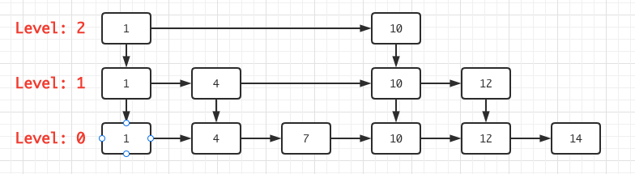
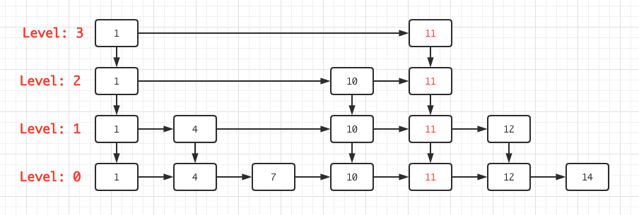

<font face="Monaco">

# 跳表 Skip List

一提到O(logn)的数据结构，很多人第一想到的肯定是红黑树，自从学习Leveldb后学到了一个比较有意思的数据结构，跳表，它的实现真比红黑树简单到不知道哪里去了。

## 0x00 理论

链表的复杂都知道，寻找需要O(n)，需要一个个节点遍历过去才行，而跳表顾名思义，可以用“跳”的，从而跳过一些不需要的节点，通过在原始链表上创建一个一级索引、二级索引、...、n级索引从而降低遍历的次数。

> SlipList 复杂度？

跳表查询增加删除均为O(logn)，空间复杂度O(n)。

### 查找

假设这样一个跳表:



开始的时候，我们总是从最高级索引开始查找，然后一级一级的down到更低级的索引，直到找到我们想要的节点。

假设寻找key=10的节点，很显然，可以通过Level2索引直接找到key=10的节点。

假设寻找的key=7的节点，那么在二级索引上发现下一跳为10，`7 < 10`，所以我们下沉至一级索引，发现一级索引中下一跳的节点key=4，`4 < 7`，所以可以跳到key=4的节点上，继续寻找下一跳，发现下一跳节点key=10，`7 < 10`，所以继续下沉至零级索引(原始链表)，可以发现4节点的下一跳即为节点7。

假设寻找key=8的节点，那么过程和上一致，只不过当我们跳到key=7时发现下一跳已为10，并且没有更底层的索引了，故返回查找失败。

### 插入

和普通链表一样，插入时需要找到插入位置的前驱，由于跳表有很多的索引，所以需要找出所有的前驱，并且，如果一味的插入节点，那么跳表会退化为链表，所以插入的同时也需要更新其索引。

跳表的索引更新则采用随机的方式，当某个节点的随机高度高过当前的最高索引，高出的部分的前驱则为head节点。

假设我们需要插入key=11的节点，并且随机得到高度为3，那么插入后图为：



其过程则是寻找前驱的过程，由图可以得知其前驱的节点为key=10的节点，并且有超出部分，超出部分节点前驱必为head节点。

### 删除

删除也和插入过程基本一致，通过寻找被删前驱，然后将前驱的next指向被删的next即可，和链表一致。

## 0x01 代码实现


其中比较核心的一些函数：

> findGreaterOrEqual()

```C++
Node* SkipList::findGreaterOrEqual(int k, Node **prev) {
  Node* cur = head_;
  int level = getMaxHeight() - 1;
  while ( true ) {
    Node* next = cur->next(level);  // 最高层
    if (keyIsAfterNode(k, next)) { // 继续在当前层找
      cur = next;
    }else {
      if ( prev != nullptr ) { // 记录
        prev[level] = cur;
      }
      if ( level == 0 ) { // 最底层
        return next;
      }else {
        level --;
      }
    }
  }
}
```

函数通过给定的k值来返回一个Node\*节点，返回的Node\*节点要么是和k一样大，又或者跳表中不存在k的节点，从而返回一个比k大的节点，参数prev则使用于寻找k值的前驱，这个prev在插入操作中比较重要。

正常情况下，在执行插入操作时，插入值为k的节点一般不存在于跳表中，我们需要找到关于k节点“将被插入的位置的前驱”，这一步和链表是一致的，不同的是跳表有多层索引，所以我们需要将所有前驱都找出来。

> insert()

```C++
void SkipList::insert(int k, int value) {
  Node* prev[kMaxHeight];
  Node* x = findGreaterOrEqual(k, prev);
  int height = randHeight();

  if ( height > getMaxHeight() ) { // 发现更高的索引出现，补全前驱为head
    for (int i=getMaxHeight(); i<height; i++) {
      prev[i] = head_;
    }
    maxHeight_ = height;
  }
  Node* node = newNode(k, height);
  for (int i=0; i<height; i++) {
    node->setNext(i, prev[i]->next(i));
    prev[i]->setNext(i, node);
  }
}
```

insert函数也就是插入函数了，如果一味的插入到原始链表中，那么跳表很快就会退化为普通的链表，所以，在插入节点的同时，也需要建立索引，而建立多少层的索引在跳表中是使用摇骰子来决定的，也就是说是“随机”事件。

怎么插入节点？其思路和链表一模一样，只需要找出其插入位置的前驱即可，只不过跳表的索引比较多，所以需要找出全部的前驱，findGreaterOrEqual中的prev参数即是用于寻找前驱的。

当摇骰子摇出一个比当前索引高度还要高的情况，那么其前驱就是head_了

> 完整代码

```C++
/* skiplist.h */
struct Node{

  Node(int k)
  : key(k)
  {}

  Node* next(int n) {
    assert ( n >= 0 );
    return next_[n];
  }

  void setNext(int n, Node* x) {
    assert ( n >= 0 );
    next_[n] = x;
  }
  
  int key;
  int value;
  Node* next_[1];
  int height; // 当前节点的高度
};

// int -> int
class SkipList {
public:
  SkipList();
  void insert(int k, int value);
  bool contain(int k);
  bool deleteNode(int k);

private:

  // k < node->key for true
  bool keyIsAfterNode(const int k, Node* node);

  /*
   * 给定k，及prev，函数将寻找到一个等于k的节点，并且找出其全部层的前驱节点，
   * 如果找不到k，则返回一个比k大的节点
   * */
  Node* findGreaterOrEqual(int k, Node** prev);
  int getMaxHeight() const { return maxHeight_; }
  int randHeight();

private:
  int kMaxHeight; // 限制的最大层数
  Node* head_;
  int maxHeight_; // 当前层数

};
```

```C++
/* skiplist.cc */
#include "skiplist.h"

Node* newNode(int k, int height) {
  char* node_mem = new char[sizeof(Node) + (sizeof(Node*) * (height - 1))];
  new (node_mem) Node(k);
  Node* node = (Node*)(node_mem);
  node->height = height;
  return node;
}


SkipList::SkipList()
: maxHeight_(1)
, kMaxHeight(12)
, head_(newNode(0, kMaxHeight))
{
  for (int i=0; i<kMaxHeight; i++) {
    head_->setNext(i, nullptr);
  }
}

bool SkipList::keyIsAfterNode(const int k, Node *node) {
  if ( node == nullptr )
    return false;
  if ( k < node->key )
    return true;
  return false;
}

Node* SkipList::findGreaterOrEqual(int k, Node **prev) {
  Node* cur = head_;
  int level = getMaxHeight() - 1;
  while ( true ) {
    Node* next = cur->next(level);  // 最高层
    if (keyIsAfterNode(k, next)) { // 继续在当前层找
      cur = next;
    }else {
      if ( prev != nullptr ) { // 记录
        prev[level] = cur;
      }
      if ( level == 0 ) { // 最底层
        return next;
      }else {
        level --;
      }
    }
  }
}

int SkipList::randHeight() {
  int height = 1;
  while (height < kMaxHeight && (rand() % 2 == 0)) {
    height ++;
  }
  assert( height > 0);
  assert( height <= kMaxHeight );
  return height;
}


// 查找
bool SkipList::contain(int k) {
  Node* x = findGreaterOrEqual(k, nullptr);
  if ( x == nullptr )
    return false;
  if ( x->key == k ) {
    return true;
  }else {
    return false;
  }
}


// 插入
void SkipList::insert(int k, int value) {
  Node* prev[kMaxHeight];
  Node* x = findGreaterOrEqual(k, prev);
  int height = randHeight();

  if ( height > getMaxHeight() ) {
    for (int i=getMaxHeight(); i<height; i++) {
      prev[i] = head_;
    }
    maxHeight_ = height;
  }
  Node* node = newNode(k, height);
  for (int i=0; i<height; i++) {
    node->setNext(i, prev[i]->next(i));
    prev[i]->setNext(i, node);
  }
}

// 删除
bool SkipList::deleteNode(int k) {
  Node* prev[kMaxHeight];
  Node* node = findGreaterOrEqual(k, prev);
  if ( node == nullptr || node->key != k) { // 不存在
    return false;
  }
  int height = node->height;
  for (int i=0; i<height; i++) {
    prev[i]->setNext(i, node->next(i));
  }
  delete node;
  return true;
}

```

注：此代码仅为int->int，且不支持负数。

</font>