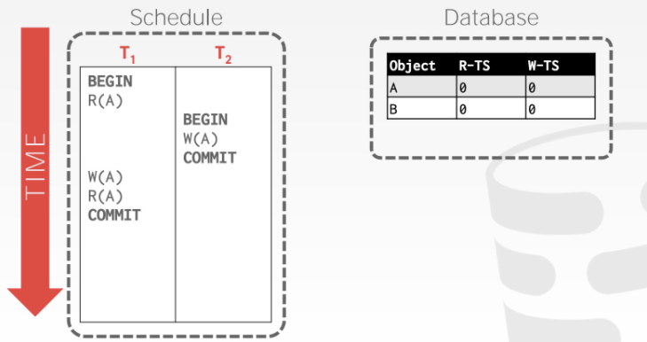
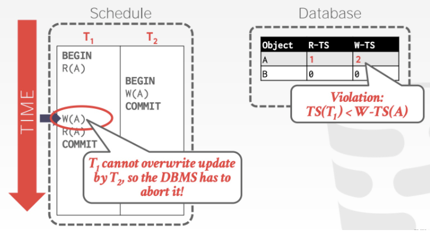
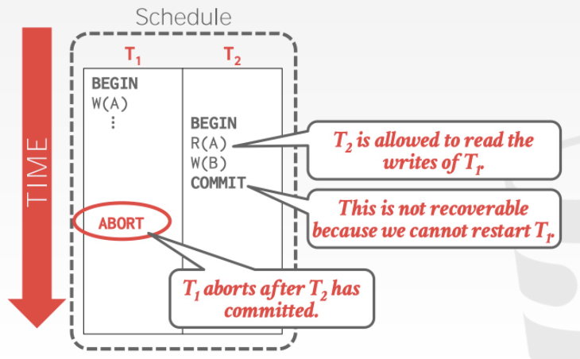

<font face="Monaco">

# Timestamp Ordering Concurrency Control 的简单实现

事务的并发控制有多种实现，比如2PL是悲观的并发控制策略，其效率也可想而之，基于乐观的并发控制策略也有很多，本文通过实现一个简单的kv数据库的T/O并发控制。

## 0x00 T/O基础

### 事务时间戳

每个事务在被执行之前，都会获取一个时间戳，通过这个时间戳，可以决定这些并发调度的最终串行结果，即，如果TS1 < TS2，那么数据库的最终结果必须和先执行T1，后执行T2的结果一致。

当然，这里的时间戳不一定说是“时间戳”，也可以是一个简单的计数器等等。

在T/O中，每条数据都需要多携带2个信息，分别为：

> write_ts(x): 最后一次写入x发生的时间戳，也就是“做了这件事的transcation”

> read_ts(x): 最后一次读x发生的时间戳，同上。

在事务中，我们需要时刻的比对这些值，在防止脏读事件上，T/O做了这样的规定：

> 通过比对TS和write_ts，可以知道读取到的数据是否是“未来的数据”，一旦察觉到，则立刻终止或者重启当前事务。

比如我们可以写出这样的read代码：

```C++
value read(X) {
    if ( TS < write_ts(X) ){
        // abort or restart transcation
    }else {
        value ret = get(X);
        read_ts(X) = max(read_ts(X), TS);
        return ret
    }
}
```

通过`if (TS < write_ts(X))`可以发现是否读取到了一些未来写入的数据，并且，如果进行了读取操作，有必要时需要进行read_ts更新(当前的TS更大时)。

write代码：

```C++
void write(X, val) {
    if ( TS <  write_ts(X) || TS < read_ts(X) ){
        // abort or restart transcation
    }else {
        set(X, val)
        write_ts(X) = max( write_ts(X), TS );
    }
}
```

同样的，写入一个数据，需要确保这个值是否是未来的某个事务写入的，又或者，是未来某个事务已经读取过了，如果发现，那就立刻放弃当前事务或者重启。

### Thomas Write Rule

这里我们先看一个例子：



这里我们有2个事务T1和T2，T1的时间戳为1，T2时间戳为2，那么按这个顺序执行我们可以得到：



在T1进行W(A)时，进行检测，发现其值其实是T2中写入的，在T/O中，我们应该放弃T1事务或者重新开始T1的事务，但其实仔细一想，我们 __可以直接选择放弃T1中的W(A)，并且继续T1的事务__，__最终结果仍然符合串行性(not Conflict Serializable)__。

这就称为托马斯写规则(Thomas Write Rule)，这种规则可以适当的提高事务的执行效率，想象一下，原本有些事务本该被abort，但有了TWR，这些事务得以继续执行，并且不影响串行性。

### Recoverable Schedules

当引入Recoverable Schedules时，问题就变得复杂一些了，因为一些事务可能会被abort，而未来的某些事务可能会读取到一些时间戳比较靠前的事务，并且这个比较靠前的事务最后没能完成commit，然后它abort了，而这个读取到的数据就成了脏数据了。

比如：



T1执行操作W(A)，随后T2执行R(A)读取到了T1所改变的数据(这肯定是允许的，T2是的事务TS比较高)，但问题出现在未来，T1没能完成commit终结了，而T2中所获取到的数据就是脏数据。


## 0x01 提交位

提交位是为了解决之前的问题，通过加入提交位commit(X)，来保证X这个字段 __已经被提交__，那么之后的事务就可以放心的进行读写操作了，如果提交位表示这个字段还未提交，那么就有几种策略的选择了：

> 1. 终止当前的事务。

> 2. 推迟当前的事务，直到这个字段被提交再继续。

那么基于目前所提出的所有理论，就可以进行重构之前的read和write操作。


### Read


在Read请求中，我们会遇到几种问题：

> TS < write_ts(X)

这个和之前的讨论中是一致的，为了确保不读到未来的某些数据，我们只能放弃当前事务。

> TS >= write_ts(X)

在这种情况下，我们就需要使用到提交位了，并且其还需要继续细分，当`TS=write_ts(X)`时，也就是 __和当前事务id是一致的时候，那么不管提交与否(肯定是未提交的，因为当前事务根本就还没结束)，我们允许当前事务读取X__。

当`TS > write_ts(X)`的时候，即看到了一些以前写的数据，这是允许的，但我们 __只允许读取已提交的数据，即判断提交位，如果提交位为真，那么允许读取，如果为假，那么选择放弃当前事务或者等待直到提交位为真__。

基于这种规则，我们可以写出类似的read代码：

```C++
value read(X) {
    if ( TS < write_ts(X) ){
        // abort
    }else {
        // 以前提交的和自己写入的，都是允许读取
        if ( TS == write_ts(X) || (TS > write_ts(X) && commit(X)) ){
            value ret = get(X);
            read_ts(X) = max(TS, read_ts(X)); // 修改读取时间戳
            return ret;
        }else {
            // abort 或者等待提交
        }
    }
}
```

### Write

在Write请求中，有如下问题：

> TS >= read_ts(X) && TS >= write_ts(X)

这种情况可以直接写入。

> TS >= read_ts(X) && TS < write_ts(X)

这种情况发生在一些比较早的事务写入时，已有更高时间戳的事务进行写入，可以考虑TWR，即放弃当前的写入，不过需要进一步的细分，__如果X提交位为真，那么可以直接执行TWR，忽略写入，如果X提交位不为真，那么需要等待提交位为真或者直接放弃写入__。

> TS < read_ts(X)

已经有更高时间戳的事务进行了读取操作，那么只能放弃当前事务。

基于这些规则，我们可以写出write代码如：

```C++
void write(X, val) {
    if ( TS < read_ts(X) ) {
        // abort
    }else {
        if ( TS >= read_ts(X) && TS >= write_ts(X) ){
            set(X, val);
            write_ts(X) = max(write_ts(X), TS);
            return;
        }else {
            if (!commit(X)) {
                // abort 或者等待为真
            }
            set(X, val);
            write_ts(X) = max(write_ts(X), TS);
            return;
        }
    }
}
```


## 0x02 实现 and Test

[code](https://github.com/Swaggerzhan/Timestamp-Ordering)


</font>