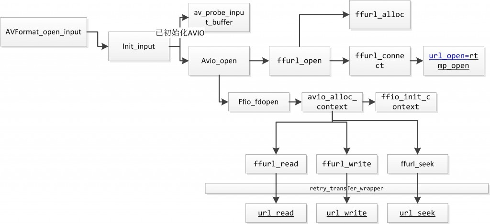
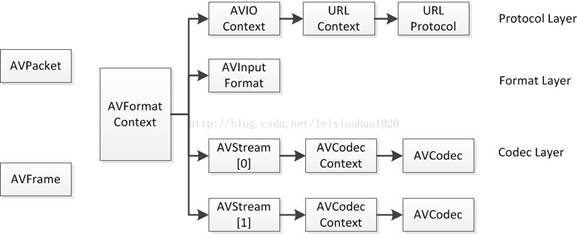

# ffmpeg

### 1. 函数部分

 *  avformat_open_input()
FFMPEG打开媒体的过程开始于avformat_open_input这个函数，它使得AVIOContext初始化，输入输出协议识别。


```C
int avformat_open_input(
    AVFormatContext **ps, // 函数调用成功后处理过的AVFormatContext结构体
    const char *filename, // 打开的音视频的URL
    AVInputFormat* fmt, // AVFormatContext中的AVInputFormat,为NULL自动检测
    AVDictionary **options, // 附加选项，一般为NULL
);

/* 成功返回值>=0 */
```

* avformat_alloc_context()
AVFormatContext 初始化函数

```C
AVFormatContext *avformat_alloc_context(void); // 初始化
void avformat_free_context(AVFormatContext* s); // 销毁
```

* avio_alloc_context()
AVIOContext 初始化函数

```C
AVIOContext *avio_alloc_context(
    unsigned char *buffer, // buffer
    int buffer_size, // buffer size
    int write_flag, // 1表示buffer可写，否则buffer只读
    void *opaque, // 用户自定义数据
    int (*read_packet)(void *opaque, uint8_t *buf, int buf_size),
    int (*write_packet)(void *opaque, uint8_t *buf, int buf_size),
    int64_t (*seek)(void *opaque, int64_t offset, int whence)
);
// 初始化
av_free(AVIOContext* s); // 销毁
```

read_packet()函数是一个读取外部数据填充buffer的函数。
write_packet()函数是一个往buffer中写入数据的函数。

* avformat_new_stream()
AVStream 初始化函数

```C
AVStream *avformat_new_stream(
    AVFormatContext *s,
    const AVCodec *c
); // 初始化
void avformat_free_context(); //销毁
```

* avcodec_alloc_context3()
AVCodecContext 初始化，一般是由AVStream初始化时候顺带初始化了。

```C
AVCodecContext *avcodec_alloc_context3(const AVCodec* codec);
```

* av_format_alloc()
AVFrame 结构体初始化

```C
AVFrame *av_frame_alloc(void); // 初始化
void av_frame_free(AVFrame **frame); // 销毁
```

* av_init_packet()
AVPacket 结构体初始化

```C
void av_init_packet(AVPacket *pkt); // 初始化 可能已经弃坑
static void get_packet_defaults(AVPacket *pkt);// 新初始化函数
int av_new_packet(AVPacket *pkt, int size); // 另外的一个初始化函数，内部调用了av_init_packet函数
void av_free_packet(AVPacket *pkt); // 销毁
```

* avio_open2()
该函数用于打开ffmpeg的输入和输出文件

```C
int avio_open2(
    AVIOContext **s, // 函数调用成功后创建的AVIOContext结构体
    const char *url, // 输入输出协议的地址(文件就是路径)
    int flags, // 标志位
    const AVIOIterruptCB *int_cb, // NULL
    AVDictionary **options // NULL
);
```
其中flags有3个选择
`AVIO_FLAG_READ` 只读
`AVIO_FLAG_WRITE` 只写
`AVIO_FLAG_READ_WRITE` 读写

* avcodec_find_encoder()以及avcodec_find_decoder()
函数用于寻找一个解码或者编码器

```C
AVCodec *avcodec_find_encoder( enum AVCodecID id);
AVCodec *avcodec_find_decoder( enum AVCodecID id);
// 没有找到返回NULL
```

* avcodec_open2()
函数用于初始化一个音视频编码器的AVCodecContext

```C
int avcodec_open2(
    AVCodecContext *avctx, // 需要初始化的AVCodecContext
    const AVCodec *codec, // 输入的AVCodec
    AVDictionary **options // 选项
);

int avcodec_close(AVCodecContext *avctx); // 关闭
```


### 2. 结构体

所有结构体大致是这种关系


`AVFormatContext`:统领全局的基本结构体。主要用于封装格式(FLV/MKV/RMVB等)。
`AVIOContext`: 输入输出对应结构体，用于输入输出(读写文件，RTMP协议等)。
`AVStream, AVCodecContext`: 音频流对应的结构体，用于视频编码。
`AVFrame`: 储存非压缩的数据(视频对应RGB/YUV像素数据，音频对应PCM采样数据)。
`AVPacket`: 储存压缩数据(视频对应H.264等码流数据，音频对应AAC/MP3等码流数据)。

AVFormatContext结构体内容(简略)

```C++
typedef struct AVFormatContext{
    struct AVInputFormat *iformat; // 输入
    struct AVOutputFormat *oformat; // 输出
    AVIOContext *pb; // 输入数据的缓存
    unsigned int nb_stream; // 音视频流的个数
    AVStream **streams; // 音视频流
    char filename[1024]; // 文件名
    int bit_rate; // 比特率(单位bps，转换为kbps除以1000)
    int64_t duration; // 时长(单位:us,1x10^6次方)
    enum CodecID video_codec_id;
    enum CodecID audio_codec_id;
    AVDictionary *metadata; // 元数据 -------|
};                                          |
        |-----------------------------------|
//      |
typedef struct AVDictionaryEntry{
    char *key;
    char *value;
} AVDictionaryEntry;

```

AVIOContext结构体(简略)

```C++
typedef struct{
    unsigned char *buffer; // 缓存开始的位置，其中储存着ffmpeg读入的数据
    int buffer_size; // buf长度
    unsigned char *buf_ptr; // 当前位置(current position in the buffer)
    unsigned char *buf_end; //  缓存结束的位置
    
    void *opaque; // URLContext结构体
    /* 以下是开始时传入的那坨 */
    int (*read_packet)(void *opaque, uint8_t *buf, int buf_size);
    int (*write_packet)(void *opaque, uint8_t *buf, int buf_size);
    int64_t (*seek)(void *opaque, int64_t offset, int whence);

};
/* 每种协议对应一种结构体  */
typedef struct URLProtocol {
	const char *name;
	int (*url_open)(URLContext *h, const char *url, int flags);
	int (*url_read)(URLContext *h, unsigned char *buf, int size);
	int (*url_write)(URLContext *h, const unsigned char *buf, int size);
	int64_t (*url_seek)(URLContext *h, int64_t pos, int whence);
	int (*url_close)(URLContext *h);
	struct URLProtocol *next;
	int (*url_read_pause)(URLContext *h, int pause);
	int64_t (*url_read_seek)(URLContext *h, int stream_index,
		int64_t timestamp, int flags);
	int (*url_get_file_handle)(URLContext *h);
	int priv_data_size;
	const AVClass *priv_data_class;
	int flags;
	int (*url_check)(URLContext *h, int mask);
} URLProtocol;
/* file协议 */
URLProtocol ff_file_protocol = {
    .name                = "file",
    .url_open            = file_open,
    .url_read            = file_read,
    .url_write           = file_write,
    .url_seek            = file_seek,
    .url_close           = file_close,
    .url_get_file_handle = file_get_handle,
    .url_check           = file_check,
};
/* rtmp协议 */

URLProtocol ff_rtmp_protocol = {
    .name                = "rtmp",
    .url_open            = rtmp_open,
    .url_read            = rtmp_read,
    .url_write           = rtmp_write,
    .url_close           = rtmp_close,
    .url_read_pause      = rtmp_read_pause,
    .url_read_seek       = rtmp_read_seek,
    .url_get_file_handle = rtmp_get_file_handle,
    .priv_data_size      = sizeof(RTMP),
    .flags               = URL_PROTOCOL_FLAG_NETWORK,
};
/* udp协议 */
URLProtocol ff_udp_protocol = {
    .name                = "udp",
    .url_open            = udp_open,
    .url_read            = udp_read,
    .url_write           = udp_write,
    .url_close           = udp_close,
    .url_get_file_handle = udp_get_file_handle,
    .priv_data_size      = sizeof(UDPContext),
    .flags               = URL_PROTOCOL_FLAG_NETWORK,
};
```

AVCodecContext结构体(简略)

```C++
typedef struct AVCodecContext{
    enum AVMediaType codec_type; // 编码器类型
    struct AVCodec *codec; // 采用的解码器(H.264, MPEG2..)
    int bit_rate; // 比特率
    uint8_t *extradata; 
    itn extradata_size; // 针对特定编码器的附加信息,比如h.264储存方式pps，sps
    AVRational time_base; // 可以把PTS转化为实际时间
    int width, height; // 宽高
    int refs; // 运动参考帧个数
    int sample_rate; // 采样率
    int channels; // 声道数
    enum AVSampleFormat sample_fmt; // 采样格式
    int profile;
    int level;
/* 以上许多都是在编码时候使用 */
};
```

### 关于AVFrame结构体

其中比较重要的结构体成员

```C++
// 源码中是这样定义的
#define AV_NUM_DATA_POINTERS 8 
uint8_t *data[AV_NUM_DATA_POINTERS]; // 解码后的原始数据
/* 当存储packed格式数据，如RGB24等等会直接存储在data[0]里面 */
/* 当存储planar格式数据时如YUV420P会在data[0]中存储Y, data[1]中存U
    data[2]中存V
 */

/* data中一行数据的大小，需要根据具体format进行计算 */
/* 对于ARGB8888格式的为 width * 4 */
int linesize[AV_NUM_DATA_POINTERS]; 

int width, height; // 宽高

int nb_samples; // 音频中的一个AVFrame中可能有多个音频帧，此成员表示有几个

int format; // 解码后的格式，如YUV420, YUV422, RGB24, RGB32等

int key_frame; // 是否是关键帧
```

```C++
/* 其中对于结构体的操作函数 */

/* 申请AVFrame结构体空间，这里只包含了结构体，其中的图像数据pinter还是null的 */
AVFrame* av_frame_alloc();

/* 申请AVFrame中所指向的图像数据的空间，这里需要提前设置frame的各种参数后才能获取
align是属于对齐，和frame中的linesizec差不多
 */
av_frame_get_buffer(AVFrame* frame, int align);

/* 销毁frame结构体，并且减少一个data的引用计数 */
av_frame_free(AVFrame** frame);
```

由于频繁的复制图像数据将使得生成帧或者渲染时间的时间降低，所以要避免频繁的复制相同的数据，所以ffmpeg内部采用某些数据共享的方式来进行操作，通过ref引用来`共用`数据，其中维护着一个引用计数，最后一个被free的AVFrame结构体负责销毁共享的数据。

```C++
/* dst中的结构体使用和src中相同的图像数据，这个操作将使得data数据中的引用计数+1 */
av_frame_ref(AVFrame* dst, AVFrame* src);

/* 查看引用计数数量，这个操作是原子的，但是作用并不大
当这条函数执行后还是有概率会被其他线程free掉数据导致计数是错误的
 */
av_buffer_get_ref_count(const AVBufferRef* buf);
```


引用: https://blog.csdn.net/leixiaohua1020/article/details/44064715