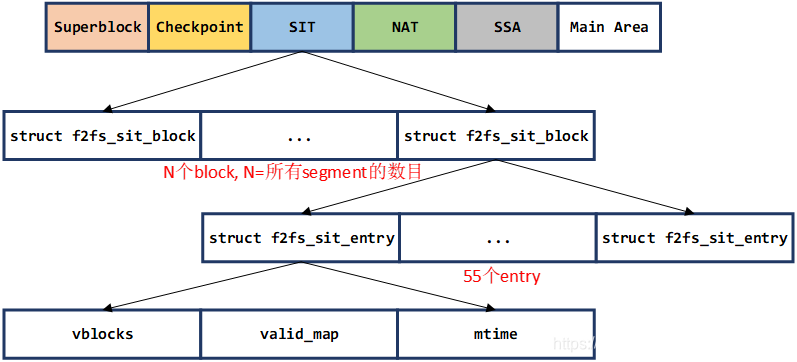
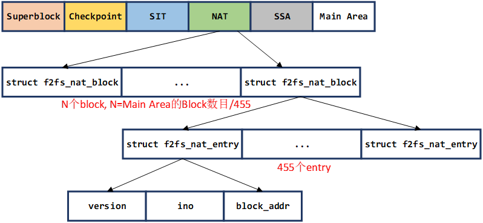
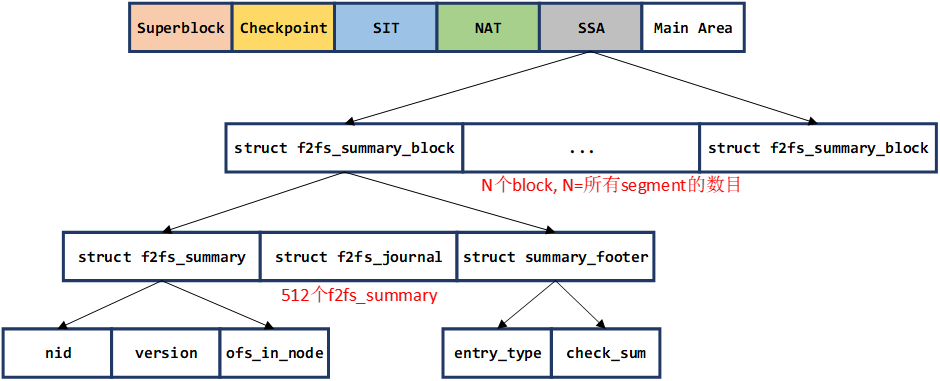

# F2FS


首先，F2FS将文件系统的unit划分为以下几种：

zone -> section -> segment -> block

其中512个block组成一个segment，至于segmnt和section、zone的大小，这里暂时先比做1:1，仅看segment即可。


## 文件系统meta信息

### superblock

### check point

### segment info table(SIT)

源码结构：

```c
// SIT_VBLOCK_MAP_SIZE 64
struct f2fs_sit_entry {
        __le16 vblocks;                         /* reference above */
        __u8 valid_map[SIT_VBLOCK_MAP_SIZE];    /* bitmap for valid blocks */
        __le64 mtime;                           /* segment age for cleaning */
} __packed;

struct f2fs_sit_block {
        struct f2fs_sit_entry entries[SIT_ENTRY_PER_BLOCK];
} __packed;
```

按图形显示则为：




解释一下其中的内容：

每一个f2fs_sit_entry对应一个segment，所以其中的bitmap刚刚好是512。

TODO：这里的f2fs_sit_block应该是没有什么强关联？只是为了将整个block刚刚好塞到内核的page中？

SIT可以用来做可用的block挑选、mtime也可以用作gc使用。

### Node Address Table (NAT)

这是一个映射表，用于将node id映射到一个int32_t 的offset，这个offset从Main area开始，源码中的结构如图：

```c
/*
 * For NAT entries
 */
#define NAT_ENTRY_PER_BLOCK (F2FS_BLKSIZE / sizeof(struct f2fs_nat_entry))

struct f2fs_nat_entry {
        __u8 version;           /* latest version of cached nat entry */
        __le32 ino;             /* inode number */
        __le32 block_addr;      /* block address */
} __packed;

struct f2fs_nat_block {
        struct f2fs_nat_entry entries[NAT_ENTRY_PER_BLOCK];
} __packed;
```

这个地址转化简单的将NAT部分的开始部分作为inode=0的开始，将整个“f2fs_nat_entry”作为“数组”的单位做转化(实现上可能略有不同，会先拿到block的index，然后继续计算entry的index)。





### Segment Summary Area (SSA)

保存每个Segment(包括内部的block)的反查信息，结构为：

```c
#define SUM_ENTRY_SIZE          (SUMMARY_SIZE * ENTRIES_IN_SUM)
/* a summary entry for a block in a segment */
struct f2fs_summary {
        __le32 nid;             /* parent node id */
        union {
                __u8 reserved[3];
                struct {
                        __u8 version;           /* node version number */
                        __le16 ofs_in_node;     /* block index in parent node */
                } __packed;
        };
} __packed;

/* Block-sized summary block structure */
struct f2fs_summary_block {
        struct f2fs_summary entries[ENTRIES_IN_SUM];
        struct f2fs_journal journal;
        struct summary_footer footer;
} __packed;
```

每个f2fs_summary对应一个block。
当这个block作为data block的时候，其中nid直接指向所属inode，ofs_in_node表示本数据块属于“整个inode”第几个数据块。这个ofs_in_node大致可以理解为索引地址，主node的结构就是direct index，其余的均为对应的indirect index，可以通过ofs_in_node找到一个NAT中的地址，进而修改这块地址实现“变更”。

当作为node block的时候，



