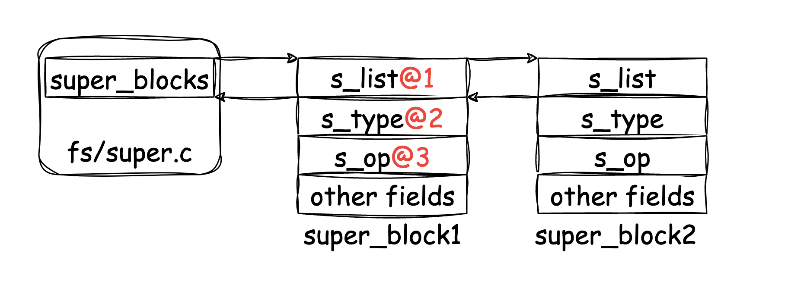
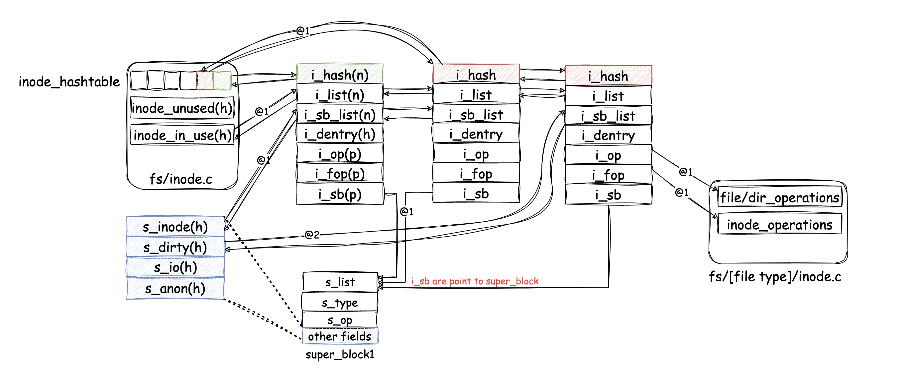

# 从linux的vfs开始理解文件系统的实现

# 从linux的vfs开始理解文件系统的实现(1)

挂载对于一个文件系统而言到底意味着什么？对于本地文件系统，可能需要读取磁盘中的内容到内存中，对于网络文件系统，读取一些必要的信息和本地文件系统应该没多大区别，不过可能会在远程服务器上拿点什么唯一标识符之类的，初始化一些服务器的状态，然后我又想到挂载点本身就已经存在了一个“目录”，所以这其中的内容可能还涉及到隐藏挂载点目录的信息等操作，至于发生了什么，只有到代码中去寻找答案了。

以下内容基于Linux kernel 2.6.36 版本。

### 挂载流程

我们直接略过用户态相关的，从内核开始，mount系统调用声明位于fs/namespace.c中的: `SYSCALL_DEFINE5(mount, ...)`，入口函数为其中的do_mount函数：

```c
long do_mount(char* dev_name, char* dir_name, char* type_page, unsigned long flags, void* data_page){
    struct path path;
    // ...
    retval = kern_path(dir_name, LOOKUP_FOLLOW, &path);
    // some flags check ...
    // if new mount, we go here:
    do_new_mount(&path, type_page, flags, mnt_flags, dev_name, data_page);
}
```
> kern_path(): 函数主要功能是从根文件系统开始"walk"，找到符合dir_name的路径，然后初始化path结构体，这里的dir_name，就是想要挂载的路径，称为"mountpoint"，dev_name为挂载的设备名字，比如/dev/sdb等等。

现在我们关注其中的do_new_mount函数:
```c
static int do_new_mount(struct path* path, char* type, int flags, int mnt_flags, char* name, void* data) {
    struct vfsmount *mnt;
    lock_kernel();
    mnt = do_kern_mount(type, flags, name, data);
    unlock_kernel();
    // ...
    return do_add_mount(mnt, path, mnt_flags, NULL);
}
```
> do_kern_mount(): 挂载中比较核心的函数，主要做了以下几件事：
>> 1. 根据type获取到file_system_type，从而拿到初始化superblock的方法(具体见filesystem注册方式)。
>> 2. 调用vfs_kern_mount，初始化vfsmount内存、使用之前获取的指针初始化superblock结构体，一般而言，初始化superblock的函数都在fs/[file system type]/super.c里。

当上述superblock结构体被初始化完成后，会使用s_list字段以链表的形式链接起来，如下图：



链表的头部位于fs/super.c中的super_blocks变量，而s_op则作为superblock的各种操作指针，由各自的文件系统实现，内容大致为：

> do_add_mount():
>> 1. TODO: 检查是否发生了变化？
>> 2. 调用graft_tree()做namespace相关的操作，核心调用函数为：attach_recursive_mnt()，内部又调用了这几个函数：
>> 3. propagate_mnt()关于namespace相关的，暂时先略过。
>> 4. mnt_set_mountpoint(): 设置新生成的vfsmount的mount树结构，每一个“挂载”操作都会生成一个vfsmount，vfsmount会保留parent树结构相关的内容，这里所保存的是parent的vfsmount，以及“挂载点”的dentry。
>> 5. commit_tree(): 使用parent的vfsmount+mountpoint的dentry地址作为hash key，新vfsmount作为值来保存，再将新vfsmount链到parent vfsmount的children链表中。

mount流程大概讲完了，后面补充下关于结构体相关的内容。首先是vfsmount相关的：

```c
struct vfsmount {
    struct list_head mnt_hash;
    struct vfsmount *mnt_parent;    /* fs we are mounted on */
    struct dentry *mnt_mountpoint;  /* dentry of mountpoint */
    struct dentry *mnt_root;        /* root of the mounted tree */
    struct super_block *mnt_sb;     /* pointer to superblock */
    struct list_head mnt_mounts;    /* list of children, anchored here */
    struct list_head mnt_child;     /* and going through their mnt_child */
    int mnt_flags;
    /* 4 bytes hole on 64bits arches */
    const char *mnt_devname;        /* Name of device e.g. /dev/dsk/hda1 */
    struct list_head mnt_list;
    struct list_head mnt_expire;    /* link in fs-specific expiry list */
    struct list_head mnt_share;     /* circular list of shared mounts */
    struct list_head mnt_slave_list;/* list of slave mounts */
    struct list_head mnt_slave;     /* slave list entry */
    struct vfsmount *mnt_master;    /* slave is on master->mnt_slave_list 
};
```


### inode

inode结构体在vfs中的定义大致为：

```c
d
```

结合一下图片进行解释：


> inode申请来自于`get_new_inode函数(fs/inode.c)`，这是个vfs的函数，初始化的时候会完成简单的设置，图中@1的绝大部分会在这个函数中完成(各种链表的链接)，一般刚刚初始化的inode会被链到in_use的链表中，i_op和i_fop会指向这个empty的operations，get_new_inode一般会被真正的文件系统实现来调用，如ext4的`ext4_iget函数(fs/ext4/inode.c)`，在这里，函数会填充i_op、i_fop(根据类型dir/file来判断)指针。

> 值得注意的是，inode除了使用链表来链接这些结构体以外，也使用了hash的方式来提寻找的速度(TODO:hash方式？)。

> @2的部分则是会根据inode的状态来进行动态调整，比如superblock中的一些链表，s_dirty表示这些inode在内存中还有未刷入磁盘的数据，s_io则表示这些inode正在执行磁盘相关的操作。


--- 


直接从Linux的vfs内核部分开始，最终mount系统调用来到了do_mount，位于fs/namespace.c，大致的调用流程为：

```c
do_mount
  ->user_path @1
    do_new_mount
      ->get_fs_type # 从filesystme模块中，找到已注册好的设备(register_filesystem)
        vfs_kern_mount 
          ->alloc_vfsmnt 
            mount_fs # 调用对应filesystem的mount函数
            list_add_tail # 暂时不清楚这个干啥的
        mount_too_revealing # 挂载点可视？
        do_add_mount
          ->graft_tree
              ->attach_recursive_mnt
```


> @1 拿到需要挂载的struct path信息


TODO：将QA串成一个完整的文章


---
Q1:
只知道get_filesystem，看似找了一些啥东西，拿到了filesystem_type，然后用这个里头的mount指针做了mount操作，不清楚这个mount啥时候预留的，不过也看到了register_filesystem，可能是有地方做了驱动的注册？

A1:
在fs/ext4.c中看到了ext4_init_fs，确实调用了register_filesystem来注册文件系统。
```c
static struct file_system_type ext4_fs_type = {
	.owner		= THIS_MODULE,
	.name		= "ext4",
	.mount		= ext4_mount,
	.kill_sb	= kill_block_super,
	.fs_flags	= FS_REQUIRES_DEV,
};

static int __init ext4_init_fs(void)
{
    ...
    err = register_filesystem(&ext4_fs_type);
}
```

TODO:
1. 看一下fuse的注册方式？
2. ext4_mount做了啥？类比一下fuse？
3. kmem_cache结构体，看着是slab内核存储池相关的

---

Q2: 
如何理解Linux中的block device概念？

---

Q3:
每个path都有对应的一个mnt信息？没有就null么？do_add_mount加入到namespace mnt tree？整个namespace的mnt tree是咋样的？这个vfsmount最终有变成对应的fs类型？
```c
struct path {
	struct vfsmount *mnt;
	struct dentry *dentry;
} __randomize_layout;

struct vfsmount {
	struct dentry *mnt_root;	/* root of the mounted tree */
	struct super_block *mnt_sb;	/* pointer to superblock */
	int mnt_flags;
} __randomize_layout;
```

---

Q4:
暂时只知道模块初始化的方式，module_init的宏定义，至于内核怎么加载的，暂时搁置

---

# some linux code style

通过一个field指针，拿到结构体首部地址：

```c
container_of(ptr, struct, field name);
// example
struct Header {
    int field1;
    int field2;
    int field3;
}
Header h;
int* p = h.field2;
Header* point2header = container_of(p, struct Header, field2);
```


4.19.191


# fuse

fuse分为内核模块和用户态模块，内核模块需要注册对应的字符串设备(也有可能是块设备方式的实现)/dev/fuse，可以在fs/fuse目录中，找到相关的注册代码。


fuse内核模块的启动逻辑：
module_init


kmem_cache_create 初始化一个slab内存池,


TODO：fuse的初始化流程

fs/fuse/dev.c中，做了关于/dev/fuse的初始化，注册了比较关注的dev的fops：

```c
const struct file_operations fuse_dev_operations = {
	.owner		= THIS_MODULE,
	.open		= fuse_dev_open,
	.llseek		= no_llseek,
	.read_iter	= fuse_dev_read,
	.splice_read	= fuse_dev_splice_read,
	.write_iter	= fuse_dev_write,
	.splice_write	= fuse_dev_splice_write,
	.poll		= fuse_dev_poll,
	.release	= fuse_dev_release,
	.fasync		= fuse_dev_fasync,
	.unlocked_ioctl = fuse_dev_ioctl,
	.compat_ioctl   = fuse_dev_ioctl,
};
```

然后便是这里比较有意思的点，fuse_dev_open和fuse_dev_ioctl


---

# tmpfs

tmpfs感觉也是一个比较有意思的东西，在内核中称为shared_memory_filesystem，其代码位于mm/shmm.c中。


我们从之前说起的vfs开始，接着tmpfs来续说，先看简单的一个函数调用栈：

```
mount_fs
  ->shmem_mount
      ->shmem_fill_super #  @1 
          ->uuid_gen # fs唯一uuid
            shmem_get_inode # @2 
            d_make_root # 赋值给superblock的s_root
        
```

> @1 一个函数指针的调用方式，这里直接简化了，调用者做了superblock的内存初始化，然后交给本函数做填充，同时也填充了shmem_ops，这里头表明了一些对superblcok的op指针，后续也许对他会感兴趣

```c
static const struct super_operations shmem_ops = {
	.alloc_inode	= shmem_alloc_inode,
	.destroy_inode	= shmem_destroy_inode,
#ifdef CONFIG_TMPFS
	.statfs		= shmem_statfs,
	.remount_fs	= shmem_remount_fs,
	.show_options	= shmem_show_options,
#endif
	.evict_inode	= shmem_evict_inode,
	.drop_inode	= generic_delete_inode,
	.put_super	= shmem_put_super,
#ifdef CONFIG_TRANSPARENT_HUGE_PAGECACHE
	.nr_cached_objects	= shmem_unused_huge_count,
	.free_cached_objects	= shmem_unused_huge_scan,
#endif
};
``` 


> @2 初始化root inode，由于是tmpfs，这里的inode生成算法是一个机器启动后的递增seq，这里使用一个函数包了一些，确保在多核心上，一样可以获取到一个唯一的递增序列。
> 除了这些，我想我们更关注下面的的内容：对这个inode做对应的op指针初始化，我们所熟知的，对于inode的各种操作，就始于这里(其他文件系统类似)，这里传递进来的mode是S_IFDIR，即目录。

```c

case S_IFDIR:
	inc_nlink(inode);
	/* Some things misbehave if size == 0 on a directory */
	inode->i_size = 2 * BOGO_DIRENT_SIZE;
	inode->i_op = &shmem_dir_inode_operations;
	inode->i_fop = &simple_dir_operations;
	break;
	
...
static const struct inode_operations shmem_dir_inode_operations = {
#ifdef CONFIG_TMPFS
	.create		= shmem_create,
	.lookup		= simple_lookup,
	.link		= shmem_link,
	.unlink		= shmem_unlink,
	.symlink	= shmem_symlink,
	.mkdir		= shmem_mkdir,
	.rmdir		= shmem_rmdir,
	.mknod		= shmem_mknod,
	.rename		= shmem_rename2,
	.tmpfile	= shmem_tmpfile,
#endif
#ifdef CONFIG_TMPFS_XATTR
	.listxattr	= shmem_listxattr,
#endif
#ifdef CONFIG_TMPFS_POSIX_ACL
	.setattr	= shmem_setattr,
	.set_acl	= simple_set_acl,
#endif
};
``` 


---

Q1:
在mm/shmm.c中完成tmpfs的初始化的同时，也挂载了一个tmpfs，不同的是，这个tmpfs并没有直接暴露出来，而是直接保存在了当前文件，以static的方式保存了一个vfs的挂载点，并且ns=-1，这里的挂载点会暴露？啥时候暴露？

A1:
当前只能知道是用户也能够进行挂载，并且走的是vfs的普通mount路线，传递的挂载flags也有不同，同时用户的挂载方式是可以暴露内容挂载点内容的

TODO:内核的挂载
TODO: fs/open.c vfs_open
TODO: 内核挂载中，ramfs和rootfs明显不一样，并且配置中CONFIG_TMPFS是yes状态，表明注册的应是rootfs，而非ramfs，如果走的是ramfs？那么get rootfs不会failed？哪里做了ramfs的初始化？并且也没有看到“/”如何被挂载的？只是知道当前的进程task的fs是rootfs/ramfs的根而已。

---


log: 内核的root文件系统明显不是根据某个全局变量或者啥的来存储的，是通过fork等传递进程中关于fs_struct结构体来传递的，其中就有vfsmount，并且通过real_mount来获取真实的struct mount结构体。

暂时不清楚init进程是如何替换掉这个“/”结构的，如何通过挂载覆盖掉一开始初始化的rootfs/ramfs


TODO：文件目录的open中，到底是哪个地方做了mount转化，比如/mnt/test/dir1/file1，其中/mnt/test是一个挂载点，在path work过程中，怎么做的转化？走到test这个dentry的时候，是怎么做的切换？或者说我们根本就不在意这个切换？关键字：follow_mount