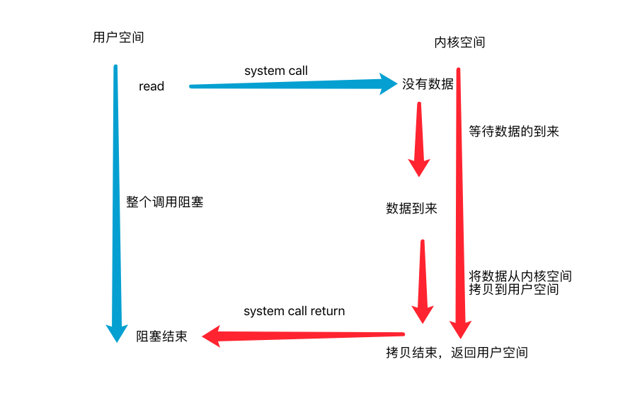
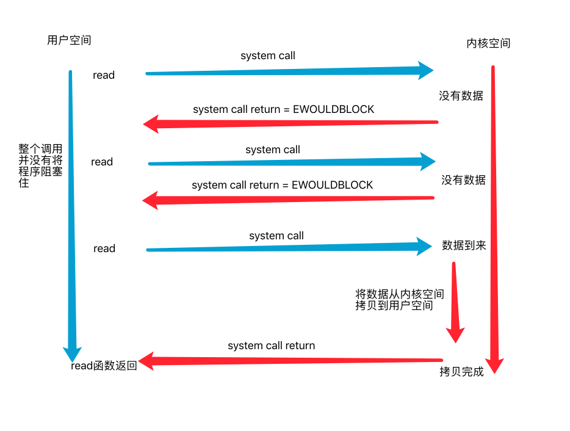
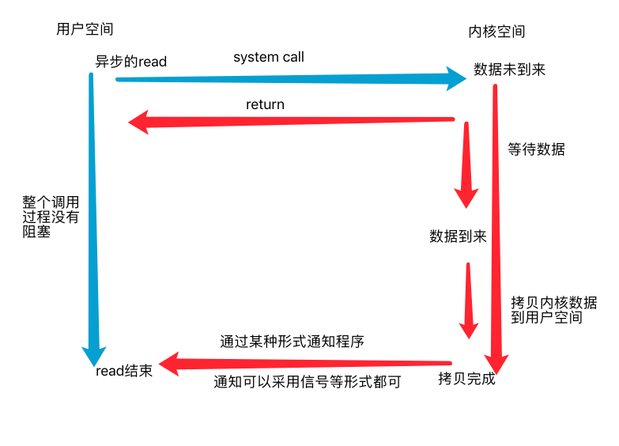

# EPOLL

### 1. 文件描述符

文件描述符号 (File Descirptor)大多是Linux下的一个术语，是一个用于表述指向文件的引用的抽象化概念。

文件描述符在形式上是一个非负整数。实际上，它是一个 __索引值__ ，指向内核为每一个进程所维护的该进程打开文件的记录表， __当一个程序打开一个文件或者是一个网络socket时，内核向进程返回一个文件描述符__ 。

对于文件，管道或者网络socket的读写，有许多种模式:

##### * 阻塞IO (Blocking IO)

当进程发起`read`系统调用时候，整个程序进入阻塞状态。如果`read`调用对象`fd`是一个网络上的`socket`，并且其属性是属于`阻塞fd`， __只有当数据到达后，内核将网络上的数据接收到网络协议栈(这个也是在内核空间)中，并且复制到内核空间，再从内核空间复制到用户空间后，程序才正真返回，整个过程，程序都在`阻塞`状态下__ 。

##### * 非阻塞IO (NonBlocking IO)

当进程发起`read`系统调用读一个`非阻塞fd`的时候，程序并不会进入阻塞状态，它只是跟内核空间 __"询问了一下有没有数据"__ ，如果没有数据，则 __立刻返回错误，并且将errno设置为EWOULDBLOCK或者EAGAIN__ ，当再次调用`read`系统调用的时候，数据已经到达了， __那么内核就会将数据拷贝到用户空间，并且结束`read`系统调用。整个过程`read`并没有阻塞(其实还是有，程序在从内核空间复制数据到用户空间的这段时间其实是不能做事情的，这就是同步和异步的区别)，在没有数据到来的情况下可以去做其他事情__ 。

##### * 异步IO (Asynchronous IO):

当进程发起一个`异步的read调用`的时候会 __立即返回__ ，当整个`异步read函数`结束后才会以某种形式通知进程， __整个过程进程并没有阻塞__ 。异步操作和非阻塞型IO的差距就在于异步是 __"整个操作结束后才通知进程"__ ，而且非阻塞型IO需要自己 __"收数据"，即从内核空间复制数据到用户空间这段时间进程是不能做其他事情的__ 。

### 2. select与poll

select能够监听的文件描述符存在限制，最大通常是1024，你也可以改变数量。

select是采用轮询的方式来扫描文件描述符的，当数量过大时，性能会变得非常差。

select也存在内核空间用户空间的拷贝问题。

select返回的是一个含有整个fd的数据，程序需要遍历数组才能知道哪些fd发生了事件。

相比于select，poll采用了链表的形式来保存fd，没有最大文件的限制，但其他关于select的缺点依然存在。

如果说优点，那么select的优点就是移植性好了，并且由于精度够高，其实还是能用来做一些定时操作的。

### 3. epoll事件参数

解释参数之前，先了解一下EPOLL的 __水平触发(level trigger)__ `LT`和 __边缘触发__ (edge trigger)`ET`。

区分两者比较明显的方式是

对于可读事件
* LT: 当一个fd文件描述符中存在数据，则 __持续触发。__
* ET: 当一个文件描述符中存在数据，则触发，如果后续没有继续进行处理，则不触发，直到 __文件描述符中的缓冲区变化后触发。__ 所以当一个文件描述符是ET方式的时候，应该循环将其缓冲区中的值读出，否则后续将不再触发，若将监听套接字设置为ET方式，在高并发的时候，可能会丢失某些链接，需要等到新客户链接才会继续触发，所以应当循环accpet直到accpet返回-1并且将errno设置为EAGAIN表示没有新连接。

事件参数具体解析：

* ### __EPOLLIN__ 
    文件描述符可读，当客户端调用close断开fd时也会触发，表现为读取套接字长度为0，又或者客户端调用了shutdown(sock, SHUT_WR)停止读取服务器发来的数据，那么服务器也会触发EPOLLIN并且当read时候返回长度为0
* ### __EPOLLOUT__

    文件描述符可写

* ### __EPOLLHUP__

    关闭读写会触发

* ### __EPOLLRDHUP__

    对方关闭读的情况会触发，并不是所有操作系统都会触发
    
* ### __EPOLLONESHOT__

    只监听一次事件。
    
    如果存在以下例子，当一个fd发起请求时，服务器进行解析的同时，同样的fd又发来一个新事件，那么在多线程服务器中势必会分配另外一个线程来处理此事件，那么就会导致多个线程处理同一个fd的情况。为了避免这个条件，对一个fd设置事件`EPOLLONESHOT`就可以避免，当一个fd的事件处理完后在重新注册进epoll。
    