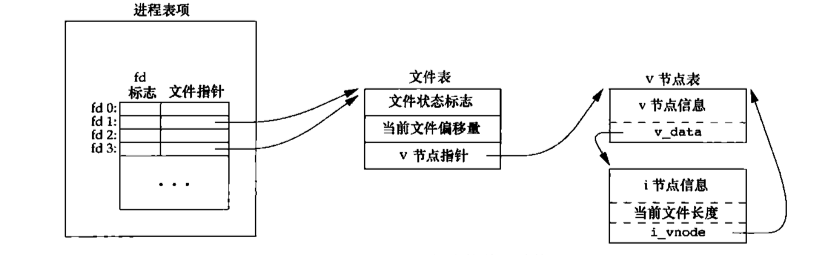
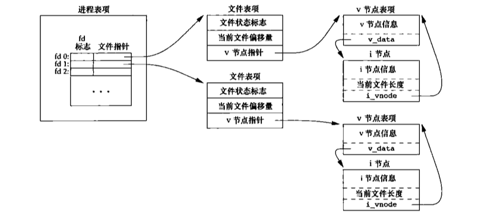
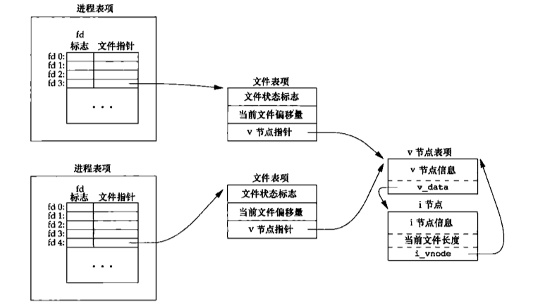

[TOC]
# linux-file
## 一、函数
### 1. open函数
__int open(const char* path, mode_t mode);__


* O_RDONLY __只读打开__  RD-->read.  ONLY
* O_WRONLY __只写打开__  WD-->write. ONLY
* O_RDWD __读写打开__    WD-->write. RD-->read
* O_EXEC __只执行打开__
* O_SEARCH __只搜索打开__
* O_APPEND __追加，写的时候追加到文件尾部__
* O_CREAT __文件不存在则创建(需要添加访问权限..)__
* O_NONBLOCK __将文件描述符设置为非堵塞型__
* O_SYNC __使每次write等待物理I/O操作完成__
* O_TRUNC (..)

以上是mode_t的参数，其中(O_RDWD | O_CREAT | O_TRUNC)三个参数一起传入可以实现和`creat()`函数一样的效果，`creat()`函数是早期unix系统的遗留问题额外添加，现在可以由`open()`函数直接代替。

### 2. close函数
__int close(int fd);__
关闭一个文件描述符号，同时也会关闭设置在这个文件上的所有`记录锁`。

### 3. lseek函数
__off_t lseek(int fd, off_t offset, int whence);__


* SEEK_CUR __返回当前文件位置，如果offset有数据则将偏移量增加到对应的fd中__
* SEEK_SET __将文件偏移量设置为offset__
* SEEK_END __返回文件长度，如果offset有数据则将文件长度增加offset__

>其中off_t的原型是 int64_t 也就是 long long型


用来查看文件描述符fd当前读取到的位置偏移量，其中实现方法使用的是fd所对应的结构体(之后解释)。使用对象是网络套接字和标准输入输出描述符则会出现报错。

### 4. read函数

__ssize_t read(int fd, void* buf, size_t nbytes);__

read成功，返回读到的字节数。如果已经达到文件尾部，则返回0。
如果 `size_t nbytes`所给定的数值过大，超过文件描述符中数据的长度，则直接全部读取，并且返回`fd中所有的数据的 长度`，`下一次读取时返回 0`。
如果读取的是`管道、网络套接字或者标准输入与标准输出`且其中没有数据，则会出现 __堵塞__，将描述符设置为 __NONBLOCK__则会直接返回`-1并且设置errno`。read函数不对`buf`参数负责，如果 __buf空间小于nbytes和fd中数据长度,__  __空间大小不够的buf持续读入可能会出现`越界`情况。__

### 5. write函数

__ssize_t write(int fd, void* buf, size_t nbytes);__

write函数则和read函数返回值相同，通过fd所绑定的结构体中所记录的当前文件偏移量写入数据。其中`O_APPEND`方式打开会影响文件状态标志(细节见文件的数据结构)。如果`size_t nbytes`的数值超过buf，那么只会写入buf中的所有数据并且返回buf的长度。出错时候设置`errno`。

### 6. pread函数与pwrite函数

__ssize_t pread(int fd, void* buf, size_t nbytes, off_t offset);__
__ssize_t pwrite(int fd, const void* buf, size_t nbytes, off_t offset);__

调用pread方法相当于调用了lseek后调用read，与自己手动调用这两个函数的区别：
* pread运行时不可中断其定位和读操作。
* 不更新当前文件偏移量。

### 7. dup函数和dup2函数

__int dup(int fd);__
__int dup2(int fd, int fd2);__

__dup和dup2函数是干什么的用一张图片就可以清楚解释：__

返回一个新的文件描述符，它所指向的文件和参数fd指向的文件相同。

dup函数返回一个新文件描述符，是当前文件描述符中最小值。对于dup2，可以使用fd2参数来指定新的描述符的值，如果fd2已经打开，就先关闭fd2。如果fd2等于fd，则直接返回fd2。

### 8.readv和writev函数

readv和writev即散布读和散布写，可以在一次调用读写多个缓冲区。使用这种方案比多次调用read或者write函数效率要高，毕竟谁也不想调用相同的系统调用多次，徒增切换花销。
```C++
#include <sys/uio.h>

ssize_t readv(int fd, const iovec *iov, int iovcnt);
ssize_t writev(int fd, const iovec* iov, int iovcnt);
// iov是一个指向iovec结构体的数组，iovcnt表示数组个数

struct iovec{
    void *iov_base; /* 起始地址 */
    size_t iov_len;/* 长度 */
};
```

### 9. 储存映射IO函数mmap

储存映射能将磁盘上的一个文件直接映射到内存中的一个缓冲区上，当从缓存区中读写信息就等同于在文件中读写信息，即在不实用read和write的情况下执行IO操作。
```C++
#include <sys/mman.h>
/* 返回值为映射区指向的地址 */
void *mmap(void *addr, size_t len, int prot, int flag, int fd, off_t off);
/* 改变映射区的权限 */
int mprotect(void *addr, size_t len, int prot);
/* 关闭映射区 */
int munmap(void* addr, size_t len);
```
addr参数指向一个地址，表示将磁盘数据映射到这个地址上，建议设置为0，由操作系统接管。
prot表示映射地区的保护要求，可按位打开
```C++
PROT_READ // 映射区可读
PROT_WRITE // 映射区可写
PROT_EXEC // 映射区可执行
PROT_NONE // 映射区不可访问
```
flag字段可以用来设置映射区的属性等
```C++
MAP_FIXED // 必返回指定的addr地址，不建议
MAP_SHARED // 对于映射区的操作等同于对文件的操作
MAP_PRIVATE // 对于缓存的操作不改变文件本身 调试可用
```
fd为指向的文件，off表示文件偏移量
最后，fork的子进程是可以继承映射区的，但是exec后就不共享了。


## 二、文件共享
### 1. 维护文件的数据结构

每一个进程中都存在一个 __进程表项__，其中存有`fd`所对应的`文件指针`，`文件指针`又指向 __文件表项__，文件表项中储存着当前`文件状态标志`，`当前文件偏移量`(只针对打开此文件的进程，每一个进程维护着自己的文件偏移量)，以及`v节点指针`(linux中不使用vnode)。


如果两个独立的进程打开了相同的文件：


使用`O_APPEND`打开方式的时候， __每次write往文件中写入都会实时通过文件v节点指针(i节点指针)获取文件长度__，并且加上偏移量进行写入，这种方法和使用lseek函数实现的有差别。

例如有两个进程A与B，A和B都打开了相同的文件(没有使用`O_APPEND`标志位)，A和B的进程中都有着自己独立的 __文件表项__，有着自己的 __文件偏移量__，文件初始大小1500， __之后A使用lseek获取了文件大小__， __想往文件尾部写入100字节__，但是巧合的是这时候内核`切换`了进程。进程B开始运行，进程B进行和A一样的操作， __lseek文件得到1500__，写入100字节，之后文件长度 __更新到1600__。内核再次切换到进程A运行， __从1500处开始写入__，进而发生错误。 __如果该用O_APPEND方法就可以避免此问题，因为O_APPEND标志位是偏移量+文件长度的方式，可以实时获取真正的文件长度，但是这种方法也存在问题__。另一种解决方式正是`原子操作`。

## 三、文件权限

### 1.文件类型

在理解文件权限之前，我们先了解一下文件权限是怎么存储在linux中的。linux提供许多API来获取文件信息的函数

```C
#include <sys/stat.h>

int stat(const char* pathname, struct stat* buf);
int fstat(int fd, struct stat *buf);
int lstat(const char* pathname, struct stat* buf);
int fstatat(int fd, const char* pathname, struct stat* buf, int flag);

// 成功return 0，出错return -1
```

对于返回的`结构体stat`的定义如下

```C
struct stat{
    mode_t          st_mode; /* 文件类型和权限都存储在此 */
    ino_t           st_ino; /* i-node节点个数 */
    dev_t           st_dev;
    dev_t           st_rdev;
    nlink_t         st_nlink;
    uid_t           st_uid; /* 所有者ID */
    gid_t           st_gid; /* 所有组ID */
    off_t           st_size; /* 文件长度，主要用于普通文件 */
    struct timespec st_atime; /* 最后访问时间 */
    struct timespec st_mtime; /* 最后修改时间 */
    struct timespec st_ctime; /* 最后改变文件状态时间 */
    blksize_t       st_blksize;
    blkcnt_t        st_blocks; /* 磁盘中分配了多少个块 */
};
```

对于其中比较常用的几个字段，如st_mode可以使用Linux所定义的宏来进行访问。
```C
S_ISREG() /* 是否为普通文件 */
S_ISDIR() /* 是否为目录文件 */
S_ISCHR() /* 字符特殊文件 */
S_ISBLK() /* 块特殊文件 */
S_ISFIFO() /* 管道符文件 */
S_ISLNK() /* 符号链接 */
S_ISSOCK() /* 是否为套接字 */
```

### 2. 权限

Linux中有许多关于ID概念
    
    * 实际用户ID
    * 实际组ID
    * 有效用户ID
    * 有效组ID
    * 附属组ID
    * 保存的设置用户ID
    * 保存的设置组ID

对于stat结构体中存在的两个字段`st_uid`和`st_gid`分别对应 __文件的所有者__ 和 __文件的所有者组__ 。 当我们以`swagger`用户登陆时候，我们所登陆的那个shell的ID也就是`swagger`用户的ID，称为 __实际用户ID和实际用户组ID__ 。
我们可以通俗的暂时理解 __实际用户ID和实际用户组ID是一个`操作者的权限`__ ，而 __有效用户ID和有效用户组ID是一个`运行起来的进程的权限`__ ，带着这个暂时的理解，我们来看一个例子。
当一个可执行文件执行的时候，这个文件所执行后生成的进程会有一个 __有效用户ID和有效用户组ID__ ，它们通常就是这个文件(可执行文件)的 __执行者的实际用户ID__ 。当然这个所谓的 __执行者用户ID到底有没有权限执行这个文件我们先不讨论__ ，假设`swagger`用户可以执行一个文件，那么那个文件执行后生成的进程的 __有效用户ID和有效用户组ID__ 就是`swagger`用户的 __实际用户ID和实际用户组ID__ 。
我们先创建如下程序：
```C
int main(){
    printf("uid:  %d\n", getuid());
    printf("gid:  %d\n", getgid());
    printf("euid: %d\n", geteuid());
    printf("egid: %d\n", getegid());
}
```
我们使用root用户创建以上程序，并且编译得到`a.out`文件，使用`ls -l`查看权限如下:
```shell 
-rwxr-xr-x 1 root root 8712 Apr 27 16:02 a.out
```
可以看到任何人都用x权限，也就是执行权限。我们使用root先运行一下得到以下结果:
```shell
root@test:$ id
uid=0(root) gid=0(root) groups=0(root)
root@test:$ ./a.out 
uid:  0
gid:  0
euid: 0
egid: 0
```
现在换成swagger用户，先查看swagger用户的id:
```shell
swagger@test:$ id
uid=1001(swagger) gid=1001(swagger) groups=1001(swagger)
swagger@test:$ ./a.out
uid:  1001
gid:  1001
euid: 1001
egid: 1001
```

通过上面的例子可以看到确实当一个文件被运行时候，它的 __有效用户ID和有效用户组ID__ 是和当前的 __运行者(运行者的实际用户ID和实际用户组ID)__ 有关的。

但以上结论并不是一定的，我们可以通过`st_mode`标志位设置一个文件运行时候的 __有效用户ID和有效用户组ID__ 。我们使用`chmod u+s a.out`将a.out的设置用户ID标志位设为有效，之后我们再使用`root`和`swagger`各运行一次得到：

```shell
root@test:$ ./a.out 
uid:  0
gid:  0
euid: 0
egid: 0
```
```shell
swagger@test:$ ./a.out
uid:  1001
gid:  1001
euid: 0
egid: 1001
```
以上可以看到，当使用swagger运行之后， __`a.out`进程的`euid`也就是`有效用户ID`变成了0__ 。现在，谜题已经解开。
__uid和gid称为实际用户ID和实际用户组ID的，是用来表示`我是谁？`__ 。
__euid和egid称为有效用户ID和有效用户组ID的，是用来表示`我有多少权限？我能以谁的名义来执行这个程序？`__ 。接下来我们来验证这个想法

```C
#include <unistd.h>
#include <sys/fcntl.h>
#include <stdio.h>
#include <stdlib.h>
#include <errno.h>
int main(){
    printf("uid:  %d\n", getuid());
    printf("gid:  %d\n", getgid());
    printf("euid: %d\n", geteuid());
    printf("egid: %d\n", getegid());
    int fd = open("/root/test", O_RDONLY);
    if (fd < 0){
            printf("open() fial!\n");
            printf("%s\n", strerror(errno));
            exit(1);
    }
    char *buf = malloc(128);

    read(fd, buf, 128);
    printf("content: %s\n", buf);
    close(fd);
}
```
我们尝试使用`a.out`来读取`/root/test`文件，这个文件是在`/root`目录下， __需要拥有root权限才可以读取__ !不同用户运行得到:

```shell
root@test:$ ./a.out 
uid:  0
gid:  0
euid: 0
egid: 0
content: this is root's file! no one can see this except root!!
```
```shell
swagger@test:$ ./a.out
uid:  1001
gid:  1001
euid: 1001
egid: 1001
open() fial!
Segmentation fault
```
`swagger`没有权限读取`/root`下文件，必定读取失败。我们尝试使用`chmod u+s a.out`将`a.out`的 __有效运行ID__ 设置为root __(运行起来的程序以root的名义来跑，但是本身还是属于swagger用户的进程)__ ，结果:

```shell
swagger@test:$ ./a.out
uid:  1001
gid:  1001
euid: 0
egid: 1001
content: this is root's file! no one can see this except root!!
```
__可以看到，`a.out`是一个swagger的进程，但是是以`root`的权限来运行的。由此，我们成功读取到了内容__ 。


