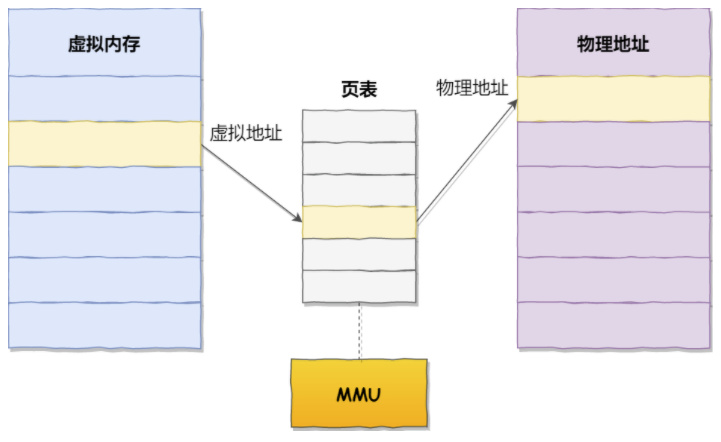
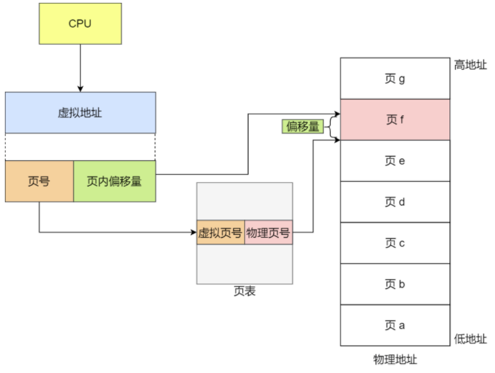
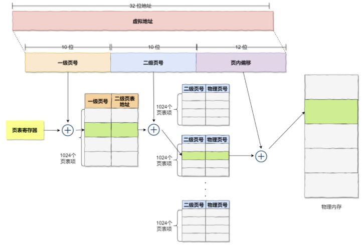

## Linux内存管理

### 0x00 分页与虚拟内存理论

Linux默认将物理内存分割为一个个页，其大小为4k。

虚拟内存的存在，使得程序可以重复利用地址，不必在编译时确定`真正`的内存地址，只需要确定部分虚拟地址即可，在装载时，交由操作系统来将虚拟地址映射到物理地址，至于如何实现这个功能，就要用到分页机制以及多级页表了。

##### 32位操作系统未进行分表

在32位操作系统下，将一个个页分成4k，即 2 ^ 12 = 4096，对于一个32位的操作系统，我们将得到1048576个页，这样，通过`页号`和`页内偏移量`就可以定位到一个准确的虚拟地址上，然后，我们再通过一个映射表`页表`，将虚拟地址映射成物理地址。




需要注意的是，不要将虚拟内存和页表进行混淆了，它们间的转换为:




这里假设在不使用多级页表。通过虚拟地址，我们将其划分为`页号`部分和`页内偏移`部分，分别各占`2^20`和`2^12`，则每个页为4k大小，共计1048576个页号。真正占用内存的来了，也就是`页表`，我们需要通过页表来实现如下的内容。


即通过虚拟地址映射到物理地址上。

在每一个进程中，都有其独立的虚拟内存，也就是说，1048576页号是固定死的，这样的话`页号就不需要进行存储了，直接使用数组索引的方式即可`，如上图所示。每个页表项需要4bytes来存储，一个页表共计4MB，如果存在100个进程，那么单单页表就将占用400MB内存，这就是单页映射的致命缺点。

##### 32位操作系统下的二级分页

如果使用二级分页，即我们可以将`虚拟地址`划分成3个部分，为`10bit---10bit---12bit`的方式，分别代表`一级页号---二级页号---页内偏移量`。

具体为：



一级表中的`一级页号`是不存在的，由其数组索引表示，同样的，`二级页号`也是不存在的，由数组索引表示。

```c++
// 一级页表
void* levelOnePage[1024];
// 每个一级页表中存储的，均为二级页表的地址

// 二级页表
void* levelTwoPage[1024];
// 每个二级页表中存储的，均为物理页号，一共1048576个，分散在1024个二级页表中
// 每个二级页表有1024个项
```

当我们拿到一个地址，通过高10bit索引levelOnePage中的值拿到一个二级页表的地址，然后再通过中间10bit来索引二级页表，进而拿到真实的物理地址块，通过加上低12bit的偏移量拿到真正的物理地址。

以上，一级页表一共占用1024 * 4bytes = 4K，二级页表一共占用 1024 * 1024 * 4bytes = 4MB，虽然使用了更多内存，但可以通过`局部性`原则的方式来进行优化，我们都知道， __程序可以使用所有虚拟地址，但程序大概率不会全部使用全部虚拟地址__ ，也就是说，有些页表压根没有任何作用，可以直接省略掉。

一级页表处于各个进程中，不可以参略，其只占用4k，不会浪费多少内存，当我们通过一级页表`levelOnePage[index]`索引到一个`空`地址时，再二级页表，这样就可以大大减少内存的浪费了。

### 0x01 x86 Linux的页表映射


引用：

[其中图片的出处](https://jishuin.proginn.com/p/763bfbd248c0)