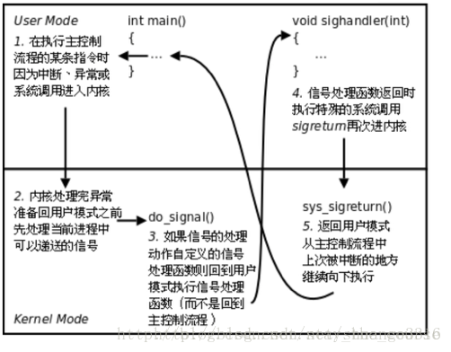

# linux signal

### signal的注册
* sighandler signal(int signum, sighandler_t handler);

signum是信号，handler为处理信号的指针

```C++
#include <iostream>
#include <signal.h>
#include <unistd.h>


void handler(int signum){
    if (signum == SIGIO)
        std::cout<<"SIGIO signal: "<<signum<<std::endl;
    else if (signum == SIGUSR1)
        std::cout<<"SIGUSR1 signal: "<<signum<<std::endl;
    else
        std::cout << "error!" << std::endl;
}


int main(){
    signal(SIGIO, handler);
    signal(SIGUSR1, handler);
    std::cout << SIGIO << ", " << SIGUSR1 << std::endl;
    for (;;){
        sleep(10000);
    }
}
```

### alarm()函数
```C++
#include <iostream>
#include <unistd.h>
#include <signal.h>


void handler(int sig){
    std::cout << "handler()" << std::endl;
    if (sig == SIGALRM){
        std::cout << "this is SIGALRM" << std::endl;
        alarm(5);
    }
}


int main(){
    int i = 1;
    signal(SIGALRM, handler);
    while(true){
        printf("sleep %d\n", i);
        sleep(1);
        i ++;
    }
}
```
alarm(unsigned int second)函数会在second秒后给进程发送SIGALRM信号
上述例子中可以通过kill -SIGALRM (pid)命令向程序发送SIGALRM信号

### sigaction函数

```C++
#include <signal.h>
/* 函数声明 
** signo是需要捕获的信号
*  act是指向sigaction结构体
*/
int sigaction(int signo, const struct sigaction *restrict act,
    struct sigaction *restrict oact
);
/* sigaction结构体 */
struct sigaction{
    void (*sa_handler)(int); /* 信号处理的函数 */
    sigset_t        sa_mask; /* 调用信号处理函数时需要堵塞的信号 */
    int             sa_flags;/* 信号进程处理选项 */
    void            (*sa_sigaction)(int, siginfo_t *, void *);
};
```
sa_mask使得调用信号处理函数时候屏蔽其中的信号， __保证在处理一个给定的信号时，这种信号如果再次发生，那么它会被堵塞到对前一个信号的处理结束为止。__ 如果某个信号被阻塞时，它发生了5次， __那么对这种信号解除阻塞后，其信号处理函数通常只会被调用一次。__

sa_flags比较常用的一个字段是 __SA_RESTART__ ，`表示由此信号中断的系统调用自动重新启动。`

* 信号集 

这种数据类型告诉内核不允许发生信号集中的信号。
```C++
#include <signal.h>

int sigemptyset(sigset_t *set);
int sigfillset(sigset_t* set);
int sigaddset(sigset_t *set, int signo);
int sigdelset(sigset_t *set, int signo);
/* 以上4个函数成功返回0，出错返回-1 */

int sigismember(const sigset_t *set, int signo); // 真返回1，假返回1
```

信号集初始化的时候必须调用`sigemptyset()`或者`sigfillset()`，一个将其信号集清空，一个将信号集包含所有信号，之后就可以使用信号增减函数对信号集进程加减操作。
```C++
int sigprocmask(int how, const sigset_t *set, sigset_t *oset);
                //成功返回0,出错返回-1
/* how字段 */
// SIG_BLOCK set指向的集合加入屏蔽信号集合
// SIG_UNBLOCK set指向的集合解除屏蔽
// SIG_SETMASK set指向的集合覆盖当前指向的屏蔽集合
```


### 关于信号量的实现

当一个程序定义了信号量处理函数的时候，操作系统在内核态返回程序的用户态时会检查其是否有信号，如果有，则转入其中执行提前注册的处理信号的函数，main主程序和信号处理函数是完全不同的控制流程。

其中有一个需要注意的 __可重入安全__ 当主线程main运行malloc时候，此时中断出现，操作系统执行其他线程，当再从内核态转向用户态时候，发现存在信号，转而进入信号处理函数，由于信号处理函数和main是完全不同的控制流程，如果信号处理函数中再次调用malloc就会出现问题，如此称为 __不可重入__ ，一个函数如果被打断运行不影响结果，则为 __可重入的__ 。
