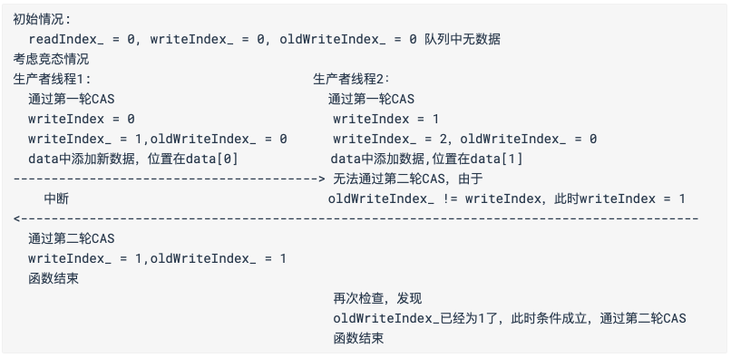

## 无锁编程


### 无锁队列的一个简单实现

其中共用到了3个比较重要的index，分别为`readIndex`和`writeIndex`以及`oldWriteIndex`，代表的是队列中读的索引，写的索引，以及`真正的队尾`。


关于入队操作，首先判断容量，之后就进入主要的逻辑了，需要由2个`CAS`来进行限制。

起初，`oldWriteIndex`和`writeIndex`处于相同的位置上，之后通过我们通过`CAS`的方式将`writeIndex + 1`，然后写入数据，之后再同样通过`CAS`的方式来更新`oldWriteIndex`。

代码实现:

```c++
// writeIndex_ 		原子变量
// readIndex_			原子变量
// oldWriteIndex_ 原子变量
bool put(int target){
  int writeIndex;
  int readIndex;
  do {
    writeIndex = writeIndex_.load();
    readIndex = readIndex_load();
    if ( (writeIndex + 1) % capacity_ == readIndex ) // 满
      return false;
    /* 通过CAS的方式使得writeIndex_ + 1 */
  } while ( !writeIndex_.compare_exchange_weak(writeIndex, writeIndex + 1));
  data_[ writeIndex % capacity_ ] = target; // 添加
  /* 通过CAS的方式使得oldWriteIndex_ + 1 */
  while ( !oldWriteIndex_.compare_exchange_weak(writeIndex, writeIndex + 1));
  return true;
}
```

关于出队操作就更简单了，只需要将`readIndex + 1`，然后再读出即可。

```c++
bool get(int* ret){
  int readIndex;
  int oldWriteIndex;
  do {
    readIndex = readIndex_.load();
    oldWriteIndex = oldWriteIndex_.load();
    if ( (readIndex + 1) % capacity_ == oldWriteIndex ) // 满
      return false;
    /* 使用CAS的方式使readIndex_ + 1 */
  }while (!readIndex_.compare_exchange_weak(readIndex, readIndex+1));
  *ret = data_[ readIndex % capacity_ ];
  return true;
}
```

以上关于`readIndex`和的变量大小可能需要进行一些操作，不然当其溢出可能会有一些奇奇怪怪得问题。

* 多生产者的情况



即使在以上中断的条件下，有消费者线程尝试获取数据也将以失败告终，消费者以`oldWriteIndex`为同步条件，而不管是生产者线程2亦或者是消费者，都需要等待`oldWriteIndex`的更新才能进行下一步的操作。

