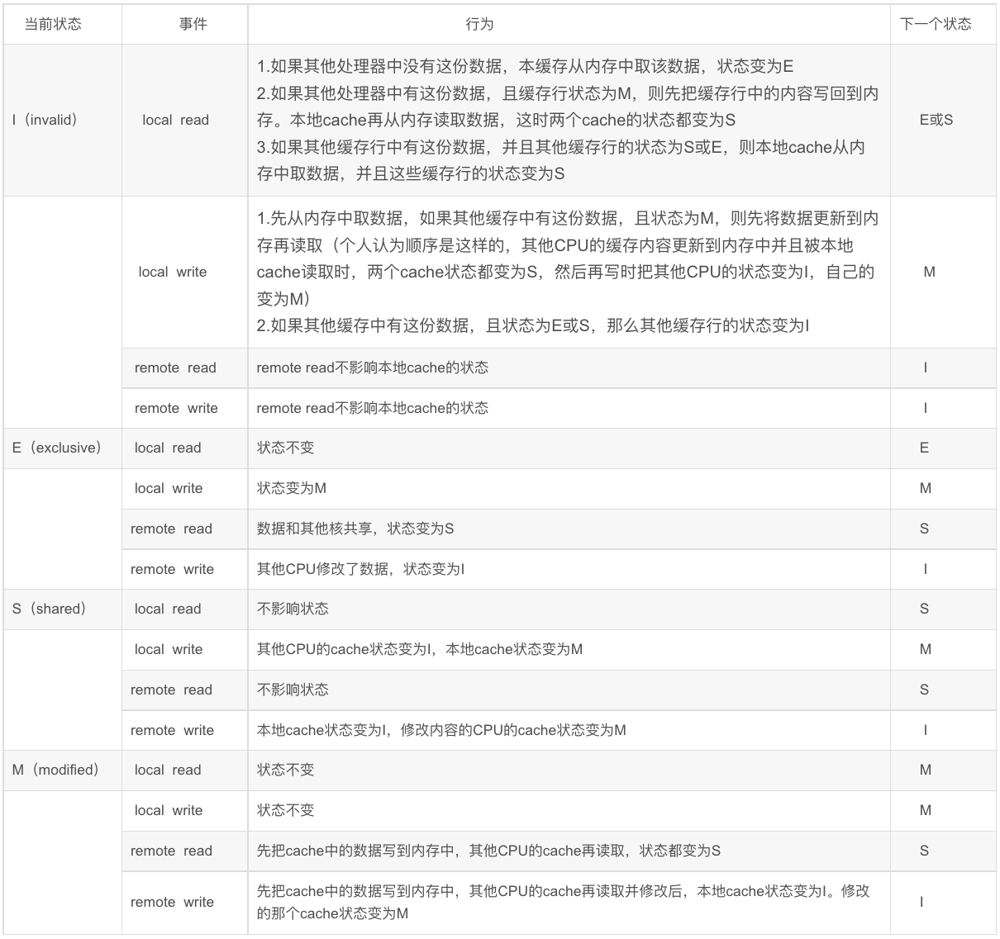

# MESI缓存一致性协议

## 0x00 基础

MESI 4个字母分别表示了4种缓存状态，为 __M(Modify exclusive)、E(Exclusive)、S(Shared)、I(invalid)__ 。

具体含义为：

### M(Modify exclusive)

即 __修改且独享__ 的，当前Cache Line数据和对应的内存数据 __不同__ ，只有 __当前core__ 在使用此内存数据(独享)。


### E(Exclusive)

即 __独享__ 的，当前Cache Line数据和对应的内存数据 __相同__ ，只有 __当前core__ 在使用此内存数据(独享)。

### S(Shared)

即 __共享__ 的，当前Cache Line数据和对应的内存数据 __相同__ ， __多个core__ 都在使用此内存数据，也就是多个core中的Cache Line都有此内存数据的高缓(共享)。

### I(Invalid)

该Cache Line没有被使用(无效)。


## 0x01 状态改变


图片引用自：https://blog.csdn.net/xiaowenmu1/article/details/89705740


## 0x02 代码模拟

为了加深理解，试着用代码来“模拟”了一下MESI的运行流程：

```C++
/* MESI.h */
#ifndef MESI_MESI_H
#define MESI_MESI_H

#define CORE_NUM 2048

typedef enum {
  Modify,
  Exclusive,
  Shared,
  Invalid
}State;

class CacheLine {
public:

  CacheLine();

  ~CacheLine()=default;

  bool read(int coreIndex, int* ret);
  bool write(int coreIndex, int value);
  void check();
  void stateChange(State src, State to);

private:

  State state_[CORE_NUM];
  int data_[CORE_NUM];

  // in mem
  int mem_data_;

  // for check
  bool debug_;
  int m_count_;
  int e_count_;
  int s_count_;
  int i_count_;
  
};
#endif //MESI_MESI_H
```

```C++
/* MESI.cc */
#include "MESI.h"
#include <cassert>
#include <iostream>

using std::cout;
using std::endl;

CacheLine::CacheLine()
: m_count_(0)
, e_count_(0)
, s_count_(0)
, i_count_(CORE_NUM)
, debug_(true)
, mem_data_(0)
{
  for (int i=0; i<CORE_NUM; ++i) {
    state_[i] = Invalid;
  }
}

void CacheLine::stateChange(State src, State to) {
  switch (src) {
    case Modify: {
      m_count_ -= 1;
      break;
    }
    case Exclusive: {
      e_count_ -= 1;
      break;
    }
    case Shared: {
      s_count_ -= 1;
      break;
    }
    case Invalid: {
      i_count_ -= 1;
      break;
    }
    default: {
      cout << "Error at change state" << endl;
      exit(0);
    }
  }
  switch (to) {
    case Modify: {
      m_count_ += 1;
      break;
    }
    case Exclusive: {
      e_count_ += 1;
      break;
    }
    case Shared: {
      s_count_ += 1;
      break;
    }
    case Invalid: {
      i_count_ += 1;
      break;
    }
    default: {
      cout << "Error at change state" << endl;
      exit(0);
    }
  }
}

bool CacheLine::read(int coreIndex, int *ret) {
  assert(coreIndex >= 0);
  assert(coreIndex < CORE_NUM);

  // Cache hit
  if ( state_[coreIndex] == Modify ) {
    *ret = data_[coreIndex];
    return true;
  }

  if ( state_[coreIndex] == Exclusive ) {
    *ret = data_[coreIndex];
    return true;
  }

  if ( state_[coreIndex] == Shared ) {
    *ret = data_[coreIndex];
    return true;
  }

  // Cache Miss at current core Cache Line
  // state == Invalid
  assert ( state_[coreIndex] == Invalid );
  // broadcast on bus
  for (int otherCoreIndex = 0; otherCoreIndex < CORE_NUM; ++ otherCoreIndex) {
    if ( otherCoreIndex == coreIndex ){
      continue;
    }
    // Modify case:
    // in other core state change: M -> write back -> S
    // in current core state : I -> write allocate -> S
    if ( state_[otherCoreIndex] == Modify ) {
      mem_data_ = data_[otherCoreIndex]; // write back
      state_[otherCoreIndex] = Shared;  // M -> S
      stateChange(Modify, Shared);

      data_[coreIndex] = mem_data_; // write allocate
      state_[coreIndex] = Shared; // I -> S
      stateChange(Invalid, Shared);

      *ret = data_[coreIndex];
      check();
      return true;
    }

    // Exclusive case:
    // in other core state change: E -> S
    // in current core state change: I -> S
    if ( state_[otherCoreIndex] == Exclusive ) {
      state_[otherCoreIndex] = Shared; // E -> S
      stateChange(Exclusive, Shared);

      // current core
      state_[coreIndex] = Shared; // I -> S
      data_[coreIndex] = data_[otherCoreIndex]; // get data by bus
      stateChange(Invalid, Shared);

      *ret = data_[coreIndex];
      check();
      return true;
    }

    // Shared case:
    // current core state change: I -> S
    if ( state_[otherCoreIndex] == Shared ) {
      state_[coreIndex] = Shared; // I -> S
      data_[coreIndex] = data_[otherCoreIndex]; // get data by bus
      stateChange(Invalid, Shared);

      *ret = data_[coreIndex];
      check();
      return true;
    }
  }

  // Cache Miss: all the core are Invalid
  // current core state change: I -> E
  data_[coreIndex] = mem_data_; // write allocate
  state_[coreIndex] = Exclusive;
  stateChange(Invalid, Exclusive);
  *ret = data_[coreIndex];
  check();
  return false;
}

bool CacheLine::write(int coreIndex, int value) {
  assert( coreIndex >= 0 );
  assert( coreIndex < CORE_NUM );

  // Cache hit
  if ( state_[coreIndex] == Modify ) {
    // Modify didn't change state
    data_[coreIndex] = value;

    check();
    return true;
  }

  if ( state_[coreIndex] == Exclusive ) {
    data_[coreIndex] = value;
    state_[coreIndex] = Modify; // E -> M
    stateChange(Exclusive, Modify);
    check();
    return true;
  }


  if ( state_[coreIndex] == Shared ) {
    // broadcast other core state to Invalid
    for (int otherCoreIndex = 0; otherCoreIndex < CORE_NUM; ++ otherCoreIndex) {
      if ( otherCoreIndex == coreIndex ) {
        continue;
      }
      if ( state_[otherCoreIndex] == Shared ){
        state_[otherCoreIndex] = Invalid; // S -> I
        stateChange(Shared, Invalid);
      }
    }

    // S -> M
    state_[coreIndex] = Modify;
    data_[coreIndex] = value;
    stateChange(Shared, Modify);
    check();
    return true;
  }

  // Cache Miss at current core
  if ( state_[coreIndex] == Invalid ) {
    // broadcast to get the other core state
    for (int otherCoreIndex = 0; otherCoreIndex < CORE_NUM; ++ otherCoreIndex) {
      if ( otherCoreIndex == coreIndex ) {
        continue;
      }

      // case Modify:
      // in other core state change: M -> write back -> I
      // in current core state change: I -> write allocate -> E -> M
      // TODO: MESI protocol may has some diff?
      if ( state_[otherCoreIndex] == Modify ) {
        mem_data_ = data_[otherCoreIndex]; // write back
        state_[otherCoreIndex] = Invalid; // M -> I
        stateChange(Modify, Invalid);

        data_[coreIndex] = mem_data_; // write allocate
        state_[coreIndex] = Exclusive; // I -> E
        stateChange(Invalid, Exclusive);

        data_[coreIndex] = value; // write to cache
        state_[coreIndex] = Modify; // E -> M
        stateChange(Exclusive, Modify);

        check();
        return true;
      }

      // case Exclusive:
      // in other core state change: E -> I
      // in current core state change: I -> E -> M
      // TODO: MESI protocol may has some diff ?
      if ( state_[otherCoreIndex] == Exclusive ) {
        state_[otherCoreIndex] = Invalid; // E -> I
        stateChange(Exclusive, Invalid);

        data_[coreIndex] = mem_data_; // write allocate
        state_[coreIndex] = Exclusive; // I -> E
        stateChange(Invalid, Exclusive);
        data_[coreIndex] = value;
        state_[coreIndex] = Modify; // E -> M
        stateChange(Exclusive, Modify);

        check();
        return true;
      }

      // case Shared:
      // need to change all others core state: S -> I
      if ( state_[otherCoreIndex] == Shared ) {
        state_[otherCoreIndex] = Invalid;
        stateChange(Shared, Invalid);
      }
    }
    // case Shared and Invalid:
    // in others case state change: S -> I
    // in current case state change: I -> M
    state_[coreIndex] = Modify;
    data_[coreIndex] = value;
    stateChange(Invalid, Modify);

    check();
    return true;
  }
  // Error!
  cout << "Error at write end!" << endl;
  exit(0);
  return false;
}

void CacheLine::check() {
  if ( (m_count_ == 1 && i_count_ == CORE_NUM - 1)
    || (e_count_ == 1 && i_count_ == CORE_NUM - 1)
    || (s_count_ >= 2 && i_count_ == CORE_NUM - s_count_)
    || (i_count_ == 4) ){

    if (debug_) {
      cout << "m_count: " << m_count_ << " ";
      cout << "e_count: " << e_count_ << " ";
      cout << "s_count: " << s_count_ << " ";
      cout << "i_count: " << i_count_ << endl;
    }
  }else {
    cout << "Last Error state: " << endl;
    if (debug_) {
      cout << "m_count: " << m_count_ << " ";
      cout << "e_count: " << e_count_ << " ";
      cout << "s_count: " << s_count_ << " ";
      cout << "i_count: " << i_count_ << endl;
    }
    exit(0);
  }
}
```

测试代码：

```C++
/* main.cc */
#include <iostream>
#include "MESI.h"

using std::cout;
using std::endl;

int main() {
 srand(1111);
 CacheLine cache;
 int lastValue = 0; // memory initialization value is 0
 for (int i=0; i<1000000; i++) {
   int coreIndex = rand() % CORE_NUM;
   int value = rand() % 1000;
   int op = rand() % 2;
   if ( op == 0 ) { // read
      cache.read(coreIndex, &value);
      printf("loop[%d]: read data from core[%d]: %d\n", i, coreIndex, value);
      if (lastValue != value) { // check consistency
        printf("Error at lastValue[%d] -> got value[%d]\n", lastValue, value);
        exit(0);
      }
   }else if ( op == 1 ) { // write
     cache.write(coreIndex, value);
     lastValue = value;
     printf("loop[%d]: write data from core[%d]: %d\n", i, coreIndex, value);
   }
 }
 cout << "ALL TEST OK" << endl;
 cout << "PASS" << endl;
}
```
## 0x03 监听任务

现代CPU架构(smp大部分吧应该)必须在总线上监听某种状态，具体为：

### M : 

当一个处于此状态的缓存行，必须时刻监听 __所有__ 试图读取该缓存行对应的主存地址的操作，如果一旦监听到，则执行write back操作。

### E : 

当存在一个处于此状态的缓存行，必须时刻监听总线上的所有试图读取此缓存对应的主存地址的操作，如果一旦监听到，则将此状态设置为S(Exclusive -> Shared)。

### S :

当存在一个处于此状态的缓存行，必须在总线上时刻监听使该缓存行 __无效或者独享__ 该缓存行的请求，如果监听到，则执行将此状态设置为I(Shared -> Invalid)。

## 0x04 消息机制


MESI中存在6种消息，分请求和相应，它们在总线上传递，可能由Cache发出，也可能由主存发出。


### Read 请求

通知其他core，当前core准备读取某个主存数据，消息包含这个待读取的主存数据的地址。

### Read Response 响应

Read Response可以从主存发出，也可以从某个core的Cache中发出，包含Read请求的内存数据。

### Invalidate 请求

通知其他core，请求中携带一个主存地址，令其他core将此主存地址对应的Cache Line状态设置为Invalid(无效)。

### Invalidate Acknowledge 响应

收到Invalidate并且处理完请求后的core需要回复这个响应，表示已经完成操作。

### Read Invalidate 请求

这是一个复合请求，同时携带Read和Invalidate，发出此消息一般当前core试图更新某个数据，此消息要求收到的core响应一个Read Response后删除对应Cahce，然后再响应一个Invalidate Acknowledge，发送次消息的处理器期望收到一个Read Response以及多个Invalidate Acknowledge。

### Writeback 请求

该消息包含需要写入主存的数据以及其对应的内存地址，该消息仅在Cache Line状态为Modify状态发出。


## 0x05 例子

// TODO: wait for update...


## 0x06 最后

[内存屏障](./concurrent#0x03Barrier)