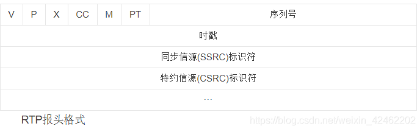

# RTSP 协议

### 协议请求开头

```
OPTIONS rtsp://127.0.0.1:8888 RTSP/1.0
CSeq: 2
User-Agent: LibVLC/3.0.7.1 (LIVE555 Streaming Media v2016.11.28)
```


### RTP包结构和定义



* V 版本(2bit): 表示RTP包使用版本
* P 填充(1bit): 如果该位置位，表示RTP包尾包含填充的附加字节
* X 扩展(1bit): 如果该位置位，表示RTP包头有额外的扩展头
* CC CSRC计数器(4bit): 含有固定头部后面跟着的CSRC的数据
* M 标记位(1bit): 该位的解释由配置文档承担
* PT 载荷类型(7bit): RTP载荷的类型
* SN 序列号(16bit): 发送方载每发送完一个RTP包后就将该值增加1，可以用于检测丢包等等，初始值为随机。
* 时间戳(32bit): 记录了该包中数据的第一个字节的采样时刻
* SSRC 同步源标识符(32bit): 同步源即RTP包来源，同一个RTP会话中不能有两个相同的SSRC值。
* CSRC List 贡献资源列表(32bit每项，共0-15个项)


### RTSP协议请求过程

RTSP请求一般来讲需要通过TCP来传输指令数据，之后进行数据传输通过RTP包来进行传输，一般也为UDP进行穿出，其中的视频控制指令通过RTCP协议(同UDP)进行传输。

* OPTIONS 指令 

<font color=F0000> 用于客户端向服务器请求可以用的指令，如服务器回复OPTIONS,DESCRIBE,SETUP,TEARDOWN,PLAY等等方法 </font>

例:
客户端向服务器发送请求

```
OPTIONS rtsp://ip:port RTSP/1.0\r\n
CSeq: 2\r\n
\r\n
```

服务器回应可用指令

```
RTSP/1.0 200 OK\r\n
CSeq: 2\r\n
Public: OPTIONS, DESCRIBE, SETUP, TEARDOWN, PLAY\r\n
\r\n
```

* DESCRIBE 指令

<font color=F0000> 客户端向服务器请求关于媒体的描述文件，格式为sdp格式 </font>

例: 

客户端向服务器发送DESCRIBE指令请求媒体信息

```
DESCRIBE rtsp://ip:port RTSP/1.0\r\n
CSeq: 3\r\n
Accept: application/sdp\r\n
\r\n
```

服务器返回对应的sdp格式响应

```
RTSP/1.0 200 OK\r\n
CSeq: 3\r\n
Content-length: 146\r\n
Content-type: application/sdp\r\n
\r\n

v=0\r\n
o=- 91565340853 1 in IP4 192.168.31.115\r\n
t=0 0\r\n
a=contol:*\r\n
m=video 0 RTP/AVP 96\r\n
a=rtpmap:96 H264/90000\r\n
a=framerate:25\r\n
a=control:track0\r\n
```

* SETUP 指令

<font color=F0000> 客户端请求建立发送视频的方式，比如通过UDP方式需要服务器和客户端都沟通好需要发送的端口等 </font>

例:

```
SETUP rtsp://ip:port RTSP/1.0\r\n
CSeq: 4\r\n
Transport: RTP/AVP;unicast;client_port=54492-54493\r\n
\r\n
```
其中的client_port=54492-54493为客户端的UDP端口，其中偶数一般传输RTP协议，奇数传输RTCP协议。

服务器回应其自己的RTP端口和RTCP端口

```
RTSP/1.0 200 OK\r\n
CSeq: 4\r\n
Transport: RTP/AVP;unicast;client_port=54492-54493;server_port=56400-56401\r\n
Session: 66334873\r\n
\r\n
```
