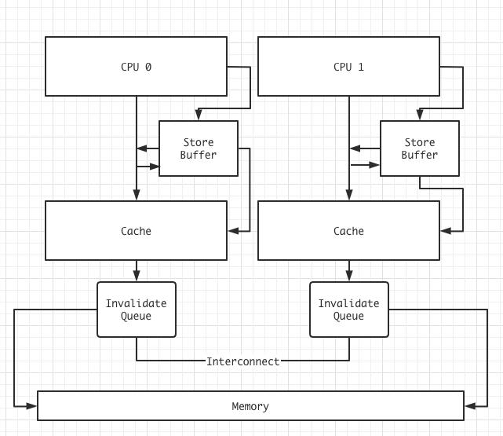

# 并发编程知识整理

## 0x00 CPU缓存-False Sharing

前置知识：[MESI协议](./MESI.md)。

CPU中存在多级缓存结构，越靠近CPU的缓存读取速度越快，但空间也就越小，如何高效的利用CPU缓存也是多线程中比较重要的点，我遇到的坑点是假共享(False Sharing: 感觉不如翻译成误共享)，直接上一个例子：

```C++
int arr[100];
int len = 500000000;

void thread1() {
  long start = TimeStamp::Now();
  for (int i=0; i<len; i++) {
    arr[0] = i;
  }
  long end = TimeStamp::Now();
  TimeStamp::diff(start, end); // 计算时间差
}

void thread2() {
  long start = TimeStamp::Now();
  for (int i=0; i<len; i++) {
    arr[1] = i;
  }
  long end = TimeStamp::Now();
  TimeStamp::diff(start, end);
}

void thread3() {
  long start = TimeStamp::Now();
  for (int i=0; i<len; i++) {
    arr[50] = i;
  }
  long end = TimeStamp::Now();
  TimeStamp::diff(start, end);
}
```

如果我同时启动`Thread1`和`Thread2`，可以看到，他们没有任何临界区，可以随意读写，在我机器上执行后平均时间大致在4s-5s之间。而如何同时启动`Thread1`和`Thread3`则在1s-1.4s之间，差了好几倍，做的确是相同的事情。

CPU中，每个核心有独立L1缓，并且CPU缓存Cache Line一般是在64Bytes，以上面的例子，Thread1在读取arr[0]后，通常也会将arr[1]以及之后的部分数据也读入缓存，看起来是没问题，但如果Thread1修改了arr[0]这个变量将导致整个缓存行改变，而此时另外一个核心在读写arr[1]，不同核心的高缓(L1)由于缓存不同，需要通过MESI来重新同步，这就增加了耗时。而`Thread3`中做修改的arr[50]和arr[0]不在同一个缓存行中，所以两个不同核心间不用频繁做同步，速度也就快了。

通过上面的做法姑且算是以空间换时间，如果过多变量都这样处理可能导致缓存被浪费，具体的话可以考虑网上比较常见的“数组”读写的案例。

__注：单核CPU永远无法体现以上的差距__ 。


## 0x01 LockFree-无锁编程

前置知识：[无锁队列](./LockFree.md)，[MESI协议](./MESI.md)，原子变量(内存结构)。

无锁编程在一定程度上比有锁编程要快非常的多，很多人应该都听过Kfifo的大名了，这几天学到了Disruptor，用C++自己写一版记录一下：

Disruptor实现和kfifo很像，都是围绕一个ringBuffer来实现的，一些小优化比如False Sharing亦或者加快mod的操作这里就不再赘述了。

### 生产者

首先是生产者，Disruptor中维护一个`writeCursor_`和`commitWriteCursor_`的原子变量，前者表示可以写入的点(还没写入)，后者则表示 __已经写入__ 的点(commited，生产者可读了)。有可能看起来混淆，解释一下生产者的步骤就能更了解了：

1. 将`writeCursor_`自增1。
2. 成功，获取自增前的seq，失败则进入某种策略，比如让出CPU。
3. 获取的seq即为写入点，当生产者完成写入后，需要进行更新，等待`seq-1=commitWriteCursor_`。
4. 更新lastWriteCursor = seq 表示写入成功。

注： __生产者的commit过程是有严格顺序的，多位生产者也许可以同时写入数据，但更新只能是数组索引顺序commit__ 。


### 消费者

消费者同样维护2个原子变量，为`readCursor_`和`commitRead_`，`readCursor_`指向最后派发给消费者的索引(已经派发出去了)，`commitRead_`则表示已经被消费者读完的索引。

1. 获取readCursor_ + 1的值为seq。
2. 读取数组索引为seq的值。
3. 读取成功后，消费者需要提交已经读取完成的操作，需要等待seq-1=commitRead_。
4. 消费者更新读取进度，commitRead_=seq

注：同生产者。

### 边界处理及实现

如果生产者速度过快，而消费者来不及处理的话，需要保证`writeCursor_`和`commitRead_`之差不能超过`ringBuffer`的长度。

相反，如果消费者过快，那么也要保证`readCursor_`不超过`commitWriteCursor_`。

可写范围一直在`[commitRead_, seq]`之间，也即`[commitRead_, writeCursor_)`。

我这边简单写了一个Disruptor的[C++实现](https://github.com/Swaggerzhan/Raiden/blob/master/base/Disruptor.h)，是一个其中策略非常的简单(spin)，排除False Sharing后速度确实快了非常多，但对CPU的压力也不小，具体需要取决于业务需求。

并且，采用Spin的策略在核心较少的处理器上可能会适得其反，在单核CPU中主动让出资源一直是比较好的选择。

## 0x02 volatile以及原子变量

C++中的volatile不同于JVM中的概念，它代表某个变量是易变的，volatile作用于编译器，多线程情况下不能使用volatile来做线程同步，这个是肯定的。至于volatile如何作用于编译器，我们可以看个小例子：

```C++
int a = 0;
int do_something() {
    while ( a > 1 );
    return 1;
}
```

在x86-64 gcc 10.1版本下编译，得到以下汇编：

```assembly
a:
        .zero   4
do_something():
        push    rbp
        mov     rbp, rsp
.L3:
        mov     eax, DWORD PTR a[rip]
        cmp     eax, 1
        jle     .L2
        jmp     .L3
.L2:
        mov     eax, 1
        pop     rbp
        ret
```

可以看到，编译器“老老实实”的做了我们写的代码，事实上我们也确实希望编译器这样做， __但有些时候，我们想使用一些编译器的优化选项来提高代码的运行效率，并且降低执行文件的大小，当我们使用一些优化选项时，也就赋予了编译器一些“不老实”的权限，当通过`-Ofast`的优化选项后，相同的代码将得到以下汇编__ ：

```assembly
do_something():
        mov     eax, 1
        ret
a:
        .zero   4
```

可以看到输出的汇编少了很多，并且 __函数do_something()直接摆烂，这是因为编译器开始自作聪明了，它认为，既然`a=0`，那么while语句中的`a>1`就永远不会成立，那么也就永远不用运行，所以可以直接删除，即刻返回1，乍一看也没问题(单线程)，但代码一放到多线程情况下运行，那么a就有可能被其他线程改变进而执行while语句__ 。

当我们使用volatile对a变量进行修饰后，同样开启-Ofast优化，得到汇编码：

```assembly
do_something():
.L2:
        mov     eax, DWORD PTR a[rip]
        cmp     eax, 1
        jg      .L2
        mov     eax, 1
        ret
a:
        .zero   4
```

可以看到，编译器对`a`这个变量又老实起来了。

__注：volatile作用于编译器，对CPU来说是透明的，volatile变量不能作多线程下的同步__ ! CPU的结构导致多线程的原子变量同步需要考虑到内存序。

## 0x03 Barrier

并发编程中，内存屏障算是比较重要的基础了，记录一些自己所学的关于内存屏障的知识。

### 编译器屏障之volatile

之前讨论的volatile就算是一种编译器屏障，这里再次扩展深入，考虑这样一段代码:

```C++
#include <unistd.h>
#include <thread>

int flag = 0;

void wakeup() {
    flag = 1;
}

void wait() {
    while ( flag == 0 );
}

int main() {
    std::thread t(wait);
    sleep(1);
    wakeup();
    t.join();
}
```

代码很简单，主线程创建一个wait子线程，wait子线程一直判断flag是否为0(这里先不讨论这个flag是不是原子变量)，而主线程在某个时间段，试着将flag修改为1，子线程察觉到flag改变了，子线程退出while进而结束线程。

问题发生在哪？ __如果不启用编译器优化，似乎也没毛病，一旦启动优化，编译器又开始自作聪明了，在`-O`优化下(gcc x86-64 10.1)，这段代码执行后将永远不会退出__ ！具体问题则发生在wait处，其代码编译后得到以下汇编：

```assembly
wait():
        mov     eax, DWORD PTR flag[rip]
.L2:
        test    eax, eax
        je      .L2
        mov     eax, 1
        ret
```

问题即出在 __test eax, eax__ ，__编译器认为，寄存器的访问速度是要优于内存的，所以索性直接访问寄存器(单线程没毛病)，那么当主线程修改flag内存处的值后，子线程仍使用寄存器中的值(旧值)来进行比对，永远都无法退出while，而如果该变量用volatile修饰，则要求编译器遇到这个变量必须到对应的内存处重新取值，从而拿到新值并退出程序。但再次强调，C++中的线程间同步不能使用volatile变量，volatile只能保证CPU去内存中取值，而某些存在于高缓中的问题，需要CPU级别的屏障__ 。

注：CPU到内存中取值，不是真的“傻傻”的等待主存响应，如果高缓快速响应，则使用高缓，所以以下讨论的将是更为底层的CPU高缓一致性问题。

### CPU屏障

前置知识：[MESI协议](./MESI.md)，[一致性问题](https://github.com/Swaggerzhan/linux_md/blob/master/Raft/consistency.md)

首先是现代smp的CPU架构一般为：



大多数CPU都采用了writeback的策略，即在能异步的情况下就使用异步，这样能提升速度，但也带来了更多的问题，首先就是一致性问题，Store Buffer的存在使得在多核CPU情况下，其他核心可能看到执行的顺序不一致，这就需要内存屏障了，这里讲的内存屏障，更多的是说CPU中的高缓。

### Store Buffer

write 操作总是费事费时的，如果需要写的数据高缓行是S状态，则CPU需要发送Invalidate请求，并且等待Acknowledge响应，整个期间CPU都将停滞，这样做无疑是浪费了CPU，为了提高效率进而引出了Store Buffer，这样， __可以在等待期间，先将计算好的结果先放入Store Buffer，然后直接执行下一条指令，等到Acknowledge响应到来后，再将Store Buffer中数据更新到Cache__ 。

如果发生了write->read，那么CPU可以不等待write而直接发起read，得到overlap memory accesses的效果。但这也带来了一些麻烦，那就是顺序一致的问题，考虑有这样的代码：

```C++
a = 1;
b = a + 1;
assert( b == 2 );
```

其中a在其他的CPU高缓中，b在当前的CPU高缓中，它们初始值都为0，则执行过程：

1. 当前的CPU发现a不在当前高缓中，执行完a=1后，向其他CPU发送Read Invalidate消息。
2. 当前的CPU直接将a=1写入Store Buffer，企图去执行其他指令。
3. 其他CPU收到了Read Invalidate消息，响应了Read Response，并且删除对应缓存。
4. 当前的CPU执行b=a+1，此时还是需要a的数据。
5. 当前的CPU终于收到了其他CPU发出的Read Response，将a=0写入高缓，状态为E，顺利执行了b=a+1，得到b=1。
6. 当前CPU发现b在缓存行中属于Exclusive状态，故直接写入b=1，并且将其缓存行状态修改为Modify。
7. 当前CPU将Stroe Buffer中的a=1写入到缓存中(当前CPU中a高缓状态为E，可写，写完后状态为M)。

可以看到流程走完后，由于Store Buffer的存在，指令发生了重排，b = a + 1提前发生了，导致了最后assert失败。

### 增加Store Forwarding

Store Forwading规定，每次载入数据时，一起查看Store Buffer和Cache Line，这样就能得到最新的数据了，情况是这样的吗？考虑这样一段代码：

```C++
void CPU0() {
    a = 1;
    b = 1;
}

void CPU1() {
    while ( b == 0 );
    assert( a == 1 );
}
```

a和b初始值都为0，并且a在CPU1的高缓中，b在CPU0的高缓中，执行步骤为：

1. CPU0执行a=1的操作，发现不在其高缓中，发送Read Invalidate请求(Cache Miss)，同时直接将a=1写入Store Buffer。
2. CPU1执行while，发现其高缓中不存在b，发送Read请求(Cache Miss)。
3. CPU0执行b=1指令，发现其高缓中存在b，且状态为M或者E，所以直接将b=1写入Cache Line。
4. CPU0收到Read消息，响应b=1。(E or M -> S)
5. CPU1收到Read Response，得到b=1，while循环退出。
6. CPU1执行assert，发现a存在其高缓中，值为0，assert失败。(Read Invalidate还未被CPU1收到，即使CPU1收到了，并且将a高缓设置为失效，并且重新发起了Read请求，也可能得到同样a=0的结果，因为CPU0并未将Store Buffer中数据更新到Cache中)

可以发现，加入了Store Forwarding后，最终结果还是出现了歧义，在CPU0看来，指令没有发生重排，这里解释一下“重排”，在单线程情况下看CPU0执行过程，我们认为b=1时，a必定等同于1，这是必然的，也是我们希望看到的，可惜的是并行情况下，结果令我们失望。

__CPU0认为，写入Store Buffer和写入Cache Line都是写入成功，因为CPU0可以通过Store Forwarding来同时读取两块缓存从而得到最新数据，而CPU1认为，只有写入Cache Line才算写入成功(CPU1看不到CPU0中的Store Buffer)，以CPU1的视角看，指令还是发生了重排__ !

### 屏障

很可惜的，现代CPU无法做到顺序一致性(强一致性)，我们只能通过内存屏障来避免指令重排的发生，这也是屏障存在的意义。

首先是smp_mb()，它要求 __执行后面的语句的前提__ 是 __需要将Store Buffer中的数据处理完(即使smp_mb()语句后的一些数据在高缓中，且状态为E或者M)__ ，在满足这个要求的情况下，CPU有以下策略可以选择：

1. CPU停下来，将Store Buffer中所有数据都更新到Cache中，但这意味着CPU需要等待一些MESI消息的响应，速度必然受到影响。
2. CPU不停下，将smp_mb()后的数据也一并写入Store Buffer中，但作出一个保证， __即:在将smp_mb()后的指令结果从Store Buffer写入到Cache中时，先更新smp_mb()之前的__ 。

毫无疑问，现代CPU使用了后者策略，这样以来，我们上以上代码稍微修改，得到：

```C++
void CPU0() { // cache has b
    a = 1;
    smp_mb();
    b = 1;
}

void CPU1() { // cache has a
    while ( b == 0 );
    assert( a == 1 );
}
```

同样的，a和b初始值都为0，a存在于CPU1的高缓中，b存在于CPU0的高缓中，执行过程为：

1. CPU0执行a=1指令，发现其高缓中不存在a，发送Read Invalidate请求，然后将a=1结果写入Store Buffer。
2. CPU1执行while指令，发现其高缓中不存在b，发送Read请求。
3. CPU0执行smp_mb()，CPU0记住了Store Buffer中的数据，当前只有a=1。
4. CPU0执行b=1，发现其高缓中存在，且状态为E或者M，本可以直接写入，但由于smp_mb()存在，所以索性将b=1也写入Store Buffer。(这里不能更新a到Cache的原因是Read Invalidate还未得到响应)
5. CPU0收到了Read指令，响应b=0，修改b缓存状态为S。(b=1还在Store Buffer中)
6. CPU1收到Read Response，得到b=0，循环继续。
7. CPU1收到了Read Invalidate请求，将a=0移除，然后返回Read Response及Acknowledge。
8. CPU0终于收到了Read Invalidate的响应，然后将Store Buffer中的a=1写入到高缓中，状态为M。(b不能写，b高缓状态为S)
9. CPU0发送Invalidate请求给其他CPU，企图移除其他CPU中对b的高缓。
10. CPU1收到Invalidate后，将b高缓移除，然后响应Acknowledge，并且同时，CPU1还在执行while操作，发现b被移除后，发送Read请求。(读取b的请求)
11. CPU0收到Invalidate响应后，将Store Buffer中b=1的数据写入Cache。(现在可以写了，在收到Invalidate后，b缓存的状态就由S转为E，故可以写，且写完后状态由E转为M)
12. CPU0收到Read请求后，响应Read Response。
13. CPU1收到Read Response，得到b=1，while结束。
14. CPU1发送Read请求，并且得到CPU0的响应，得到a=1，程序结束，assert成功。

可以看到，程序通过了assert，通过内存屏障，CPU“可以”做到顺序一致性。

### 屏障指令
// TODO: wait for upate...

## 0x04 C++内存顺序

// TODO: wait for upate....


