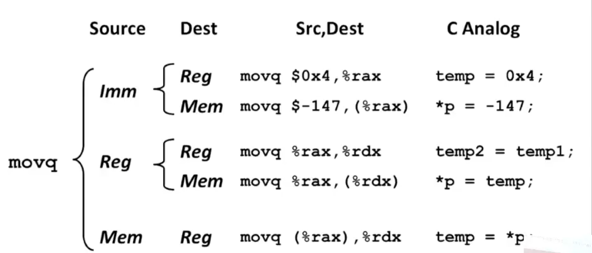
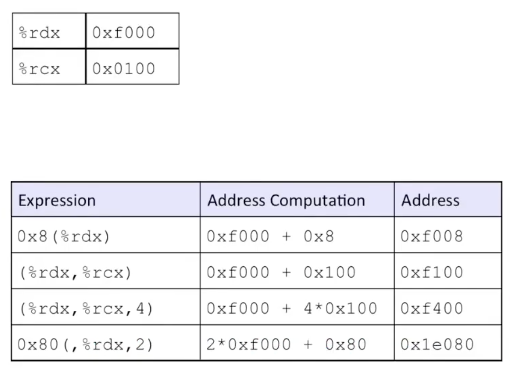
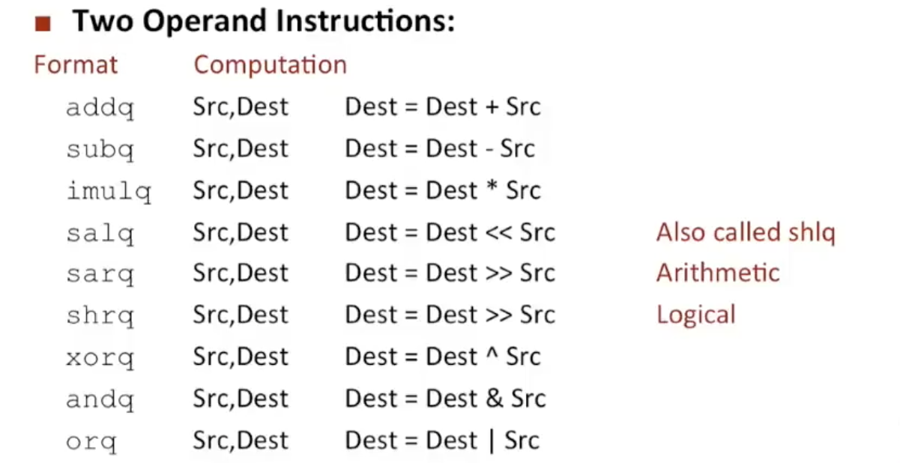
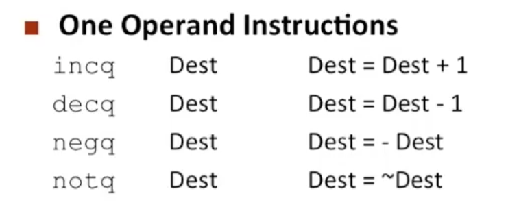

<font face="Monaco">

# some data

## 0x00 Register name && Some assembly

### Register name

R for Register, E for Extend

* ax : accumulate
* cx : counter
* dx : data
* bx : base
* si : source index
* di : destination index
* sp : stack pointer
* bp : base pointer

### Assembly

汇编中的操作大小一般体现在指令后缀中：

```
1. char   -> b
2. short  -> w : word
4. int    -> l 
8. long   -> q : quad word
```

#### 1. mov

mov中有3种类型的操作，分别为立即数，内存地址，寄存器，仅能有以下操作方式：



mov操作数组，仅能取到“地址”，需要取到数据，一般使用lea，甚至更多的，会用lea来做一些简单的运算。



#### 2. lea

load effect address，类似C/C++中的&。

和mov类似，lea同样可以配合一些()来做简单的操作，比如：

```assembly
leaq (%rdi, %rsi), %rax # rdi地址处和rsi地址处值相加，并且赋值到rax中
```

这种语法为：t(x, y, z) -> x + (y * z) + t

#### 3. 其他指令



</font>