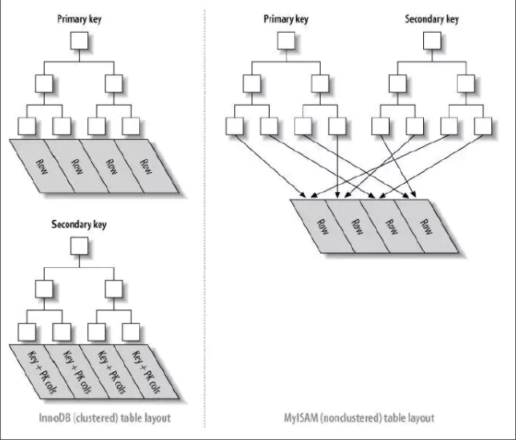

# Mysql

### 1. Mysql数据库的一些sql语句


* 1. 创建表结构
    
    ```sql
    /* 创建表，建议将其保存在.sql文件中再使用 mysql < 表.sql直接运行。 */
    CREATE TABLE member(
        member_id INT UNSIGNED NOT NULL AUTO_INCREMENT,
        PRIMARY KEY (member_id), /* 主键，默认必须要一个主键(索引) */
        last_name   VARCHAR(20) NOT NULL, /* 不可为空 */
        first_name  VARCHAR(20) NOT NULL,
        suffix      VARCHAR(5) NULL, /* 默认为空 */
        expiration  DATA NULL,
        email       VARCHAR(100) NULL,
        street      VARCHAR(50) NULL,
        city        VARCHAR(50) NULL,
        state       VARCHAR(2) NULL,
        zip         VARCHAR(10) NULL,
        phone       VARCHAR(20) NULL,
        intersets   VARCHAR(255) NULL
    );
    /* 使用DESCRIBE语句+表名可以显示表字段，简写DESC + 表名 */
    ```
* 2. WHERE
    where是条件语句，使用where可以过滤一些消息，过滤显示如 __SELECT id,name FROM 表名 WHERE id=1;__ 可以将条件定位id=1，并且将其显示出来。
    


### 2. 一些Mysql面试题目
    
#### * Myisam和Innodb引擎的区别
    
Myisam是早些的引擎，而Innodb从5.5后起成为了Mysql默认引擎。
    
<font color=F0000>Innodb支持事务，且支持外键，而这些Myisam都不支持。</font>
    
事务指有4点
    * 原子性 一个事务操作要么失败，要么成功
    * 一致性 即数据库从一个状态转换到另外一个状态，只有当事务成功时，数据库才会保存处理完事务后的数据
    * 隔离性 每个事务相互独立，只有提交后才会被其他事务可见
    * 永久性 事务提交后，将被永久保存到数据库中

<font color=F0000> Innodb是聚簇索引，而Myisam是非聚簇索引，并且Innodb不保存具体表中有多少行数，而Myisam有对应字段保存表中有多少行数。 </font>



其中对于非聚簇索引来说，索引和数据部分是分开存储的，其索引的值部分保存了数据地址的指针，所以非聚簇索引中的主索引和二级索引其实是一样的。

对于聚簇索引表来说，索引和数据是合在一起存储的，索引中的值就是数据部分，二级聚簇索引中的值是主键值，使用B+树作为索引的存储结构。

其中聚簇索引的优势在于范围查找比非聚簇索引更快，因为B+树的原因使得不用进行中序遍历来进行范围查找，而且由于非聚簇索引的原因，需要通过指针再次寻址一次(IO)。

聚簇索引也有其缺点，插入速度依赖于插入的顺序，按照主键的顺序插入速度最快，其他方式可能出现页分裂情况，尽量定义一个自增ID作为主键使用。并且更新主键代价高。二级索引需要先找到主键，并且通过主键进行寻找，相比非簇族索引较慢。并且，在插入新值的时候需要进行遍历整棵树来判断是否有重复的主键，聚簇索引由于数据和索引统一存储的原因使得遍历整个节点没有非聚簇索引来的快。

#### * 锁的类型

<font color=F0000>共享锁和排他锁</font>

共享锁即读锁，排他锁即写锁

<font color=F0000>表锁和行锁</font>

表锁会锁定整个表，对这个表进行读取将被阻塞，行锁(Myisam不支持)又分为 __乐观锁和悲观锁__ 等。

表锁不会出现死锁，行锁会出现死锁的情况。表锁并发低，行锁并发高。

<font color=F0000>乐观锁和悲观锁</font>

悲观锁，每次都认为数据会被别人修改，那就每次操作前都进行上锁

乐观锁，每次都认为数据不会被修改，所以不会上锁，只是会在更新的时候判断一下在此期间有没有人改动过这个数据。乐观锁使用版本号的方式来实现。

一个用于多写场景，一个用于多读场景。


    
    
    
    