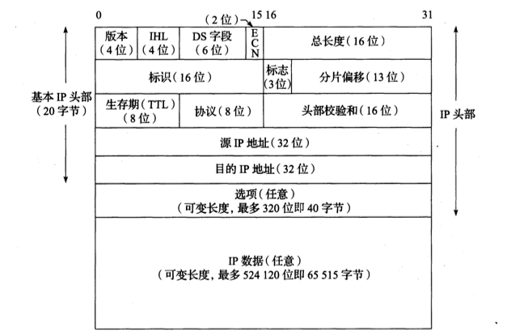
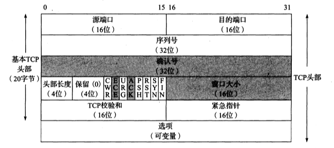
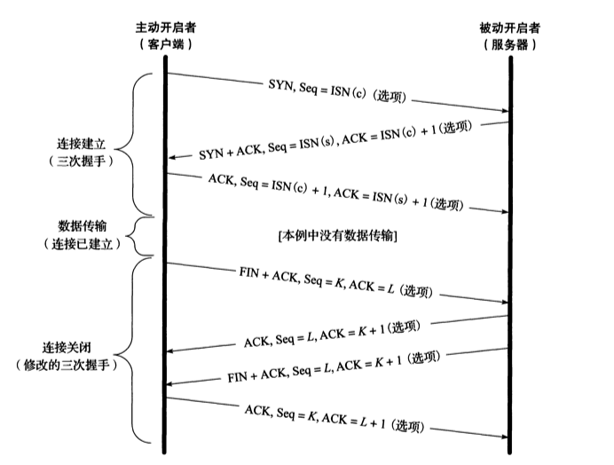
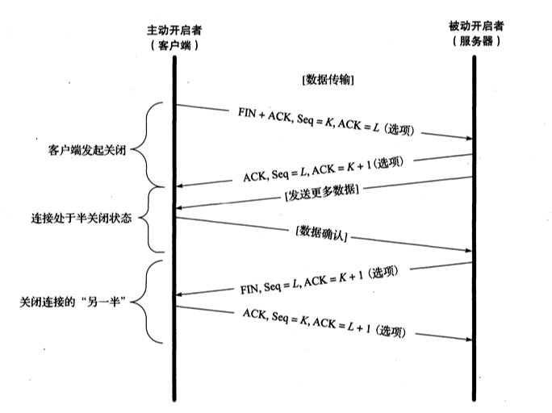

# TCP/IP协议exp

## 1. IP协议

__IP协议提供一种尽力而为的服务，它无法保证数据包一定会到对端，当发生某些错误时，IP数据包可能会被丢弃__ 。关于IP数据报的发送和接收方式，它总是从最高有效位开始发送 __(一个32位的值总是先将0-7bit发出，然后才是8-15bit....)__ 。如此的字节顺序称为 __网络字节序__ ，计算机所使用的字节序(大端与小端)有所不同，需要时需进行转换。


__0~3 bit__ `总共4bit`: __版本字段__ ，表示IP数据报的版本，一般为4和6，分别表示IPv4和IPv6。

__4~7 bit__ `总共4bit`: __IHL字段__ ，表示整个IP报头部字段的长度称为`IHL(Internet Header Length)`，由于只有4位，能表示最大值为15，其中每个`"1"对应一个32bit的大小`，也就是IP数据报头部被限制为最大值`15 * 32bit = 60bytes`。不过一般的IP数据包中都是`20bytes`，也就是将IHL设置为5。

__8~13 bit__ `总共6bit`: __DS字段__

__14~15 bit__ `总共2bit`: __ECN字段__

__16~31 bit__ `总共16bit`: __总长度字段__ ， __包括头部和数据部分__ ，我们可以配合IHL来判断`数据载荷`是从`IP数据报`的哪个地方开始的。由于它是一个16bit的字段，即能表示的最大值长度(包括头部)65535字节。即使如此，大多数的主机并不接受大于576字节的IPv4数据报(很多UDP协议都将自己的数据量限制为512字节大小，以免被抛弃)。要解决如此，需要将大的数据报分割成小的IP数据报发送(被分割的每个数据报本身还是相互独立)，其中片偏移字段就起到了作用。

__32~47 bit__ `总共16bit`: __标识字段__ ，留空。

__48~50 bit__ `总共3bit`: __标志字段__

__51~63 bit__ `总共13bit`: __分片偏移__

__64~71 bit__ `总共8bit`: __生存期字段__ TTL(time-to-live)表示的当前的IP数据报能经过的最大路由器数量，等同于IPv6中的最大跳，能够避免一些数据报在网络中出现循环跳的现象。一般将其设置为64或者128，少有的主机会将其设为255。当数据报被减少到0时，处理它的路由器会将数据报丢弃，并生成一个ICMP报告之发送着发生了什么。TTL影响到了整个头部字段的数据，每经过一个路由器都需要将头部效验和重新计算。

__72~79 bit__ `总共8bit`: __协议字段__ ，用于表明其IP数据报携带的上层协议是什么一般为17(UDP)和6(TCP)。

__80~95 bit__ `总共16bit`: __头部效验和字段__ ，此字段只效验IPv4头部是否发生了错误。IP数据报不保证其携带载荷的正确性，它由其上层协议自行验证。

__96~127 bit__ `总共32bit`: __源IP地址__ 。

__128~159 bit__  `总共32bit`: __目的IP地址__ 。

__160~最大479 bit__ 后续为可选字段，最多40字节。

## 2. TCP协议

TCP协议提供一种稳定的连接。

>### 2.1 TCP头部字段




下面直接分析其头部字段。

__0~15 bit__ `总共16bit`: __源端口__ 。

__16~31 bit__ `总共16bit`: __目的端口__ 。

__32~63 bit__ `总共32bit`: __序列号字段(seq)__ ，ISN(Initial Sequence Number)时通常是一个随机数，避免攻击，当数达到最大值时候回环从0开始。

__64~95 bit__ `总共32bit`: __确认号字段(ack)__ ，此字段配合ACK标志位，当ACK标志位设置为0时忽略，当ACK为1时启用。 __ACK表示一种“确认”，但我更愿称之为“请求”__ ，当对端发送一个`seq=x`的序列号时，本机回复`ack=x+1`，它表示 __“我已经成功接收到了你发送的数据”__ ，此外，还包含着 __“我希望你继续发送，发送的序列号请从x+1开始”__ 的请求。

__96~99 bit__ `总共4bit`: __头部长度__ ，同IP的IHL字段。

__100~103 bit__ `总共4bit`: __保留__ 。

__104~111 bit__ `总共8bit`: __这里将其总8个字段一起解释，每个字段占 1 bit__ 。
        
* CWR 即 __拥塞窗口减(Congestion Window Reduced)__ ，


* ECE 即 __ECN回显__ ，发送方收到了一个更早的拥塞通告。


* URG 即 __紧急(urge)__ ，启用紧急指针字段，很少使用。


* ACK 即 __确认(acknowledge)__ ，只要连接后，此字段一般都是置为1，即启用确认号字段。


* PSH 即 __推送(push)__ ，接收方尽快给应用程序发送这个数据(几乎没有用到)。


* RST 即 __重置连接(reset)__ ，连接取消，一般是对端发生了错误如主机宕机等。


* SYN 即 __同步(Synchronize Sequence Numbers)__ ，表示将初始化一个连接。此字段是受保护的(即seq需要包含此字段)，丢失时需要重传。


* FIN 即 __结束(finish)__ ，此报文发送方声明已经结束向对端发送数据。此字段是受保护的(即seq需要包含此字段)，丢失时需要重传。

__112~127 bit__ `总共16bit`: __窗口大小__ ，表明自身窗口大小，窗口大小将影响到一个TCP传输的效率和速率。

__128~143 bit__ `总共16bit`: __TCP效验和__ ，效验范围只包括头部字段。

__144~159 bit__ `总共16bit`: __紧急指针__ ，是一个加到seq上的一个正向偏移量，只有当URG置为1时启用，很少启用。


> ### 2.2 TCP连接

#### TCP的三次"握手"。



__主动发送SYN包的是主动打开一个连接__ ，一般为客户端。

__第一步__ : 客户端发送一个`SYN`报文即将SYN位置为1，其中初始化(ISN)了一个`seq(客户端)`，表明为 __初始值__ ，当客户端还未发送此数据的时候，客户端状态为`CLOSE`，服务器为`LISTEN`。我们先称其为第一个包，客户端发送第一个包后，客户端状态更改为`SYN_SEND`。

__第二步__ : 服务端收到这个包后则会回复一个新的包，我们先称为第二个包，其中将`SYN`置为1以及`ACK`置为1，初始化(ISN)一个`seq(服务端)`和一个`ack`，这个`ack=seq(客户端)+1`，服务器发送第二个包后将改变状态到`SYN_RECV`，并且为客户端分配TCP缓存和变量，这使得服务器容易收到SYN洪水攻击。

__第三步__ : 客户端收到第二个包后立刻改变状态为`ESTABLISH`，并且生成第三个包，其中将`ack`置为1，之后将`ack=seq(服务端)+1`，并且`seq(客户端) = ISN(初始值) + 1`，将生成的包发给服务器表明收到即建立连接，服务器收到这第三个包就表明TCP握手成功，将改变服务器状态为`ESTABLISH`。以上第三个包其实是可以传输数据的，如果传输数据，那么`seq(客户端) = ISN(初始值) + 数据长度`，但一般不这么做。

 __SYN报文是安全的，每发送一个SYN报文就会将seq+1，如果出现丢失情况，则SYN段会重传__ !

问题1: 如果是2次握手会发生如何?
    
这里我们假设一个条件，有一个客户端A和一个服务器B，如果A发送了一个SYN包，但是这个包由于某种场合它延迟到达了B，B是服务器，它同意进行连接，直接将自己状态改变为ESTABLISH，但是当B发出的SYNACK包到达客户端A后，客户端A认为上次发送的SYN包已经失效了，所以丢弃了SYNACK包。结果就是服务器傻傻的等待客户端，造成资源浪费。

#### TCP的四次"挥手"。



__关闭之前__ : 客户端和服务都处于`ESTABLISHED`状态

__第一步__ : 客户端发送一个包，我们先称为第一个包， __它将FIN置为1，ACK置为1__ ，并且带上一个`Seq=k`, `ack=l`，发送这个包后将改变自己状态为`FIN-WAIT1`。

__第二步__ : 服务器收到这个包，并且生成第二个包， __它将ACK置为1__ ，并且带上`seq=l`，`ack=k+1`，发送完这个包后将改变自己状态为`CLOSE_WAIT`，当客户端收到这个包后改变状态为`FIN_WAIT2`。

__完成这2步后称为TCP的半关闭，此时表示客户端已经完全关闭了发送的管道，但服务器还可以进行发送数据，客户端也还可以进行接收数据__ 。

__第三步__ : 服务器发送一个包，我们先称为第三个包， __它将FIN置为1，ACK置为1__ ，并且带上一个`seq=w`(图上有错，半关闭状态下没有发送数据seq就为l+1)，`ack=k+1`(由于客户端已经关闭发送了，所以服务器发送的数据ack总是k+1，即关闭前客户端的seq+1)，发送这个包后服务器状态改变为`LAST_ACK`。

__第四步__ : 客户端收到这个包后，生成一个包，我们先称为第四个包， __它将ACK置为1__ ，并且将`seq=k+1`，`ack=w+1`，将它发送给服务器后自身进入`TIME_WAIT`状态，等待2MSL后进入`CLOSED`状态，服务器收到这个包后直接进入`CLOSED`状态。


当一端发送了一个`FIN`包表示本端不再写入数据了，对端(服务器)对其`ACK`回应后处于半关闭状态，当对端(服务器)也发送了`FIN`包后TCP断开连接， __主动断开端(客户端)需要在`TIME_WAIT`的状态下再等待`2MSL`时间__ 。这是由于如果最后一个`FIN`包如果丢失了，或者`ACK`包丢失了， __那么对端(服务器)不知道主动断开端(客户端)是否收到FIN包__ ， __所以主动关闭端(客户端)保留`2MSL`时间来处理`FIN`包或者`ACK`包丢失的情况__ 。
当一个`FIN`被收到，而主动关闭端(客户端)发送的`ACK`包丢失，那么服务器等待一段时间后将重传`FIN`包，客户端等待时间内能够及时重发`ACK`从而关闭连接。

__服务器应减少或者避免主动关闭连接，过多的`TIME_WAIT`占用端口在高并发情况下将是灾难性的__ 。

## 3. TCP相关系统调用

#### * send 系统调用

```C++
// 向fd指向的管道发送数据，数据长度为len，flag为0时和write基本无差异
size_t send(int fd, const char* buf, size_t len, int flags);
```

这里我们需要先提前讲一下write函数，其解析如下: 

```C++
size_t write(int fd, const char* buf, size_t len);
```

我们经常使用write函数来进行文件写入的操作，但其真正的操作并不会进行磁盘操作，磁盘操作由操作系统另外进行。

send的和write有许多相同之处，只不过send更多用于socket套接字的数据发送，但send函数返回真的就代表对方收到了吗？

解析这个问题就要知道操作系统中的协议栈缓冲区，它由内核来进行操作，每个socket都有其对应的缓冲区， __缓冲区分为接收缓冲区和发送缓冲区__ ，send函数用到的是发送缓冲区。

用户层使用send系统调用，操作系统将复制send的用户缓冲区数据(buf中的数据)到对应的socket内核缓冲区数据(对应的协议栈缓冲区)。接下来的东西需要分阻塞和非阻塞的调用方式来解析。

* 阻塞调用的方式: 当对应的socket发送缓冲区(内核中)大小足够容纳用户缓冲区的数据时，拷贝完成后返回，返回对应拷贝长度， __当对应socket发送的缓冲区大小不够容纳时，send函数将一直阻塞，直到用户缓冲区中的数据被完整拷贝到内核协议栈缓冲区后返回(期间内核缓冲区会一直发送数据到对端，只要收到ack就清空对应数据)__ 。
* 非阻塞调用的方式: 当对应的socket发送缓冲区(内核中)大小足够容纳用户缓冲区数据时，拷贝完成后返回，返回对应长度，不同的发生在接下来的部分，当对应的socket缓冲区大小不够容纳的时候， __send函数将尽力的复制用户缓冲区数据到内核协议栈缓冲区中，具体复制多少，取决于内核协议栈还剩下多少空间，之后返回拷贝的字节数，并且设置errno为EAGAIN__ 。


<font color=F0000>所以可以得出结论，send返回不代表对方已经收到信息了！如果是非阻塞情况，send返回时，协议栈正在努力的发送数据到对方的协议栈上，而对方用户层可能还未调用read或者recv来读取对应的数据呢，如果在阻塞情况下，有可能部分数据已经到达对方，但是具体对方读取了多少还是不从而知！如果非要确切的知道对方是否收到，需要做用户层面的ack机制才可。</font>


#### * sendto 系统调用

```C++
// sendto用于UDP类的socket(SOCK_DRAM)
int sendto(int s, const void* msg, int len, int flags, 
    const struct sockaddr* to, int tolen
);
``` 

和send不同，send多用于SOCK_DRAM形的socket，也就是UDP协议下的socket，UDP协议也有内核协议缓冲区，但是它没有发送缓冲区，只有接收缓冲区，这是由于UDP没有流量控制。

当调用系统sendto时，操作系统即刻将对应的数据发送出去，并返回，如果需要做对方确认收到的情况，需要在用户层做ack。

#### * recv 系统调用

```C++
size_t recv(int fd, const char* buf, size_t len int flags);
```

recv函数和send函数相反，recv将内核协议栈中的数据复制到用户层面上，同样需要分阻塞和非阻塞来进行讨论。

* 阻塞情况下: 如果内核中的接收缓冲区没有数据，recv将阻塞， __直到有数据，recv将返回拷贝到的数据长度(如果只有1byte也会返回，这点类似read函数)__ 。
* 非阻塞情况下:  __不管内核中的接收缓冲区有没有数据，recv都将即可返回，如果有数据，则返回对应的拷贝长度，如果没有数据，则返回-1，并且设置对应errno，一般为EAGAIN__。

<font color=F0000> 这里涉及到一个TCP知识，当recv迟迟不被调用时，接收缓冲区上将充满数据，tcp的拥塞控制将使得其发送一个移动窗口使用情况到对端，建议对方停止发送数据，如果对端继续发送，当缓冲区数据已容纳不下时，TCP将选择抛弃对应的数据包。 </font>

#### * recvfrom 系统调用

```C++
size_t recvfrom(int fd, const char* buf, size_t len, int flags,
    struct sockaddr* from, size_t fromlen
);
```

recvfrom和sendto一样都是用于SOCK_DRAM形式的套接字，即UDP。

* 阻塞模式下: recvfrom会阻塞，直到内核缓冲区中有一个完整的UDP包即返回。
* 非阻塞模式下: recvfrom即可返回，如果有完整UDP包，返回对应包长度，没有数据则返回-1并且设置errno，一般为EAGAIN。


#### * listen 系统调用

```C++
int listen(int sockfd, int backlog);
```

listen函数一般用于服务器，它将一个socket设定为监听套接字，表示这个套接字将等待客户端连接，但是这里有些许的误会，就是listen并没有参与三次握手，即使accept也没有参与3次握手，服务器端的三次握手实现另有其人。

我们注意到listen函数有一个backlog参数，它是一个总数，一般为5，告诉内核连接队列的长度。

之前的介绍中有说到，服务器在三次握手中如果返回第一个包的ack将切换状态至 `SYN_RECV` 收到客户端的ack后将转换状态为 `ESTABLISH` 。这里有2个状态，内核有2个队列来保存这两个状态的连接，`SYN_RECV`的为半连接状态，`ESTABLISH`是连接完成的状态(accept还未接管)，它们的总数为backlog。


#### * accept 系统调用

```C++
int accept(int sockfd, struct sockaddr* addr, socklen_t *addrlen);
```

accept函数做的是将内核中的 __TCP连接完成队列__ 中的队列头取出，并返回一个真正的用于传输的套接字，并且accept也有阻塞和非阻塞之分。

* 阻塞模式下: accept获取TCP连接完成队列的队列头，然后返回。如果队列为空，则阻塞，直到有新元素后返回。
* 非阻塞模式下: 如果队列中有元素，则获取后返回，如果为空，则即可返回-1，并且设置errno，一般为EAGAIN。

accept返回后，将得到一个新的socket，之后对这个客户端的读写都通过此socket进行，此socket是服务器内核生成的，其根本就是一个文件描述符(socket文件描述符)。

对于一些小疑问，比如服务器是如何区分不同客户端的，客户端和服务器发起多TCP连接如何区分不同连接等，这是因为TCP是使用四元组来进行区分的，即( __服务器地址，服务器端口，客户端地址，客户端端口__ )。

#### * connect 系统调用

```C++
int connect(int sockfd, struct sockaddr* name, size_t namelen);
```

connect函数用于发起tcp连接，sockfd是一个socket类型的文件描述符，发起connect系统调用后，TCP4元组就已经确定，如果没有提前调用bind，则将由内核随机选择客户端端口进行连接。

connect函数真正的参与了TCP的三次握手(调用了更底层的握手函数，如果是阻塞情况可以大致看成它完成了三次握手)，同样有阻塞和非阻塞的调用方式。

* 阻塞模式下: connect发起TCP请求，期间connect不返回，直到服务器返回一个ACK后即返回(内核做的TCP三次握手)。
* 非阻塞模式下: connect发起TCP情况，立刻返回-1，并且设置errno为EINPROGRESS表明TCP连接进行中，之后TCP三次握手将由内核来完成。再次调用connect，如果握手成功，则返回对应文件描述符，如果进行中则返回-1设置errno为EINPROGRESS，失败则返回-1并设置对应errno。

由于TCP连接的特性，对于一些网络复杂情况，阻塞connect可能需要用非常长的时间，所以建议使用非阻塞connect，在TCP连接期间可以做一些其他的事情。

#### * bind 系统调用

```C++
int bind(int sockfd, struct sockaddr* addr, size_t addrlen);
```

主要用于服务器，将一个对应的socket文件描述符绑定到一个固定的地址和端口上，失败返回-1。服务器在调用listen前需要调用bind来固定一个端口。

如果是客户端则没有这个必要，客户端在调用connect函数的时候，内核将自动分配一个端口用于传输数据，一般为10000+的端口，如果调用了bind，connect将使用固定好的这个端口进行请求。


