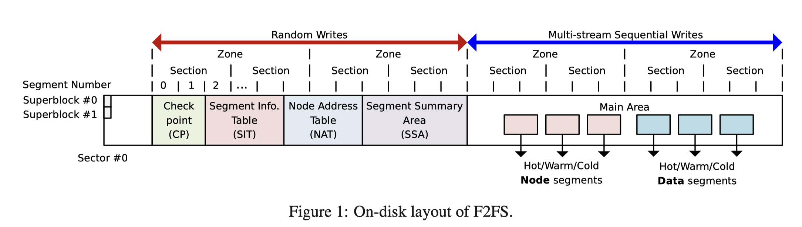
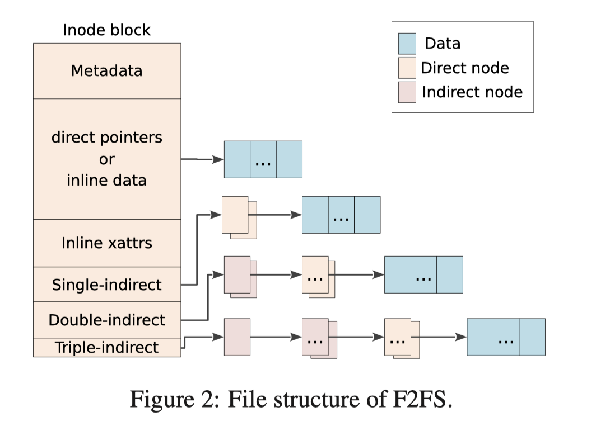

# F2FS 论文笔记

F2FS是三星为闪存磁盘所设计的类似LFS文件系统，它将随机写转变为顺序写。

### 磁盘划分 & layout
F2FS将整个内存区域划分为随机写区域和顺序写区域两个大的区域，其作用顾名思义，顺序写区域只做顺序追加写入，随机写区域才允许随机写入；除此划分之外，F2FS也将磁盘分层一个个的小块，称为block，每个block大小固定4K，将512个block合并为segment(2MB)，然后几个segment合并成为一个section，几个section合并成为一个zone(实际实现上zone和section是1:1)，figure1中给出了一个磁盘layout布局：

### 文件layout

F2FS特殊之处在于做文件内容的修改时，能做到随机写入变成顺序写入，其中包括文件元数据的变更，之前提到F2FS有一个个的block，每个block都可以保存一些数据，这些block分别可以保存这些信息：
* node信息(文件的元信息，如size、mode，以及data或者指向data块的指针)
* direct指针(指向保存data的segment)
* indirect指针(指向保存direct指针的segment，类似二级指针)

整个文件的layout如figure2所示：

### SIT(Segment Infomation Table)

Segment Infomation Table，段信息表，用于保存segment的信息，每一个segment都能在SIT表中找到与之对应的元信息，保存着当前segment的block数量、block使用情况(bitmap)，在执行pick block时亦或者gc时都有着重要的作用。

### NAT(Node Address Table) & wandering problem

在LFS这种文件结构中，修改叶子结点的内容(如图中蓝色所表示的data部分)，需要生成一个新的block，并append到磁盘log结构的末尾，然后更新上层索引(如图中的Direct node或者indirect node)，而更新上层索引也会导致继续更新更上一层的索引，直到跟结点，这种问题在论文F2FS中称为wandering problem。

F2FS使用一个称为NAT(Node Address Table)的表结构来解决这个问题，NAT保存在随机写区域中，在F2FS初始化的时候，每个顺序写入区域中的block都会有一个id，称为node id，nid从0开始，NAT表的大小能够容纳整个磁盘的划分block数量，表最主要的作用是保持nid到磁盘地址的映射，这样在node信息中，direct和indirect不再保存磁盘地址，而是nid；当写入叶子结点内容值新的时候，不需要修改上层结点的内容，而是直接修改NAT表中的值，进而规避了这个wandering problem。

### SSA (Segment Summary Area) & GC

F2FS这种LFS结构的文件系统由于其特性，需要定期做GC，将那些无效的block回收，在F2FS中，GC以segment的单位进行，主要的步骤为：
* 挑选victim segment
* 执行 GC

在挑选victim segment时有一些策略可以选择，不过无法逃脱的是，我们无法保证整个segment中所有的block都是无效的，多数场景下是 无效和有效的block在一个segment中共存，这引出一个问题：有效block的索引更新，对于那些无效的block，F2FS当然可以直接抛弃，而对于那些有效的block，则必须更新这些有效block的上层索引，遗憾的是，GC并不知道这些物理block上的数据属于哪些“node”的，这个问题引出了一个位于随机写区域的结构 SSA，SSA中记录着几个重要信息，如nid和ofs_in_node，这些信息使得GC线程能够跟根据物理磁盘地址反推出所属的nid以及在nid中的逻辑offset，进而

