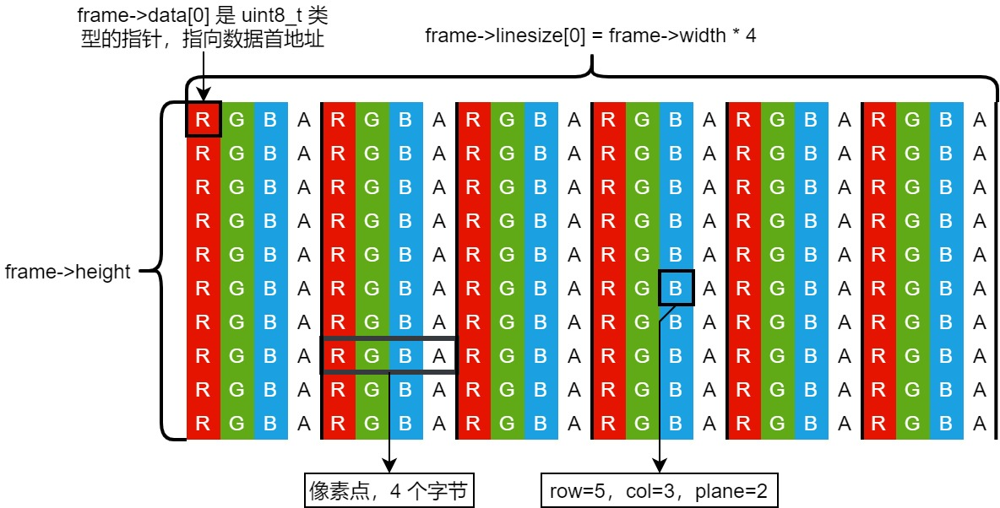
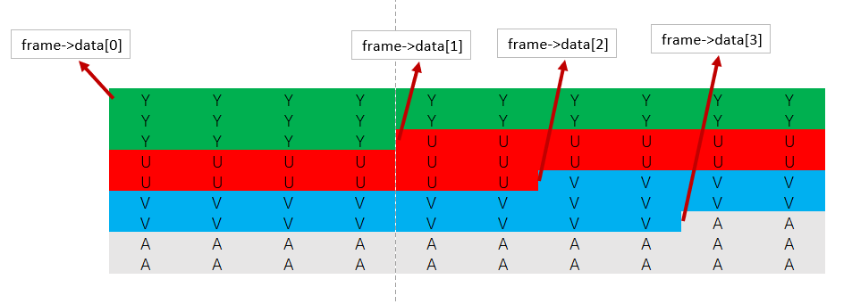

# AVFrame

图像有较多存储方式，其中比较常见的比如RGBA，BGRA，ARGB，AGBR以及YUV等。

RGBA在FFMPEG的`AVFrame`结构体中的存储方式是 __RGBA RGBA RGBA RGBA... RGBA__ 的方式存储，RGB为三种基础颜色，A表示透明度。



YUV420P在FFMPEG的`AVFrame`结构体中的存储方式是 __YYYY YYYY UU VV__ 这种是planar平面存储方式，YUV420P是4个Y共享1个U和一个V的，Y为图像亮度信息，U和V都是色度信息。



FFMPEG为了提高性能，所以没有将图像数据存储在`AVFrame`结构体中，而是在`AVFrame`中通过一个指针来控制这个 __图像数据__ 。

```C++
/* 通过av_frame_alloc函数创建并且返回一个指针 */
AVFrame* frame = av_frame_alloc();
```

`AVFrame`结构体中有许多的成员，其中比较重要的几个成员如下: 

```C++
typedef struct AVFrame{
/* AV_NUM_DATA_POINTERS 为8 */
    uint8_t *data[AV_NUM_DATA_POINTERS];
    int linesize[AV_NUM_DATA_POINTERS];
    uin8_t **extended_data;
    int width, height;
    int format;
    int key_frame;
    enum AVPictureType pict_type;
    int64_t pts;
}AVFrame;
```

### * <font color=F0000> int width, height </font>

图像分辨率，width即宽度，height即高度。

### * <font color=F0000> int64_t pts </font>

显示时间戳，frame被渲染显示出来的时间。

### * <font color=F0000> int key_frame </font>

判断当前帧是否是关键帧，值为1表示关键帧，0表示非关键帧。

###  * <font color=F0000> int format </font>

`format`字段表示的就是图片存储的格式，比如RGBA，YUV420P等， __在FFMPEG中RGBA的表示为AV_PIX_FMT_RGBA，而YUV420P则为AV_PIX_FMT_YUV420P__ 。

### * <font color=F0000>uint8_t *data[AV_NUM_DATA_POINTERS] </font>

`data`是一个指针数组，其中指针指向图像存储地址，在`av_frame_alloc()`之后这个data数组中所有指针指向为空，只有调用`av_frame_get_buffer()`之后，这个指针所指向的地址才真正可用。

当储存RGBA格式的时候一般只使用`data[0]`，`data[0]`将指向真正的图像存储地址。

当存储YUV420P格式图像的时候一般使用前3个指针，`data[0]`表示Y，`data[1]`表示U，`data[2]`表示V。

### * <font color=F0000> int linesize[AV_NUM_DATA_POINTERS] </font>

`data`字段表示的是一个图像存储地址，而且其图像大小需要由`linesize`和`height`来确定，`linesize`所表示的是一个图像的width长度，此width长度和真正的图像中的width长度不同，而是一个图像的横向长度。

如果存储的是RGBA格式的图像，图像分辨率是 __width * height__ ，但是其每个像素点是需要存储4个颜色数据，所以图像的横向宽度就将是 __width * 4__ ，所以`linesize[0]`中就改存此数据。

如果存储的是YUV420P格式的图像，由于存储的方式不同，YUV图像存储方式有planar，和plane，其中对于planar方式，存储方式是先存储Y后存储U之后才是V，即 __YYYY YYYY UU VV__ 的方式存储。所以对于YUV420P，`linesize[0]`表示Y的横向宽度，为分辨率中的`width`，而且`linesize[1]和linesize[2]`是一样的，都为 `width / 2`。

### AVFrame数据申请

当AVFrame已经被创建的时候，其内部是没有包含图像数据空间的，需要进一步申请空间，不过当申请图像空间时，需要实现指定图像的大小以及图像像素格式才能进行申请。

```C++
AVFrame* frame = av_frame_alloc();
frame->width = 800;
frame->height = 600;
frame->format = AV_PIX_FMT_YUV420P;
frmae->linesize[0] = 800;
...
/* 为frame申请空间，第二个参数为对齐参数，如果事先设置好linesize可用直接传入0表示自动识别 */
av_frame_get_buffer(frame, 0);
```

### AVFrame图像数据引用

之所以将AVFrame设置的这么复杂，将图像和AVFrame结构体分开存储，就是为了提高效率，当AVFrame之间需要进行共享的时候可以直接通过指针复制而降低内存拷贝，为了实现这个功能，FFMPEG又添加了一系列函数。

```C++
/* dst的frame将使用和src相同的图像数据 */
int av_frame_ref(AVFrame* dst, const AVFrame* src);
```

av_frame_ref将使得dst和src使用相同图像数据，调用此函数后将使得共用的图像数据引用+1，引用数量表示的是这个 __图像数据被多少个AVFrame所使用__ ，当最后一个使用此图像数据AVFrame被free掉后，图像数据也将被free掉。

```C++
/* 图像复制 */
AVFrame* av_frame_clone(AVFrame* frame);
```

生成一个新的AVFrame结构体，新的结构体将和frame使用相同的图像数据，这个函数类似于先调用 `av_frame_alloc()` 后再调用 `av_frame_ref()`

同样的，也可以手动的将引用计数减一

```C++
/* 将frame中的引用计数减一，并且不再使用其中的数据，复位frame中的成员变量 */
void av_frame_unref(AVFrame* frame);
```

图像的深拷贝，完全复制图像数据，需要目标AVFrame中有提前申请空间。

```C++
int av_frame_copy(AVFrame* dst, const AVFrame* src);
```

```C++
void av_frame_move_ref(AVFrame* dst, AVFrame* src);
```
将src中的数据移动到dst中，需要提前申请好dst的空间，并且需要进行空间释放，防止内存泄漏。并且调用后src中的数据将被复位。

# AVPacket

FFMPEG从H264或者H265文件中读取到的数据将存储在AVPacket中，AVPacket的数据量相比AVFrame少很多，但是也采用了类似的方式来存储数据。

```C++
AVPacket* packet = av_packet_alloc(); // 申请AVPacket结构体空间
av_packet_free(AVPacket** pkt); // 清除AVPacket结构体空间
```

`av_packet_alloc()`只申请AVPacket结构体空间，其中不包括真正的数据空间。AVPacket需要使用`av_packet_free()`清除AVPacket结构体空间。

AVPacket结构体中比较重要的成员: 

```C++
typedef struct AVPacket{
    AVBufferRef* buf; // 引用计数的实现
    int64_t pts;
    int64_t dts;
    uint8_t *data;
    int size;
    int stream_index;
    int flags;
    AVPacketSideData *size_data;
    int side_data_elems;
    int64_t duration;
    int64_t pos;
}AVPacket;
```

### * <font color=F0000> AVBufferRef* buf </font>

和AVFrame一样，`AVPacket`采用数据和结构体分开存储的方式，这种方式可以使得多个AVPacket共享同一个H264/H265数据， __当一个AVPacket被释放的时候，真正的数据并不会被释放，数据被释放取决于引用这个数据的AVPacket的数量，只有当最后一个AVPacket被释放的时候，数据才会被释放__ ，而这个`AVBufferRef* buf`成员就是用来实现这个功能的。

### * <font color=F0000> int64_t pts, dts </font>

pts和dts都是一种时间戳，pts表示帧显示时间，dts表示帧解码时间，他们都是以time_base为时间单位，pts必定大于等于dts，图像必定是先被解码后显示的。

在没有B帧的情况下，pts和dts时间一般都是一致的。

### * <font color=F0000> uint8_t *data 和 int size </font>

`data`是AVPacket所指向的真实数据，H264/H265解码后的数据就存储在此，这个空间没有明确的申请函数，包含解码的函数一般都会自动申请这个空间，所以当AVPacket需要使用其他数据时，记得使用`av_packet_unref`来减少data的引用计数来清空内存，由于`data`的数据是H264/H265数据，其大小一般不大，发生内存泄漏时不容易发现。

`size`表示`data`的大小。

### * <font color=F0000> int stream_index </font>

一个视频媒体中一般包含着Video、Audio和字幕等等，所以需要`stream_index`来区分当前AVPacket是属于哪个流的。

### * <font color=F0000> int64_t duration 和 int64_t pos </font>

`duration`用来表示数据的时长，以time_base为时间单位。

`pos`表示本AVPacket在媒体流中的字节偏移量。


